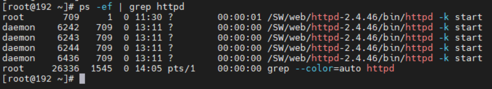
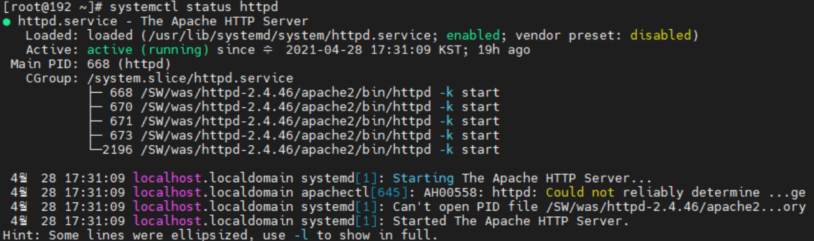

# Apache 2.4.46 버전 linux(centos7) 환경 설치 방법

## Apache HTTP Server - Source 파일을 이용한 컴파일 설치

우선, apache 설치에 필요한 os 패키지를 설치합니다.
```
# yum install gcc-c++

# yum install openssh-server openssh-clients openssh-askpass

# yum install openssl openssl-devel

# yum install zlib-devel

# yum install expat-devel
```

필요한 최신 버전의 설치 파일을 링크 주소 복사 후 다운로드 및 압축 해제를 합니다.
1.apache (http://httpd.apache.org/download.cgi#apache24)


2.apr (https://apr.apache.org/download.cgi)


3.apr-util (https://apr.apache.org/download.cgi)


4.pcre (https://ftp.pcre.org/pub/pcre/


```
# wget https://mirror.navercorp.com/apache//httpd/httpd-2.4.46.tar.gz
# wget https://mirror.navercorp.com/apache//apr/apr-1.7.0.tar.gz
# wget https://mirror.navercorp.com/apache//apr/apr-util-1.6.1.tar.gz
# wget https://ftp.pcre.org/pub/pcre/pcre2-10.36.tar.gz

# tar xvfz httpd-2.4.46.tar.gz
# tar xvfz apr-1.7.0.tar.gz
# tar xvfz apr-util-1.6.1.tar.gz
# tar xvfz pcre2-10.36.tar.gz
```

그 다음엔 pcre 설치를 해줍니다. (차례로 입력하면 됩니다.)
```
# cd ./pcre2-10.36
# ./configure --prefix=/usr/local/pcre
# make
# make install
```

apr 설치를 합니다. (차례로 입력하면 됩니다.)
```
# cd ../apr-1.7.0
# ./configure --prefix=/usr/local/apr (에러발생)
# cp -arp libtool libtoolT
# ./configure --prefix=/usr/local/apr(다시 configure)
# make
# make install
```

apr-util 설치를 합니다. (차례로 입력하면 됩니다.)
```
# cd ../apr-util-1.6.1
# ./configure --prefix=/usr/local/aprutil --with-apr=/usr/local/apr
# make
# make install
```

apr-1.7.0과 apr-util-1.6.1은 ./httpd-2.4.46/srclib/ 안에 디렉토리명을 바꿔서 넣어줍니다.
```
# mv apr-1.7.0 ./httpd-2.4.46/srclib/apr
# mv apr-util-1.6.1 ./httpd-2.4.46/srclib/apr-util
```

apache 설치를 해줍니다. (차례로 입력하면 됩니다.)
```
# cd ../httpd-2.4.46
# ./configure \
--prefix=/SW/web/httpd-2.4.46 \
--with-mpm=worker \
--with-pcre=/usr/local/pcre/bin/pcre-configure \
--with-apr=/usr/local/apr \
--with-apr-util=/usr/local/aprutil \
--with-ssl=/usr/bin/openssl \
--enable-module=so \
--enable-so \
--enable-rewrite=shared \
--enable-ssl=shared  \
--enable-deflate=shared \
--enable-cache=shared \
--enable-disk-cache=shared \
--enable-mem-cache=shared \
--enable-proxy \
--enable-unique-id \
--enable-asis=shared \
--enable-headers \
--enable-logio=shared \
--enable-expires=shared \
--enable-status=shared \
--enable-auth-digest \
--enable-lib64 --libdir=/usr/lib64
# make 
# make install
```
위 명령어를 실행 시키면 본인이 설정한 설치경로에 아파치 홈 디렉토리가 생성됩니다.


설치가 다 끝났으면 아파치를 실행합니다.
```
# (설치파일경로)/bin/apachectl start
```

제대로 실행이 됐는지 확인합니다.
```
# ps -ef | grep httpd
```
제대로 실행이 됐다면 다음과 같이 나타납니다.


이제 80포트 방화벽을 개방해줍니다.
```
# firewall-cmd --permanent --zone=public --add-port=80/tcp 
# firewall-cmd --reload 
# firewall-cmd --list-ports
```

httpd를 서비스 등록을 시켜줍니다. (os 재부팅시 자동실행)
```
# nano /etc/systemd/system/httpd.service
```
/etc/systemd/system 경로로 가서 httpd라는 서비스 파일을 만듭니다.

nano 편집기로 다음 내용을 입력합니다.

```
[Unit]
Description=The Apache HTTP Server

[Service]
Type=forking
#EnvironmentFile=(아파치설치경로)/bin/envvars
PIDFile=(아파치설치경로)/logs/httpd.pid
ExecStart=(아파치설치경로)/bin/apachectl start
ExecReload=(아파치설치경로)/bin/apachectl graceful
ExecStop=(아파치설치경로)/bin/apachectl stop
KillSignal=SIGCONT
PrivateTmp=true
```
입력이 끝났으면 다음 명령어로 적용을 해줍니다.
```
# systemctl daemon-reload
```

실행을 시켜봅니다. (아무것도 나타나지 않으면 정상실행)
```
# systemctl start httpd
```

제대로 실행 되었는지 확인을 해봅니다.
```
# systemctl status httpd
```

다음과 같이 나타나면 정상.



os재부팅시 할때마다 tomcat 실행시키고 싶다면 다음 명령어를 실행해줍니다.
```
# systemctl enable httpd
```