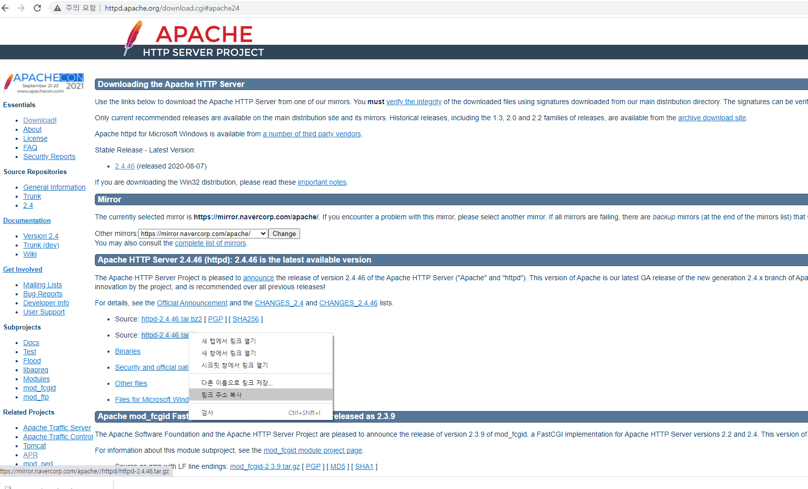
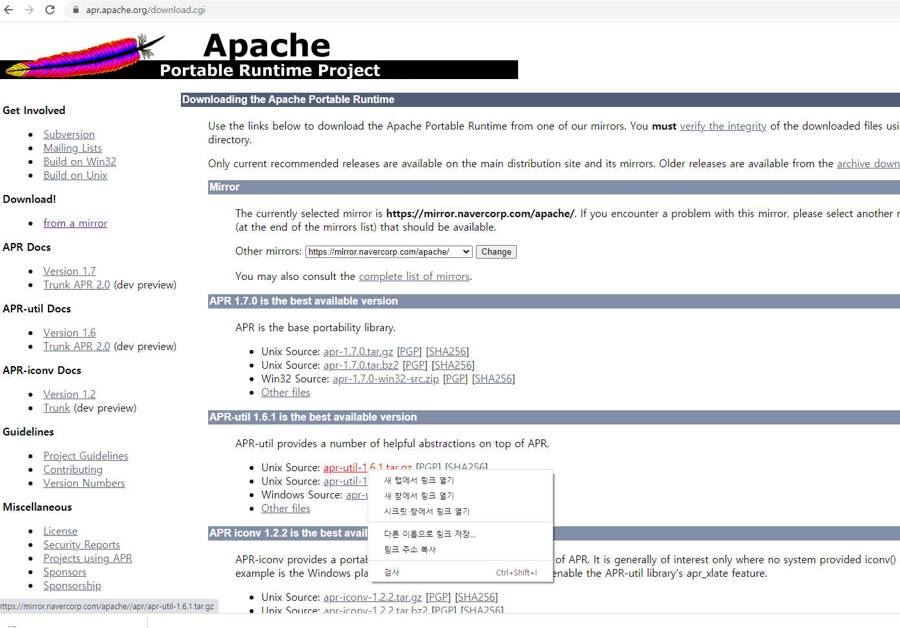
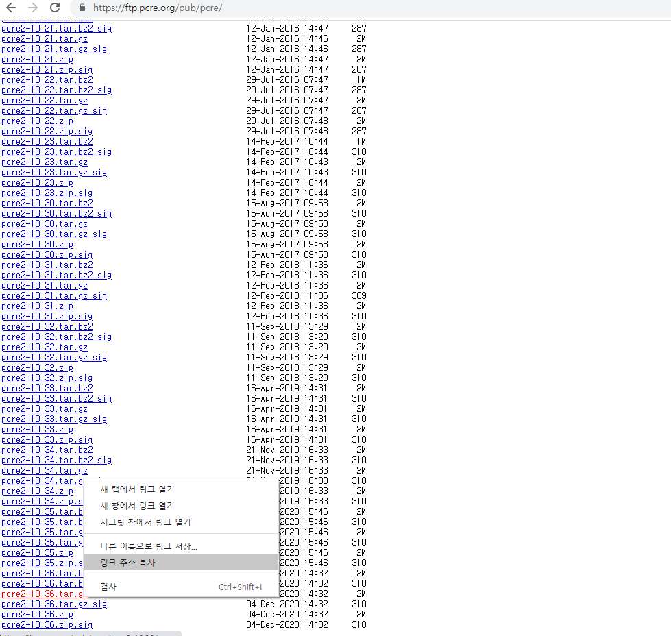

# Apache 2.4.46 버전 linux(centos7) 환경 설치 방법

## Apache HTTP Server - Source 파일을 이용한 컴파일 설치

우선, GCC 패키지를 설치합니다.
```
# yum install gcc make gcc-c++ pcre-devel
```

필요한 설치 파일을 다운로드 합니다.
1.apache (http://httpd.apache.org/download.cgi#apache24)


2.apr (https://apr.apache.org/download.cgi)


3.apr-util (https://apr.apache.org/download.cgi)


4.pcre (https://ftp.pcre.org/pub/pcre/
