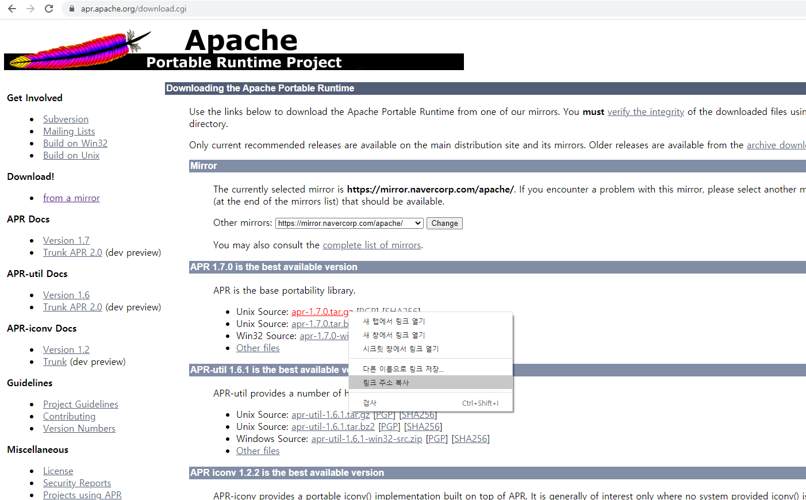
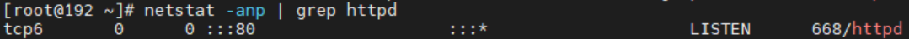
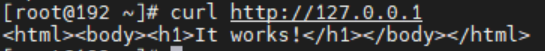
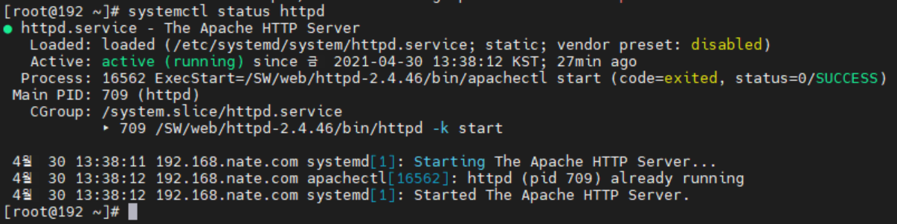

# Apache 2.4.46 버전 linux(centos7) 환경 설치 방법

## Apache HTTP Server - Source 파일을 이용한 컴파일 설치

우선, GCC 패키지를 설치합니다.
```
# yum install gcc make gcc-c++ pcre-devel
```

필요한 최신 버전의 설치 파일을 링크 주소 복사 후 다운로드 및 압축 해제를 합니다.
1.apache (http://httpd.apache.org/download.cgi#apache24)


2.apr (https://apr.apache.org/download.cgi)


3.apr-util (https://apr.apache.org/download.cgi)


4.pcre (https://ftp.pcre.org/pub/pcre/


```
# wget https://mirror.navercorp.com/apache//httpd/httpd-2.4.46.tar.gz
# wget https://mirror.navercorp.com/apache//apr/apr-1.7.0.tar.gz
# wget https://mirror.navercorp.com/apache//apr/apr-util-1.6.1.tar.gz
# wget https://ftp.pcre.org/pub/pcre/pcre2-10.36.tar.gz

# tar xvfz httpd-2.4.46.tar.gz
# tar xvfz apr-1.7.0.tar.gz
# tar xvfz apr-util-1.6.1.tar.gz
# tar xvfz pcre2-10.36.tar.gz
```

apr-1.7.0과 apr-util-1.6.1은 ./httpd-2.4.46/srclib/ 안에 따로 폴더 생성 후 넣어줍니다.
```
# mv apr-1.7.0 ./httpd-2.4.46/srclib/apr
# mv apr-util-1.6.1 ./httpd-2.4.46/srclib/apr-util
```

그 다음엔 pcre 설치를 해줍니다. (차례로 입력하면 됩니다.)
```
# cd ./pcre2-10.36
# ./configure
# make
# make install
```

pcre 설치가 끝났으면 apache 설치를 해줍니다. (차례로 입력하면 됩니다.)
```
# cd ./httpd-2.4.46
# ./configure --prefix=(설치파일경로)/apache2
# make 
# make install
```
위 명령어를 실행 시키면 (설치파일경로)에 apache2가 아파치 홈 디렉토리가 됩니다.
만약, configure: error: Cannot use an external APR-util with the bundled APR 오류 발생하면 ./configure --prefix=(설치파일경로)/apache2 --with-included-apr를 해보자.

설치가 다 끝났으면 아파치를 실행합니다.
```
# (설치파일경로)/apache2/bin/httpd -k start
```

제대로 실행이 됐는지 확인합니다.
```
# ps -ef | grep httpd
# netstat -anp | grep httpd
# curl http://127.0.0.1
```
제대로 실행이 됐다면 다음과 같이 나타납니다.




이제 80포트 방화벽을 개방해줍니다.
```
# firewall-cmd --permanent --zone=public --add-port=80/tcp 
# firewall-cmd --reload 
# firewall-cmd --list-ports
```

httpd를 서비스 등록을 시켜줍니다. (os 재부팅시 자동실행)
```
# nano /usr/lib/systemd/system/httpd.service
```
/usr/lib/systemd/system 경로로 가서 httpd이라는 서비스 파일을 만듭니다.

nano 편집기로 다음 내용을 입력합니다.

```
[Unit]

Description=The Apache HTTP Server

[Service]

Type=forking

PIDFile=(apache2설치경로)/logs/httpd.pid

ExecStart=(apache2설치경로)/bin/apachectl start

ExecReload=(apache2설치경로)/bin/apachectl graceful

ExecStop=(apache2설치경로)/bin/apachectl stop

KillSignal=SIGCONT

PrivateTmp=true

[Install]

WantedBy=multi-user.target
```
입력이 끝났으면 다음 명령어로 적용을 해줍니다.
```
# systemctl daemon-reload
```

실행을 시켜봅니다. (아무것도 나타나지 않으면 정상실행)
```
# systemctl start httpd
```

제대로 실행 되었는지 확인을 해봅니다.
```
# systemctl status httpd
```

다음과 같이 나타나면 정상.



os재부팅시 할때마다 tomcat 실행시키고 싶다면 다음 명령어를 실행해줍니다.
```
# systemctl enable httpd
```
