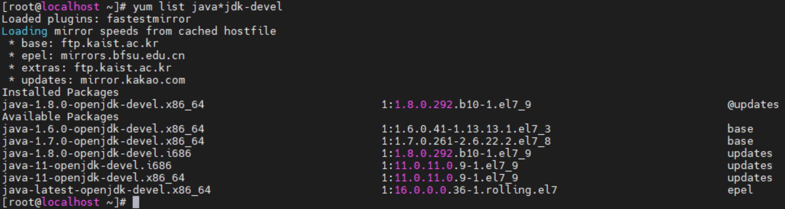
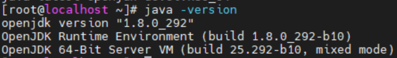
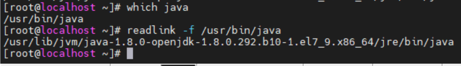
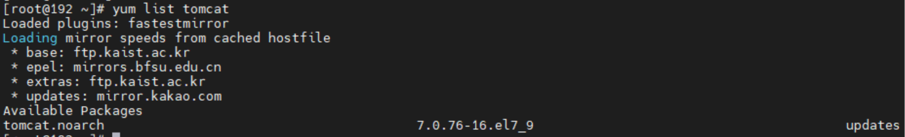
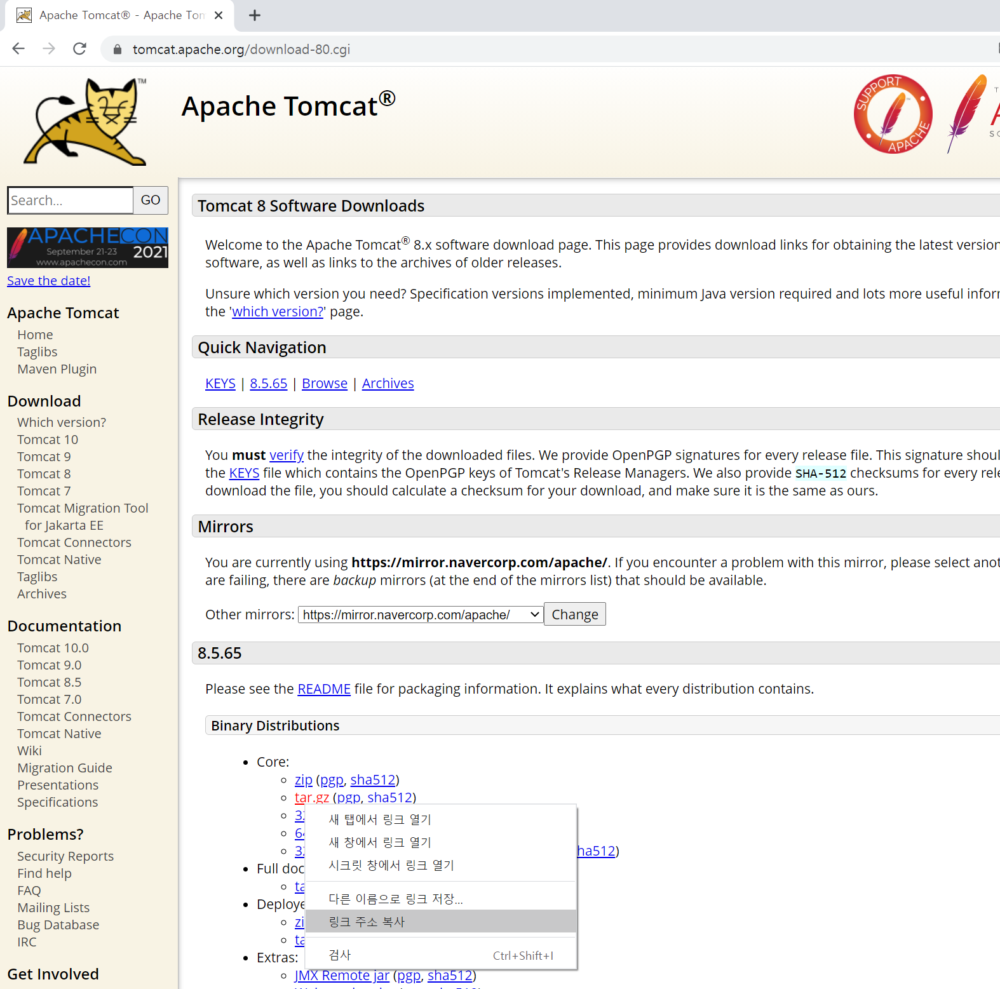
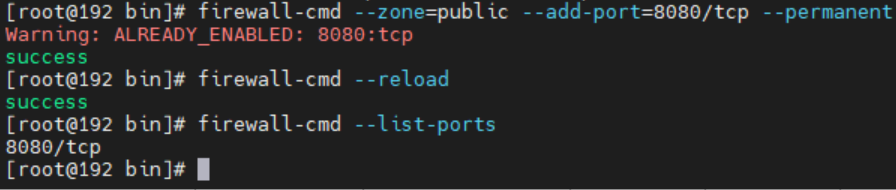
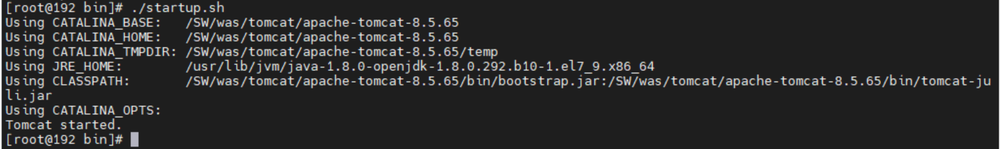
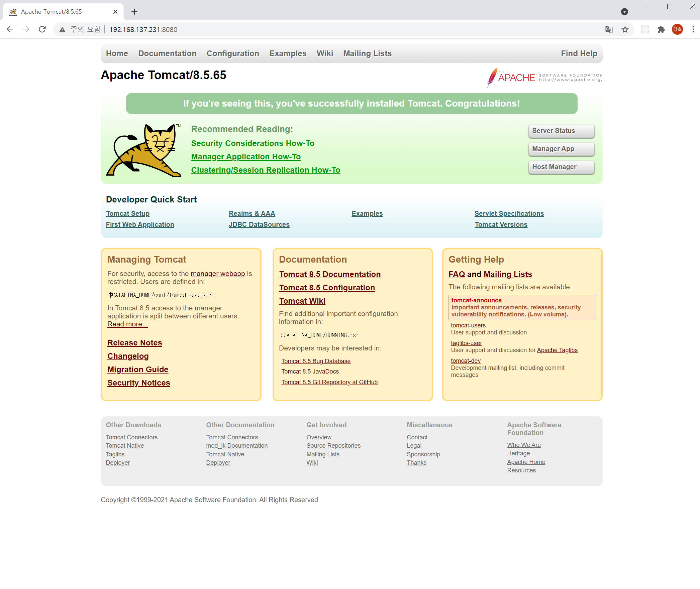

# Tomcat 8.5 버전 linux(centos7) 환경 설치 방법

## java 설치
tomcat을 실행 시키기 위해서는 java가 설치 되어 있어야 합니다. 

```
# yum list java*jdk-devel
```
설치가능한 jdk를 확인하기 위해 위 명령어를 실행시키면 다음과 같은 목록이 뜹니다.



Available Packages 중에서 java-1.8.0-openjdk-devel.x86_64을 설치하면 됩니다. 
(저는 이미 설치가 되어 있어서 Installed Packages에 있습니다.)

설치하는 명령어는

```
# java-1.8.0-openjdk-devel.x86_64
```

설치가 되었는지 확인을 해봅니다.



설치가 완료 되었으면 환경변수 설정을 해줍니다. 우선 javac의 위치를 확인해야 합니다.



'which javac'로 javac의 위치를 검색하고 
/usr/bin/javac는 심볼릭 링크이기 때문에 
'readlink -f'를 통해서 /usr/bin/javac의 실제 경로를 구합니다.

그리고 /etc/profile 을 nano편집기로 열어 하단에 다음 구문을 작성합니다.

```
PATH=$PATH:$JAVA_HOME/bin
JAVA_HOME=/usr/lib/jvm/java-1.8.0-openjdk-1.8.0.292.b10-1.el7_9.x86_64
CLASSPATH=.:$JAVA_HOME/jre/lib:$JAVA_HOME/lib/tools.jar

export PATH
export JAVA_HOME
export CLASSPATH

```

작성이 끝났으면 profile 파일 적용 위해 터미널 재접속 또는 다음 명령어를 입력합니다.

```
# source /etc/profile
```


## tomcat 설치

설치가능한 tomcat 버전을 확인하기 위해 다음 명령어를 입력합니다.

```
yum list tomcat
```

그러면 다음과 같은 목록이 뜨는데 패키지 설치 도구인 yum으로는 tomcat7버전까지만 지원을 합니다.



그래서 직접 http://tomcat.apache.org/ 사이트에 들어가서 원하는 버전의 tomcat을 확인해서 .tar파일 링크 주소를 복사합니다.




본인이 설치 하려는 디렉토리로 가서 wget 명령어를 이용해 설치를 합니다.

```
# wget https://mirror.navercorp.com/apache/tomcat/tomcat-8/v8.5.65/bin/apache-tomcat-8.5.65.tar.gz
```
(wget이 실행 안된다면 'yum install wget'으로 설치)


설치를 완료 했으면 .tar파일 압축을 풀어줍니다.

```
# tar zxvf apache-tomcat-8.5.65.tar.gz
```

외부에서 접속 가능하게 하려면 방화벽 포트를 개방합니다.



이제 톰캣 bin 디렉토리에서 startup.sh 파일을 실행시켜 줍니다. (톰캣 서버 실행)



제대로 실행이 된다면 웹에서 'http://서버ip:8080으로 접속합니다.

다음과 같은 화면이 나오면 성공입니다.



