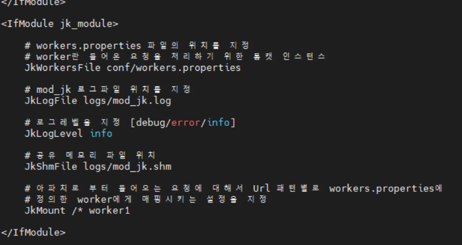
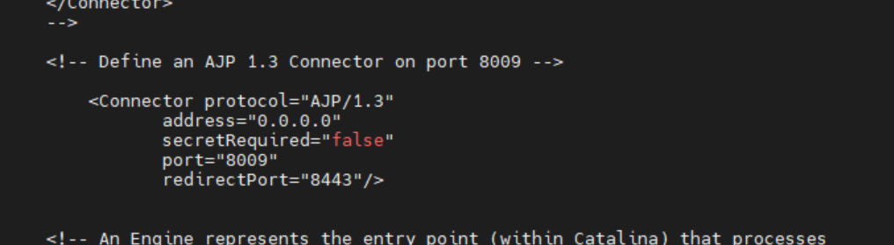

# linux(centos7) 환경에서 Apache와 tomcat 연동하기(1)

## 1. Mod_jk란?

아파치와 톰캣을 연동하기 위한 모듈로써 AJP 프로토콜을 이용하여 아파치에 들어온 요청 중 톰캣이 처리할 요청을 AJP 포트(일반적으로 8009)를 통해 톰캣에 전달하고 그에 대한 응답을 받는 역할을 수행합니다.

## 2. Mod_jk 설치

아파치 및 톰캣 설치 방법은 이전 글들을 참고 하시기 바랍니다.

우선, mod_jk를 설치에 필요한 패키지를 설치합니다.
```
# yum install gcc gcc-c++ httpd-devel
```

톰캣 웹사이트(http://tomcat.apache.org/)에 접속하여 Tomcat Connectors 메뉴로 들어가 최신 버전 파일의 링크 주소를 복사합니다.


wget 명령어를 이용하여 내려받고 압축을 풀어줍니다.
```
# wget https://mirror.navercorp.com/apache/tomcat/tomcat-connectors/jk/tomcat-connectors-1.2.48-src.tar.gz

# tar xvfz tomcat-connectors-1.2.48-src
```

Tomcat Connector 홈/native 디렉터리로 이동. configure 명령어를 통해 설치경로 정보(여기서는 아파치 설치 경로/bin/apxs)를 포함한 make 파일을 생성합니다. 정상적으로 make 파일이 생성되었다면 make 파일로 컴파일하고, make install로 설치를 진행합니다. 

```
# cd ./tomcat-connectors-1.2.48-src/native/
# ./configure --with-apxs=(아파치 설치 경로)/bin/apxs
# make
# make install
```

정상적으로 설치가 완료되면 아파치홈/modules 경로에 mod_jk.so 파일이 생성되게 됩니다.


## 2. 연동 설정

아파치 홈/conf/httpd.conf 설정 파일을 설정합니다. nano 편집기로 httpd.conf파일을 열어서 

LoadModule 부분에 다음을 추가해줍니다.


가장 하단에 다음을 추가해줍니다.


아파치홈/conf/ 에 연동할 톰캣 리스트를 나타낼 workers.properties 파일을 만들어 줍니다.
```
# nano /아파치홈/conf/workers.properties
```

다음의 내용을 입력해줍니다.
```
# list는 mod_jk가 사용할 모든 작업자리스트 기술(콤마로 구분)
# type은 톰캣과 통신할 프로토콜을 정의(ajp12, ajp13, ajp14, jni, lb)
#        ajp13프로토콜이 가장 널리 사용되며, lb는 로드밸런싱에 사용.
# host는 대상 톰캣의 IP
# port는 톰캣과 통신할 포트
worker.list=worker1
worker.worker1.type=ajp13
worker.worker1.host=localhost
worker.worker1.port=8009
```

톰캣 서버 설정을 변경해줍니다.
```
# nano 톰캣홈/conf/server.xml
```


설정이 다 되었으면 아파치와 톰캣을 재기동 하고 결과를 확인입니다.
```
# systemctl restart tomcat
# ps - ef | grep tomcat
# systemctl restart httpd
# ps - ef | grep httpd
```

웹브라우저에서 '본인IP'로 접속해서 톰캣사이트가 나오면 성공입니다.
