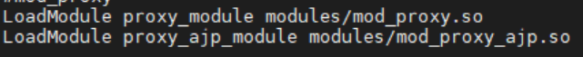
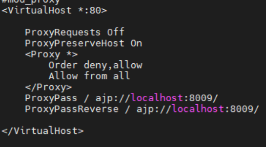

# Apache tomcat 튜닝

## 1. Server.xml 튜닝

1) Listener 설정
```
<Listener className="org.apache.catalina.security.SecurityListener" checkedOsUsers="root" />
```
– tomcat이 기동할 때, root 사용자이면 기동을 하지 못하게 하는 옵션이다.  
– application server를 root 권한으로 띄웠다가 다음번에 다시 실행하려고 하면 permission 에러  
– root 권한으로 서버가 실행되었기 때문에, 각종 config 파일이나 log 파일들의 permission이 모두 root로 바뀌어 버리기 때문에, 일반 계정으로 다시 재 기동하려고 시도하면, config 파일이나 log file들의 permission 이 바뀌어서 파일을 읽어나 쓰는데 실패하게 되고 결국 서버 기동이 불가능  
  
  
2) Connector 설정  
```
protocol="org.apache.coyote.http11.Http11Protocol"
```  
– Tomcat은 네트워크 통신하는 부분에 대해서 3가지 정도의 옵션을 제공 (BIO,NIO,APR)  
– NIO는 Java의 NIO 라이브러리를 사용하는 모듈이고, APR은 Apache Web Server의 io module을 사용  
– C라이브러리를 JNI 인터페이스를 통해서 로딩해서 사용하는데, 속도는 APR이 가장 빠른것으로 알려져 있지만, JNI를 사용하는 특성상, JNI 코드 쪽에서 문제가 생기면, 자바 프로세스 자체가 core dump를 내면서 죽어 버리기 때문에 안정성 측면에서는 BIO나 NIO보다 낮다.  
– BIO는 일반적인 Java Socket IO 모듈을 사용하는데, 이론적으로 보면 APR > NIO > BIO 순으로 성능이 빠르지만, 실제 테스트 해보면 OS 설정이나 자바 버전에 따라서 차이가 있다. (Default는 BIO)  
  
```
acceptCount="10"
```
– 이 옵션은 request Queue의 길이를 정의한다.  
– HTTP request가 들어왔을때, idle thread가 없으면 queue에서 idle thread가 생길때 까지 요청을 대기하는 queue의 길이  
– 보통 queue에 메세지가 쌓였다는 것은 해당 톰캣 인스턴스에 처리할 수 있는 쓰레드가 없다는 이야기이고, 모든 쓰레드를 사용해도 요청을 처리를 못한다는 것은 이미 장애 상태일 가능성이 높다.  
– 그래서 큐의 길이를 길게 주는 것 보다는, 짧게 줘서, 요청을 처리할 수 없는 상황이면 빨리 에러 코드를 클라이언트에게 보내서 에러처리를 하도록 하는 것이 좋다.  
– Queue의 길이가 길면, 대기 하는 시간이 길어지기 때문에 장애 상황에서도 계속 응답을 대기를 하다가 다른 장애로 전파 되는 경우가 있다.  
– 순간적인 과부하 상황에 대비 하기 위해서 큐의 길이를 0 보다는 10내외 정도로 짧게 주는 것이 좋다.  
  
```
enableLookups="false"
```  
– 톰캣에서 실행되는 Servlet/JSP 코드 중에서 들어오는 http request에 대한 ip를 조회 하는 명령등이 있을 경우, 톰캣은 yahoo.com과 같은 DNS 이름을 IP주소로 바뀌기 위해서 DNS 서버에 look up 요청을 보낸다.  
– 이것이 http request 처리 중에 일어나는데, 다른 서버로 DNS 쿼리를 보낸다는 소리이다.  
– 그만큼의 서버간의 round trip 시간이 발생하는데, 이 옵션을 false로 해놓으면 dns lookup 없이 그냥 dns 명을 리턴하기 때문에, round trip 발생을 막을 수 있다.  
  
```
compression="off"
```
– HTTP message body를 gzip 형태로 압축해서 리턴한다.  
– 업무 시나리오가 이미지나 파일을 response 하는 경우에는  compression을 적용함으로써 네트워크 대역폭을 절약하는 효과가 있겠지만, 이 업무 시스템의 가정은, JSON 기반의 REST 통신이기 때문에, 굳이 compression을 사용할 필요가 없으며, compression에 사용되는 CPU를 차라리 비지니스 로직 처리에 사용하는 것이 더 효율적  
  
```
maxConnection="8192"
```
– 하나의 톰캣인스턴스가 유지할 수 있는 Connection의 수를 정의 한다.  
– 이 때 주의해야 할 점은 이 수는 현재 연결되어 있는 실제 Connection의 수가 아니라 현재 사용중인 socket fd (file descriptor)의 수 이다.  
– TCP Connection은 특성상 Connection 이 끊난 후에도 바로 socket이 close 되는 것이 아니라 FIN 신호를 보내고, TIME_WAIT 시간을 거쳐서 connection을 정리한다.  
– 실제 톰캣 인스턴스가 100개의 Connection 으로 부터 들어오는 요청을 동시 처리할 수 있다하더라도, 요청을 처리하고 socket이 close 되면 TIME_WAIT에 머물러 있는 Connection 수가 많기 때문에, 단시간내에 많은 요청을 처리하게 되면 이 TIME_WAIT가 사용하는 fd 수 때문에, maxConnection이 모자를 수 있다. 그래서 maxConnection은 넉넉하게 주는 것이 좋다.  
– 이외에도 HTTP 1.1 Keep Alive를 사용하게 되면 요청을 처리 하지 않는 Connection도 계속 유지 되기 때문에, 요청 처리 수 보다, 실제 연결되어 있는 Connection 수가 높게 된다.  
– 그리고, process당 열 수 있는 fd수는 ulimit -f 를 통해서 설정이 된다. maxConnection을 8192로 주더라도, ulimit -f에서 fd 수를 적게 해놓으면 소용이 없기 때문에 반드시 ulimit -f 로 최대 물리 Connection 수를 설정해놔야 한다.  
  
```
maxKeepAliveRequest="1"
```
– HTTP 1.1 Keep Alive Connection을 사용할 때, 최대 유지할 Connection 수를 결정하는 옵션이다.  
– REST 방식으로 Connectionless 형태로 서비스를 진행한다면, Kepp Alive를 사용하지 않기 위해서 값을 1로 준다.  
– 만약에 KeepAlive를 사용할 예정이면, maxConnection과 같이 ulimit에서 fd수를 충분히 지정해줘야 한다.  
  
```
maxThread="100"
```
– 톰캣내의 쓰레드 수를 결정 하는 옵션이다.  
– 쓰레드수는 실제 Active User 수를 뜻한다.   
– 즉 순간 처리 가능한 Transaction 수를 의미  
– 일반적으로 100 내외가 가장 적절하고, 트렌젝션의 무게에 따라 50~500 개 정도로 설정하는 게 일반적이다. 이 값은 성능 테스트를 통해서 튜닝을 하면서 조정해 나가는 것이 좋다.  
  
```
tcpNoDelay="true"
```
– TCP 프로토콜은 기본적으로 패킷을 보낼때 바로 보내지 않는다. 작은 패킷들을 모아서 버퍼 사이즈가 다 차면 모아서 보내는 로직을 사용한다.
– 버퍼가 4K라고 가정할때, 보내고자 하는 패킷이 1K이면 3K가 찰 때 까지 기다리기 때문에, 바로바로 전송이 되지 않고 대기가 발생한다.
– tcpNoDelay 옵션을 사용하면, 버퍼가 차기전에라도 바로 전송이 되기 때문에, 전송 속도가 빨라진다.
– 반대로, 작은 패킷을 여러번 보내기 때문에 전체적인 네트워크 트래픽은 증가한다.
– 예전에야 대역폭이 낮아서 한꺼번에 보내는 방식이 선호되었지만 요즘은 망 속도가 워낙 좋아서 tcpNoDelay를 사용해도 대역폭에 대한 문제가 그리 크지 않다.


3) Tomcat Lib 세팅
– 자바 애플리케이션에서 사용하는 라이브러리에 대한 메모리 사용률을 줄이는 방법
– 일반적으로 배포를 할때 사용되는 라이브러리(jar)를 *.war 패키지 내의 WEB-INF/jar 디렉토리에 넣어서 배포 하는 것이 일반적이다.
– 보통 하나의 war를 하나의 톰캣에 배포할 때는 큰 문제가 없는데, 하나의 톰캣에 여러개의 war 파일을 동시 배포 하게 되면, 같은 라이브러리가 각각 다른 클래스 로더로 배포가 되기 때문에, 메모리 효율성이 떨어진다.
– 그래서 이런 경우는 ${TOMCAT_HOME}/lib 디렉토리에 배포를 하고 war 파일에서 빼면 모든 war가 공통 적으로 같은 라이브러리를 사용하기 때문에 메모리 사용이 효율적이고, 또한 시스템 운영 관점에서도 개발팀이 잘못된 jar 버전을 패키징해서 배포하였다 하더라도, lib 디렉토리의 라이브러리가 우선 적용되기 때문에, 관리가 편하다.
– 반대로 war의 경우, war만 운영중에 재배포를 하면 반영이 가능하지만, lib 디렉토리의 jar 파일들은 반드시 톰캣 인스턴스를 재기동해야 반영되기 때문에, 이 부분은 주의해야 한다.


4) JVM 튜닝
– Java Virtual Machine 튜닝은 java 기반 애플리케이션에서는 거의 필수 요소
– server
    – 제일 먼저 해야할일은 JVM 모드를 server 모드로 전환하는 것이다.
    – JVM 내의 hotspot 컴파일러도 클라이언트 애플리케이션이나 서버 애플리케이션이냐 에 따라서 최적화 되는 방법이 다르다.
    – 그리고 메모리 배치 역시 클라이언트 애플리케이션(MS 워드와같은)의 경우 버튼이나 메뉴는 한번 메모리에 로드 되면, 애플리케이션이 끝날 때 까지 메모리에 잔존하기 때문에 Old 영역이 커야 하지만, 서버의 경우 request를 받아서 처리하고 응답을 주고 빠져서 소멸되는 객체들이 대부분이기 때문에, New 영역이 커야 한다.
    – 이런 서버나 클라이언트냐에 대한 최적화 옵션이 이 옵션 하나로 상당 부분 자동으로 적용되기 때문에, 반드시 적용
– 메모리 옵션
    – JVM 튜닝의 대부분의 메모리 튜닝이고 그중에서도 JVM 메모리 튜닝은 매우 중요
    – Full GC 시간을 줄이는 것이 관건인데, 큰 요구 사항만 없다면, 전체 Heap Size는 1G 정도가 적당
    – New대 Old의 비율은 서버 애플리케이션의 경우 1:2 비율이 가장 적절
    – PermSize는 class가 로딩되는 공간인데, 배포하고자 하는 애플리케이션이 아주 크지 않다면 128m 정도면 적당하다. (보통 256m를 넘지 않는다. 256m가 넘는다면 몬가 애플린케이션 배포나 패키징에 문제가 있다고 봐야 한다.)
    – heap size는 JVM에서 자동으로 늘리거나 줄일 수 가 있다. 그래서 -Xms와 -Xmx로 최소,최대 heap size를 정할 수 있는데, Server 시스템의 경우 항상 최대 사용 메모리로 잡아 놓는 것이 좋다.
    – 메모리가 늘어난다는 것은 부하가 늘어난다는 것이고, 부하가 늘어날때 메모리를 늘리는 작업 자체가 새로운 부하가 될 수 있기 때문에, 같은 값을 사용하는 것이 좋다.
    ```
    -Xmx1024m –Xms1024m -XX:MaxNewSize=384m -XX:MaxPermSize=128m
    ```
    – 이렇게 하면 전체 메모리 사용량은 heap 1024m (이중에서 new가 384m) 그리고 perm이 128m 가 되고, JVM 자체가 사용하는 메모리가 보통 300~500m 내외가 되서 java process가 사용하는 메모리 량은 대략 1024+128+300~500 = 대략 1.5G 정도가 된다.
    – 32 bit JVM의 경우 process가 사용할 수 있는 공간은 4G가 되는데, 이중 2G는 시스템(OS)이 사용하고 2G가 사용자가 사용할 수 있다. 그래서 위의 설정을 사용하면 32bit JVM에서도 잘 동작한다.
    – 64 bit JVM의 경우 더 큰 메모리 영역을 사용할 수 있는데, 일반적으로 2G를 안 넘는 것이 좋다.(최대 3G), 2G가 넘어서면 Full GC 시간이 많이 걸리기 시작하기 때문에, 그다지 권장하지 않는다.
    – 시스템의 가용 메모리가 많다면 Heap을 넉넉히 잡는 것보다는 톰캣 인스턴스를 여러개 띄워서 클러스터링이나 로드밸런서로 묶는 방법을 권장
– OutOfMemory
    – 자바 애플리케이션에서 주로 문제가 되는 것중 하나가 Out Of Memory 에러
    – JVM이 메모리를 자동으로 관리해줌에도 불구하고, 이런 문제가 발생하는 원인은 사용이 끝낸 객체를 release 하지 않는 경우
    – 예를 들어 static 변수를 통해서 대규모 array나 hashmap을 reference 하고 있으면, GC가 되지 않고 계속 메모리를 점유해서 결과적으로 Out Of Memory 에러를 만들어낸다.
    – Out Of Memory 에러를 추적하기 위해서는 그 순간의 메모리 레이아웃인 Heap Dump가 필요한데, 이 옵션을 적용해놓으면, Out Of Memory가 나올때, 순간적으로 Heap Dump를 떠서 파일로 저장해놓기 때문에, 장애 발생시 추적이 용이하다.
    ```
    -XX:-HeapDumpOnOutOfMemoryError -XX:HeapDumpPath=./java_pid<pid>.hprof
    ```
– GC옵션    
    – Memory 옵션 만큼이나 중요한 옵션인데, Parallel GC + Concurrent GC는 요즘은 거의 공식처럼 사용
    – 이때 Parallel GC에 대한 Thread 수를 정해야 하는데, 이 Thread수는 전체 CPU Core수 보다 적어야 하고, 2~4개 정도가 적당
    ```
    -XX:ParallelGCThreads=2 -XX:-UseConcMarkSweepGC
    ```    
– GC로그옵션
    – 서버와 JVM이 건강한지 메모리상 문제는 없는지 GC 상황은 어떻게 디는지를 추적하려면 GC 로그는 되도록 자세하게 추출할 필요가 있다. GC로그를 상세하게 걸어도 성능 저하는 거의 없다.
    ```
    -XX:-PrintGC -XX:-PrintGCDetails -XX:-PrintGCTimeStamps -XX:-TraceClassUnloading -XX:-TraceClassLoading
    ```
    – 마지막에 적용된 TraceClassLoading은 클래스가 로딩되는 순간에 로그를 남겨준다.
    – 일반적으로는 사용하지 않아도 되나, OutOfMemory 에러 발생시 Object가 아니라 class에서 발생하는 경우는 Heap dump로는 분석이 불가능 하기 때문에, Out Of Memory 에러시 같이 사용하면 좋다.


3) event 방식
– 아파치 2.4.x 버전부터 생성된 방식
– worker 방식을 기반으로 함
– keepalive 시에 클라이언트로부터 요청을 기다리고 있는 자식 프로세스 또는 자식 스레드 전체를 keep하게
되는 문제를 해결하기 위하여 리스닝 소켓과 기타 모든 소켓을 처리하는 각 프로세스를 위한 전용 리스너
스레드를 사용

4) prefork 방식과 worker 방식 차이
– worker가 Prefork에 비해 적은 메모리를 사용한다.
– worker: 통신량이 많은 서버에 적절한 형태를 가진다.
– prefork: 안전하지 않은 제 3자가 만든 모듈을 사용할 수 있다.
– prefork: 디버깅이 빈약한 플랫폼에서 쉽게 디버깅 할 수 있다.
– prefork 방식과 worker 방식의 속도는 비슷하다.

대부분 prefork 방식이 기본적으로 사용되며, 사용자가 많은 경우에는 worker방식을 사용합니다.

<prefork> 방식
```
# 아파치홈/conf/extra/httpd-mpm.conf
<IfModule mpm_prefork_module>
    StartServers             5
    MinSpareServers          5
    MaxSpareServers         10
    MaxRequestWorkers      250
    MaxConnectionsPerChild   0
</IfModule>
```
– StartServer : 아파치서버의 자식 프로세스 개수 지정.

– MinSpareServers, MaxSpareServers : 부하가 적어서 MinSpareServers 개수 보다 적었을 경우 최소한 이 개수 만큼 아파치가 유지하려 하며, 부하가 증가하여 프로세스 개수가 많아질 경우에 MaxSpareServers 개수 이하로 줄이려고 아파치가 구동 됩니다. 절대적인 수치는 아닙니다.

– MaxRequestWorkers, ServerLimit : 기본값이 256 이기 때문에 MaxRequestWorkers 값이 256보다 작으면 따로 적을 필요가 없으며, 256보다 크면 그와 같은 값으로 설정해야합니다.

– MaxReqeustPerChild : 클라이언트들의 요청 개수를 제한, 만약 자식 프로세스가 이 값만큼의 클라이언트 요청을 받았다면 이 자식 프로세스는 자동으로 kill 됩니다. (0 인 경우 무한대)

<worker> 방식
```
# 아파치홈/conf/extra/httpd-mpm.conf
<IfModule mpm_worker_module>
    StartServers             3
    MinSpareThreads         75
    MaxSpareThreads        250
    ThreadsPerChild         25
    MaxRequestWorkers      400
    MaxConnectionsPerChild   0
</IfModule>
```
– StartServers(Default 3) : 시작시에 생성되는 서버 프로세스의 개수, 자식 프로세스의 수는 부하에 따라 동적으로 변경되기 때문에 이 값은 큰 의미가 없습니다.

– ServerLimit (default : 16) : 구성 가능한 child 프로세스의 제한 수. ServerLimit 값이 필요 이상 높게 설정 된다면, 불필요한 공유 메모리가 할당 되므로 적절한 설정 필요합니다. MaxClient 와 ThreadPerChild 에서 요구한 프로세스 수보다 높게 설정하지 마시기 바랍니다.

– MaxClient (default : ServerLimit * ThreadsPerChild) : 동시에 처리될 최대 커넥션(request)의 수, MaxClients 수치를 초과한 후 온 요청들은 ListenBackLog에 의해 대기상태가 됩니다. ThreadsPerChild 옵션과 매우 긴밀하게 작용, 동시접속자가 많을 경우, MaxClient값을 증가시켜야 합니다. OS의 FD(File Descriptor)값을 증가 시켜 MaxClient 의 상한값을 증가시키시기 바랍니다.

– MinSpareThreads(default 75) : 최소 thread 개수, 서버에 idle 쓰레드가 충분하지 않다면 child 프로세스는 idle 쓰레드가 MinSpareThreads 보다 커질때까지 생성됩니다.

– MaxSpareThreads(default 250) : 최대 thread개수, 서버에 너무 많은 idle 쓰레드가 존재하면 child 프로세스는 idle 쓰레드가 MaxSpareThreads 수보다 작아질 때까지 kill 됩니다.

– ThreadPerChild : 개별 자식 프로세스가 지속적으로 가질 수 있는 Thread의 개수.

– MaxRequestPerChild : 자식 프로세스가 서비스할 수 있는 최대 요청 개수

– ThreadLimit (default : 64) : child 프로세스의 라이프주기 동안 ThreadsPerChild 의 최대 설정값을 설정합니다. ThreadLimit 가 ThreadsPerChild 보다 훨씬 높게 설정된다면, 여분의 미사용 공유 메모리가 할당될 것입니다. ThreadLimit 과 ThreadsPerChild 모두 시스템이 감당할 수 있는 값 보다 높게 설정하면, 아파치가 기동되지 않거나 시스템이 불안정하게 될 수 있습니다.최대 예상 ThreadsPerChild의 설정보다 높게 설정하면 안됩니다.

<event> 방식
```
# 아파치홈/conf/extra/httpd-mpm.conf
<IfModule mpm_event_module>
    StartServers             3
    MinSpareThreads         75
    MaxSpareThreads        250
    ThreadsPerChild         25
    MaxRequestWorkers      400
    MaxConnectionsPerChild   0
</IfModule>
```

<현재 MPM 모듈 확인 방법>
```
# 아파치홈/bin/apachectl -V | grep -i mpm
```
Server MPM: worker


## 2. httpd.conf 설정

-Timeout
지정한 시간동안 클라이언트가 응답이 없을 경우, 세션을 끊어 버립니다.
```
Timeout 60
```

-KeepAlive
지속적인 연결을 허용 여부를 설정합니다. 비활성화하려면 Off 를 입력하면 됩니다.
```
KeepAlive on
```

-MaxKeepAliveRequests
허용할 최대 요청 수를 지정합니다. 최상의 성능을 위해서는 수치를 높게 설정하는 것을 권장합니다.
무제한으로 설정하려면 0 으로 설정하면 됩니다.
```
MaxKeepAliveRequests 100
```

-KeepAliveTimeout
동일한 연결에서 동일한 클라이언트의 다음 요청을 대기하는 시간입니다.
응답이 없을 경우 서버가 클라이언트의 접속을 끊습니다.
```
KeepAliveTimeout 5
```

<Apache 동시접속자 확인하기>
– 아파치 서버가 현재 처리 중인 소켓 연결 개수를 확인할 수 있으며
설정한 MaxClients 수를 넘지 않도록 유의해야 합니다.
```
# netstat -nltp |grep :80.*ESTABLISHED | wc -l
```


## 3. 벤치마킹 테스트
<웹서버 벤치마킹 도구(ab) 사용하여 테스트>
```
# ab -n 3000 -c 300 http://localhost/
```
=> -n은 요청수를, -c 는 동시요청수를 나타낸다. (사이트 주소의 끝에 / (슬래시)를 붙여야 합니다.)

```
Server Software : 아파치 버전을 표시
Server Hostname : 특정사이트의 이름
Server Port : 웹서비스 사용 포트 번호
Document Path : 초기 문서가 존재하는 웹문서 root위치
Time taken for tests : 응답시간(매우 중요한 결과 값)
Document Length : 초기문서의 크기
Complete requests : 요구에 응답완료한 세션 수
Failed requests : 요구에 응답실패한 세션 수
Broken pipe errors : 실패한 에러 수
Total transferred : 총 전송 바이트 수
HTTP transferred : 총 전송한 HTML 바이트 수
Requests per second : 초당 응답 요구 수
Time per request : 요구에 응답한 시간(단위 micro second, 중요한 결과값)
Time per request : 요구에 응답한 시간
Transfer rate : 초당 전송 가능한 용량
```


## 4. 아파치 메모리 사용량 측정
- 전체 메모리 사용량을 아파치 프로세스 개수로 나누어 계산
```
# ps aux | grep apache | awk '{print $6}' | awk '{total = total + $1 } END {print total/1024}'
```
=> 105.699




그리고 하단에 다음을 추가해줍니다.



설정이 다 되었으면 아파치를 재기동 하고 결과를 확인입니다.
```
# systemctl restart httpd
# ps - ef | grep httpd
```

웹브라우저에서 '본인IP'로 접속해서 톰캣사이트가 나오면 성공입니다.


