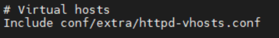
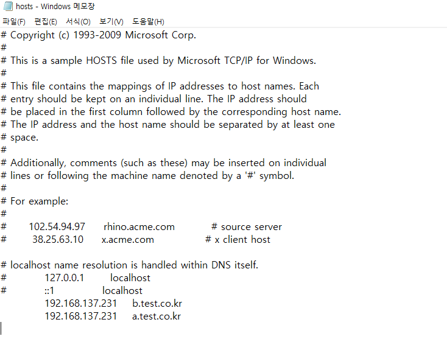
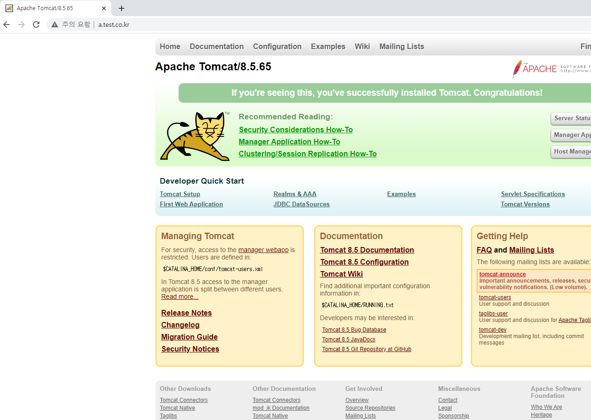

# linux(centos7) 환경에서 Apache와 tomcat 연동하기(3)

## 1. 멀티 도메인

virtual host (가상 호스트)는 하나의 서버에서 여러 웹사이트를 서비스 한다는 의미.<br>
서버가 1개, ip도 1개 두개의 도메인이 하나의 ip로 설정되어 있고 각각의 도메인으로 접속 했을 때, 서로 다른 화면을 보여주는 것은 virtual host를 통해서 구성할 수 있다.
실습환경은 다음과 같다.
```
Linux : Centos7
apache : 2.4.46
tomcat : 8.5
```

먼저 httpd.conf 파일에서 설정에 필요한 모듈의 주석을 풀어준다
```
# nano 아파치홈/conf/httpd.conf
```

Virtual Host 부분도 주석을 풀어준다.
  



설정이 끝났으면 httpd-vhosts.conf 파일에서 virtual host 구성을 해줘야 합니다.
```
# nano 아파치홈/conf/extra/httpd-vhosts.conf
```

우선, a.test.co.kr 도메인을 입력했을 때 톰캣홈 화면을 보여주는 virtualhost 구문
```
<VirtualHost *:80>

        DocumentRoot /SW/web/src
        DirectoryIndex index.html
        ServerName a.test.co.kr

        ErrorDocument 403 /error.html
        ErrorDocument 404 /error.html
        ErrorDocument 500 /error.html

        ErrorLog "|/SW/web/httpd-2.4.46/bin/rotatelogs -l /SW/web/httpd-2.4.46/logs/t_error.log.%Y%m%d 86400"
        CustomLog "|/SW/web/httpd-2.4.46/bin/rotatelogs -l /SW/web/httpd-2.4.46/logs/t_access.log.%Y%m%d 86400" combi$

        <Proxy balancer://pc_cluster stickysession=JSESSIONID>
                BalancerMember http://localhost:8080 route=pc01 loadfactor=5 retry=2
        </Proxy>

        ProxyPass /pub !
        ProxyPassReverse /pub !

        ProxyPass / balancer://pc_cluster/
        ProxyPassReverse / balancer://pc_cluster/

        Header unset X-Frame-Options

        <Location />
            Options NONE
            Require all granted
            AddOutputFilterByType DEFLATE text/html text/plain text/xml
        </Location>

</VirtualHost>
```
<br>
b.test.co.kr 도메인을 입력했을 때 index.html 페이지 화면을 보여주는 virtualhost 구문
```
<VirtualHost *:80>

        DocumentRoot /SW/web/src
        DirectoryIndex index.html
        ServerName b.test.co.kr

        ErrorDocument 403 /error.html
        ErrorDocument 404 /error.html
        ErrorDocument 500 /error.html

        ErrorLog "|/SW/web/httpd-2.4.46/bin/rotatelogs -l /SW/web/httpd-2.4.46/logs/t_error.log.%Y%m%d 86400"
        CustomLog "|/SW/web/httpd-2.4.46/bin/rotatelogs -l /SW/web/httpd-2.4.46/logs/t_access.log.%Y%m%d 86400" combi$

        <Proxy balancer://pc_cluster stickysession=JSESSIONID>
                BalancerMember http://localhost:8080 route=pc01 loadfactor=5 retry=2
        </Proxy>

        ProxyPass /pub !
        ProxyPassReverse /pub !

        ProxyPassMatch ^/(.*\.html)$ !
        ProxyPassReverse / balancer://pc_cluster/

        Header unset X-Frame-Options

        <Location />
            Options NONE
            Require all granted
            AddOutputFilterByType DEFLATE text/html text/plain text/xml
        </Location>

</VirtualHost>
```

이제는 사용할 Host(도메인)가 내부망에 연결되도록 등록해야 합니다.<br>
C:\Windows\System32\Drivers\etc\hosts 이 위치에 있는 hosts파일을 메모장으로 열어줍니다.(관리자 권한으로 실행)<br>
다음과 같이 아래쪽에 도메인을 등록시켜 줍니다.


등록이 끝났으면 웹 브라우저에서 확인을 해봅니다.

<br>


