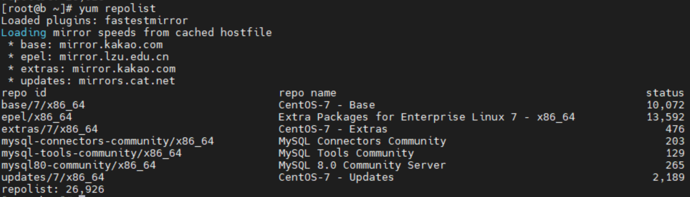
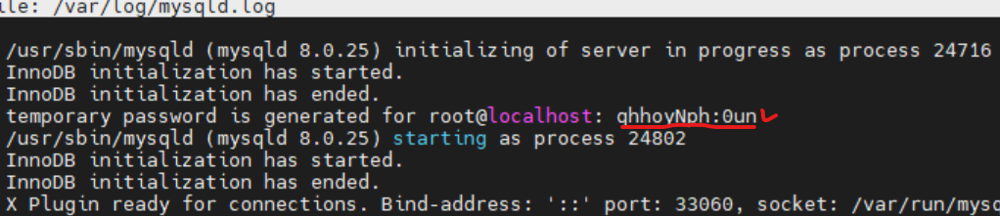
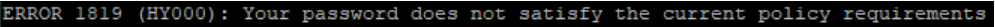
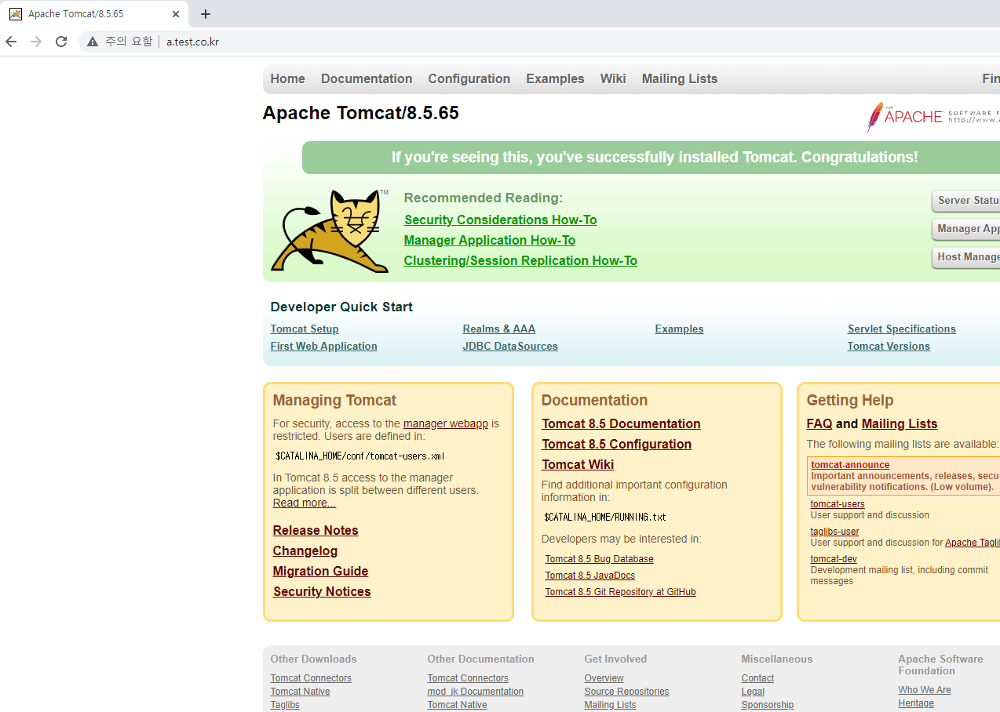

# linux(centos7) 환경에서 mysql8.x 설치하기

## 1. 다른 버전 있는지 확인 및 불필요 버전 삭제

아래 명령어를 실행 시켜서 mysql 확인 후 기존 버전이 있다면 삭제를 해줍니다.
```
# yum list installed | grep mysql
```
그리고 centos7에는 기본적으로 mariadb가 설치 되어 있어서 충돌이 일어날 수 있으므로 삭제해 줍니다.

```
# yum list installed | grep mariadb
```

## 2. MySQL rpm 패키지 링크 가져오기

Centos7의 yum에 MYSQL 관려 repository 구축을 위한 rpm 패키지를 다운받습니다.

먼저 [MYSQL DOWNLOAD](https://dev.mysql.com/downloads/) 페이지를 열고 운영체제 및 버전을 선택합니다.


<br>

설치 서버의 운영체제 버전에 맞게 Download 누르면 되는데 저는 Centos7이기 때문에 두번째를 선택합니다.
<br>

하단의 No thanks,just start my download. 부분을 우클릭 해서 링크 주소를 복사해서 rpm 패키지 설치를 진행하면 됩니다.
<br><br>

## 3. yum localinstall 명령어로 MySQL rpm 패키지 설치

localinstall 명령어로 rpm 파일 이용해서 repository를 구성합니다.
```
# yum localinstall https://dev.mysql.com/get/mysql80-community-release-el7-3.noarch.rpm
```
rpm 파일이 정상적으로 설치되었을 경우 'yum repolist' 명령어로 yum repository 목록에 mysql 관련 항목이 함께 출력될 것입니다.

<br>
mysql 서버 설치 위해 필요한 repository 구성이 완료 되었으니 mysql 서버를 설치합니다.

<br><br>

## 4. mysql-community-server 설치

```
# yum install mysql-community-server
```
yum install 명령어로 mysql-community-server를 설치합니다.

혹시 충돌이 일어날 경우에 다음 명령어로 yum 저장소를 정리 후 다시 설치를 진행해줍니다.

```
# yum clean all
# yum update
```
<br><br>

## 5. mysql 기본 설정 및 실행

설치가 완료 되었으면 mysql을 기동시킵니다.
```
# systemctl start mysqld
```

접속하기 전에 전에 미리 임시비밀번호를 확인합니다.
```
# nano /var/log/mysqld.loc
```

<br>

접속해봅니다.
```
# mysql -u root -p
password : 
```

그런데 비밀번호 규칙이 엄격해져서 비밀번호 바꾸기 위해서 보안 규칙을 내려야 합니다. 그렇지 않으면 다음과 같은 에러 발생합니다.


다음 명령어를 통해서 정책을 수정해줘야 한다.
```
# nano /etc/my.cnf
```
하단에 다음 내용을 추가해 줍니다.
```
#캐릭터셋
character-set-server=utf8mb4
collation-server=utf8mb4_unicode_ci

#비밀번호 정책
validate_password.policy=LOW
```

수정을 했으면 mysql을 재기동 시켜 줍니다.
```
# systemctl restart mysqld
```

접속 후 다음과 같이 비밀번호를 변경해 줍니다.
```
# mysql -u root -p
password : 

alter user 'root'@'localhost' identified by '변경할 비밀번호';
flush privileges;
```


실습환경은 다음과 같다.
```
Linux : Centos7
apache : 2.4.46
tomcat : 8.5
```

먼저 httpd.conf 파일에서 설정에 필요한 모듈의 주석을 풀어준다
```
# nano 아파치홈/conf/httpd.conf
```

Virtual Host 부분도 주석을 풀어준다.


설정이 끝났으면 httpd-vhosts.conf 파일에서 virtual host 구성을 해줘야 합니다.
```
# nano 아파치홈/conf/extra/httpd-vhosts.conf
```

우선, a.test.co.kr 도메인을 입력했을 때 톰캣홈 화면을 보여주는 virtualhost 구문
```
<VirtualHost *:80>

        DocumentRoot /SW/web/src
        DirectoryIndex index.html
        ServerName a.test.co.kr

        ErrorDocument 403 /error.html
        ErrorDocument 404 /error.html
        ErrorDocument 500 /error.html

        ErrorLog "|/SW/web/httpd-2.4.46/bin/rotatelogs -l /SW/web/httpd-2.4.46/logs/t_error.log.%Y%m%d 86400"
        CustomLog "|/SW/web/httpd-2.4.46/bin/rotatelogs -l /SW/web/httpd-2.4.46/logs/t_access.log.%Y%m%d 86400" combi$

        <Proxy balancer://pc_cluster stickysession=JSESSIONID>
                BalancerMember http://localhost:8080 route=pc01 loadfactor=5 retry=2
        </Proxy>

        ProxyPass /pub !
        ProxyPassReverse /pub !

        ProxyPass / balancer://pc_cluster/
        ProxyPassReverse / balancer://pc_cluster/

        Header unset X-Frame-Options

        <Location />
            Options NONE
            Require all granted
            AddOutputFilterByType DEFLATE text/html text/plain text/xml
        </Location>

</VirtualHost>
```
<br>
b.test.co.kr 도메인을 입력했을 때 index.html 페이지 화면을 보여주는 virtualhost 구문
```
<VirtualHost *:80>

        DocumentRoot /SW/web/src
        DirectoryIndex index.html
        ServerName b.test.co.kr

        ErrorDocument 403 /error.html
        ErrorDocument 404 /error.html
        ErrorDocument 500 /error.html

        ErrorLog "|/SW/web/httpd-2.4.46/bin/rotatelogs -l /SW/web/httpd-2.4.46/logs/t_error.log.%Y%m%d 86400"
        CustomLog "|/SW/web/httpd-2.4.46/bin/rotatelogs -l /SW/web/httpd-2.4.46/logs/t_access.log.%Y%m%d 86400" combi$

        <Proxy balancer://pc_cluster stickysession=JSESSIONID>
                BalancerMember http://localhost:8080 route=pc01 loadfactor=5 retry=2
        </Proxy>

        ProxyPass /pub !
        ProxyPassReverse /pub !

        ProxyPassMatch ^/(.*\.html)$ !
        ProxyPassReverse / balancer://pc_cluster/

        Header unset X-Frame-Options

        <Location />
            Options NONE
            Require all granted
            AddOutputFilterByType DEFLATE text/html text/plain text/xml
        </Location>

</VirtualHost>
```

이제는 사용할 Host(도메인)가 내부망에 연결되도록 등록해야 합니다.<br>
C:\Windows\System32\Drivers\etc\hosts 이 위치에 있는 hosts파일을 메모장으로 열어줍니다.(관리자 권한으로 실행)<br>
다음과 같이 아래쪽에 도메인을 등록시켜 줍니다.


등록이 끝났으면 웹 브라우저에서 확인을 해봅니다.

<br>


