# linux(centos7) 환경에서 WAR file Tomcat 배포

## 1. Spring Tool Suite에서 WAR 배포 파일 만들기
<br>

이클립스에서는 다음과 같이 간편하게 war 파일을 만들 수 있습니다.
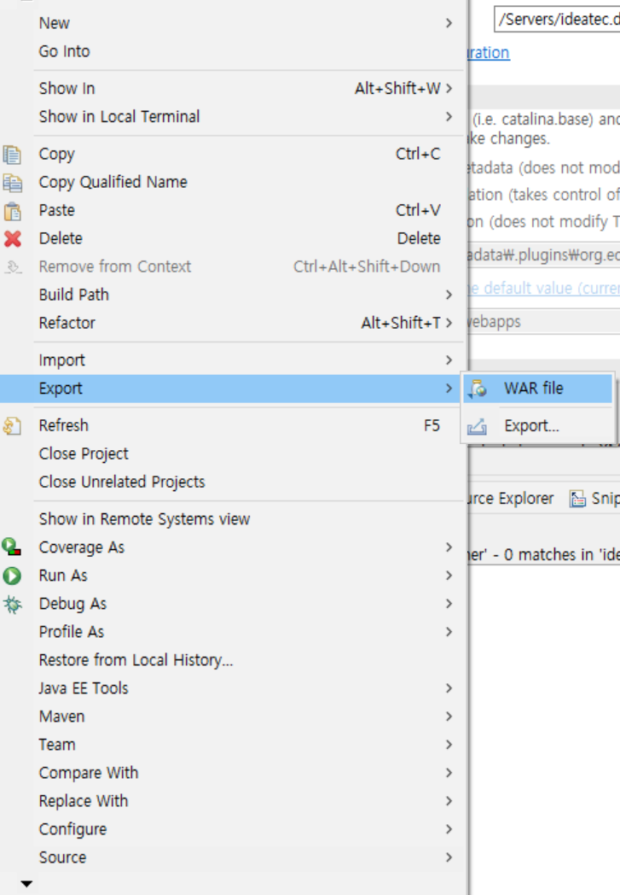
<br>
하지만 sts에서는 이클립스와 같은 방법으로 할 수 없습니다.
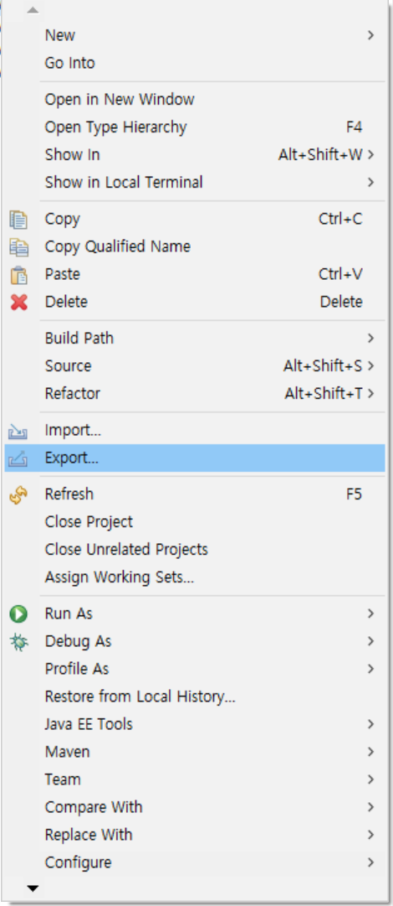
<br>
sts에서는 프로젝트 우클릭 후 Run As -> Maven Install을 해줍니다.
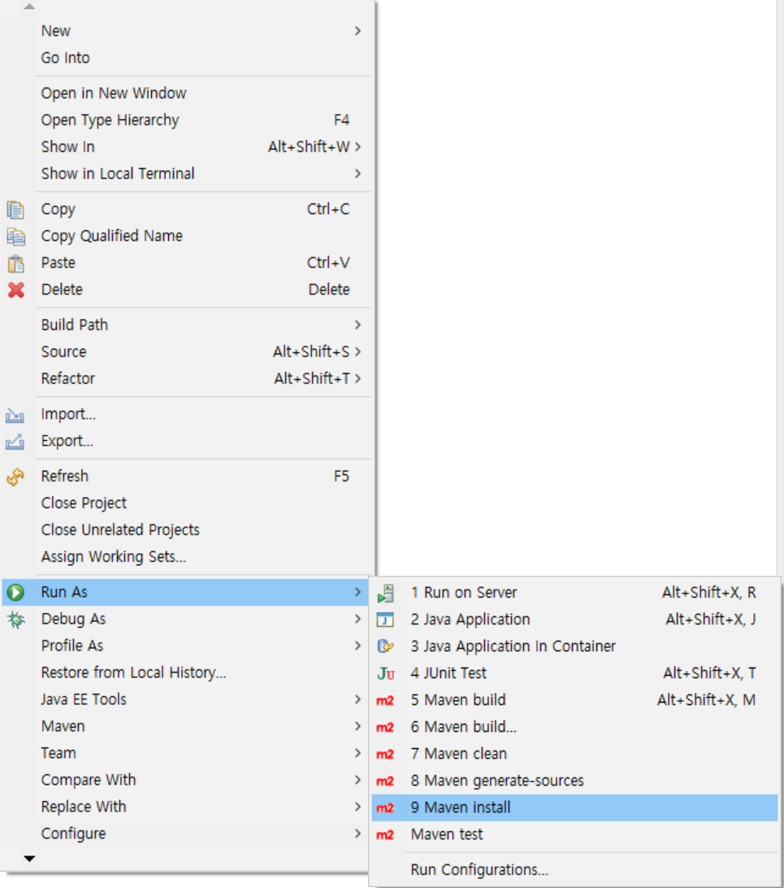
<br>
그러면 console 창에 다음과 같이 설치경로가 나옵니다.
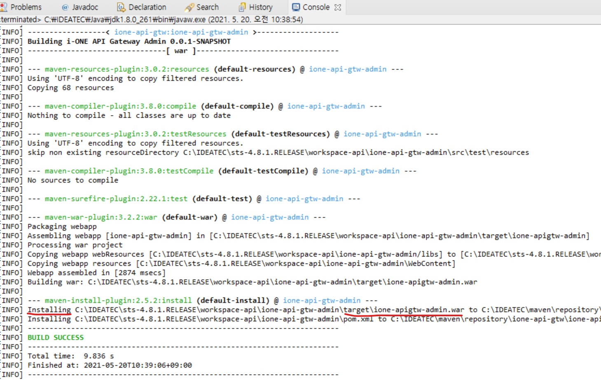
<br>
해당 경로로 가보면 war 파일이 생성된 것을 확인할 수 있습니다.
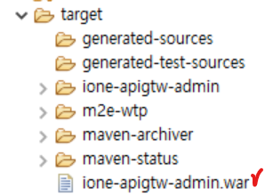
<br><br>

## 2. 로컬 Window에서 SSH를 이용해서 Linux 서버로 파일 전송하기
<br>
먼저, Window10 기준으로 OpenSSH Client기능이 활성화 되어 있어야 합니다. 

시작 메뉴 우측에 있는 검색 버튼에서 '앱 및 기능'을 검색 후 클릭합니다.
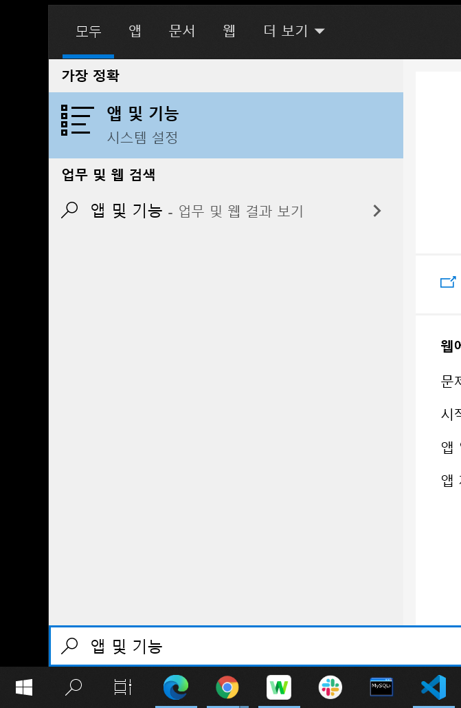
<br>
'선택적 기능'을 클릭 후 OpenSSH 클라이언트가 설치 되어 있는 것을 확인합니다.
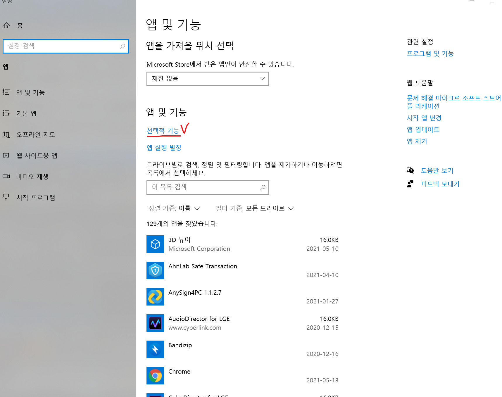
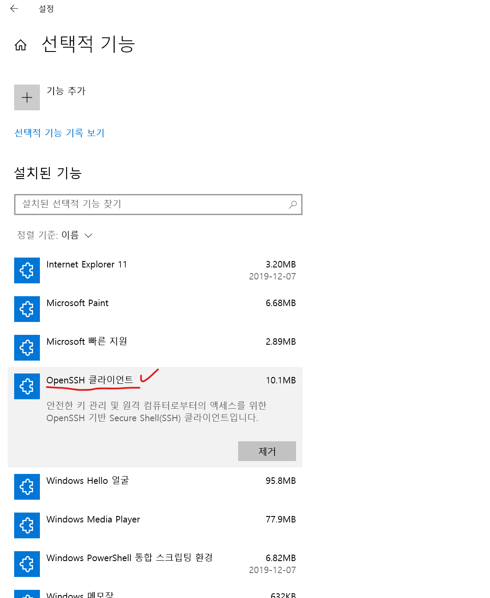
<br>
Linux 쪽도 openssh가 설치되어 있는지 확인합니다. 다음 명령어를 실행하면 설치가 되어 있다면 최신버전으로 업데이트하고 설치가 안되어 있다면 설치를 진행합니다.
```
# yum install -y openssh-server openssh-clients openssh-askpass
```

설치가 완료 되었으면 (필요시)sshd_config파일을 열어 설정 변경을 해줍니다.
```
# nano /etc/ssh/sshd_config
```

방화벽을 허용하고 다시 로드 해준 뒤 확인해줍니다.
```
# firewall-cmd --permanent --zone=public --add-port=22/tcp
# firewall-cmd --reload
# firewall-cmd --list-all
```

다시 Window로 돌아와서 cmd 창을 열어 톰캣홈디렉토리/webapps 안에 war 파일 전송을 합니다.<br>
scp -P (ssh 포트번호) (window 파일경로) (Linux 계정)]@(서버주소):(묵적지경로)<br>
(포트번호가 22일 경우 포트번호를 따로 입력하지 않아도 됩니다.)
```
scp C:\IDEATEC\sts-4.8.1.RELEASE\workspace-api\ione-api-gtw-admin\target\ione-apigtw-admin root@192.168.137.231:/SW/was/tomcat/webapps 
```

혹시 전송이 되지 않을 경우, WinSCP를 다운받아서 접속 정보 입력 후 파일을 전송하면 됩니다. 
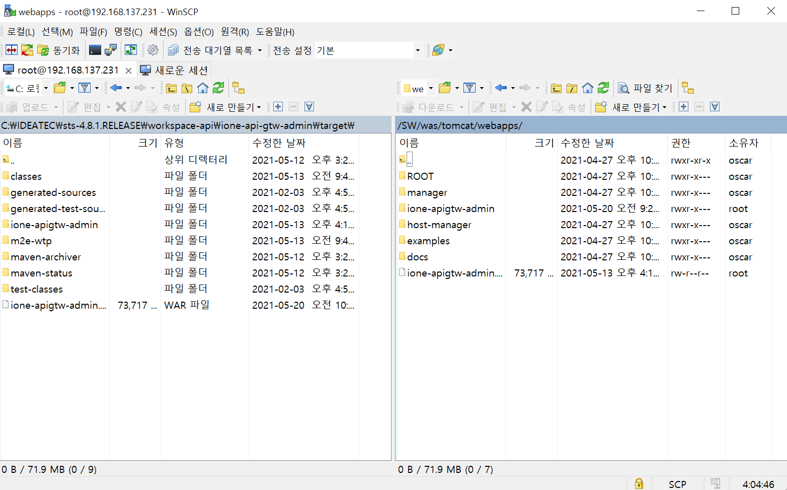
<br>

war 파일이 전송이 되고 tomcat을 기동시켜주면 war 파일 압축을 풀어줍니다. 
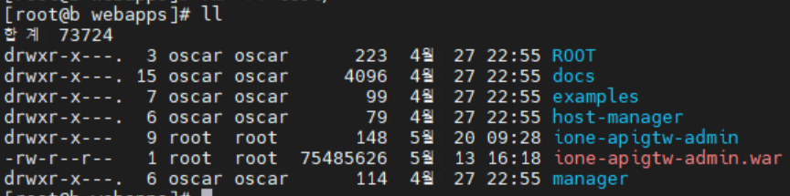
<br><br>

## 3. 기타 설정 및 경로 설정

혹시 어플리케이션 기동에 필요한 JVM 옵션이 있다면 tomcat/bin/catalina.sh 파일에서 해당 부분에 다음과 같이 추가해주면 됩니다.
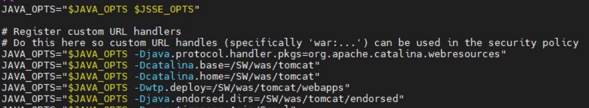

마지막으로 톰캣홈디렉토리/conf/server.xml 파일에서 &lt;Host&gt; 내의 &lt;Context&gt;에서 파일경로 설정 및 변경이 가능합니다.

```
# nano 톰캣홈디렉토리/conf/server.xml
```

```
<Host name="192.168.137.231"  appBase="webapps"
            unpackWARs="true" autoDeploy="true">

    <Context path="/" docBase="ione-apigtw-admin" reloadable="true" source="org.eclipse.jst.jee.server:ione-api-gtw-admin" />    

<Host>            
```
&lt;Host&gt;의 name 에선 host 설정을 해주고, appBase로 부터 시작하는 상대로경로이므로 톰캣홈디렉토리/webapps가 기본 디렉토리가 됩니다.<br>
&lt;Context&gt; 내용은 l92.168.137.231:8080/를 요청할 경우, l92.168.137.231:8080/ione-apigtw-admin 로 접속을 합니다.
<br>

모든 설정이 끝났으면 tomcat 재기동 후 접속해봅니다.
<br><br>

## 4. Server.xml 설정

&lt;Host&gt;<br>
1.name : host 이름 설정 <br>
2.appBase : 웹 어플리케이션이 존재하는 경로<br>
3.autoDeploy (디폴트 true) : WAR 파일을 appBase 디렉토리에 위치시키면 톰캣 구동 시 WAR 파일을 자동으로 읽어서 배포함. <br>
4.unpackWARs (디폴트 true) : WAR 파일의 압축을 풀어서 배치. <br><br>

&lt;Context&gt;<br>
1.path : 어플리케이션이 배치되는 URL 앞부분을 정함.<br>
2.docBase : WAR 파일이나 확장 어플리케이션 디렉토리 나타냄. <br>
3.reloadable : 일정 주기마다(15초) 루트경로의 class파일 변경여부 확인하고, 자동으로 재기동하여 리로드 시켜줌.


