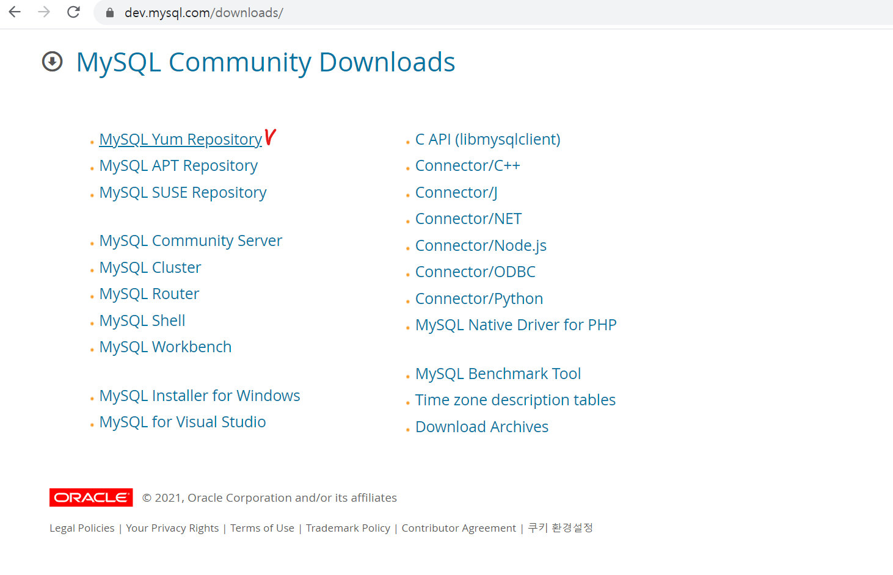
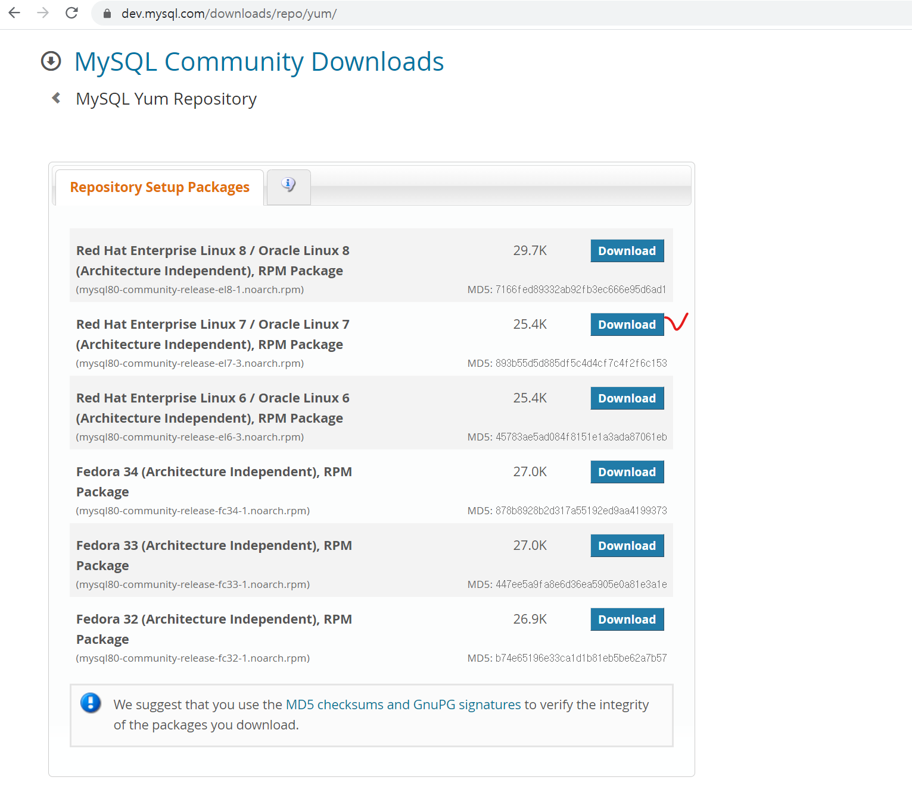
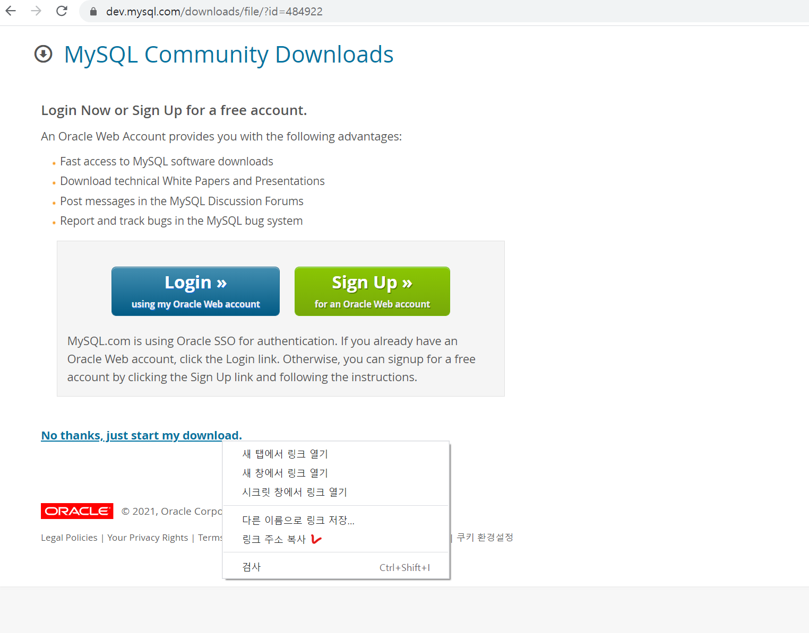

# linux(centos7) 환경에서 WAR file Tomcat 배포

## 1. Spring Tool Suite에서 WAR 배포 파일 만들기

이클립스에서는 다음과 같이 간편하게 war 파일을 만들 수 있습니다.


하지만 sts에서는 이클립스와 같은 방법으로 할 수 없습니다.


sts에서는 프로젝트 우클릭 후 Run As -> Maven Install을 해줍니다.


그러면 console 창에 다음과 같이 설치경로가 나옵니다.


해당 경로로 가보면 war 파일이 생성된 것을 확인할 수 있습니다.

<br><br>

## 2. 로컬 Window에서 SSH를 이용해서 Linux 서버로 파일 전송하기

먼저, Window10 기준으로 OpenSSH Client기능이 활성화 되어 있어야 합니다. 

시작 메뉴 우측에 있는 검색 버튼에서 '앱 및 기능'을 검색 후 클릭합니다.


'선택적 기능'을 클릭 후 OpenSSH 클라이언트가 설치 되어 있는 것을 확인합니다.


Linux 쪽도 openssh가 설치되어 있는지 확인합니다. 다음 명령어를 실행하면 설치가 되어 있다면 최신버전으로 업데이트하고 설치가 안되어 있다면 설치를 진행합니다.
```
# yum install -y openssh-server openssh-clients openssh-askpass
```

설치가 완료 되었으면 (필요시)sshd_config파일을 열어 설정 변경을 해줍니다.
```
# nano /etc/ssh/sshd_config
```

방화벽을 허용하고 다시 로드 해준 뒤 확인해줍니다.
```
# firewall-cmd --permanent --zone=public --add-port=22/tcp
# firewall-cmd --reload
# firewall-cmd --list-all
```

다시 Window로 돌아와서 cmd 창을 열어 톰캣홈디렉토리/webapps 안에 war 파일 전송을 합니다.<br>
scp -P (ssh 포트번호) (window 파일경로) (Linux 계정)]@(서버주소):(묵적지경로)<br>
(포트번호가 22일 경우 포트번호를 따로 입력하지 않아도 됩니다.)
```
scp C:\IDEATEC\sts-4.8.1.RELEASE\workspace-api\ione-api-gtw-admin\target\ione-apigtw-admin root@192.168.137.231:/SW/was/tomcat/webapps 
```

혹시 전송이 되지 않을 경우, WinSCP를 다운받아서 접속 정보 입력 후 파일을 전송하면 됩니다. 

<br>

war 파일이 전송이 되면 war파일 이름으로된 디렉토리가 생성이 되어있습니다. 해당 디렉토리로 들어가서 압축을 풀어주면 됩니다.
```
# cd ione-apigtw-admin
# jar xvf ione-apigtw-admin.jar ../ione-apigtw-admin
```

<br><br>

## 3. 기타 설정 및 경로 설정

혹시 어플리케이션 기동에 필요한 JVM 옵션이 있다면 tomcat/bin/catalina.sh 파일에서 해당 부분에 다음과 같이 추가해주면 됩니다.


마지막으로 톰캣홈디렉토리/conf/server.xml 파일에서 &lt;Host&gt; 내의 &lt;Context&gt;에서 파일경로 설정 및 변경이 가능합니다.

```
# nano 톰캣홈디렉토리/conf/server.xml
```

```
<Host name="192.168.137.231"  appBase="webapps"
            unpackWARs="true" autoDeploy="true">

    <Context path="/" docBase="ione-apigtw-admin" reloadable="true" source="org.eclipse.jst.jee.server:ione-api-gtw-admin" />    

<Host>            
```
&lt;Host&gt;의 name 에선 host 설정을 해주고, appBase로 부터 시작하는 상대로경로이므로 톰캣홈디렉토리/webapps가 기본 디렉토리가 됩니다.<br>
&lt;Context&gt; 내용은 l92.168.137.231:8080/를 요청할 경우, l92.168.137.231:8080/ione-apigtw-admin 로 접속을 합니다.
<br>


아래 명령어를 실행 시켜서 mysql 확인 후 기존 버전이 있다면 삭제를 해줍니다.
```
# yum list installed | grep mysql
```
그리고 centos7에는 기본적으로 mariadb가 설치 되어 있어서 충돌이 일어날 수 있으므로 삭제해 줍니다.

```
# yum list installed | grep mariadb
```

## 2. MySQL rpm 패키지 링크 가져오기

Centos7의 yum에 MYSQL 관려 repository 구축을 위한 rpm 패키지를 다운받습니다.

먼저 [MYSQL DOWNLOAD](https://dev.mysql.com/downloads/) 페이지를 열고 운영체제 및 버전을 선택합니다.


<br>

설치 서버의 운영체제 버전에 맞게 Download 누르면 되는데 저는 Centos7이기 때문에 두번째를 선택합니다.
<br>

하단의 No thanks,just start my download. 부분을 우클릭 해서 링크 주소를 복사해서 rpm 패키지 설치를 진행하면 됩니다.
<br><br>

## 3. yum localinstall 명령어로 MySQL rpm 패키지 설치

localinstall 명령어로 rpm 파일 이용해서 repository를 구성합니다.
```
# yum localinstall https://dev.mysql.com/get/mysql80-community-release-el7-3.noarch.rpm
```
rpm 파일이 정상적으로 설치되었을 경우 'yum repolist' 명령어로 yum repository 목록에 mysql 관련 항목이 함께 출력될 것입니다.

<br>
mysql 서버 설치 위해 필요한 repository 구성이 완료 되었으니 mysql 서버를 설치합니다.

<br><br>

## 4. mysql-community-server 설치

```
# yum install mysql-community-server
```
yum install 명령어로 mysql-community-server를 설치합니다.

혹시 충돌이 일어날 경우에 다음 명령어로 yum 저장소를 정리 후 다시 설치를 진행해줍니다.

```
# yum clean all
# yum update
```
<br><br>

## 5. mysql 기본 설정 및 실행

설치가 완료 되었으면 mysql을 기동시킵니다.
```
# systemctl start mysqld
```

접속하기 전에 전에 미리 임시비밀번호를 확인합니다.
```
# nano /var/log/mysqld.loc
```

<br>

접속해봅니다.
```
# mysql -u root -p
password : 
```

그런데 비밀번호 규칙이 엄격해져서 비밀번호 바꾸기 위해서 보안 규칙을 내려야 합니다. 그렇지 않으면 다음과 같은 에러 발생합니다.


다음 명령어를 통해서 정책을 수정해줘야 한다.
```
# nano /etc/my.cnf
```
하단에 다음 내용을 추가해 줍니다.
```
#캐릭터셋
character-set-server=utf8mb4
collation-server=utf8mb4_unicode_ci

#비밀번호 정책
validate_password.policy=LOW
```

수정을 했으면 mysql을 재기동 시켜 줍니다.
```
# systemctl restart mysqld
```

접속 후 다음과 같이 비밀번호를 변경해 줍니다.
```
# mysql -u root -p
password : 

alter user 'root'@'localhost' identified by '변경할 비밀번호';
flush privileges;
```


