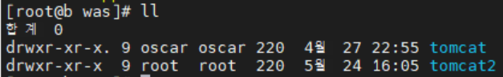
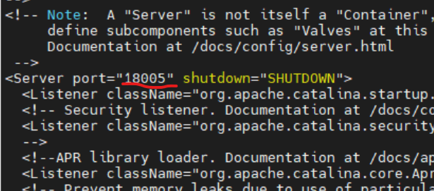
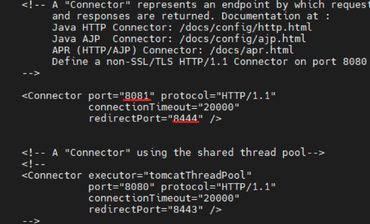
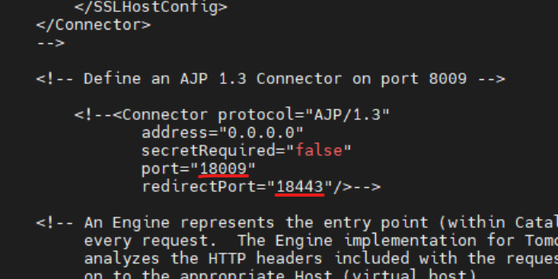
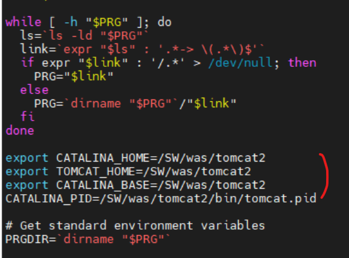
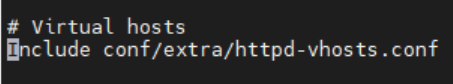
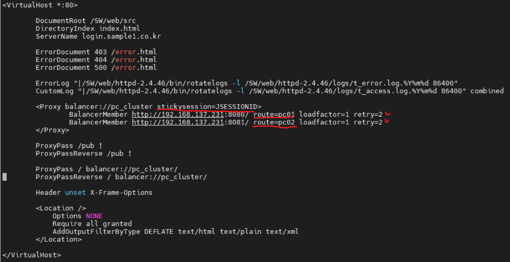
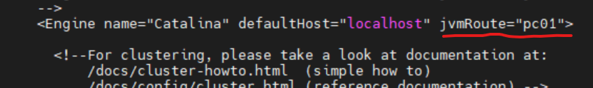
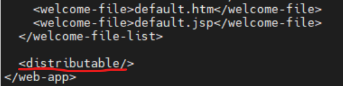

# linux(centos7) 환경에서 apache tomcat으로 session clustering

## 1. Tomcat 이중화 구성하기
기존에 톰캣이 설치되어 있다면 톰캣 홈디렉토리를 복사해서 하나를 더 구성합니다.


server.xml파일에서 포트를 변경해줍니다.
```
# nano 복사한톰캣홈디렉토리/conf/server.xml
```



혹시 ajp도 쓰고 있다면 변경해줍니다.


<br>
catalina.sh파일에서 CATALINA 경로를 변경해줍니다. 해당위치에 아래 소스를 추가해줍니다.

```
# nano 복사한톰캣홈디렉토리/bin/catalina.sh
```
```
export CATALINA_HOME=복사한톰캣홈디렉토리
export TOMCAT_HOME=복사한톰캣홈디렉토리
export CATALINA_BASE=복사한톰캣홈디렉토리
CATALINA_PID=복사한톰캣홈디렉토리/bin/tomcat.pid
```


<br>

## 2. session clustering 설정
일단, 기존 톰캣에 war파일 배포한 것과 마찬가지로 복사한 톰캣에도 같은 위치에 war파일을 배포해줍니다.<br>
그리고 아파치 httpd.cof파일에서 httpd-vhosts.conf파일에 대한 주석을 제거합니다.
```
# nano 아파치홈디렉토리/conf/httpd.conf
```

<br>

아파치 httpd-vhosts.conf파일에서 로드밸런싱 설정을 해줍니다. Proxy balancer에 stickysession으로 JSESSIONID 설정해주고, BalancerMember로 톰캣서버2개를 설정해주는데 고정세션값 route를 서로 다른 이름으로 설정합니다. 
```
# nano 아파치홈디렉토리/conf/extra/httpd-vhosts.conf
```

<br>

아파치 설정이 끝났으면 톰캣의 server.xml파일cluster 설정을 해줍니다. (톰캣서버 둘다 적용)
```
# nano 톰캣홈디렉토리/conf/server.xml
```
Cluster 부분의 주석을 풀고 아래 소스를 추가해줍니다.<br>
여기서 Membershipe 절에 address=228.0.0.4", port=45564" 두요소는 클러스터멤버쉽을 구성합니다.(동일 클러스터는 동일 address,port를 가져야함)<br>
동일 서버에 여러개의 톰캣을 설치하여 클러스터멤버쉽을 구성할경우 Receiver 절의 port 변경해줍니다.(톰캣2는 4001)
```
  <Cluster className="org.apache.catalina.ha.tcp.SimpleTcpCluster"
              channelSendOptions="8">

       <Manager className="org.apache.catalina.ha.session.DeltaManager"
                     expireSessionsOnShutdown="false" notifyListenersOnReplication="true"/>

       <Channel className="org.apache.catalina.tribes.group.GroupChannel">

          <Membership className="org.apache.catalina.tribes.membership.McastService"
                             address="228.0.0.4"
                             port="45564"
                             frequency="500"
                             dropTime="3000"/>

          <Receiver className="org.apache.catalina.tribes.transport.nio.NioReceiver"
                        address="auto"
                        port="4000"
                        autoBind="100"
                        selectorTimeout="5000"
                        maxThreads="6"/>

          <Sender className="org.apache.catalina.tribes.transport.ReplicationTransmitter">

              <Transport className="org.apache.catalina.tribes.transport.nio.PooledParallelSender"/>
          </Sender>		  
          <Interceptor className="org.apache.catalina.tribes.group.interceptors.TcpFailureDetector"/>

          <Interceptor className="org.apache.catalina.tribes.group.interceptors.MessageDispatchInterceptor"/>                  
        </Channel>

        <Valve className="org.apache.catalina.ha.tcp.ReplicationValve" filter=""/>
        <Valve className="org.apache.catalina.ha.session.JvmRouteBinderValve"/>
        <Deployer className="org.apache.catalina.ha.deploy.FarmWarDeployer"
                       tempDir="/tmp/war-temp/"
                       deployDir="/tmp/war-deploy/"
                       watchDir="/tmp/war-listen/"
                       watchEnabled="false"/>
         <ClusterListener className="org.apache.catalina.ha.session.ClusterSessionListener"/>
 </Cluster>
```
그리고 apache 로드밸런싱 설정시 해줬던 route명을 Engine의 jvmRoute명으로 설정합니다.(톰캣서버 둘다 적용)

<br>

다음엔 세션을 공유하고자 하는 웹어플리케이션의 web.xml에 다음 소스를 추가해줍니다. (톰캣서버 둘다 적용)
```
<distributable/>
```

<br>

마지막으로 멀티캐스트와 Receiver포트 방화벽을 오픈해주면 됩니다.
```
firewall-cmd --permanent --zone=public --add-port=45564/tcp
firewall-cmd --permanent --zone=public --add-port=45564/udp
firewall-cmd --permanent --zone=public --add-port=4000/tcp
firewall-cmd --permanent --zone=public --add-port=4001/tcp
firewall-cmd --reload
```


