# linux(centos7) 환경에서 redis를 활용한 tomcat session Management

## 1. Redis 설치하기
redis를 활용한 tomcat session 관리를 위해서는 가장 먼저 Redis를 설치해야 합니다.<br>
[레디스 다운로드](https://redis.io/download) 페이지에서 아래와 같이 링크 주소 복사를 해줍니다.<br>
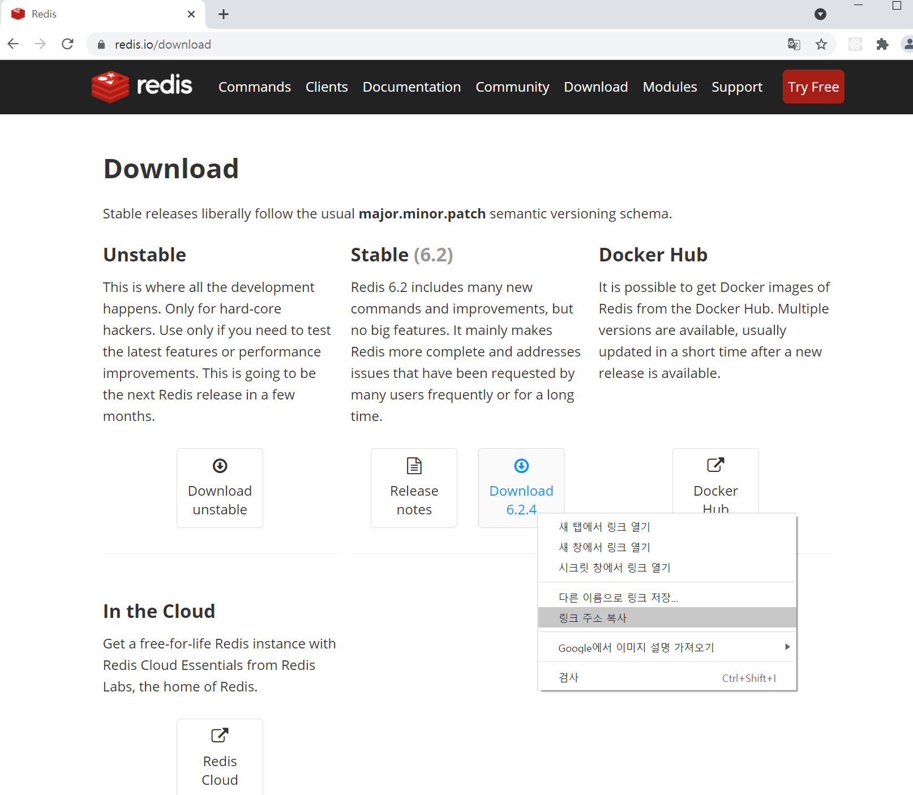
<br>

리눅스 터미널에서 다음과 같이 명령어를 입력해 다운로드 및 압축 해제를 합니다.
```
# wget (복사한 링크 주소)https://download.redis.io/releases/redis-6.2.3.tar.gz
# tar xf redis-6.2.3.tar.gz
```
<br>
그럼 다음과 같이 디렉토리가 생성이 됩니다.
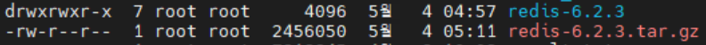
<br>
생성된 디렉토리로 들어가서 make 파일을 실행해줍니다.
```
# cd redis-6.2.3
# make
```
에러 발생시 gcc를 설치하고 make 파일을 distclean 한 뒤에 다시 실행해줍니다.
```
# yum install gcc
# make distclean
# make
# make install PREFIX=/opt/redis
```

profile파일을 열어 다음과 같이 입력해 환경 변수 설정을 해줍니다.
```
# nano etc/profile
```
```
export REDIS_HOME=/opt/redis
export PATH=$PATH:$REDIS_HOME/bin
```

환경변수를 활성화 해줍니다.
```
# source /etc/profile
```

<br>
환경 변수 설정까지 끝났으면 install_server.sh를 실행시켜줍니다.
```
# cd redis홈디렉토리/utils
# ./install_server.sh
```
<br>
그럼 다음과 같은 문구가 나타납니다.
```
This systems seems to use systemd.
Please take a look at the provided example service unit files in this directory, and adapt and install them. Sorry!
```
<br>
install_server.sh를 열어서 다음과 같이 주석을 달아줍니다.
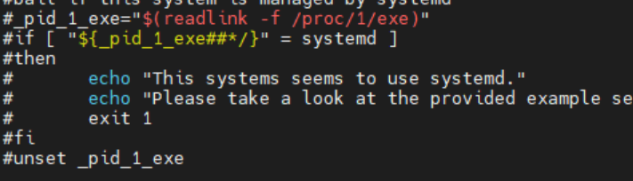
<br>
그리고 다시 install_server.sh 파일을 실행하면 다음과 같이 나타나게 되고, default로 할거면 ENTER키를, 아니라면 따로 설정을 해주면 됩니다.
```
# ./install_server.sh
```
```
Please select the redis port for this instance: [6379] 
```
redis server의 default포트. (ENTER)
```
Please select the redis config file name [/etc/redis/6379.conf]  
```
config 파일 경로 설정. (ENTER)
```
Please select the redis log file name [/var/log/redis_6379.log]  
```
로그 파일 경로 설정. (ENTER)
```
Please select the redis executable path []
```
redis-server 실행 경로 설정. 못찾을 시 다음과 같이 설정
```
Please select the redis executable path [] /opt/redis/bin/redis-server
```
설정이 끝나면 다음과 같이 나타나고 마지막 ENTER키를 누르게 되면 설치에 성공했다는 문구가 나타납니다.
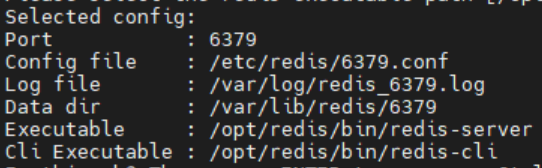<br><br>

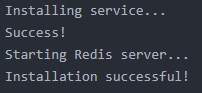<br>

redis 서버가 기동되고 있는지 확인합니다.
```
# systemctl status redis_6379
```
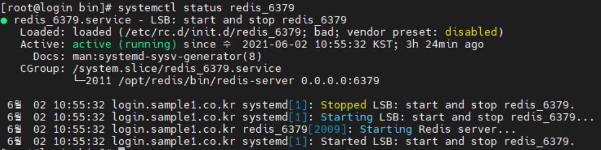<br>

마지막으로 외부접속이 가능하도록 방화벽포트를 열어주고 설정 변경을 해줍니다.
먼저 방화벽 포트를 열어줍니다.
```
# firewall-cmd --permanent --add-port=6379/tcp
# firewall-cmd --reload
```

다음으로 /etc/redis/6379.conf 파일을 열어 127.0.0.1은 주석해주고 0.0.0.0으로 bind 해줍니다.
```
# nano /etc/redis/6379.conf
```
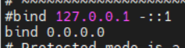<br><br>


## 2. Redisson을 이용한 tomcat session 관리

2개 이상의 톰캣서버를 운영할 경우에 JndiRedissonFactory를 tomcat홈디렉토리/conf/server.xml의 GlobalNamingResources태그 부분에 추가합니다. (모든 톰캣서버에 적용)
```
# nano tomcat홈디렉토리/conf/server.xml
```
```
  <GlobalNamingResources>
    <Resource name="bean/redisson"
	      auth="Container"
              factory="org.redisson.JndiRedissonFactory"
              configPath="${catalina.base}/conf/redisson.yaml"
	      closeMethod="shutdown"/>
  </GlobalNamingResources>
```
configPath에서 설정해놓은 redisson.yaml 파일을 해당 경로에 만들어줍니다. address부분만 본인이 설정한 포트로 맞춰줍니다. (모든 톰캣서버에 적용)
```
# cd tomcat홈디렉토리/conf/redisson.yaml
```
```
singleServerConfig:
  idleConnectionTimeout: 10000
  connectTimeout: 10000
  timeout: 3000
  retryAttempts: 3
  retryInterval: 1500
  password: null
  subscriptionsPerConnection: 5
  clientName: null
  address: "redis://localhost:6379"
  subscriptionConnectionMinimumIdleSize: 1
  subscriptionConnectionPoolSize: 50
  connectionMinimumIdleSize: 24
  connectionPoolSize: 64
  database: 0
  dnsMonitoringInterval: 5000
threads: 16
nettyThreads: 32
codec: !<org.redisson.codec.MarshallingCodec> {}
transportMode: "NIO"
```

다음엔 JndiRedissonSessionManager를 tomcat홈디렉토리/conf/context.xml에 추가합니다. (모든 톰캣서버에 적용)
```
# nano tomcat홈디렉토리/conf/context.xml
```
```
    <ResourceLink name="bean/redisson"
                  global="bean/redisson"
		  type="org.redisson.api.RedissonClient" />

    <Manager className="org.redisson.tomcat.JndiRedissonSessionManager"
         readMode="REDIS"
         jndiName="bean/redisson" />
```

마지막으로 본인의 tomcat버전에 맞는 2개의 jar 파일을 tomcat홈디렉토리/lib에 넣어주면 됩니다.
```
redisson-all-3.15.5.jar

Tomcat 7.x - redisson-tomcat-7-3.15.5.jar

Tomcat 8.x - redisson-tomcat-8-3.15.5.jar

Tomcat 9.x - redisson-tomcat-9-3.15.5.jar

Tomcat 10.x - redisson-tomcat-10-3.15.5.jar
```

나머지 아파치 virtualhost설정 및 route설정은 이전 글을 참고바랍니다.<br>

모든 설정이 끝났으면 apache, redis서버와 두개의 tomcat서버를 기동시키고 확인합니다.
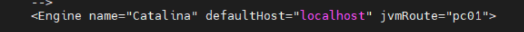<br>

브라우저에서 session정보를 확인합니다.
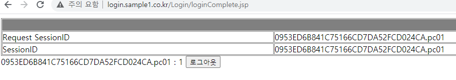<br>

해당톰캣서버를 중지시키고 웹브라우저에서 새로고침을 하고도 session이 유지가 되면 성공입니다.

```
# kill -9 15714(해당포트PID)
```
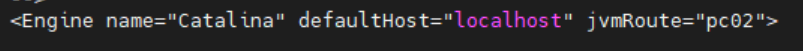<br><br>

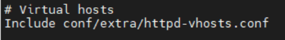<br>

