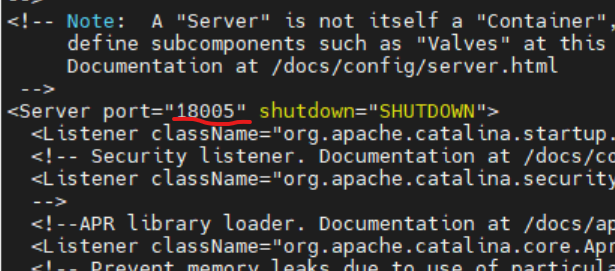
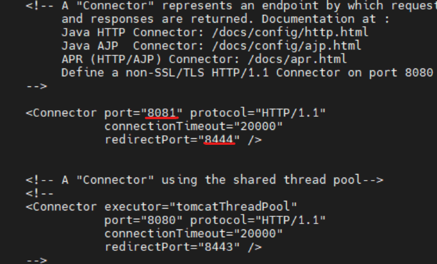
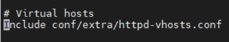
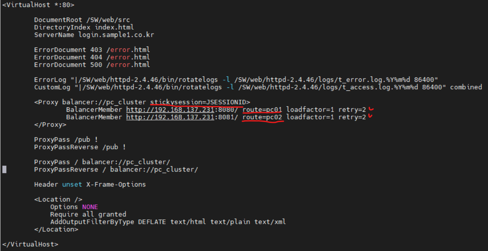
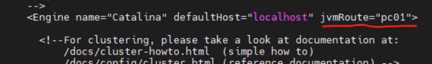
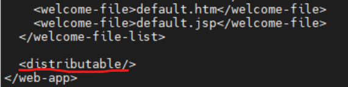

# linux(centos7) 환경에서 redis를 활용한 tomcat session Management

## 1. Redis 설치하기
redis를 활용한 tomcat session 관리를 위해서는 가장 먼저 Redis를 설치해야 합니다.<br>
[레디스 다운로드](https://redis.io/download) 페이지에서 아래와 같이 링크 주소 복사를 해줍니다.<br>

<br>

리눅스 터미널에서 다음과 같이 명령어를 입력해 다운로드 및 압축 해제를 합니다.
```
# wget (복사한 링크 주소)https://download.redis.io/releases/redis-6.2.3.tar.gz
# tar xf redis-6.2.3.tar.gz
```
<br>
그럼 다음과 같이 디렉토리가 생성이 됩니다.

<br>
생성된 디렉토리로 들어가서 make 파일을 실행해줍니다.
```
# cd redis-6.2.3
# make
```
에러 발생시 gcc를 설치하고 make 파일을 distclean 한 뒤에 다시 실행해줍니다.
```
# yum install gcc
# make distclean
# make
# make install PREFIX=/opt/redis
```

profile파일을 열어 다음과 같이 입력해 환경 변수 설정을 해줍니다.
```
# nano etc/profile
```
```
export REDIS_HOME=/opt/redis
export PATH=$PATH:$REDIS_HOME/bin
```

환경변수를 활성화 해줍니다.
```
# source /etc/profile
```

<br>
환경 변수 설정까지 끝났으면 install_server.sh를 실행시켜줍니다.
```
# cd redis홈디렉토리/utils
# ./install_server.sh
```
<br>
그럼 다음과 같은 문구가 나타납니다.
```
This systems seems to use systemd.
Please take a look at the provided example service unit files in this directory, and adapt and install them. Sorry!
```
<br>
install_server.sh를 열어서 다음과 같이 주석을 달아줍니다.

<br>
그리고 다시 install_server.sh 파일을 실행하면 다음과 같이 나타나게 되고, default로 할거면 ENTER키를, 아니라면 따로 설정을 해주면 됩니다.
```
# ./install_server.sh
```
```
Please select the redis port for this instance: [6379] 
```
redis server의 default포트. (ENTER)
```
Please select the redis config file name [/etc/redis/6379.conf]  
```
config 파일 경로 설정. (ENTER)
```
Please select the redis log file name [/var/log/redis_6379.log]  
```
로그 파일 경로 설정. (ENTER)
```
Please select the redis executable path []
```
redis-server 실행 경로 설정. 못찾을 시 다음과 같이 설정
```
Please select the redis executable path [] /opt/redis/bin/redis-server
```
설정이 끝나면 다음과 같이 나타나고 마지막 ENTER키를 누르게 되면 설치에 성공했다는 문구가 나타납니다.
<br>
<br>

redis 서버가 기동되고 있는지 확인합니다.
```
# systemctl status redis_6379
```
<br>

마지막으로 외부접속이 가능하도록 방화벽포트를 열어주고 설정 변경을 해줍니다.
먼저 방화벽 포트를 열어줍니다.
```
# firewall-cmd --permanent --add-port=6379/tcp
# firewall-cmd --reload
```

다음으로 /etc/redis/6379.conf 파일을 열어 127.0.0.1은 주석해주고 0.0.0.0으로 bind 해줍니다.
```
# nano /etc/redis/6379.conf
```
<br><br>


## 2. Redisson을 이용한 tomcat session 관리

2개 이상의 톰캣서버를 운영할 경우에 JndiRedissonFactory를 tomcat홈디렉토리/conf/server.xml의 GlobalNamingResources태그 부분에 추가합니다. (모든 톰캣서버에 적용)
```
# nano tomcat홈디렉토리/conf/server.xml
```
```
  <GlobalNamingResources>
    <Resource name="bean/redisson"
	      auth="Container"
              factory="org.redisson.JndiRedissonFactory"
              configPath="${catalina.base}/conf/redisson.yaml"
	      closeMethod="shutdown"/>
  </GlobalNamingResources>
```
configPath에서 설정해놓은 redisson.yaml 파일을 해당 경로에 만들어줍니다. address부분만 본인이 설정한 포트로 맞춰줍니다. (모든 톰캣서버에 적용)
```
# cd tomcat홈디렉토리/conf/redisson.yaml
```
```
singleServerConfig:
  idleConnectionTimeout: 10000
  connectTimeout: 10000
  timeout: 3000
  retryAttempts: 3
  retryInterval: 1500
  password: null
  subscriptionsPerConnection: 5
  clientName: null
  address: "redis://localhost:6379"
  subscriptionConnectionMinimumIdleSize: 1
  subscriptionConnectionPoolSize: 50
  connectionMinimumIdleSize: 24
  connectionPoolSize: 64
  database: 0
  dnsMonitoringInterval: 5000
threads: 16
nettyThreads: 32
codec: !<org.redisson.codec.MarshallingCodec> {}
transportMode: "NIO"
```

다음엔 JndiRedissonSessionManager를 tomcat홈디렉토리/conf/context.xml에 추가합니다. (모든 톰캣서버에 적용)
```
# nano tomcat홈디렉토리/conf/context.xml
```
```
    <ResourceLink name="bean/redisson"
                  global="bean/redisson"
		  type="org.redisson.api.RedissonClient" />

    <Manager className="org.redisson.tomcat.JndiRedissonSessionManager"
         readMode="REDIS"
         jndiName="bean/redisson" />
```

마지막으로 본인의 tomcat버전에 맞는 2개의 jar 파일을 tomcat홈디렉토리/lib에 넣어주면 됩니다.
```
redisson-all-3.15.5.jar

Tomcat 7.x - redisson-tomcat-7-3.15.5.jar

Tomcat 8.x - redisson-tomcat-8-3.15.5.jar

Tomcat 9.x - redisson-tomcat-9-3.15.5.jar

Tomcat 10.x - redisson-tomcat-10-3.15.5.jar
```

나머지 아파치 virtualhost설정 및 route설정은 이전 글을 참고바랍니다.<br>

모든 설정이 끝났으면 apache, redis서버와 두개의 tomcat서버를 기동시키고 확인합니다.
<br>

브라우저에서 session정보를 확인합니다.
<br>

해당톰캣서버를 중지시키고 웹브라우저에서 새로고침을 하고도 session이 유지가 되면 성공입니다.

```
# kill -9 15714(해당포트PID)
```
<br>
<br>


기존에 톰캣이 설치되어 있다면 톰캣 홈디렉토리를 복사해서 하나를 더 구성합니다.


server.xml파일에서 포트를 변경해줍니다.
```
# nano 복사한톰캣홈디렉토리/conf/server.xml
```




혹시 ajp도 쓰고 있다면 변경해줍니다.


<br>
catalina.sh파일에서 CATALINA 경로를 변경해줍니다. 해당위치에 아래 소스를 추가해줍니다.

```
# nano 복사한톰캣홈디렉토리/bin/catalina.sh
```
```
export CATALINA_HOME=복사한톰캣홈디렉토리
export TOMCAT_HOME=복사한톰캣홈디렉토리
export CATALINA_BASE=복사한톰캣홈디렉토리
CATALINA_PID=복사한톰캣홈디렉토리/bin/tomcat.pid
```


<br>

## 2. session clustering 설정
일단, 기존 톰캣에 war파일 배포한 것과 마찬가지로 복사한 톰캣에도 같은 위치에 war파일을 배포해줍니다.<br>
그리고 아파치 httpd.cof파일에서 httpd-vhosts.conf파일에 대한 주석을 제거합니다.
```
# nano 아파치홈디렉토리/conf/httpd.conf
```

<br>

아파치 httpd-vhosts.conf파일에서 로드밸런싱 설정을 해줍니다. Proxy balancer에 stickysession으로 JSESSIONID 설정해주고, BalancerMember로 톰캣서버2개를 설정해주는데 고정세션값 route를 서로 다른 이름으로 설정합니다. 
```
# nano 아파치홈디렉토리/conf/extra/httpd-vhosts.conf
```

<br>

아파치 설정이 끝났으면 톰캣의 server.xml파일cluster 설정을 해줍니다. (톰캣서버 둘다 적용)
```
# nano 톰캣홈디렉토리/conf/server.xml
```
Cluster 부분의 주석을 풀고 아래 소스를 추가해줍니다.<br>
여기서 Membershipe 절에 address=228.0.0.4", port=45564" 두요소는 클러스터멤버쉽을 구성합니다.(동일 클러스터는 동일 address,port를 가져야함)<br>
동일 서버에 여러개의 톰캣을 설치하여 클러스터멤버쉽을 구성할경우 Receiver 절의 port 변경해줍니다.(톰캣2는 4001)
```
  <Cluster className="org.apache.catalina.ha.tcp.SimpleTcpCluster"
              channelSendOptions="8">

       <Manager className="org.apache.catalina.ha.session.DeltaManager"
                     expireSessionsOnShutdown="false" notifyListenersOnReplication="true"/>

       <Channel className="org.apache.catalina.tribes.group.GroupChannel">

          <Membership className="org.apache.catalina.tribes.membership.McastService"
                             address="228.0.0.4"
                             port="45564"
                             frequency="500"
                             dropTime="3000"/>

          <Receiver className="org.apache.catalina.tribes.transport.nio.NioReceiver"
                        address="auto"
                        port="4000"
                        autoBind="100"
                        selectorTimeout="5000"
                        maxThreads="6"/>

          <Sender className="org.apache.catalina.tribes.transport.ReplicationTransmitter">

              <Transport className="org.apache.catalina.tribes.transport.nio.PooledParallelSender"/>
          </Sender>		  
          <Interceptor className="org.apache.catalina.tribes.group.interceptors.TcpFailureDetector"/>

          <Interceptor className="org.apache.catalina.tribes.group.interceptors.MessageDispatchInterceptor"/>                  
        </Channel>

        <Valve className="org.apache.catalina.ha.tcp.ReplicationValve" filter=""/>
        <Valve className="org.apache.catalina.ha.session.JvmRouteBinderValve"/>
        <Deployer className="org.apache.catalina.ha.deploy.FarmWarDeployer"
                       tempDir="/tmp/war-temp/"
                       deployDir="/tmp/war-deploy/"
                       watchDir="/tmp/war-listen/"
                       watchEnabled="false"/>
         <ClusterListener className="org.apache.catalina.ha.session.ClusterSessionListener"/>
 </Cluster>
```
그리고 apache 로드밸런싱 설정시 해줬던 route명을 Engine의 jvmRoute명으로 설정합니다.(톰캣서버 둘다 적용)

<br>

다음엔 세션을 공유하고자 하는 웹어플리케이션의 web.xml에 다음 소스를 추가해줍니다. (톰캣서버 둘다 적용)
```
<distributable/>
```

<br>

마지막으로 멀티캐스트와 Receiver포트 방화벽을 오픈해주면 됩니다.
```
firewall-cmd --permanent --zone=public --add-port=45564/tcp
firewall-cmd --permanent --zone=public --add-port=45564/udp
firewall-cmd --permanent --zone=public --add-port=4000/tcp
firewall-cmd --permanent --zone=public --add-port=4001/tcp
firewall-cmd --reload
```
<br>
clustering 설정이 끝났으면 테스트를 해봅니다.<br>
로그인 했을 때 세션값을 가지고 오고 톰캣서버 하나를 죽였을때도 같은 세션값이 유지되는지 확인해 볼 수 있습니다.<br>
아파치와 톰캣1,2 서버를 기동시킵니다.<br>
```
# 아파치홈디렉토리/bin/apache start
# 톰캣1홈디렉토리/bin/startup.sh
# 톰캣2홈디렉토리/bin/startup.sh
``` 
아파치 80포트와 클러스터멤버쉽의 Receiver포트인 4000포트와 4001포트가 올라와 있는 지 확인합니다.<br>

<br>

아파치에서 설정한 도메인으로 접속해봅니다.

<br>

로그인 했을때, 세션값을 가져옵니다.

<br>

세션값 끝에 jvmRoute명이 pc02이므로 톰캣2서버를 다운시킵니다.
```
# 톰캣2홈디렉토리/bin/shutdown.sh
```
<br>
이제 새로고침을 해보면 로그아웃되지 않고 jvmRoute명이 pc1이 되고 같은 세션값이 유지되면 성공입니다.


