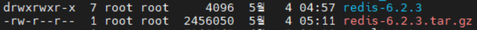
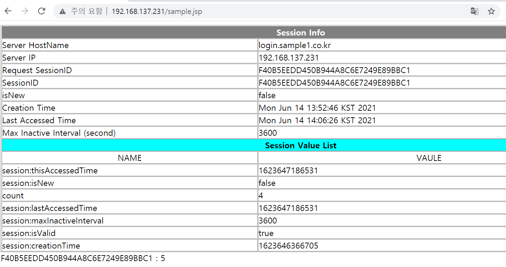

# linux(centos7) 환경에서 redis cluster 생성 및 session clustering

## 1. redis 서버 설치
redis cluster를 구성하기 위해서는 먼저 redis를 설치해야 합니다.<br>
[레디스 다운로드](https://redis.io/download) 페이지에서 아래와 같이 링크 주소 복사를 해줍니다.<br>

<br>

리눅스 터미널에서 다음과 같이 명령어를 입력해 다운로드 및 압축 해제를 합니다.
```
# wget (복사한 링크 주소)https://download.redis.io/releases/redis-6.2.3.tar.gz
# tar xf redis-6.2.3.tar.gz
```
<br>
그럼 다음과 같이 디렉토리가 생성이 됩니다.

<br>
생성된 디렉토리로 들어가서 make 파일을 실행해줍니다.
```
# cd redis-6.2.3
# make
```
에러 발생시 gcc를 설치하고 make 파일을 distclean 한 뒤에 다시 실행해줍니다.
```
# yum install gcc
# make distclean
# make
# make install PREFIX=/opt/redis
```

profile파일을 열어 다음과 같이 입력해 환경 변수 설정을 해줍니다.
```
# nano etc/profile
```
```
export REDIS_HOME=/opt/redis
export PATH=$PATH:$REDIS_HOME/bin
```

환경변수를 활성화 해줍니다.
```
# source /etc/profile
```

<br>
환경 변수 설정까지 끝났으면 포트번호, config파일, 로그파일, 실행파일경로 설정을 위해 install_server.sh 스크립트 파일을 실행시켜줍니다.
```
# cd redis홈디렉토리/utils
# ./install_server.sh
```
<br>
만약 다음과 같은 문구가 나타난다면 (systemd로 실행하게 되면 다음문구가 나오게 설정되어 있어서 주석처리 해주면 됩니다.)
```
This systems seems to use systemd.
Please take a look at the provided example service unit files in this directory, and adapt and install them. Sorry!
```
<br>
install_server.sh를 열어서 다음과 같이 주석을 달아줍니다.

<br>
그리고 다시 install_server.sh 파일을 실행하면 아래와 같이 나타나게 되고, default로 할거면 ENTER키를, 아니라면 따로 설정을 해주면 됩니다.
```
# ./install_server.sh
```
```
Please select the redis port for this instance: [6379] 
```
redis server의 default포트. (ENTER)
```
Please select the redis config file name [/etc/redis/6379.conf]  
```
config 파일 경로 설정. (ENTER)
```
Please select the redis log file name [/var/log/redis_6379.log]  
```
로그 파일 경로 설정. (ENTER)
```
Please select the data directory for this instance [/var/lib/redis/6379]
```
데이터 디렉토리 생성. (ENTER)
```
Please select the redis executable path []
```
redis-server 실행 경로 설정. 못찾을 시 다음과 같이 설정
```
Please select the redis executable path [] /opt/redis/bin/redis-server
```
설정이 끝나면 다음과 같이 나타나고 마지막 ENTER키를 누르게 되면 설치에 성공했다는 문구가 나타납니다.
<br><br>

<br>

redis 서버가 기동되고 있는지 확인합니다.
```
# systemctl status redis_6379
```
<br><br>

## 2. redis cluster 구성
redis cluster를 구성하기 전 redis cluster에 대해 몇가지만 알아보자면<br>

cluster는 v3.0부터 가능하며 1000 개의 node까지 확장 가능합니다.<br>
cluster는 16383개의 slot으로 구성되며 각 node가 이 slot을 나누어 가지게 됩니다.<br>
cluster 구성시 최초 3개의 node가 필요며, ndoe 추가시에 cluster의 중지가 필요 없습니다. <br>
그리고 기본 port 외에 + 10000 포트를 이용해 cluster를 구성합니다. 10000번대 포트는 cluster bus로 사용되는데 장애감지, 구성 업데이트, failover 승인 등에 사용됩니다. <br>
반드시 두개의 포트의 통신은 보장해줘야 합니다.<br><br>

cluster에 대해 간략히 알아보았다면 이제 실제로 구성해봅니다.<br>

master node 3개 replica node 3개 총 6개의 node를 위에서 최초 설치 시 만든 것과 같이 redis홈디렉토리/utils/install_server.sh를 실행 시켜 만들어줍니다. <br>

(저는 포트번호를 기존에 설치한6379를 포함해 차례대로 6379 ~ 6879로 설정)<br>

6개를 다 만들었으면 설치 시 설정한 conf파일 위치로 가서 설정 변경을 해줍니다.

```
# cd /etc/redis/포트번호.conf
# nano 포트번호.conf
```
<br>
외부와의 통신을 위해 0.0.0.0으로 변경합니다.<br>
<br>

주석이 풀려 있는지 포트번호가 맞는지 확인합니다.<br>
<br><br>
<br><br>
<br><br>
<br>

cluster 설정 부분의 주석을 풀어주고 해당 포트번호에 맞게 바꿔줍니다.<br>
<br><br>
<br><br>
<br><br>
<br>

설정 변경이 끝났으면 redis-server를 통해 node를 실행시켜 줍니다.

```
# cd /opt/redis/bin
# ./redis-server /etc/redis/포트번호.conf (6개 모두 다)
```

redis server 포트와 cluster bus 포트가 모두 올라왔는지 확인해봅니다.

```
# netstat -nltp
```
10000번대 포트까지 올라와 있는지 확인합니다.
<br>

node를 실행시켰으면 이제 node를 cluster로 묶어줍니다. 
```
# redis-cli --cluster create 127.0.0.1:6379 127.0.0.1:6479 127.0.0.1:6579 127.0.0.1:6679 127.0.0.1:6779 127.0.0.1:6879 --cluster-replicas1
```
(cluster에 구성되는 node의 ip가 같다면 위와 같이 명령어를 입력했을때 순서대로 3개씩 master와 replica가 정해집니다. )<br>
위 명령어를 실행하면 다음과 같이 나타나는데 yes를 입력합니다.
<br>
yes를 입력하면 다음과 같이 나타나고 구성이 완료됩니다.
<br>

참고사항으로<br>
master node 추가 시에는 다음과 같이 명령어를 입력해줍니다.
```
# redis-cli --cluster add-node 아이피:포트
```
replica node 추가 시에는 다음과 같이 명령어를 입력합니다.
```
# redis-cli --cluster add-node 아이피:포트(추가할 replica) 아이피:포트(추가될 master) --cluster-slave
```
cluster 리셋은 다음 명령어를 입력합니다.
```
# redis-cli --cluster call 아이피:포트 flushall
# redis-cli --cluster call 아아피:포트 cluster reset
``` 

제대로 구성이 되었는지 확인해봅니다.<br>
```
# redis-cli -c -p 포트번호
# cluster nodes
```
위 명령어를 입력하면 다음과 같이 node 정보들을 확인할 수 있습니다.<br>

<br><br>

## 3. session clustering 확인
redis cluster 구성까지 했다면 간단한 어플리케이션을 통해 master server가 다운됐을 때도 서비스가 죽지 않고 session이 유지가 되는지 확인해 봅니다.<br>

먼저, 다음과 같은 session 정보를 받아오는 sample.jsp파일을 tomcat의 ROOT디렉토리에 넣어줍니다. 
```
<%@ page language="java" contentType="text/html; charset=UTF-8" pageEncoding="UTF-8"%>
<%@ page import="java.text.*"%>
<%@ page import="java.util.*"%>
<%
        String RsessionId = request.getRequestedSessionId();
        String sessionId = session.getId();
        boolean isNew = session.isNew();
        long creationTime = session.getCreationTime();
        long lastAccessedTime = session.getLastAccessedTime();
        int maxInactiveInterval = session.getMaxInactiveInterval();
        Enumeration e = session.getAttributeNames();
%>
<html>
<head>
<meta http-equiv="Content-Type" content="text/html; charset=EUC-KR">
<title>Session Test</title>
</head>
<body>
<table border=1 bordercolor="gray" cellspacing=1 cellpadding=0
        width="100%">
        <tr bgcolor="gray">
                <td colspan=2 align="center"><font color="white"><b>Session
                Info</b></font></td>
        </tr>
        <tr>
                <td>Server HostName</td>
                <td><%=java.net.InetAddress.getLocalHost().getHostName()%></td>
        </tr>
        <tr>
                <td>Server IP</td>
                <td><%=java.net.InetAddress.getLocalHost()
                                                                        .getHostAddress()%></td>
        </tr>
        <tr>
                <td>Request SessionID</td>
                <td><%=RsessionId%></td>
        </tr>
        <tr>
                <td>SessionID</td>
                <td><%=sessionId%></td>
        </tr>
        <tr>
                <td>isNew</td>
                <td><%=isNew%></td>
        </tr>
        <tr>
                <td>Creation Time</td>
                <td><%=new Date(creationTime)%></td>
        </tr>
        <tr>
                <td>Last Accessed Time</td>
                <td><%=new Date(lastAccessedTime)%></td>
        </tr>
        <tr>
                <td>Max Inactive Interval (second)</td>
                <td><%=maxInactiveInterval%></td>
        </tr>
     <tr bgcolor="cyan">
                <td colspan=2 align="center"><b>Session Value List</b></td>
        </tr>
        <tr>
                <td align="center">NAME</td>
                <td align="center">VAULE</td>
        </tr>
        <%
                String name = null;
                while (e.hasMoreElements()) {
                        name = (String) e.nextElement();
        %>
        <tr>
                <td align="left"><%=name%></td>
                <td align="left"><%=session.getAttribute(name)%></td>
        </tr>
        <%
                }
        %>
</table>
        <%
                int count = 0;
                if(session.getAttribute("count") != null)
                        count = (Integer) session.getAttribute("count");
                count += 1;
                session.setAttribute("count", count);
                out.println(session.getId() + "     :     " + count);
        %>
</body>
</html>
```
<br>
다음은 아파치홈디렉토리/conf/httpd.conf 파일에서 다음을 주석제거 시킵니다.

```
# nano 아파치홈디렉토리/conf/httpd.conf
```

<br>

그리고 아파치홈디렉토리/conf/extra/httpd-vhost.conf 파일을 아파치와 톰캣연동을 위해 다음을 입력합니다.
```
<VirtualHost *:80>

        DocumentRoot /SW/web/src
        DirectoryIndex index.html

        ErrorDocument 403 /error.html
        ErrorDocument 404 /error.html
        ErrorDocument 500 /error.html

        ErrorLog "|/SW/web/httpd-2.4.46/bin/rotatelogs -l /SW/web/httpd-2.4.46/logs/t_error.log.%Y%m%d 86400"
        CustomLog "|/SW/web/httpd-2.4.46/bin/rotatelogs -l /SW/web/httpd-2.4.46/logs/t_access.log.%Y%m%d 86400" co$

        <Proxy balancer://pc_cluster stickysession=JSESSIONID>
                BalancerMember http://192.168.137.231:8080/ loadfactor=1 retry=2
        </Proxy>

        ProxyPass /pub !
        ProxyPassReverse /pub !

        ProxyPass / balancer://pc_cluster/
        ProxyPassReverse / balancer://pc_cluster/

        Header unset X-Frame-Options

        <Location />
            Options NONE
            Require all granted
            AddOutputFilterByType DEFLATE text/html text/plain text/xml
        </Location>

</VirtualHost>

```

아파치 설정이 끝났으면 톰캣 설정을 해줍니다.<br>
먼저, 톰캣홈디렉토리/conf/context.xml파일에 다음을 입력해줍니다.
```
# nano 톰캣홈디렉토리/conf/context.xml
```
```
    <ResourceLink name="bean/redisson"
                  global="bean/redisson"
                  type="org.redisson.api.RedissonClient" />

    <Manager className="org.redisson.tomcat.JndiRedissonSessionManager"
         readMode="REDIS"
         jndiName="bean/redisson" />

```

다음엔 server.xml파일에 다음을 입력해줍니다.
```
# nano 톰캣홈디렉토리/conf/server.xml
```
```
  <GlobalNamingResources>
    <Resource name="bean/redisson"
              auth="Container"
              factory="org.redisson.JndiRedissonFactory"
              configPath="${catalina.base}/conf/redisson_clu.yaml"
              closeMethod="shutdown"/>
  </GlobalNamingResources>

```

위에서 설정한 configPath 경로에 redisson_clu.yaml파일을 만들어 넣어줍니다.
```
# nano 톰캣홈디렉토리/conf/redisson_clu.yaml
```
```
clusterServersConfig:
  idleConnectionTimeout: 10000
  connectTimeout: 10000
  timeout: 3000
  retryAttempts: 3
  retryInterval: 1500
  failedSlaveReconnectionInterval: 3000
  failedSlaveCheckInterval: 60000
  password: null
  subscriptionsPerConnection: 5
  clientName: null
  loadBalancer: !<org.redisson.connection.balancer.RoundRobinLoadBalancer> {}
  subscriptionConnectionMinimumIdleSize: 1
  subscriptionConnectionPoolSize: 50
  slaveConnectionMinimumIdleSize: 24
  slaveConnectionPoolSize: 64
  masterConnectionMinimumIdleSize: 24
  masterConnectionPoolSize: 64
  readMode: "SLAVE"
  subscriptionMode: "SLAVE"
  nodeAddresses:(마스터 서버 3개 입력)
  - "redis://127.0.0.1:6397"
  - "redis://127.0.0.1:6479"
  - "redis://127.0.0.1:6579"
  scanInterval: 1000
  pingConnectionInterval: 30000
  keepAlive: false
  tcpNoDelay: false
threads: 16
nettyThreads: 32
codec: !<org.redisson.codec.MarshallingCodec> {}
transportMode: "NIO"
```

모든 설정이 끝났으면 아파치 서버와 톰캣서버 모두 기동시켜 줍니다.
```
# 아파치홈디렉토리/bin/apache start
# 톰캣홈디렉토리/bin/startup.sh
```

이제 웹브라우저에서 본인아이피:80/sample.jsp를 입력하고 접속해봅니다.<br>

<br>

다음 master서버를 죽이고 웹브라우저를 새로고침해도 서비스가 유지되고 있으면 성공입니다.

<br>


