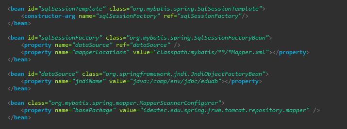

# 스프링 프레임워크

## 스프링 프레임워크에서 JNDI를 이용해 Mybatis, MySQL 연동

1. JNDI란?  
   JNDI(Java Naming and Directory Interface)의 약자로 네이밍과 디렉토리 기능을 제공하는 API으로 데이터베이스의 DB Pool을 미리 네이밍 시켜주는 방법이다.   

2. JNDI 사용의 장점  

   1. WAS에 여러 웹 애플리케이션을 올려 사용하기 때문에 WAS에서 한 번만 설정하는 것이 자원낭비를 줄일 수 있다. 
   2. 장애 발생시 다른 서버가 대신 일을 처리할 수 있다. 
   3. 데이터베이스에 접속하기 위한 정보들을 WAS에서 관리하기 때문에 애플리케이션에서 데이터베이스 관련 정보를 분리할 수 있다.   

3. 구현   
   

   위와 같이 데이터베이스 연결을 위한 JDBC, MySQL연동을 위한 MySQL 커넥터와 Mybatis 연동을 위한 Mybatis, mybatis-spring 의존성을 추가해줍니다.  

   

   그 후 Tomcat의 context.xml에 DB 연동을 위한 관련 정보들을 설정해줍니다.  

   

   그 후 spring의 root-context.xml 파일에서 위와 같이 설정해줍니다.  

   1. Jndi를 사용하기 떄문에 JndiObjectFactoryBean이라는 클래스를 사용해 dataSource를 만들어 줍니다. 이때 jndiName이라는 프로퍼티 name의 값으로 "java:/comp/env/jdbc/ + context.xml에서 설정한 jndiName값" 형식으로 넣어줍니다.  
      jndiName앞에 java:/comp/env/jdbc/를 붙임으로서 WAS에서 설정한 dataSource설정을 가져올 수 있습니다.  

   2. 생성한 dataSource bean을 가지고 sqlSessionFactory 객체를 만들어 줍니다.  이 때 mapperLocations 프로퍼티를 추가해주므로 읽어올 mapper파일의 위치를 지정해줍니다.  

     

   현재 작성자의 mapper파일의 위치는 위와 같기에 그에 맞게 설정했습니다. mapperLocation 값은 개인의 필요에 맞게 위치를 수정하면 됩니다.  

   3. MapperScannerConfigurer 빈을 만들어서 mapper 인터페이스를 스캔할 베이스 패키지를 설정해 줍니다.  

     

   mapperLocation과 마찬가지로 개인의 필요에 맞게 입력하시면 됩니다.   
    

---

# 스프링 부트

## 스프링 부트에서 Mybatis, MySql 연동

1. 구현   
     

   jdbc연동을 위한 jdbc starter(spring-boot-starter-tomcat), mybatis framework, mySql 커넥터 의존성을 추가해줍니다.  

     

   application.properties, 혹은 application.yml 에서 위와 같이 데이터베이서 연동을 위한 정보들을 설정해 줍니다.  

     

   그 후 SpringBootApplication에서 다음과 같이 설정해줍니다. new PathMatchingResourcePatternResolver().getResources() 에 mapper파일의 위치를 지정해주면 됩니다.   

---

#### 참고자료

&nbsp; - https://go-coding.tistory.com/76  
&nbsp; - https://epthffh.tistory.com/entry/Spring%EC%97%90%EC%84%9C-JNDI%EC%84%A4%EC%A0%95hikaricp  
&nbsp; - https://zzangprogrammer.tistory.com/211  
&nbsp; - https://www.holaxprogramming.com/2015/10/16/spring-boot-with-jdbc/  
&nbsp; - https://velog.io/@ghd64845/Spring-boot-MyBatis%EB%A5%BC-%EC%9D%B4%EC%9A%A9%ED%95%98%EC%97%AC-MySQL-%EC%97%B0%EB%8F%99%ED%95%98%EA%B8%B0  
