# 스프링 프레임워크

## 스프링 프레임워크에서 Logback 설정

1. **Logback이란?** <br>
   Slf4j의 구현체로서 log4j와 비교해 10배나 나은 성능의 로깅을 제공합니다. <br><br>

2. **Logback의 장점** <br>

   1. **성능** : log4j 아키텍쳐 기반으로 만들었기 때문에, log4j와 비교해 10배나 빠른 성능과 낮은 메모리 점유를 자랑합니다. <br>
   2. **안정성** : 다년간의 기간동안 테스팅을 진행해 왔기 때문에 높은 안정성을 제공합니다<br>
   3. **Slf4j 구현체** : Logback-classic 컴포넌트의 logger 클래스에서 Slf4j API를 사용하고 있기 때문에 logback-classic을 구현체로 slf4j logger를 사용했을 때 오버해드가 없습니다. <br>
   4. **문서화** : 상세하면서도 꾸준히 관리되는 문서를 제공합니다. <br>
   5. **XML, Groovy로 설정** : 전통적인 XML syntax 뿐만 아니라 Groovy syntax로도 설정할 수 있습니다. <br>
   6. **설정파일 자동 새로고침** : 설정파일에 수정 사항이 있을 경우 자동으로 감지해 반영합니다. 100개의 쓰레드가 초당 백만건의 invocation을 발생시켜도 부하가 없을 정도로 안정적이고 빠른 성능을 제공합니다<br><br>

   그 외에도 필터 등 다양한 장점들을 제공합니다. <br><br>

3. **구현** <br><br>
   

   먼저 위와 같이 기존에 사용하던 commons-logging을 제외시켜줍니다. <br>

   

   그 후 위와 같이 logback 사용을 위한 dependcy들을 추가해 줍니다.<br>

   
   

   그 후 classpath 하위로 logback.xml 파일을 위와 같이 생성하면 됩니다. <br>

   ```
      #스프링이 logback 파일을 찾는 기준

      1. logback.groovy
      2. logback-test.xml
      3. logback.xml

      위의 순서대로 우선순위를 가집니다.
      그렇기 때문에 여러 설정파일이 존재할 경우 우선순위가 높은 설정이 적용됩니다.
   ```

   

   logback이 적용된 모습 <br><br>

   ***

   ### jcl-over-slf4j?

   스프링에서는 기본적으로 JCL(Jakarta Commonc Logging)을 사용합니다. JCL의 경우 인터페이스로서 log4j같은 JCL 구현체가 있어야 동작합니다. <br>

   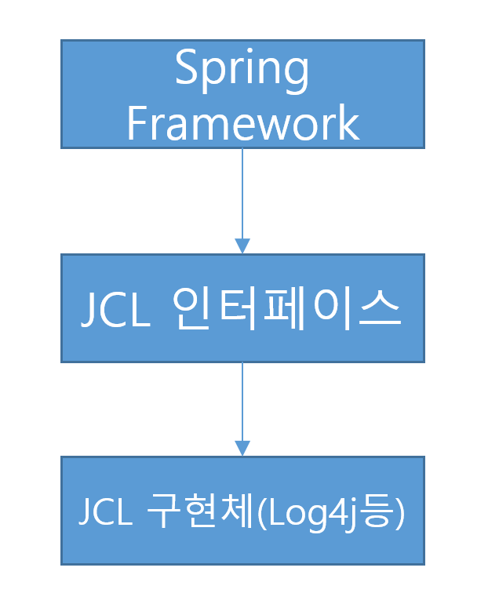

   여기서 문제는 logback은 JCL이 아닌 slf4j의 구현체이기 때문에 설정을 할 수 없는 문제가 발생합니다 <br>
   jcl-over-slf4j는 JCL과 slf4j를 연결하는 중간다리(브릿지) 역할을 지원합니다. <br>

   

   위와 같은 그림이 됩니다. <br><br>

---

# 스프링 부트

## 스프링 부트에서 Logback 설정

1. **구현** <br><br>

   스프링 부트에서는 logback이 디폴트 log이기 때문에 따로 dependency를 추가하지 않아도 된다(spring-boot-starter-web에 포함). <br>

   
   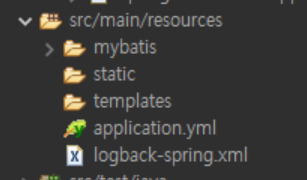

   스프링 프레임워크와 마찬가지로 resource밑에 설정파일을 생성한 후 설정해주면 됩니다.<br>
   여기서 주목할 점은 파일 이름이 logback.xml이 아닌 logback-spring.xml 인데 <br>스프링 부트에서 기본적으로 사용하는 log이기 때문에 먼저 logback.xml 로 로그백 관련 설정을 하기 때문입니다. <br>

   

   logback이 적용된 모습 <br>

---

# 추가

## 스프링에서 logback.xml 파일 경로 바꾸기

위에서 실수한 부분이 있어서 수정합니다. <br>
먼저번에 logback.xml 파일의 위치를 classpath 밑의 logback파일 밑으로 설정했는데 <br>
이러한 경우 설정한 형식이 아닌 default 형식으로 출력하는 것 같습니다. <br>

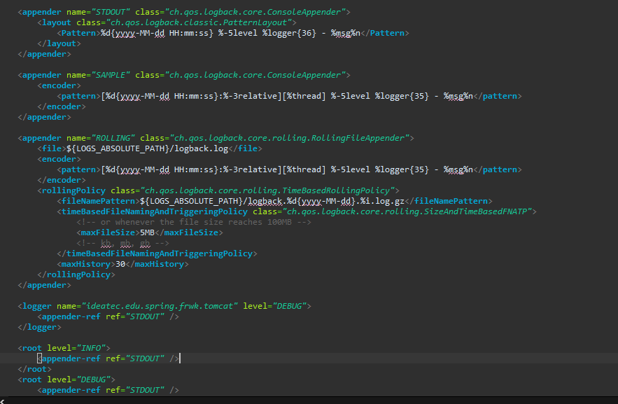

예시로 파일에서는 위와 같이 설정했지만

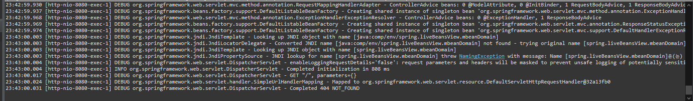

실제로는 위와 같이 설정한 형식 ( [%d{yyyy-MM-dd HH:mm:ss}:%-3relative][%thread] %-5level %logger{35} - %msg%n ) 이 아닌 <br>
다른 형태로 출력되는 것을 확인할 수 있습니다. <br><br>

이를 해결하기 위해서는 **logback.configuration**이름의 시스템 변수로 경로를 지정해줘야 합니다. <br>

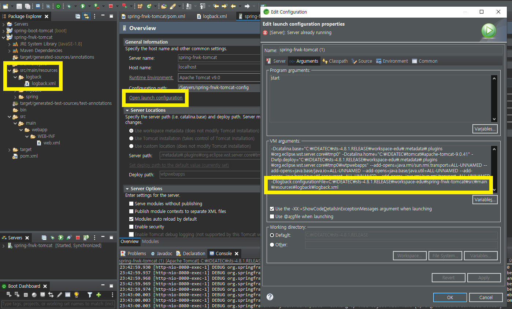

위와 같이 JVM 설정에 들어가서 설정 파일의 경로를 지정해줍니다. <br>

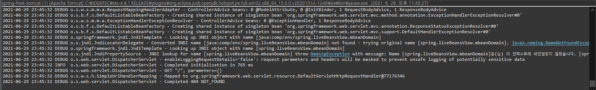

JVM 설정 후 위와 같이 잘 작동 되는걸 확인할 수 있습니다. <br><br>

## 부트에서 logback-spring.xml 파일 경로 바꾸기

스프링 부트에서는 더 간단하게 경로를 지정할 수 있습니다. <br>

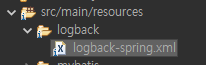

일단 위와 같이 loback-spring.xml파일을 logback 파일 밑으로 옮겼습니다. <br>

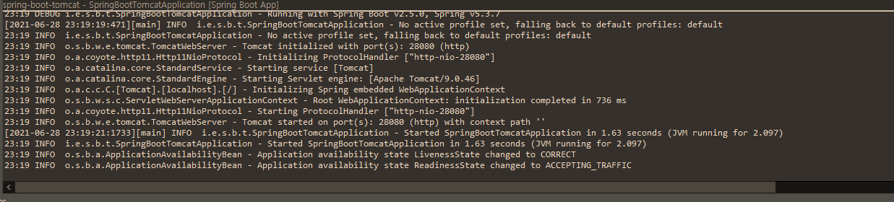

그러자 위와 같던 로그 형식이 <br>

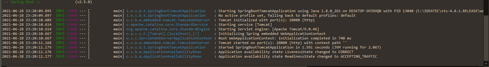

위와 같이 기본 형태로 변경 된것을 확인할 수 있습니다. <br>

해결을 위해서는 application.yml 혹은 application.properties 파일에서 다음과 같이 설정 파일 경로를 지정해주면 됩니다.

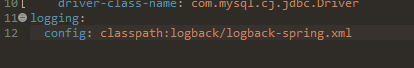
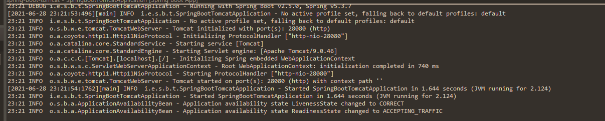

설정 후 재시작하면 다시 원래의 설정 형태로 돌아온 것을 확인할 수 있습니다. <br><br>

---

#### 참고자료

&nbsp; - https://beyondj2ee.wordpress.com/2012/11/09/logback-%EC%82%AC%EC%9A%A9%ED%95%B4%EC%95%BC-%ED%95%98%EB%8A%94-%EC%9D%B4%EC%9C%A0-reasons-to-prefer-logback-over-log4j/ <br>
&nbsp; - http://logback.qos.ch/reasonsToSwitch.html <br>
&nbsp; - https://romeoh.tistory.com/entry/Spring-Boot-Logback-%EC%84%A4%EC%A0%95%ED%95%98%EA%B8%B0 <br>
&nbsp; - https://dololak.tistory.com/635 <br>
&nbsp; - https://jeong-pro.tistory.com/154 <br>
&nbsp; - https://ckddn9496.tistory.com/78 <br>
