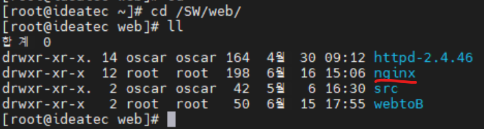

# linux(centos7) 환경에서 nginx설치 및 tomcat 연동

## 1. nginx란?

트래픽이 많은 웹사이트의 확장성을 위해 설계한 비동기 이벤트 기반 구조의 웹서버 소프트웨어로 더 적은 자원으로 더 빠르게 서비스 가능하다. 이 프로그램은 가벼움과 높은 성능을 목표로 만들어 졌으며, Apache의 C10K problem(하나의 웹서버에 10000개의 클라이언트의 접속을 동시에 다룰 수 있는 기술적인 문제)을 해결하기 위해 만든 Event-driven 구조의 HTTP, Reverser Proxy, IMAP/POP Proxy Server를 제공하는 오픈소스 서버 프로그램이다. 
<br>

### nginx특징

1.비동기 Event-Driven 기반 구조 (여러개의 커넥션을 다 Event Handler를 통해 비동기 방식으로 처리해 먼저 처리되는 것부터 로직이 진행되게끔 함)
<br>
2.다수의 연결을 효과적으로 처리 가능
<br>
3.대부분의 코어 모듈이 Apache보다 적은 리소스로 더 빠르게 동작 가능
<br>
4.더 작은 스레드로 클라이언트의 요청들을 처리 가능
<br><br>

## 2. nginx 설치(수동)

nginx 설치를 위해 미리 설치해야 하는 패키지들이 있다.<br>
ssl은 브라우저와 서버간 통신을 암호화하는 것을 말하는데 openssl은 ssl을 오픈소스로 라이브러리화 한 것을 말한다.<br>
pcre는 pearl5에서 사용하는 정규표현식 라이브러리이다.<br>
zlib는 데이터 압축 라이브러리다.<br>
gcc는 프로그래밍언어 컴파일하는 컴파일러이다.
```
# yum install openssl
# yum install pcre
# yum install zlib
# yum install gcc
# yum install gcc-c++
```
다 설치가 완료 되었으면 이제 nginx를 설치한다.<br>
[nginx 다운로드](https://nginx.org/en/download.html) 페이지에서 최신 버전을 우클릭해 링크복사를 해준다.
<br>

<br>
복사한 주소링크를 wget 명령어로 다운받아주고 압축을 풀어준다.

```
# wget http://nginx.org/download/nginx-1.21.0.tar.gz
# tar -xvf nginx-1.21.0.tar.gz
```

configure 설정과 함께 컴파일 설치를 진행한다.
```
# cd  nginx-1.21.0
# ./configure --prefix=/SW/web/nginx(nginx 설치할 경로)
# make
# make install
```

설치가 완료 되었으면 설정한 디렉토리가 만들어졌는지 확인한다. 
<br>

<br>

nginx 실행을 한다.
```
# cd nginx홈디렉토리/sbin/
# ./nginx (중지하는 명령어는 ./nginx -s stop)
```
정상적으로 작동이 되는지 확인한다.
```
# ps -ef | grep nginx
```


<br>

여기서 주의할 점은 nginx서버 기본포트가 80포트이기 때문에 겹치는 포트가 있다면 nginx.conf파일을 열어서 포트번호를 변경한다.

```
# nano nginx홈디렉토리/conf/nginx.conf
```


마지막으로 웹브라우저에서 확인을 해봅니다.
<br>
웹브라우저에서 본인아이피:81(설정한 포트번호)로 접속하면 아래와 같이 나타나면 성공.
<br>

<br><br>

## 3. tomcat 연동

tomcat 연동은 아주 쉽다. 하나만 변경해주면 된다. <br>
nginx.conf 파일에서 location 부분만 다음과 같이 변경해주면 된다.<br>


<br>

톰캣서버와 nginx서버 둘 다 기동되어 있는지 확인하고 웹브라우저에서 확인을 한다.<br>
본인아이피:81(nginx설정포트)로 접속했을 때, 톰캣 홈 페이지가 나오면 성공.


