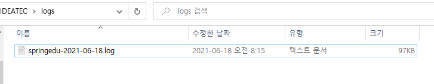

# Spring Log Back 

> ### pom.xml

	<properties>
	    <logback-version>1.1.2</logback-version>
	    <slf4j-version>1.7.7</slf4j-version>
	</properties>
	
	<dependency>
		<groupId>ch.qos.logback</groupId>
		<artifactId>logback-classic</artifactId>
		<version>${logback-version}</version>
	</dependency>
	
	<dependency>
		<groupId>org.slf4j</groupId>
		<artifactId>jcl-over-slf4j</artifactId>
		<version>${slf4j-version}</version>
		<scope>runtime</scope>
	</dependency>


> ### logback.xml

	<?xml version="1.0" encoding="UTF-8"?>
	<configuration scan="true" scanPeriod="30 seconds">
	    <appender name="ROLLING" class="ch.qos.logback.core.rolling.RollingFileAppender">
	    <rollingPolicy class="ch.qos.logback.core.rolling.TimeBasedRollingPolicy">
	        <!-- rollover daily -->
	        <fileNamePattern>C:\IDEATEC\logs\springedu-%d{yyyy-MM-dd}.log</fileNamePattern>
	        <timeBasedFileNamingAndTriggeringPolicy class="ch.qos.logback.core.rolling.SizeAndTimeBasedFNATP">
	            <maxFileSize>1024MB</maxFileSize>
	        </timeBasedFileNamingAndTriggeringPolicy>
	    </rollingPolicy>
	    <encoder>
	        <pattern>%d{HH:mm:ss.SSS} %-5level %logger{36} - %msg%n</pattern>
	    </encoder>
	    </appender>
	    <appender name="STDOUT" class="ch.qos.logback.core.ConsoleAppender">
	        <layout class="ch.qos.logback.classic.PatternLayout">
	            <Pattern>%d{HH:mm:ss.SSS} [%-5level] - %msg%n</Pattern>
	        </layout>
	    </appender>
	
	    <!-- Loggers -->
	
	    <!-- 로그 레벨 상세: trace > debug > info > warn > error -->
	    <logger name="org.apache.catalina" level="INFO">
	    </logger>
	
	    <logger name="org.apache.commons" level="INFO">
	    </logger>
	
	    <logger name="org.springframework" level="INFO" >
	    </logger>
	
	    <!-- <logger name="ideatec.eud.spring.frwk.tomcat.controller" level="INFO" >
	    </logger> -->
	
	    <root level="trace">
	       <appender-ref ref="ROLLING"/>
	       <appender-ref ref="STDOUT" />
	    </root>
	</configuration>
> ### Test

```
public class LogBackTest {
    private static final Logger logger = LoggerFactory.getLogger(LogBackTest.class);

    public static void main(String[] args) {
        logger.trace("trace");
        logger.debug("debug");
        logger.info("info");
        logger.warn("warn");
        logger.error("error");
    }
}
```

> ### console

	07:57:52.536 [TRACE] - trace
	07:57:52.536 [DEBUG] - debug
	07:57:52.536 [INFO ] - info
	07:57:52.536 [WARN ] - warn
	07:57:52.536 [ERROR] - error
> ### 파일 생성 확인 

