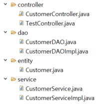
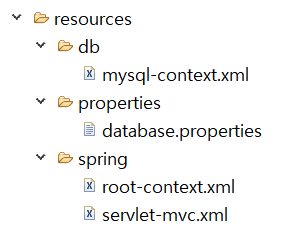
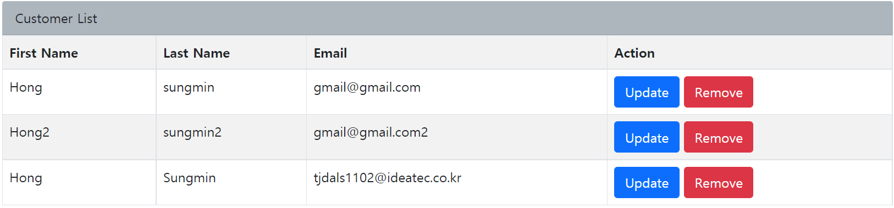
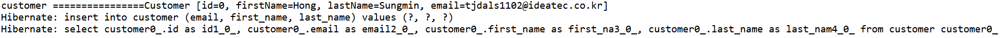

# Spring ORM (Hibernate + MySql)

### ORM
	- ORM(Object-relational mapping) 데이터베이스와 객체 지향 프로그래밍 언어간의 호환되지 않는
	  데이터를 맵핑하는 프로그래밍기법이다. 객체 모델과 관게형모델간의 불일치를 해결해 준다.

### 사용 이점
	1. 객체 지향적으로 데이터를 관리하기 때문에 직관적이다.
	2. catch/throws 및 예외 선언없이 적절한 계층에서 처리가 가능하다.
	3. JDBC 관련 코드는 O/R 매핑을 수행하는 데 사용하는 코드와 트랜잭션 방식으로 통합 할 수 있다.
	4. 지속성 관련 코드의 각 부분을 제외하고 테스트하는 것이 쉽다.

### Demo Application

#### 기술 스택
	- Spring 5.2.8.RELEASE
	- Spring Tool Suite(STS)
	- JDK 1.8
	- Hibernate 5.5.2.Final
	- c3p0 0.9.5.5
	- MySQL Connector 8.0.25
	- MySQL 8.0.25
	- Maven 3.8.0

> #### pom.xml

	<dependency>
		<groupId>org.springframework</groupId>
		<artifactId>spring-orm</artifactId>
		<version>${spring-version}</version>
	</dependency>
		
	<dependency>
		<groupId>org.hibernate</groupId>
		<artifactId>hibernate-core</artifactId>
		<version>${hibernate-version}</version>
	</dependency>
	
	<dependency>
		<groupId>mysql</groupId>
		<artifactId>mysql-connector-java</artifactId>
		<version>8.0.25</version>
	</dependency>
	
	<dependency>
		<groupId>com.mchange</groupId>
		<artifactId>c3p0</artifactId>
		<version>0.9.5.5</version>
	</dependency>

​	 
> #### IoC 접근 hibernate 인스턴스 등록 

	<?xml version="1.0" encoding="UTF-8"?>
	<beans xmlns="http://www.springframework.org/schema/beans"
		xmlns:xsi="http://www.w3.org/2001/XMLSchema-instance"
		xmlns:context="http://www.springframework.org/schema/context"
		xmlns:tx="http://www.springframework.org/schema/tx"
		xsi:schemaLocation="
			http://www.springframework.org/schema/beans	http://www.springframework.org/schema/beans/spring-beans-4.3.xsd		
			http://www.springframework.org/schema/context http://www.springframework.org/schema/context/spring-context-4.3.xsd
			http://www.springframework.org/schema/tx http://www.springframework.org/schema/tx/spring-tx-4.3.xsd">
	
		<context:annotation-config />
	
		<context:property-placeholder location="classpath:properties/database.properties" />
	
		<context:component-scan base-package="ideatec.edu.spring.frwk.tomcat" />
		<bean id="dataSource" class="com.mchange.v2.c3p0.ComboPooledDataSource"
			destroy-method="close">
			<property name="driverClass" 	value="${jdbc.driverClass}" />
			<property name="jdbcUrl" 		value="${jdbc.jdbcUrl}" />
			<property name="user" 			value="${jdbc.user}" />
			<property name="password" 		value="${jdbc.password}" />
		</bean>
	
		<bean id="sessionFactory"
			class="org.springframework.orm.hibernate5.LocalSessionFactoryBean">
			<property name="dataSource" ref="dataSource" />
			<property name="packagesToScan" value="ideatec.edu.spring.frwk.tomcat.entity" />
			<property name="hibernateProperties">
				<props>
					<prop key="hibernate.dialect">org.hibernate.dialect.MySQLDialect</prop>
					<prop key="hibernate.show_sql">true</prop>
					<prop key="hbm2ddl.auto">create</prop>
				</props>
			</property>
		</bean>
	
		<bean id="transactionManager"
			class="org.springframework.orm.hibernate5.HibernateTransactionManager">
			<property name="sessionFactory" ref="sessionFactory" />
		</bean>
		<tx:annotation-driven transaction-manager="transactionManager" />
	</beans>

​	
> #### properties 등록

	jdbc.jdbcUrl=jdbc:mysql://localhost:3306/ideatec?characterEncoding=utf8&serverTimezone=Asia/Seoul
	jdbc.driverClass=com.mysql.cj.jdbc.Driver
	jdbc.user=root ##mysql user id
	jdbc.password=0000 ##mysql user password

​	
> #### 프로젝트구조

	

> #### Entity 

	@Entity
	@NoArgsConstructor
	@Getter
	@Setter
	@ToString
	@Table(name = "customer")
	public class Customer {
		
		@Id
		@GeneratedValue(strategy = GenerationType.IDENTITY)
		@Column(name = "id")
		private int id;
	
		@Column(name = "first_name")
		private String firstName;
	
		@Column(name = "last_name")
		private String lastName;
	
		@Column(name = "email")
		private String email;
		
	}

> #### DAO

	@Repository
	public class CustomerDAOImpl implements CustomerDAO {
	
		@Autowired
		private SessionFactory sessionFactory;
	
		@SuppressWarnings("unchecked")
		@Override
		public List<Customer> getCustomers() {
			Session session = sessionFactory.getCurrentSession();
			CriteriaBuilder cb = session.getCriteriaBuilder();
			CriteriaQuery < Customer > cq = cb.createQuery(Customer.class);
			Root < Customer > root = cq.from(Customer.class);
			cq.select(root);
			Query query = session.createQuery(cq);
			return query.getResultList();
		}
		
		@Override
		public void saveOrUpdateCustomer(Customer theCustomer) {
			Session currentSession = sessionFactory.getCurrentSession();
			currentSession.saveOrUpdate(theCustomer);
		}
	
		@Override
		public void deleteCustomer(int id) {
			Session session = sessionFactory.getCurrentSession();
			Customer customer = session.byId(Customer.class).load(id);
			session.delete(customer);
		}
	}

> #### Controller

	@RestController
	@RequestMapping("/api")
	public class CustomerController {
	
		@Autowired
		private CustomerService customerService;
	
		@GetMapping("/v1/customer/list")
		public ResponseEntity<?> listCustomers() throws Exception {
			List < Customer > customers = customerService.getCustomers();
			ObjectMapper objectMapper = new ObjectMapper();
			String jsonArrayString = objectMapper.writeValueAsString(customers);
			return new ResponseEntity<String>(jsonArrayString, HttpStatus.OK);
		}
	
		@PostMapping("/v1/customer/save")
		public String saveCustomer(@RequestBody Customer customer) {
			customerService.saveOrUpdateCustomer(customer);
			return "save";
		}
		
		@DeleteMapping("/v1/customer/delete/{id}")
		public String deleteCustomer(@PathVariable int id) {
			customerService.deleteCustomer(id);
			return "delete";
		}
	}

>  #### Result

> #### Log

