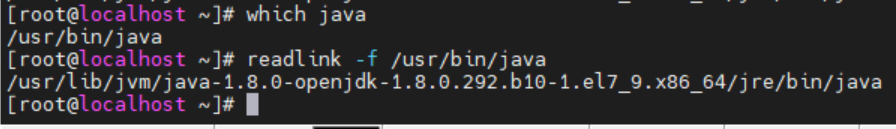
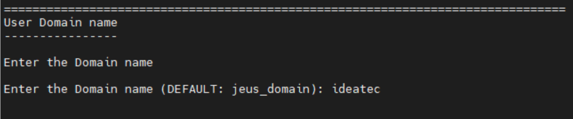

# linux(centos7) 환경에서 webtoB설치 및 라이센스

## 1. WebtoB란?

WebtoB 는 'JEUS'와 함께 티맥스소프트의 가장 대표적인 웹서버이다. ‘Web to Business’에서 따온 이름이며 Web 상에서 Browser 의
요구를 처리하여 주는 Server 용 소프트웨어이다. Web Server 시장의 대
략 67%를 상회하는 Apache 와의 호환성을 위주로, 더 나은 성능과 안
정성, 그리고 보안성을 제공하기 위해 나온 제품이다. 또한, 기존 Web
Server 와의 차별을 위하여 WebtoB 만의 새로운 기능들(Caching, Session
Management, Transaction Processing Service Call 등)을 추가하였다. 
<br>

### WebtoB특징

1. 다양한 HTML 문서들의 처리
2. CGI 및 WBAPI 지원
3. SSI(Server Side Include) 지원
4. PHP Script Language 지원
5. TP monitor 서비스 지원 (Enterprise+)
6. Servlet 및 JSP 지원 (Standard+)
7. ACL 및 SSL 등 다양한 보안 Service 지원
<br><br>

## 2. WebtoB 설치

### java 설치
webtoB를 실행 시키기 위해서는 JDK가 설치 되어 있어야 합니다. 

```
# yum list java*jdk-devel
```
설치가능한 jdk를 확인하기 위해 위 명령어를 실행시키면 다음과 같은 목록이 뜹니다.


Available Packages 중에서 java-1.8.0-openjdk-devel.x86_64을 설치하면 됩니다. 
(저는 이미 설치가 되어 있어서 Installed Packages에 있습니다.)

설치하는 명령어는

```
# java-1.8.0-openjdk-devel.x86_64
```

설치가 되었는지 확인을 해봅니다.


설치가 완료 되었으면 환경변수 설정을 해줍니다. 우선 javac의 위치를 확인해야 합니다.



'which javac'로 javac의 위치를 검색하고 
/usr/bin/javac는 심볼릭 링크이기 때문에 
'readlink -f'를 통해서 /usr/bin/javac의 실제 경로를 구합니다.

그리고 /etc/profile 을 nano편집기로 열어 하단에 다음 구문을 작성합니다.

```
PATH=$PATH:$JAVA_HOME/bin
JAVA_HOME=/usr/lib/jvm/java-1.8.0-openjdk-1.8.0.292.b10-1.el7_9.x86_64
CLASSPATH=.:$JAVA_HOME/jre/lib:$JAVA_HOME/lib/tools.jar

export PATH
export JAVA_HOME
export CLASSPATH
```

작성이 끝났으면 profile 파일 적용 위해 터미널 재접속 또는 다음 명령어를 입력합니다.

```
# source /etc/profile
```
<br><br>

### WebtoB 설치

[WebtoB 다운로드](https://technet.tmaxsoft.com/ko/front/download/findDownloadList.do?cmProductCode=0102) 페이지에서 최신 버전을 클릭한다.
<br>

<br>
하단에 Linux 항목의 Linux (x86) 64-bit를 클릭하면 바로 밑에 첨부파일로 bin파일이 나타나는데 다운로드 받는다.


<br>

다운받은 bin 파일을 linux서버에 옮기기 위한 sftp tool로 winSCP 프로그램을 사용해보겠다.<br>
(winSCP는 다운받아서 기본 default 속성으로 설치하고 linux 접속 정보를 입력하고 접속하면 된다.)<br>
그리고 다운받은 bin 파일을 원하는 디렉토리에 옮겨주면 된다.<br>


<br>
이제 linux 서버로 가서 bin 파일이 들어 있는 디렉토리로 가보면 bin 파일에 대한 실행권한이 없는데 chmod 명령어를 이용해 실행권한을 부여해 준다.

```
# chmod +x WEBTOB5_0_SP0_Fix4_LinuxK2_6_x64.bin
```
그럼 다음과 같이 좌측에 실행권한이 추가 되어 있고 bin 파일도 녹색으로 바뀌게 된다.<br>

<br>

이제 bin 파일을 실행한다.<br>

```
# ./WEBTOB5_0_SP0_Fix4_LinuxK2_6_x64.bin
```

<br>
WebtoB 설치가 진행되고 ENTER를 눌러 계속 진행한다.<br>

<br>
License 동의란으로 ENTER와 Y를 입력해 계속 진행한다.<br>

<br>
WebtoB만 설치할 것인가 아니면 Servlet과 같이 설치할 것인가를 묻는다.
<br>
WebtoB Servlet Engine에서 지원하는 HTTP Servlet은 session유지, database access, Integrated service 등 server-side service들을 모두 사용할 수 있다.
<br>
모두 설치하는 2를 누르고 ENTER
<br>

<br>
WebtoB 설치 경로를 묻는다. 설치 경로를 입력하고 차례로 y를 입력한다.<br>

<br>
설정한 디렉토리가 이미 존재한다. 덮어쓸지 변경할지 설치를 그만할지를 묻는다.<br>

<br>
JDK위치를 묻는다. profile폴더에 설정해놓은 경로를 입력해준다.<br>

<br>
Servlet password를 설정해준다.

<br>
Domain name이 설정되어 있으면 입력하면 되고 없으면 default로 한다.<br>
hostname은 명령어 창에서 hostname 입력시 확인할 수 있고, 따로 설정 또는 변경 하려면 /etc/hostname 파일에서 설정할 있다.<br>

<br>
설치 전 설정 내용을 확인한다.<br>

<br>
설치 위치를 확인한다.<br>

<br>
설치를 진행하면서 최대 파일 디스크립터 수를 설정한다. 따로 설정할 것이 없으면 ENTER<br>

<br>
설치가 완료되었다.<br>

이제 설치한 디렉토리로 가면 설치가 된 것을 확인할 수 있다.<br>
<br>

WebtoB 기본 포트가 8080이기 때문에 겹치는 포트가 있다면 config디렉토리에 있는 http.m 설정파일로 가서 변경해준다.<br>

```
# cd WebtoB홈디렉토리/config/http.m  
```

<br>

이제 /etc/profile 파일 하단에 WebtoB에 대한 경로 변수를 다음과 같이 입력해준다.

```
# nano /etc/profile
```
```
export WEBTOBDIR=/SW/web/webtoB
export PATH="${WEBTOBDIR}/bin:${PATH}"
export LD_LIBRARY_PATH="${WEBTOBDIR}/bin:${LD_LIBRARY_PATH}"
```
<br>
wscfl 명령어를 통해 환경 변수 컴파일 하려고 하였으나 명령어를 못찾는다.<br>

```
# wscfl -i http.m
```
<br>

재부팅 후 다시 시도해본다.<br>

<br>

wscfl -i http.m을 통해 환경 변수 컴파일을 해주니 WebtoB홈디렉토리에 wsconfing라는 파일이 생성된 것을 확인할 수 있다.

<br>

환경변수 활성화를 해준다.
```
# source /etc/profile
```

아까 http.m 설정파일에서 설정한 port번호에 대해 방화벽을 열어준다.
```
# firewall-cmd --permanent --add-port=8088/tcp
# firewall-cmd --reload 
```
wsboot 명령어로 WebtoB를 기동시킨다. (종료는 wsdown)<br>

<br>

이제 웹브라우저에서 본인아이피:8088(설정포트)로 접속했을 때 다음과 같이 나오면 성공.

<br><br>

참고<br>
※License 안내
   WebtoB 5 Fix#2 부터 설치 시 기본적으로 Trial 라이센스가 포함되어 있습니다.
   Trial 라이센스는 MaxUser(서버 프로세스에 속한 노드의 최대 동시 접속자 수)가 5로 제한되어 있어 그 이상의 서비스를 이용하고자 하는 경우에는
   WebtoB 정식 라이센스 또는 데모 라이센스를 이용하여야 합니다.
   데모라이센스 신청을 이용하셔서 발급을 받으시기 바랍니다.    


