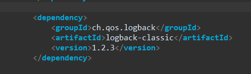
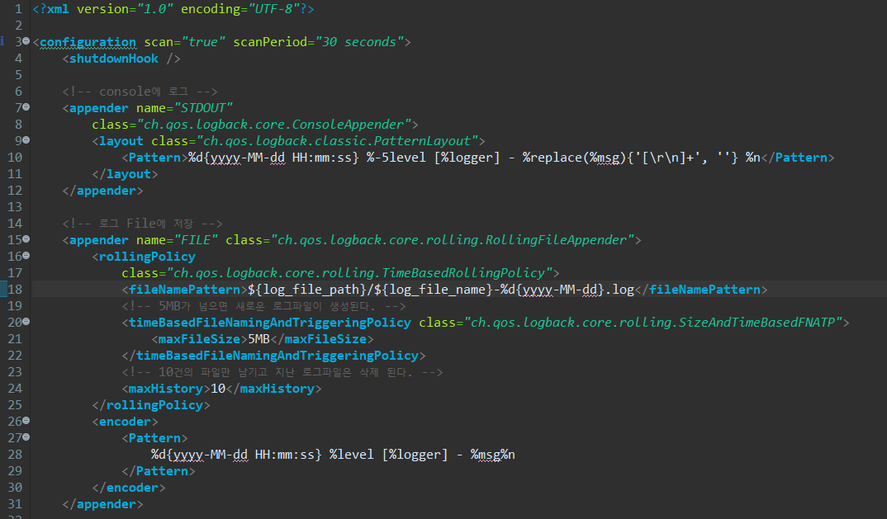
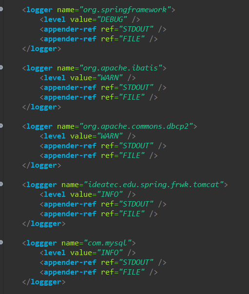
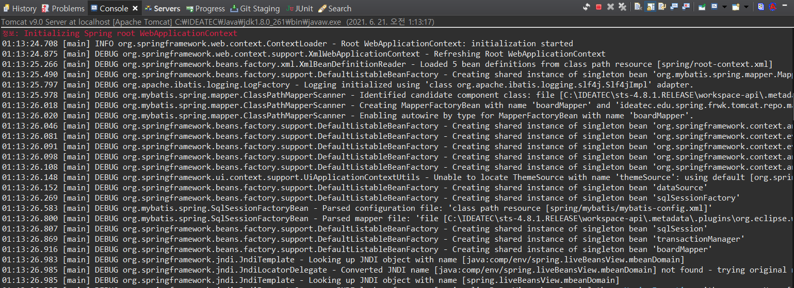
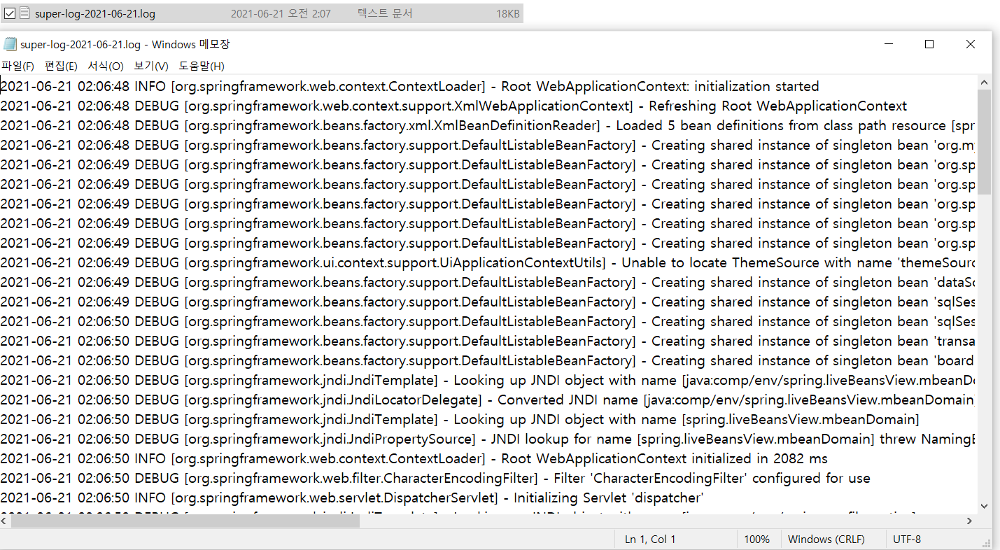
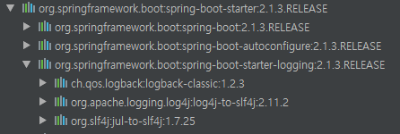

# Spring, Spring Boot에 logback 적용하기

## logback 이란?
logback은 Log4J(Log for JAVA)를 기반으로 개발된 Logging framework로, 빠른 속도와 적은 메모리 점유에 강점을 가지고 있습니다.
 
 

## Spring Framework에 적용하기
Spring Framework에 logback을 적용하기 위해서는 일단 pom.xml에 logback을 dependency로 설정해줘야합니다.
 

 

의존성을 추가해준 후에는 logback.xml 파일을 classpath에 만들어줘야합니다.
  

 

logback.xml에서는 여러가지 configuration을 등록할 수 있습니다.
 

appender은 콘솔이나 파일과 같은 출력방법에 대한 설정과 출력패턴에 대해서 정의할 수 있습니다.
 

file, filename으로 로그파일의 위치와 파일명을 설정할 수 있고 maxFileSize 옵션으로 파일 용량에 대한 제한을 할 수도 있습니다.
 

 
위처럼 logger를 사용하여 원하는 패키지나 클래스에 로그레벨과 출력방식을 설정할 수도 있습니다.
 

 
logback이 적용된 console 입니다.
 

logback으로 생성된 로그파일입니다.

## Spring Boot에 적용하기

Spring Boot의 starter에 logback이 내장되어 있습니다.
 
기존에 logback이 내장되어 있어서 xml 파일 이름은 logback-spring.xml과 같이 생성해줘야 합니다.
 

