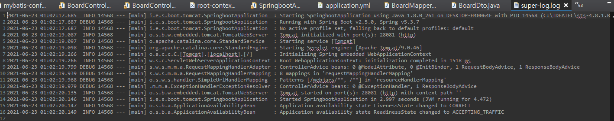

# Spring, Spring Boot에 logback 적용하기
 

 
## logback 이란?
logback은 Log4J(Log for JAVA)를 기반으로 개발된 Logging framework로, 빠른 속도와 적은 메모리 점유에 강점을 가지고 있다.
 

 

## Spring Framework에 적용하기
 
 

Spring Framework에 logback을 적용하기 위해서는 일단 pom.xml에 logback을 dependency로 설정해줘야한다.
 

 

의존성을 추가해준 후에는 logback.xml 파일을 classpath에 만들어준다.
  
 

 

logback.xml에서는 여러가지 configuration을 등록할 수 있다.
 

**Appender**는 log의 출력 방법과 출력 패턴 등을 설정할 수 있다.
 
ConsoleAppender는 log를 OutputStream에 write하여 Console에 출력되게 한다.
 
FileAppender는 log를 File에 내보낸다.
 
RollingFileAppender는 FileAppender를 상속받아 지정한 용량이 초과된 로그를 나누어 저장할 수 있다.
 

FileAppender에서는 file, filename으로 로그파일의 위치와 파일명을 설정할 수 있고 maxFileSize 옵션으로 파일 용량에 대한 제한을 할 수도 있다.
 
 

 
위처럼 logger를 사용하여 원하는 패키지나 클래스에 로그레벨과 출력방식을 설정할 수도 있다.
 

 
logback이 적용된 console
 
 

 
logback으로 생성된 로그파일
 
 

 
 
## Spring Boot에 적용하기
 

 
Spring Boot의 spring-boot-starter에 logback이 내장되어 있고 기본적으로 console log를 지원한다.
 
 

 
application.yml에서 level, fileName 등을 간편하게 설정할 수 있다.
 
 

생성된 로그파일
 
 
더 디테일한 설정이 필요할 때는 xml 파일로 구성할 수도 있다.
 
다만 Spring Boot 에는 logback이 내장되어 있어서 xml 파일 이름은 logback-spring.xml과 같이 생성해줘야 한다.
 
 

