# Spring, Spring Boot에서 간단한 RestController 구현 및 DB 연결하기
<br>
<br>
<hr style="border:1px solid gray"> 
<br>
## 1. Spring에서 DB 연동하기
<br>
<br>
우선 pom.xml에 DB 연결과 MyBatis 구성에 필요한 dependency들을 추가해준다.
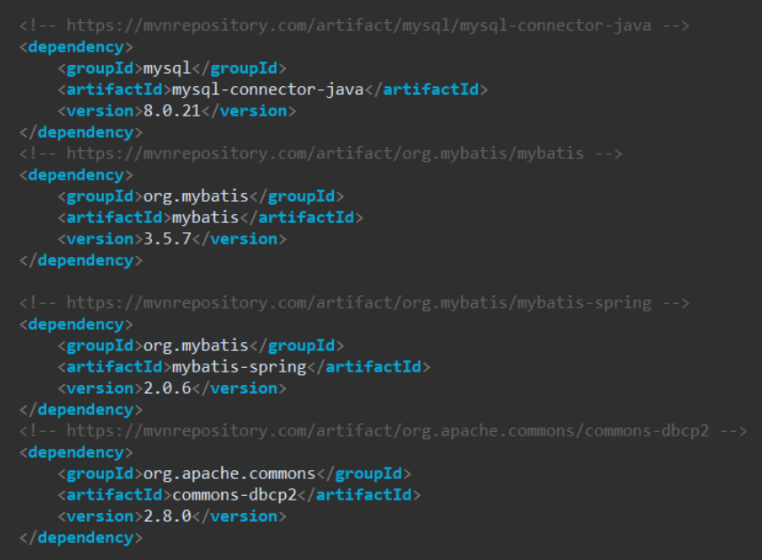
<br>
Spring Framework DB에 연동을 하기 위해서는 dataSource를 Bean으로 주입해줘야 한다.
<br>

물론 JDBC를 사용하여 아래와 같이 데이터를 가져오는 방법도 있다.
<br>
<br>
```java
Connection connection = DriverManager.getConnection(URL, USER, PW);
connection.prepareStatement("YOUR SQL HERE");
```
<br>
<br>
하지만 데이터를 가져올 때마다 이런 방법을 사용하는 것은 비효율적이고 관리하기도 매우 힘들다.
<br>
그렇기 때문에 서버 구성을 할때 Bean으로 주입하여 Pool 까지 관리할 수 있게 한다.
<br>
<br>
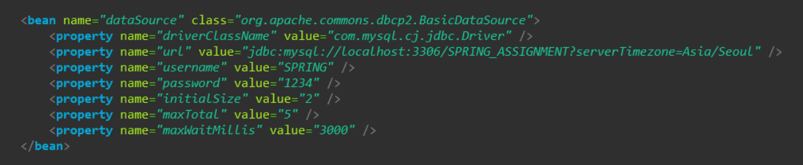
<br>
root-context.xml에 dataSource를 설정해줬다. 
<br>
<br>
이러한 dataSource class에는 spring의 DriverManagerDataSource, apache의 BasicDataSource, Altibase의 AltibaseConnectionPoolDataSource 등 여러가지 클래스를 사용할 수 있는데, 각각의 구성이 조금씩 달라서 선택하여 사용하면 된다. 
<br>
<br>
여기서는 BasicDataSource를 이용하여 구성하였는데 config properties에는 url, username, password, maxTotal, maxIdle, minIdle, maxWaitMillis, initialSize, defaultAutoCommit ... 등이 있다. (공식 Docs에서 더 많은 정보를 확인할 수 있다. https://commons.apache.org/proper/commons-dbcp/configuration.html)
<br>
<br>
url, username, password에는 DB 주소와 아이디, 비밀번호를 넣어주고 driver는 MySQL DB를 사용할 것이기 때문에 MySQL driver로 설정했다.
<br>
이렇게 서버간의 연결을 할 수 있게 해준 다음, MyBatis를 사용하기 위한 설정을 해줘야 한다.
<br>
<br>
<hr style="border:1px solid gray"> 
### MyBatis 란?
MyBatis는 Java Object와 SQL간의 매핑 기능을 지원하는 Java persistence framework 이다.
<br>
Mybatis를 이용하면 쉽게 데이터에 액세스할 수 있으며 유지보수에도 강점이 있다. 
<br>
ex) ( ? ) value 들을 #{value}와 같이 매핑, select, insert 태그 등, 코드와 SQL 분리하여 결합도 낮춤
<br>
<hr style="border:1px solid gray"> 
<br>
<br>
MyBatis를 이용하여 DB에 접근하기 위해서는 SqlSession이 필요한데, Mybatis에서는 SqlSession을 생성하기 위해 SqlSessionFactory를 사용한다.
<br>
<br>
세션을 생성하면 SQL 구문의 실행이나 커밋, 롤백 등을 하기 위해 사용할 수 있으며 필요가 없어지면 닫는다.
<br>
<br>
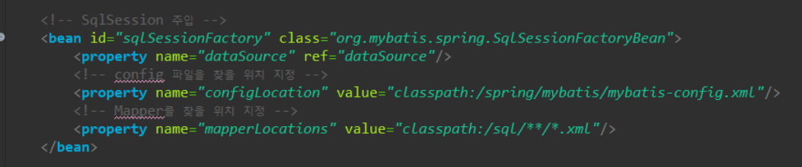
<br>
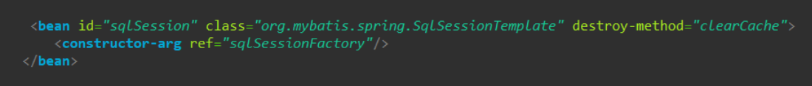
<br>
위처럼 SqlSessionFactory와 SqlSessionTemplate을 각각 Bean으로 주입했다.
<br>
<br>
SqlSessionFactory에는 데이터베이스 Connection 인스턴스를 가져오기 위한 DataSource가 필요하고, configLocation과 mapperLocations을 등록할 수 있다.
<br>
<br>
mybatis-config.xml에서는 settings, typeAliases, typeHandlers 등을 설정할 수 있다.
<br>
<br>
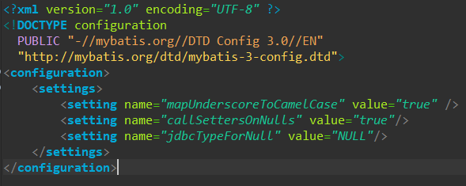
<br>
여기서는 settings 에 mapUnderScoreToCamelCase, jdbcTypeForNull, callSettersOnNull를 설정해주었다.
<br>
mapUnderScoreToCamelCase 설정을 통해 DB의 UnderScore value들을 JAVA의 camelCase value와 매핑시킬 수 있게 된다.
<br>
ex) board_seq : boardSeq
<br>
<br>
WAS가 실행될 때 Bean으로 주입되면서 해당 경로의 Mapper와 mybatis-config.xml을 찾기 때문에 정확하게 주소를 입력해줘야한다.
<br>
SqlSessionTemplate은 SqlSessionFactory를 참조하여 생성했으며, 실질적으로 SQL 구문 실행이나 트랜잭션 관리를 실행하며 Thread-safe 하다.
<br>
<br>
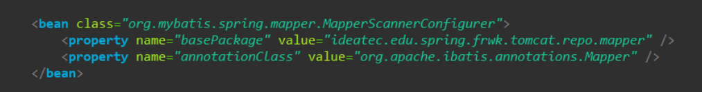
<br>
위에서 찾은 Mapper(SQL)와 Java Mapper 클래스(Interface)를 매핑시키기 위해 MapperScannerConfigurer 역시 주입을 해줘야 한다.
<br>
basePackage에 Mapper Interface의 주소, annotationClass는 @Mapper 어노테이션과 매핑시켜야 하므로 org.apache.ibatis.annotations.Mapper로 설정했다.
<br>
<br>
<hr style="border:1px solid gray"> 
<br>
#### 간단한 게시판 RestController 구현하기
<br>
<br>
앞서 진행한 DB연결과 MyBatis 설정을 바탕으로 데이터를 가져오는 간단한 서비스를 구현할 것이다.
<br>
<br>
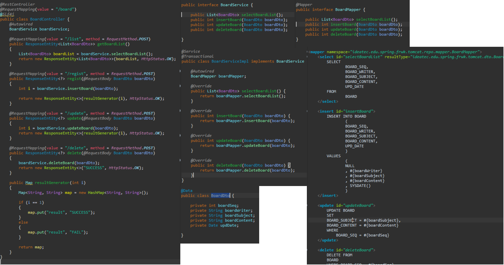
<br>
별다른 로직은 없고 들어온 요청값으로 서비스, 쿼리를 호출하여 결과를 반환한다.
<br>
<br>
Postman으로 요청하여 DB와 정상적으로 데이터를 주고 받는지 테스트했다.
<br>
<br>
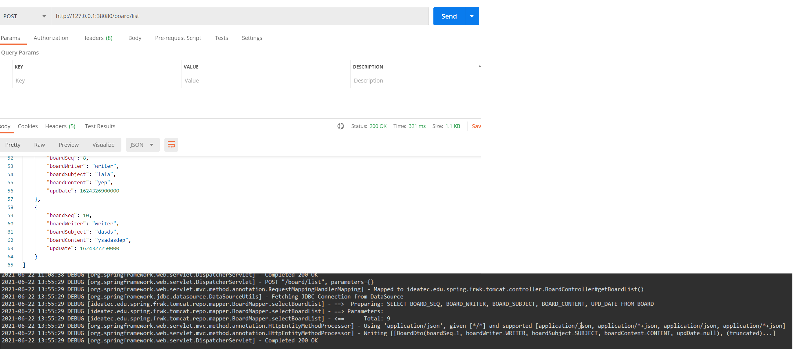
<br>
[list 테스트 결과]
<br>
<br>
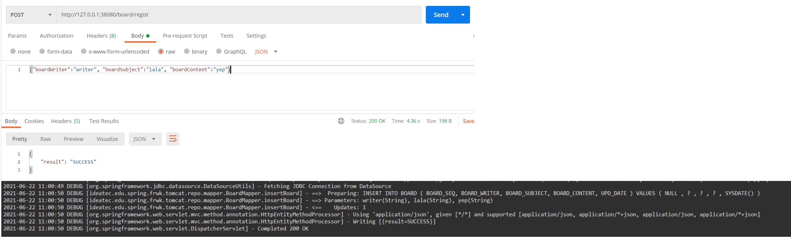
<br>
[insert 테스트 결과]
<br>
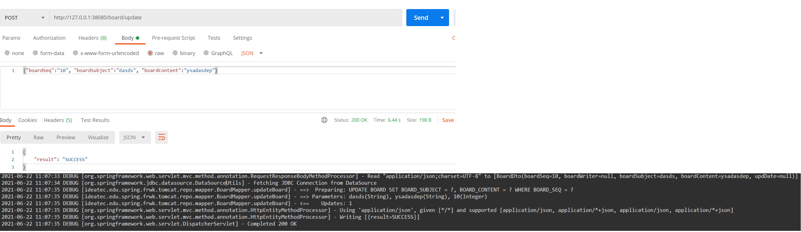
<br>
[update 테스트 결과]
<br>
<br>
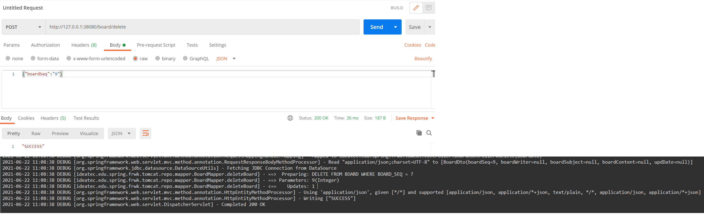
<br>
[delete 테스트 결과]
<br>
<br>
<br>
<hr style="border:1px solid gray">

## 2. Spring Boot에서 DB 연동하기
<br>
<br>
Spring Boot에서는 Java Configuration으로 DataSource를 주입했다. (Controller, Service 등 소스코드는 모두 같다.)
<br>
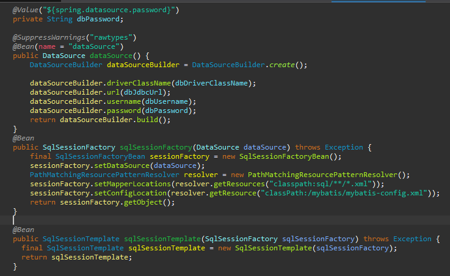
<br>
<br>
root-context.xml 에서 설정하던 것과 달라보이지만 결국 DB 접속정보를 담은 DataSource, mapperLocation과 confiuratonLocation을 가진 SqlSessionFactory로 생성한 SqlSessionTemplate을 Bean으로 등록하는 과정이다.
<br>
사진 위쪽에 @Value로 가져오는 값은 application.yml에 있는 정보이다.
<br>
<br>
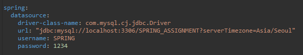
<br>
<br>
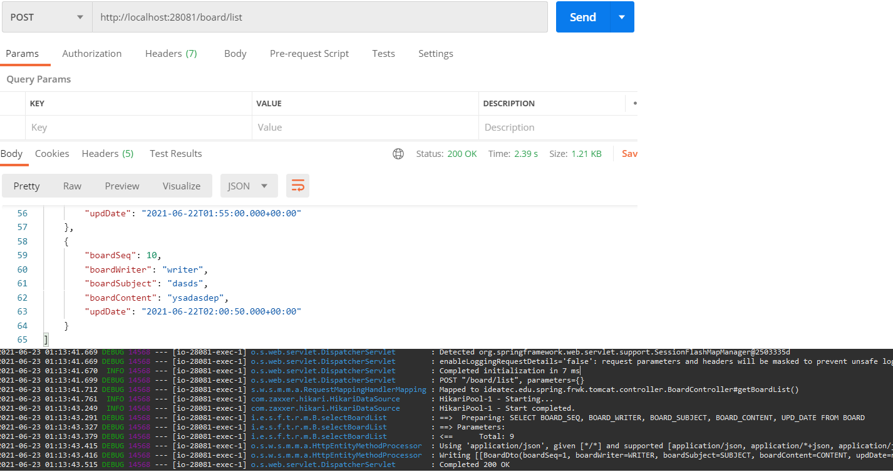
<br>
Spring Boot로도 역시 같은 결과가 출력되는 것을 확인할 수 있다.
<br>
<br>


