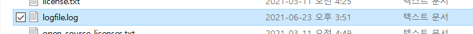
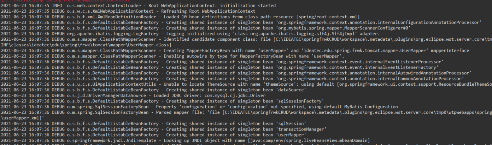
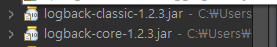
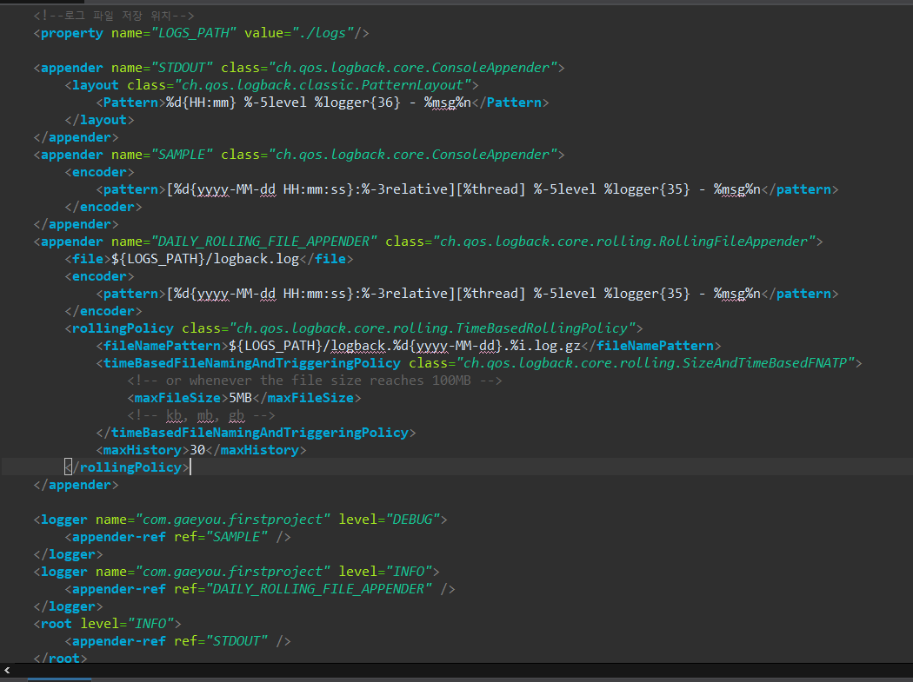
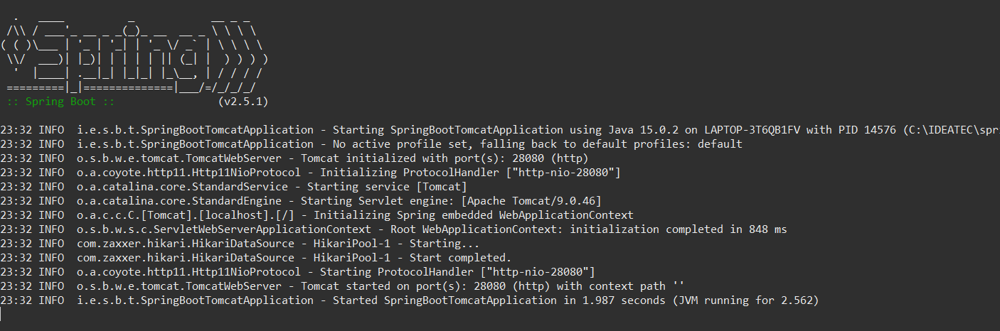

# Logback Spring, Springboot 사용해보기


## Logback


```
- Logback은 "자바 오픈소스 로깅 프레임워크"로 SLF4J의 구현체이자 스프링 부트의 기본 로그 객체입니다.

- Logback은 인기있는 log4j 프로젝트의 후속 작업으로 log4j가 중단되는 지점을 선택합니다.

- Logback의 아키텍처는 다른 상황에서 적용 할 수있을만큼 충분히 일반적입니다.

- 현재 logback은 logback-core, logback-classic 및 logback-access
의 세 가지 모듈로 나뉩니다.

```

## Spring - Logback

### pom.xml : dependency 설정


```
<dependency>
	<groupId>ch.qos.logback</groupId>
	<artifactId>logback-classic</artifactId>
	<version>1.2.3</version>
</dependency>

```

- 첫번째로 의존성을 추가해줍니다.


### logback.xml : classpath 설정 


```
<?xml version="1.0" encoding="UTF-8"?>
<configuration scan="true" scanPeriod="30 seconds">

	<!--  FileAppender는 파일에 로그 이벤트를 append 합니다 -->	
	<!--  타깃 파일은 File 옵션을 통해 명시해줄 수 있습니다. -->
    <appender name="STDOUT" class="ch.qos.logback.core.ConsoleAppender">
    	<encoder>
            <Pattern>%d{yyyy-MM-dd HH:mm:ss} %-5level %logger{36} - %msg%n</Pattern>
        </encoder>    
    </appender>
    
    <root level="DEBUG">
    <appender-ref ref="STDOUT"/>
  	</root> 
    <!-- log file 저장  -->
    <appender name="FILE" class="ch.qos.logback.core.rolling.RollingFileAppender">
        <file>logfile.log</file>
        <rollingPolicy class="ch.qos.logback.core.rolling.TimeBasedRollingPolicy">
        	<!-- 일일시간 -->
            <fileNamePattern>logFile.%d{yyyy-MM-dd}.log</fileNamePattern>
            <!-- 30일 유지 / 크기는 3GB로 제한 -->
            <maxHistory>30</maxHistory>
            <totalSizeCap>3GB</totalSizeCap>
        </rollingPolicy>
        	<triggeringPolicy class="ch.qos.logback.core.rolling.SizeBasedTriggeringPolicy">
                <maxFileSize>5MB</maxFileSize>
        	</triggeringPolicy>
		<encoder>
			<pattern>%-4relative [%thread] %-5level %logger{35} - %msg%n</pattern>
		</encoder>
    </appender>
    
</configuration>

```


- Logback 사용을 위해 configuration안에 출력 방법 및 패턴을 설정합니다.
- Console Appender는 쉽게 말해서 console창에 나오는 정보입니다.
- RollingFileAppender는 파일에 로그를 기록하는 Appender입니다.
- 특정 용량을 정해주고 그 용량이 넘어가면 자동으로 새로 기록합니다.


### Logback Console / file


[ Console ]





[ file ]





## Spring boot - Logback 




- Spring boot는 기본적으로 Logback 의존성이 설정되어 있습니다.
- Spring boot는 Console Log를 따로 설정하지 않아도 지원합니다.
- Spring boot는 기본적으로 logback이 내장되어 있어서 xml파일
생성시 파일 이름은 logback-spring.xml로 지정해줘야 합니다.


## logback-spring.xml
<br>
<br>
<br>





- spring boot xml 설정파일입니다.
- Logback-spring.xml은 appender와 logger 크게 두개로 구분됩니다.
- appender는 log의 형태를 설정합니다
- logger는 설정한 appender를 참조하여 packge와 level을 설정합니다.


## Console





- Spring boot 실행시 Console창 입니다. 감사합니다.
