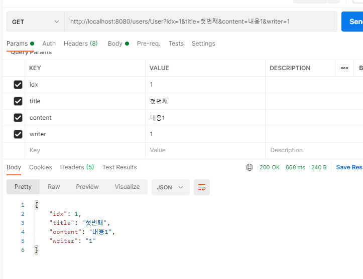
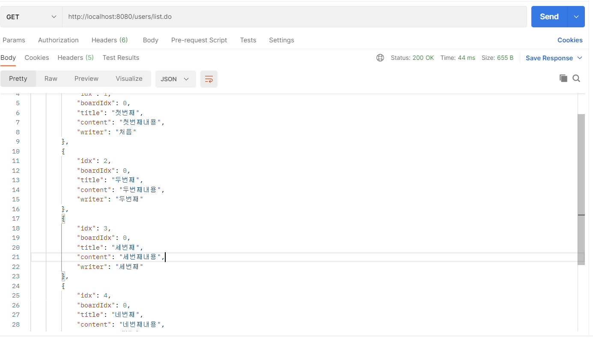
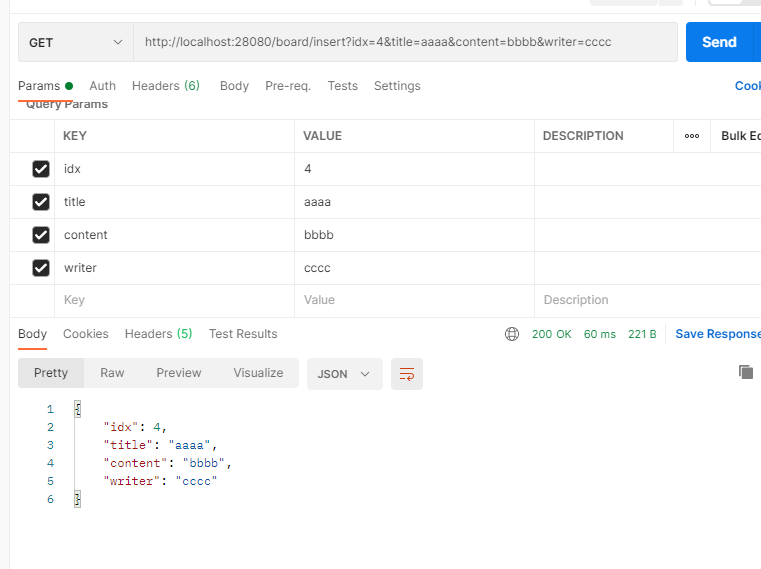

# [Spring, Spring boot] DB Connection / RestController CRUD


## Spring - DB connection , mybatis, RestController CRUD 세팅


### 1. pom.xml


```
    <dependency>
	    <groupId>org.mybatis</groupId>
	    <artifactId>mybatis</artifactId>
	    <version>3.5.7</version>
	</dependency>
	<dependency>
	    <groupId>org.mybatis</groupId>
	    <artifactId>mybatis-spring</artifactId>
	    <version>2.0.6</version>
	</dependency>
	<dependency>
	    <groupId>mysql</groupId>
	    <artifactId>mysql-connector-java</artifactId>
	    <version>8.0.25</version>
	</dependency>
```
- DB,mybatis 사용을 위해 필요한 dependency추가합니다.


### 2. web.xml 세팅 (CharacterEncodingFilter 생략)


```
  	<context-param>
    	<param-name>contextConfigLocation</param-name>
    	<param-value>classpath:spring/root-context.xml</param-value>
  	</context-param>  
```

- STS에서 기본적으로 제공해주는 설정 파일 외에, 사용자가 직접 컨트롤 하는 XML파일을 지정해주는 역할을 합니다.
- context-param에서 설정되어 있는 root-context.xml은 모든 서블릿과 필터에서 사용되는 루트 스프링 컨테이너에 대한 설정입니다.


```
<servlet>
    	<servlet-name>dispatcher</servlet-name>
    	<servlet-class>org.springframework.web.servlet.DispatcherServlet</servlet-class>
    	<init-param>
      		<param-name>contextConfigLocation</param-name>
      		<param-value>classpath:spring/servlet-mvc.xml</param-value>
    	</init-param>
  	</servlet>
  	<servlet-mapping>
    	<servlet-name>dispatcher</servlet-name>
    	<url-pattern>/</url-pattern>
  	</servlet-mapping>
```
- servlet은 spring에서는 DispatcherServlet이 모든 요청을 받고, URL과 mapping하는 controller에 위임합니다.
- servlet이란 보통 자바에서 동적 웹 프로젝트를 개발할 때, 사용자의 요청과 응답을 처리해주는 역할을 합니다.


```
 	<listener>
    	<listener-class>org.springframework.web.context.ContextLoaderListener</listener-class>
  	</listener>
```
- 스프링 설정 정보를 읽습니다.


### 3. root-context (DB,mybatis) 세팅

```
	<context:component-scan
		base-package="ideatec.edu.spring.frwk.tomcat"
		use-default-filters="false">
		<context:include-filter type="annotation"
			expression="org.springframework.stereotype.Repository" />
		<context:exclude-filter type="annotation"
			expression="org.springframework.stereotype.Component" />
		<context:exclude-filter type="annotation"
			expression="org.springframework.stereotype.Service" />
		<context:exclude-filter type="annotation"
			expression="org.springframework.stereotype.Controller" />
	</context:component-scan>
```

- Repository, Component, Service, Controller를 통해 bean을 검색할 경로를 지정합니다.


```
	<bean id="dataSource"
		class="org.springframework.jdbc.datasource.DriverManagerDataSource">
		<property name="driverClassName"
			value="com.mysql.cj.jdbc.Driver"></property>
		<property name="url"
			value="jdbc:mysql://127.0.0.1:3306/springMVC?serverTimezone=Asia/Seoul">
		</property>
		<property name="username" value="root"></property>
		<property name="password" value="q1w2e3r4!"></property>
	</bean>

    <bean id="sqlSessionFactory"
		class="org.mybatis.spring.SqlSessionFactoryBean">
		<property name="dataSource" ref="dataSource"></property>
		<property name="mapperLocations"
			value="classpath:/mappers/**/*Mapper.xml" />
	</bean>

	<bean id="sqlSession"
		class="org.mybatis.spring.SqlSessionTemplate"
		destroy-method="clearCache">
		<constructor-arg name="sqlSessionFactory"
			ref="sqlSessionFactory" />
	</bean>

```
- dataSource란 JDBC 명세의 일부분이면서 일반화된 연결 팩토리입니다.
- DB와 관계된 connection 정보를 담고 있으며, bean으로 등록하여 인자로 넘겨줍니다.
- 이 과정을 통해 Spring은 DataSource로 DB와의 연결을 획득합니다.
- DB와 연결을 위한 DB Server에 관한 property를 설정합니다. (url,driver,username,userpassword)
- Spring JDBC를 사용하려면 먼저, DB connection을 가져오는 DataSource를 spring IOC 컨테이너의 공유 가능한 Bean으로 등록해야 합니다.
- 생성된 Bean을 spring JDBC에 주입합니다.
- SqlSessionFactory는 db연결과 sql의 실행에 대한 모든 것을 가진 가장 중요한 객체입니다.
- 이 객체가 DataSource를 참조하여 Mybatis와 Mysql 서버를 연동시켜줍니다. 
- SqlSessionTemplate은 mybatis spring 연동모듈 핵심입니다.
- SqlSession을 구현하고 코드에서 Sqlsession를 대체하는 역할을 합니다.


```
	<bean class="org.mybatis.spring.mapper.MapperScannerConfigurer">
		<property name="basePackage"
			value="ideatec.edu.spring.frwk.tomcat.mapper" />
		<property name="annotationClass"
			value="org.apache.ibatis.annotations.Mapper" />
	</bean>
```


- mapper를 스캔하기 위함과 annotation은 interface에서 @Mapper 매핑을 위해 설정합니다.


### 4. RestController CRUD Source code 

UserController

```
package ideatec.edu.spring.frwk.tomcat.controller;

import java.util.HashMap;
import java.util.List;
import java.util.Map;

import org.springframework.beans.factory.annotation.Autowired;
import org.springframework.http.HttpStatus;
import org.springframework.http.ResponseEntity;
import org.springframework.web.bind.annotation.DeleteMapping;
import org.springframework.web.bind.annotation.GetMapping;
import org.springframework.web.bind.annotation.PostMapping;
import org.springframework.web.bind.annotation.RequestMapping;
import org.springframework.web.bind.annotation.RestController;

import ideatec.edu.spring.frwk.tomcat.dto.UserDTO;
import ideatec.edu.spring.frwk.tomcat.service.UserService;

@RestController
@RequestMapping("/users")
public class UserController {	

	@Autowired
	private UserService userService;
	
	@GetMapping(value = "list")
	public ResponseEntity<?> getAlluser()  throws Exception {
		List<UserDTO> list = userService.getAlluser();
		
		Map<String, Object> result = new HashMap<>();
		result.put("users", list);

		return new ResponseEntity<>(result, HttpStatus.OK);
	}
	@GetMapping(value = "User")
	public ResponseEntity<?> getInsertUser(UserDTO userDTO)  throws Exception {
		
		System.out.println("userDTO:" + userDTO);
		userService.getInsertUser(userDTO);
		
		return new ResponseEntity<>(userDTO, HttpStatus.OK);
		
	}
	
	@PostMapping(value = "UserUpdate")
	public ResponseEntity<?> UpdateUser(UserDTO userDTO)  throws Exception {
		
		System.out.println("Update userDTO : " + userDTO);
		 	userService.UpdateUser(userDTO);
		 
		return new ResponseEntity<>(userDTO, HttpStatus.OK);
	}
	
	@DeleteMapping(value = "UserDelete")
	public ResponseEntity<?> DeleteUser(UserDTO userDTO)  throws Exception {
		
		System.out.println("Delete userDTO : " + userDTO);
		userService.DeleteUser(userDTO);
		
		return new ResponseEntity<>(userDTO, HttpStatus.OK);
	}
	
}
```

UserService

```
package ideatec.edu.spring.frwk.tomcat.service;

import java.util.List;

import ideatec.edu.spring.frwk.tomcat.dto.UserDTO;

public interface UserService {
	
	public List<UserDTO> getAlluser();

	public void getInsertUser(UserDTO userDTO);
	
    public void UpdateUser(UserDTO userDTO);
 
    public void DeleteUser(UserDTO userDTO);

}

```

UserServiceImpl

```
package ideatec.edu.spring.frwk.tomcat.service;

import java.util.List;

import org.slf4j.Logger;
import org.slf4j.LoggerFactory;
import org.springframework.beans.factory.annotation.Autowired;
import org.springframework.stereotype.Service;

import ideatec.edu.spring.frwk.tomcat.dto.UserDTO;
import ideatec.edu.spring.frwk.tomcat.mapper.UserMapper;

@Service
public class UserServiceImpl implements UserService {

	@Autowired
	private UserMapper userMapper;
	
	@Override
	public List<UserDTO> getAlluser() {
			userMapper.getAlluser();
			   
		return userMapper.getAlluser();
	}

	@Override
	public void getInsertUser(UserDTO userDTO) {
		userMapper.getInsertUser(userDTO);
		
	}

	@Override
	public void UpdateUser(UserDTO userDTO) {
		System.out.println("Update DTO : " + userDTO);
		userMapper.UpdateUser(userDTO);
		
	}

	@Override
	public void DeleteUser(UserDTO userDTO) {

		System.out.println("Delete DTO : " + userDTO);
		userMapper.DeleteUser(userDTO);
		
	}

}

```

UserDTO

```
package ideatec.edu.spring.frwk.tomcat.dto;

public class UserDTO {

	// 번호
	private int idx;
	// 제목 
	private String title;
	// 글 내용
	private String content;
	// 작성자 
	private String writer;
	public int getIdx() {
		return idx;
	}
	public void setIdx(int idx) {
		this.idx = idx;
	}
	public String getTitle() {
		return title;
	}
	public void setTitle(String title) {
		this.title = title;
	}
	public String getContent() {
		return content;
	}
	public void setContent(String content) {
		this.content = content;
	}
	public String getWriter() {
		return writer;
	}
	public void setWriter(String writer) {
		this.writer = writer;
	}
	@Override
	public String toString() {
		return "UserDTO [idx=" + idx + ", title=" + title + ", content=" + content + ", writer=" + writer + "]";
	}
	
}

```

userMapper.xml

```

<mapper namespace="ideatec.edu.spring.frwk.tomcat.mapper.UserMapper">

	<select id="getAlluser" resultType="ideatec.edu.spring.frwk.tomcat.dto.UserDTO">
		select * from user;
	</select>
	
	<insert id="getInsertUser" parameterType="ideatec.edu.spring.frwk.tomcat.dto.UserDTO">
		insert into user(idx, title, content, writer) value (#{idx}, #{title}, #{content}, #{writer})
	</insert>
	
	<update id="UpdateUser" parameterType="ideatec.edu.spring.frwk.tomcat.dto.UserDTO">
		update user set title=#{title}, content=#{content}, writer=#{writer}
	</update>
	
	<delete id="DeleteUser" parameterType="ideatec.edu.spring.frwk.tomcat.dto.UserDTO">
		delete from user where content=#{content}
	</delete>
	
</mapper>

```

### 5. Postman - CRUD result

[ insert ]



[ list ]



[ update ]


[ delete ]


<hr style="border:1px solid gray">


## Spring boot 


### Springboot - DB connection , mybatis, RestController CRUD 세팅


### pom.xml

```
	 <dependency>
		 <groupId>mysql</groupId> 
		 <artifactId>mysql-connector-java</artifactId> 
	</dependency> 
	<dependency>
	    <groupId>org.mybatis.spring.boot</groupId>
	    <artifactId>mybatis-spring-boot-starter</artifactId>
	    <version>2.2.0</version>
	</dependency>

```

### SpringBootTomcatApplication

```
package ideatec.edu.spring.boot.tomcat;

import javax.sql.DataSource;

import org.apache.ibatis.session.SqlSessionFactory;
import org.mybatis.spring.SqlSessionFactoryBean;
import org.springframework.boot.SpringApplication;
import org.springframework.boot.autoconfigure.SpringBootApplication;
import org.springframework.context.annotation.Bean;
import org.springframework.core.io.Resource;
import org.springframework.core.io.support.PathMatchingResourcePatternResolver;

@SpringBootApplication
public class SpringBootTomcatApplication {

	public static void main(String[] args) {
		SpringApplication.run(SpringBootTomcatApplication.class, args);
	}
	@Bean
	public SqlSessionFactory sqlSessionFactory(DataSource dataSource) throws Exception {
		SqlSessionFactoryBean sessionFactory = new SqlSessionFactoryBean();
		sessionFactory.setDataSource(dataSource);
		
		Resource[] res = new PathMatchingResourcePatternResolver().getResources("classpath:mybatis/*Mapper.xml");
		sessionFactory.setMapperLocations(res);
		
		return sessionFactory.getObject();
	}
	
}
```

- boot 에서는 DB연결방법이 매우 많습니다
- 저는 DataSourceConfig을 사용했습니다.
- 이 방법은 아무런 설정이 없는 DataSourceProperties 객체를 반환합니다.
- 반환과 동시에 Bean으로 등록되며 이 Bean은 호출시 Spring이 알아서 DataSource값을 binding 시킨 후 값을 넘겨준다.


### BoardController

```
package ideatec.edu.spring.boot.tomcat.controller;

import java.util.HashMap;
import java.util.List;
import java.util.Map;

import org.mybatis.spring.annotation.MapperScan;
import org.springframework.beans.factory.annotation.Autowired;
import org.springframework.http.HttpStatus;
import org.springframework.http.ResponseEntity;
import org.springframework.web.bind.annotation.DeleteMapping;
import org.springframework.web.bind.annotation.GetMapping;
import org.springframework.web.bind.annotation.PostMapping;
import org.springframework.web.bind.annotation.RequestMapping;
import org.springframework.web.bind.annotation.RestController;

import ideatec.edu.spring.boot.tomcat.dto.BoardDTO;
import ideatec.edu.spring.boot.tomcat.service.BoardService;

@RestController
@RequestMapping(value = "/board")
@MapperScan(basePackages="ideatec.edu.spring.boot.tomcat")
public class BoardController {

	
	@Autowired
	private BoardService boardService;
	
	@GetMapping(value = "list")
	public ResponseEntity<?> boardList()  throws Exception {
		List<BoardDTO> list = boardService.boardList();
		
		Map<String, Object> result = new HashMap<>();
		result.put("users", list);
		
		return new ResponseEntity<>(result, HttpStatus.OK);
	}
	@GetMapping(value = "insert")
	public ResponseEntity<?> insertBoard(BoardDTO boardDTO)  throws Exception {
		
		System.out.println("BoardDTO:" + boardDTO);
		boardService.insertBoard(boardDTO);
		
		return new ResponseEntity<>(boardDTO, HttpStatus.OK);
		
	}
	
	@PostMapping(value = "Update")
	public ResponseEntity<?> updateBoard(BoardDTO boardDTO)  throws Exception {
		
		System.out.println("Update userDTO : " + boardDTO);
		 	boardService.updateBoard(boardDTO);
		
		 
		return new ResponseEntity<>(boardDTO, HttpStatus.OK);
	}
	
	@DeleteMapping(value = "Delete")
	public ResponseEntity<?> DeleteUser(BoardDTO boardDTO)  throws Exception {
		
		System.out.println("Delete userDTO : " + boardDTO);
		boardService.deleteBoard(boardDTO);
		
		return new ResponseEntity<>(boardDTO, HttpStatus.OK);
	}
	
}

```

### BoardService

```
package ideatec.edu.spring.boot.tomcat.service;

import java.util.List;

import ideatec.edu.spring.boot.tomcat.dto.BoardDTO;

public interface BoardService {

	
	public List<BoardDTO> boardList();

	public void insertBoard(BoardDTO boardDTO);
	
    public void updateBoard(BoardDTO boardDTO);
 
    public void deleteBoard(BoardDTO boardDTO);

}

```

### BoardServiceImpl

```
package ideatec.edu.spring.boot.tomcat.service;

import java.util.List;

import org.springframework.beans.factory.annotation.Autowired;
import org.springframework.stereotype.Service;

import ideatec.edu.spring.boot.tomcat.dto.BoardDTO;
import ideatec.edu.spring.boot.tomcat.mapper.BoardMapper;

@Service
public class BoardServiceImpl implements BoardService {
	
	@Autowired
	private BoardMapper boardMapper;
	
	
	@Override
	public List<BoardDTO> boardList() {
		boardMapper.boardList();
			   
		return boardMapper.boardList();
	}

	@Override
	public void insertBoard(BoardDTO boardDTO) {
		boardMapper.insertBoard(boardDTO);
		
		
	}

	@Override
	public void updateBoard(BoardDTO boardDTO) {
		System.out.println("Update DTO : " + boardDTO);
		boardMapper.updateBoard(boardDTO);
		
	}

	@Override
	public void deleteBoard(BoardDTO boardDTO) {

		System.out.println("Delete DTO : " + boardDTO);
		boardMapper.deleteBoard(boardDTO);
		
	}

}

```

### BoardDTO

```
package ideatec.edu.spring.boot.tomcat.dto;

public class BoardDTO {

	// 번호
	private int idx;
	// 제목 
	private String title;
	// 글 내용
	private String content;
	// 작성자 
	private String writer;
	
	public int getIdx() {
		return idx;
	}
	public void setIdx(int idx) {
		this.idx = idx;
	}
	public String getTitle() {
		return title;
	}
	public void setTitle(String title) {
		this.title = title;
	}
	public String getContent() {
		return content;
	}
	public void setContent(String content) {
		this.content = content;
	}
	public String getWriter() {
		return writer;
	}
	public void setWriter(String writer) {
		this.writer = writer;
	}
	
}
```

### BoardMapper

```
package ideatec.edu.spring.boot.tomcat.mapper;

import java.util.List;

import org.apache.ibatis.annotations.Mapper;

import ideatec.edu.spring.boot.tomcat.dto.BoardDTO;

@Mapper
public interface BoardMapper{

	public List<BoardDTO> boardList();

	public void insertBoard(BoardDTO boardDTO);
	
    public void updateBoard(BoardDTO boardDTO);
 
    public void deleteBoard(BoardDTO boardDTO);
 
}

```

### boardMapper.xml

```
<mapper namespace="ideatec.edu.spring.boot.tomcat.service.BoardService">

	<select id="boardList" resultType="ideatec.edu.spring.boot.tomcat.dto.BoardDTO">
		select * from board;
	</select>
	
	<insert id="insertBoard" parameterType="ideatec.edu.spring.boot.tomcat.dto.BoardDTO">
		insert into board(idx, title, content, writer) value (#{idx}, #{title}, #{content}, #{writer})
	</insert>
	
	<update id="updateBoard" parameterType="ideatec.edu.spring.boot.tomcat.dto.BoardDTO">
		update board set title=#{title}, content=#{content}, writer=#{writer}
	</update>
	
	<delete id="deleteBoard" parameterType="ideatec.edu.spring.boot.tomcat.dto.BoardDTO">
		delete from board where content=#{content}
	</delete>

</mapper>

```

### application.properties

```
server.port=28080
spring.application.name=spring-boot-test # 서비스명
spring.datasource.url=jdbc:mysql://localhost:3306/springbootMVC?CuseSSL=false&characterEncoding=UTF-8&serverTimezone=UTC
spring.datasource.username=root
spring.datasource.password=q1w2e3r4!
spring.datasource.driver-class-name=com.mysql.cj.jdbc.Driver

mybatis.type-aliases-package:ideatec.edu.spring.boot.tomcat.mapper/BoardMapper
mybatis.mapper-locations: mybatis/**/*.xml
```

- 포트번호는 28080으로 설정하며
- db연결시 필요한 url, username, password, driver, mybatis 설정 입니다.


### spring boot CRUD - List


[ List ]



- boot 또한 결과값은 비슷합니다. 감사합니다.