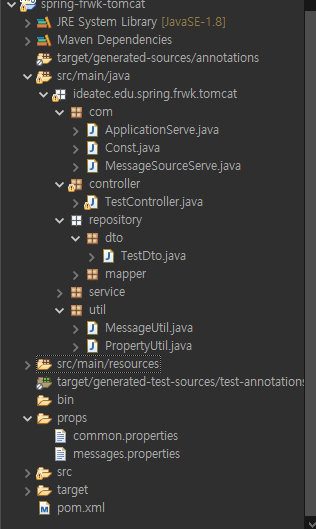
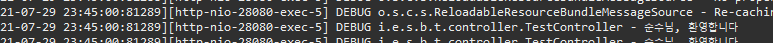

# 스프링 프레임워크

## 스프링에서 메시징 설정 및 사용

1. **메시징**  
   오류 메시지 등 다양한 메시지들을 프로퍼티 파일에 따로 관리하는 방법  
   소스 코드와 메시지를 분리할 수 있고 한번에 관리 할 수 있다는 장점이 있다.  
   국제화에 많이 사용된다.  

2. **설정**  

   

   먼저 classpath 밑에 props 폴더를 만들고 그 밑에 messages.properties 파일을 생성합니다.  

   

   messages.properties 파일 안에 값들을 Key-Value 형태로 정의합니다.  
   프로퍼티 값에는 MessageFormat 클래스가 해석할 수 있는 메시지 문자열을 지정해야 합니다.  
   좀 더 편하게 메시지를 편집하기 위해서는 ResourceBundle Editor를 사용해서 편집하는 것을 추천드립니다.  

   

   그 다음에 위와 같이 context.xml 혹은 root-context.xml 파일에서 basenames라는 프로퍼티 밑에 파일의 위치를 지정해줍니다.  
   이 때 뒤에 .properties 는 생략합니다.  
    
   스프링이 외부에서 메시지를 가져오기 위해서는 MessageSource라는 인터페이스를 사용합니다.  
   스프링 프레임워크에서는 다양한 MessageSource의 구현체들을 제공하는데 대표적인 예가 ResourceBundleMessageSource 와
   ReloadableResourceBundleMessageSource 이다.  
    
   ReloadableResourceBundleMessageSource는 일정 주기로 업데이트를 확인하는 기능이 있기 때문에 사용했다.  
   cacheSeconds를 설정하면 설정된 시간(초) 주기로 프로퍼티 파일의 업데이트 여부를 확인한다.   

3. **사용**  
   설정한 메시지 프로퍼티를 테스트 하기위해 아래와 같은 코드를 작성했습니다.  

   

   /hellow1로 요청이 들어오면 메시지를 콘솔에 찍는 간단한 예제입니다.  
   메시지에 접근하기 위해서 MessageSource를 주입받고 MessageSource의 .getMessage() 메서드를 이용해
   메시지를 가지고 옵니다.  

   

   messages.properties 에서 welcome.message 키 값으로 설정한 문구가 출력되는 것을 확인할 수 있습니다.  
   이때 getMessage()에서 두번재 인자로 받은 값이 {0} 위치에 들어간 것을 확인하실 수 있습니다.  
   이처럼 인자값을 받아와서 문자열을 만드는 것도 하실 수 있습니다.  

4. **MessageUtil 만들기**  

   다음으로는 프로퍼티 파일에서 설정한 메시지들을 가져오는 MessageUtil을 만들어 보겠습니다.  

   
   

   com 이라는 이름의 패키지 하위로 MessageSource를 반환해주는 MessageSourceServe 클래스를 구현합니다.  
   MessageSourceAware를 implement 한 후 MessageSource를 받아와 반환해 주는 간단한 코드입니다.  

   
   

   그 다음에 MessageUtil 클래스를 util 패키지 밑에 생성해줍니다. 먼저 빌드했던 MessageSourceServe 에서 MessageSource 객체를 반환받고  
   반환 받은 MessageSource 객체에서 .getMessage() 메서드를 사용해 결과 값을 반환해주는 방식입니다. 

   
   

   아까와 같은 코드에서 이번에는 MessageSource를 직접 주입받는게 아닌, MessageUtil의 getMessage()를 이용해 가져온 값을 콘솔에 찍어주게 변경했습니다.  
   그리고 보시다시피 같은 결과 값을 반환하는 것을 확인하실 수 있습니다.  

   ***

## 스프링 부트에서 메시징 설정 및 사용

부트에서는 약간 다른 방식으로 설정을 해봤습니다. config라는 이름의 패키지를 만든 후 MessageConfig 설정 파일을 만들어 위와 같이 선언했습니다. 
디테일한 설정은 스프링과 같습니다. ReloadableResourceBundleMessageSource 객체 선언 후, basename에 프로퍼티 파일의 위치,  
업데이트 확인 주기 설정, 인코딩 설정 등을 설정해준 후 반환 해주는 역할을 합니다.  

스프링에서와 같은 구현체를 사용해서 같은 동작을 하는 코드를 작성했습니다.  
역시 잘 작동하는 것을 확인할 수 있습니다.   

---

## 추가

1. **메시지 프로퍼티 파일 위치 수정**

프로퍼티 파일들위 위치를 파일 path하위로 옮겼습니다.  

파일 path의 위치를 jvm argument에 file.path 값으로 저장한 후 적용했고 이상없이 실행되는것을 확인 하실 수 있습니다. 

부트에서도 같은 방식으로 MessageConfig에서 System.getProperty()를 이용해서 path를 적용해줬습니다. 마찬가지로 정상 작동하는 것을 확인하실 수 있습니다.  

---

---

#### 참고자료

&nbsp; - https://offbyone.tistory.com/408  
&nbsp; - 스프링 철저 입문  
