# 스프링 프레임워크

## 스프링에서 프로퍼티 파일 설정 및 사용

1. **프로퍼티 파일** <br>
   코드 내에 정보들을 넣어두지 않고 .properties라는 파일에 저장 및 관리하면서<br>
   정보를 주입하는 방식입니다. <br>
   코드의 변경 없이 정보들을 따로 관리하면서 의존성을 줄이고 <br>
   쉽게 정보를 수정할 수 있다는 장점이 있습니다. <br>

2. **설정** <br>

   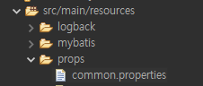

   먼저 classpath 밑에 props 폴더를 만들고 그 밑에 common.properties 파일을 생성합니다. <br>

   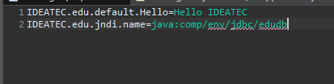

   common.properties 파일 안에 값들을 Key-Value 형태로 정의합니다. <br>
   저는 먼저 포스트에서 db연결을 위해 사용한 DB Resource jndi의 이름을 [IDEATEC.edu.jndi.name] 키 값으로 저장했습니다. <br>
   추가로 [IDEATEC.edu.default.Hello] 란 이름으로 스트링 값을 하나 추가했습니다. <br>

   

   그 다음에 위와 같이 context.xml 혹은 root-context.xml 파일에서 프로퍼티 파일의 위치를 지정해줍니다. <br>

3. **사용** <br>
   설정한 프로퍼티 값을 가져오기 위해서는 ${키값} 의 형식으로 불러오면 됩니다.<br>

   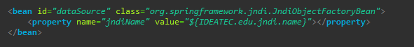

   아까 설정해둔 DB Resource의 이름을 ${IDEATEC.edu.jndi.name} 로 가져와서 dataSource에 주입시켜줬습니다. <br>

   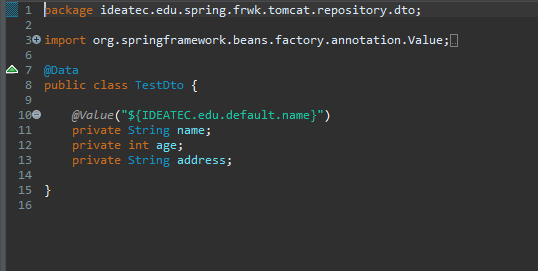

   위와 같이 @Value 어노테이션을 사용해서 값을 미리 주입해줄 수도 있습니다. <br>

   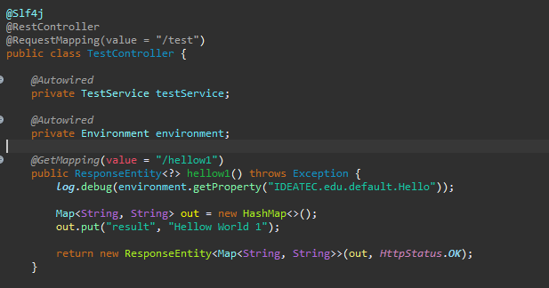

   실사용 예시를 위해서 위와 같은 코드를 작성했습니다. Envionment 객체를 주입받은 후 <br>
   "/hellow1" 로 Get 요청이 들어왔을 때 <br>
   environment.getProperty("키값"); 메서드를 사용해서 common.properties에서 설정한 값을<br>
   불러오는 간단한 코드입니다. <br>

   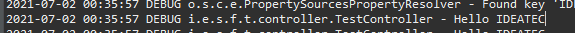

   [IDEATEC.edu.default.Hello]라는 키 값으로 저장한 "Hello IDEATEC" 이라는 문자열이 정상적으로 출력 된 모습입니다. <br>

4. **PropertyUtil 만들기** <br>

   다음으로는 프로퍼티 파일에서 설정한 값들을 가져오는 PropertyUtil을 만들어 보겠습니다. <br>

   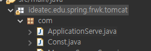
   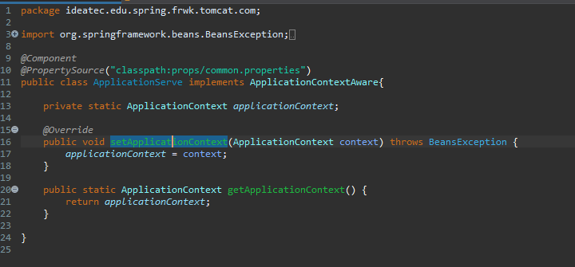

   우선 com 이라는 이름의 패키지를 만든 후 <br>
   그 아래에 ApplicationContext를 반환해주는 ApplicationServe라는 클래스를 만들어줍니다. <br>
   이 때, 우리가 설정한 프로퍼티 파일에 접근하게 해주기 위해 @PropertySource 어노테이션에 <br> 프로퍼티 파일의 경로를 지정해 줍니다. <br>

   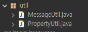
   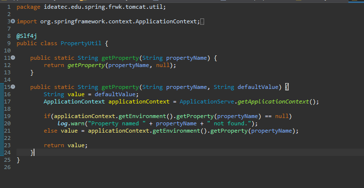

   그 다음에 실제로 구현할 PropertyUtil 클래스를 util 패키지 밑에 생성해줍니다. <br>
   실제 구현은 간단합니다. 먼저 빌드했던 ApplicationServe 클래스에서 ApplicationContext 객체를 반환받고 <br>
   반환 받은 ApplicationContext 객체에서 .getEnvironment() 메서드로 Environment 객채를 가져온 후 <br>
   먼저 테스트 한것처럼 getProperty() 메서드를 이용해 결과 값을 반환해주는 방식입니다.<br>

   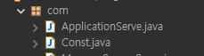
   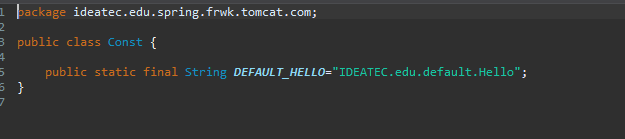

   추가적으로 키 값을 com 패키지 하위 Const 클래스를 만들어 상수로 설정했습니다. <br>

   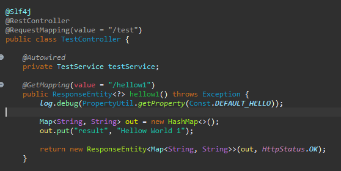

   아까와 같은 코드지만 이번에는 스스로 구현한 PropertyUtil의 getProperty() 메서드를 이용해 값을 가져오게 변경했습니다. <br>

   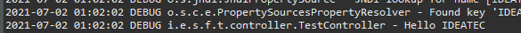

   아까와 같은 결과를 출력하는 걸 확인할 수 있습니다. <br>

   ***

## 스프링 부트에서 프로퍼티 파일 설정 및 사용

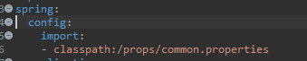

부트에서는 더욱 간단하게 설정할 수 있습니다. <br>
application.properties 혹은 application.yml 파일에서 spring.config.import로 프로퍼티 파일들을 import 해주면 됩니다. <br>

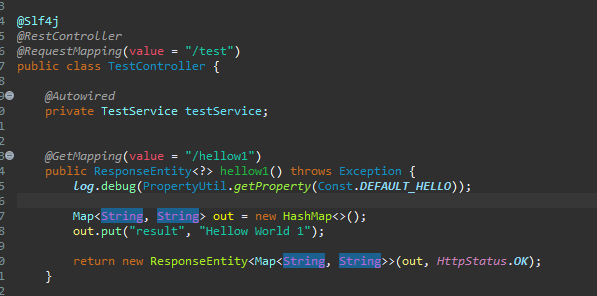
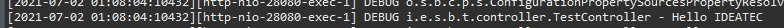

스프링에서와 같은 구현체를 사용해서 같은 동작을 하는 코드를 작성했습니다. <br>
역시 잘 작동하는 것을 확인할 수 있습니다. <br>

---

```
     # 추가

     context.xml 에서 프로퍼티 파일 경로를 지정할 때, 위에서 언급한 <context:property-placeholder location="path"/> 방식이 아닌
     <util:properties id="id" location="path"/> 방식의 <util:properties> 태그를 사용하는 방법도 있습니다.
     이때 설정 값을 사용하기 위해서는 ${키 값} 의 형식이 아닌 #{빈 id['키 값']} 의 형식을 사용해야만 값을 불러 올 수 있습니다.

```

## 추가

1. **Property 파일 위치 옮기기**

프로퍼티 파일의 위치를 classpath 하위가 아닌 다른 곳으로 옮기는 방법에 대해 알아보겠습니다. <br>

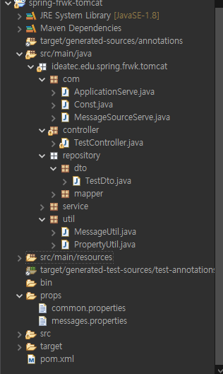

위와 같이 프로퍼티 파일들을 classpath하위가 아닌 폴더 하위로 옮겼습니다. <br>
이 경우, 이와 맞게 적용된 path들을 파일 path로 바꿔주면 됩니다. <br>

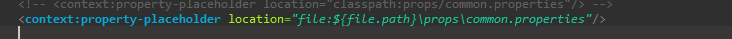
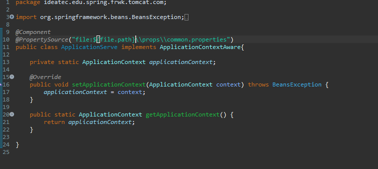

file path의 경로를 jvm argument에 file.path라는 값으로 저장한 후, 프로퍼티 파일의 위치를 파일 path에 맞게 변경했습니다. <br>

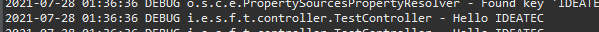

변경 후, 위와 같은 코드를 실행했을 때 같은 값이 출력되는 것을 확인하실 수 있습니다. <br><br>

**부트에서 파일 위치 옮기기**

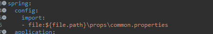
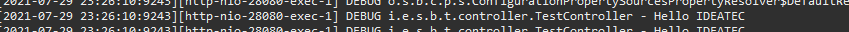

부트에서도 같은 방식으로 변경했고 이상 없이 작동하는 것을 확인할 수 있습니다. <br><br>

2. **@Value 어노테이션 default값 설정하기**

@Value 어노테이션 사용 시, default값을 주기 위해선 ${프로퍼티 키 값:디폴트 값} 형식으로 키 값 다음에 ":디폴트 값" 으로 넣어주면 키 값으로 찾지 못할 경우 디폴트 값을 주입해줍니다. <br>

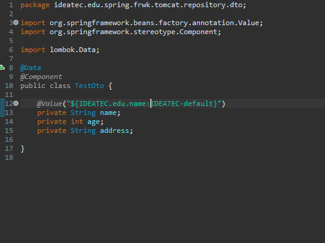

TestDto의 name변수에 IDEATEC.edu.name으로 값을 주입했고 값이 없을 경우 IDEATEC-default란 값을 기본값으로 넣어주었습니다. <br>

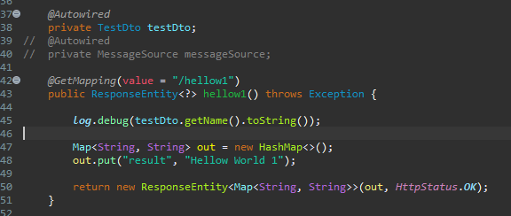

그 후 testDto를 주입받고 getName()으로 아까 설정한 값이 잘 나오나 테스트 해보는 코드 입니다. <br>

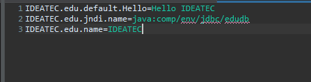


설정이 있을 경우 설정된 값이 출력되고, <br>


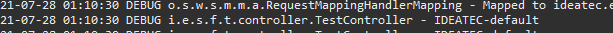

설정된 값이 없는 경우 기본값인 IDEATEC-default가 출력되는 것을 확인할 수 있습니다. <br><br>

3. **프로퍼티 파일을 이용해 List와 Map 값 주입**

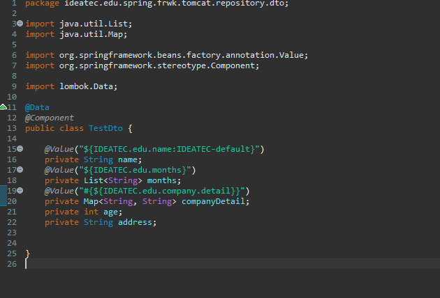

@Value 어노테이션을 이용해서 List와 Map 값을 주입하기 위한 설정입니다. <br>
months의 타입을 List<String>으로 선언하고 @Value어노테이션을 사용했습니다. 특별히 다른 형태를 띄진 않습니다. <br>
하지만 Map의 경우 #{}안에 프로퍼티 값을 넣는 다른 형태를 취했습니다. <br>

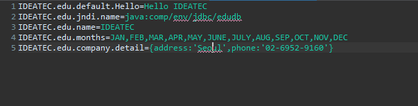

프로퍼티 파일의 모습입니다. List의 경우 ","를 구분자로 여러 값을 나열했고, Map의 경우, 중괄호 안에 {키값:'밸류'} 형식으로 들어가 있습니다.<br>

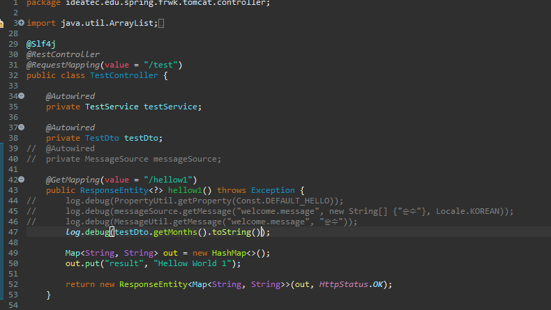
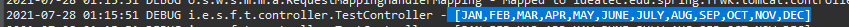

List의 실행 코드와 결과 값 입니다.<br>


Map의 실행 코드와 결과 값 입니다.<br>

---

#### 참고자료

&nbsp; - https://sgc109.github.io/2020/07/06/spring-properties/ <br>
&nbsp; - https://oingdaddy.tistory.com/67 <br>
&nbsp; - https://cornswrold.tistory.com/95 <br>
&nbsp; - https://cornswrold.tistory.com/95 <br>
