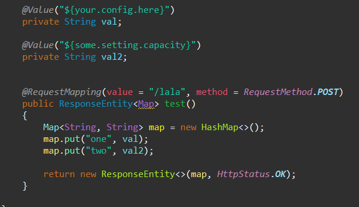

# Spring, Spring Boot에서 properties 파일 읽기
 

 
 

 
우선 resource 폴더 아래에 config 폴더와 properties 파일을 생성해주었다.
 
 

 
 
@PropertySource 어노테이션에 .properties 파일 주소를 입력하여 읽어오면 자동으로 Environment 객체에 주입된다. 
 
이 어노테이션은 @Configuration 과 같이 사용된다.
 
 

 
이렇게 Environment 객체에 주입된 값들은 @Autowired로 주입받은 클래스에서 .getProperty("key") 메소드를 통해서 값을 가져올 수 있다.
 
 

 
[결과]
 
 

 
이번에는 classPath가 아닌 project 바로 밑에 config 폴더와 properties를 생성했다.
 
 

 
servlet-context.xml에서 util:properties 태그로 properties 파일을 읽은 뒤, context:property-placeholder 태그에서 참조하면 @Value 어노테이션으로 값을 읽어올 수 있다.
 
prop_path는 vm arguments에 절대경로로 설정했다.
 
이 때 util 태그를 사용하기 위해 beans 태그에 xmlns:util="http://www.springframework.org/schema/util", http://www.springframework.org/schema/util http://www.springframework.org/schema/util/spring-util-4.3.xsd 를 추가해야 한다.
 
 

 
@Value 태그에 key 값을 입력하여 value를 받아오는 부분
 
 

 
결과가 역시 똑같이 출력된다.
 
 

