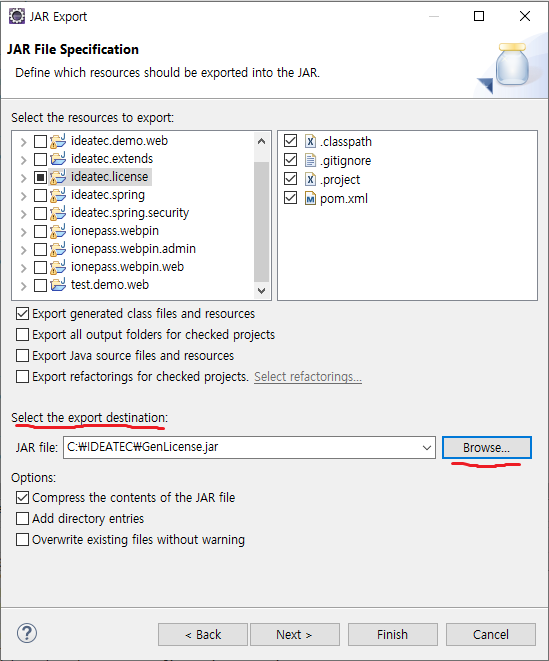
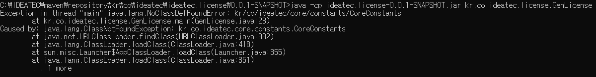

# jar 파일 build 

## 1. jar 파일과 war 파일
JAR (Java Archive) WAR (Web Application Archive) 모두 JAVA의 jar 툴을 이용하여 생성된 압축(아카이브) 파일이며 어플리케이션을 쉽게 배포하고 동작시킬 수 있도록 있도록 관련 파일(리소스, 속성파일 등)들을 패키징해주는 것이 주 역할입니다.
<br>

Maven 등을 통해 내려받는 라이브러리들은 CLASS 파일들이 묶인 jar파일로 구성되어 있는 것을 확인 하실 수 있습니다. 그리고 서비스 배포시에는 프로젝트를 WAR 포맷으로 묶어서 /webapps 등의 지정된 경로에 넣고 Tomcat 등의 웹 컨테이너(Web Contaioner)를 이용하여  deploy하는 식으로 서비스를 올립니다.
<br>

### jar 파일
.jar 확장자 파일에는 Class와 같은 Java 리소스와 속성 파일,  라이브러리 및 액세서리 파일이 포함되어 있습니다. 
쉽게 JAVA 어플리케이션이 동작할 수 있도록 자바 프로젝트를 압축한 파일입니다.<br>
JAR 파일은 원하는 구조로 구성이 가능하며 JDK(Java Development Kit)에 포함하고 있는 JRE(Java Runtime Environment)만 가지고도 실행이 가능합니다.

<br><br>

### war 파일
.war 확장자 파일은  servlet / jsp 컨테이너에 배치 할 수 있는 웹 어플리케이션(Web Application) 압축 파일 포맷입니다.  JSP,  SERVLET, JAR, CLASS, XML, HTML, JAVASCRIPT 등  Servlet Context 관련 파일들로 패키징 되어있습니다.
<br>
원하는 구성을 할 수 있는 JAR 포맷과 달리 WAR은 WEB-INF 및 META-INF 디렉토리로 사전 정의 된 구조를 사용하며 WAR파일을 실행하려면 Tomcat, Weblogic, Websphere 등의 웹 서버 (WEB)또는 웹 컨테이너(WAS)가 필요합니다.
<br><br>

## 2. jar 파일 생성

### export로 jar 파일 생성

먼저 jar로 만들 project를 우클릭해서 Export 항목을 클릭합니다.<br>

<br>
그럼 아래와 같이 나오는데 JAVA클릭 후 JAR file 선택하고 Next눌러줍니다.<br>

<br>
그러면 어떤 프로젝트 내보낼지 선택하는 화면이 나오는데 처음 프로젝트 선택시 맞게 했다면 'Select the export destination' 부분의 내보내기 경로만 설정하면 됩니다.
<br>

<br>
다음은 옵션 부분 추가 선택인데 크게 중요하지 않으므로 Next 눌러줍니다.
<br>

<br>
마지막으로 메인 클래스를 선택해주면 됩니다.
<br>

<br>

<br>
해당 경로에 가보면 .jar 파일이 생성되어 있습니다.
<br>

<br>
해당 .jar파일 압축을 풀고 해당 폴더에 들어가 보면 META-INF 폴더가 보일것입니다.
<br>

<br>
META-INF 폴더 안에 보면 MENIFEST.MF 파일이 있습니다.
<br>

<br>
파일을 열어보면 실행할 main class 경로가 나와 있습니다.
<br>

<br>
cmd 창에서 'java -jar [.jar파일]'으로 직접 실행 해보면 다른 프로젝트의 클래스를 못찾는다는 에러가 발생할 것입니다.
<br>

<br>
즉, export로 .jar 파일을 만들 때 pom.xml에서 설정한 dependancy는 해당 jar파일에 함께 묶이지 않습니다.


### maven build로 jar 파일 생성 

먼저 jar로 만들 project를 우클릭해서 Run As -> Run Configurations.. 를 클릭합니다.
<br>

<br>
다음 Maven Build의 해당 프로젝트를 클릭하고 Goals에 'clean install'을 입력해줍니다. 
<br>

<br>
maven build가 되고 jar 파일이 생성 됩니다.
<br>

<br>
해당 경로에 가보면 .jar 파일이 생성되어 있습니다.
<br>

<br>
해당 .jar파일 압축을 풀고 해당 폴더에 들어가 보면 META-INF 폴더가 보일것입니다.
<br>

 <br>
META-INF 폴더 안에 보면 MENIFEST.MF 파일이 있습니다.
<br>

<br>
파일을 열어보면 export로 jar 파일을 생성했을때와 달리 실행할 main class 경로가 없습니다.
<br>

<br>
cmd 창에서 'java -jar [.jar파일]'명령어로 해당 .jar 파일을 실행해보면 다음과 같이 에러가 납니다.
<br>

<br>
그래서 java -cp [.jar파일] [실행할 클래스 경로] 실행할 main class 경로를 입력하고 실행하면 아까의 에러는 해결됐지만 이번에는 다른 프로젝트의 클래스를 찾을 수 없다는 에러가 발생합니다.
<br>

<br><br>

### Maven Library 추출

export로 jar 파일을 생성하면 실행할 main class 경로가 설정되어 있지만 maven library들은 함께 묶이지 않습니다.
<br>
maven build로 jar 파일을 생성하면 main class 경로도 미설정 되어 있고 library도 함께 묶이지 않습니다. 
<br>
그래서 dependancy를 추출해서 따로 저장하여 경로를 추가시켜 실행하는 방법이 있다.
<br><br>

그래서 해당 프로젝트 우클릭해서 Run As -> Run Configurations 에서 Maven Build 의 해당프로젝트를 우클릭해서 duplicate 해줍니다.
<br>

<br>
그럼 해당 프로젝트에 대한 maven build가 하나 더 생성된 것을 확인할 수 있습니다. 그리고 Goals는 'dependency:copy-dependencies'를 입력하고 Run 해줍니다.
<br>

<br>
그럼 console 창에 다음과 같이 BUILD SUCCESS가 나타납니다.
<br>

<br>
해당 프로젝트의 target 디렉토리에 가보면 dependancy 폴더가 생성되어 있고 그 안에 maven library들이 추출되어 있습니다.
<br>

<br>
다시 cmd 창에서 jar 파일을 실행하는데 이번에는 추출한 maven library도 포함해서 실행해봅니다.<br>
실행하기 전에 아까전에 만들었던 .jar 파일을 dependancy 폴더가 있는 target 폴더로 옮기고나서<br>
java -cp "[.jar 파일];dependency/*" [실행할 main class 경로] 입력하면 실행이 됩니다.
<br>

<br><br>

### maven library 포함하여 Jar 파일 생성

위의 방법도 있고 아예 dependancy를 추가해서 jar 파일을 생성할 수 있습니다.
<br>
pom.xml 파일에 아래와 같이 Assembly 플러그인 내용을 추가합니다.

```
      <plugin>
        <groupId>org.apache.maven.plugins</groupId>
        <artifactId>maven-assembly-plugin</artifactId>
        <version>2.2.1</version>
        <configuration>
          <descriptorRefs>
            <descriptorRef>jar-with-dependencies</descriptorRef>
          </descriptorRefs>
        </configuration>
      </plugin>
```
<br>
아까와 같이 해당 프로젝트 우클릭해서 Run As -> Run Configurations 에서 Maven Build 의 해당프로젝트를 우클릭해서 duplicate 하면 해당 프로젝트에 대한 maven build가 하나 더 생성된 것을 확인할 수 있습니다. 그리고 Goals는 'assembly:assembly'를 입력하고 Run 해줍니다.
<br>

<br>
그러면 target 폴더에 -jar-with-dependencies 이름으로 dependency가 포함된 Jar 파일이 생성이 됩니다.

<br>
cmd 창에서 jar 파일이 만들어진 폴더로 이동 후 java -cp [.jar 파일] [실행할 class 경로]를 입력해보면 바로 실행이 됩니다.
<br>

<br><br>

jar 파일이 다른 프로젝트에 적용될 때도 마찬가지로 적용되는 프로젝트에 해당 jar 파일에 쓰여지는 library 들이 포함되어 있지 않으면 에러가 발생하므로 적용되는 프로젝트에 해당 library들이 build 되어 있어야 합니다.


