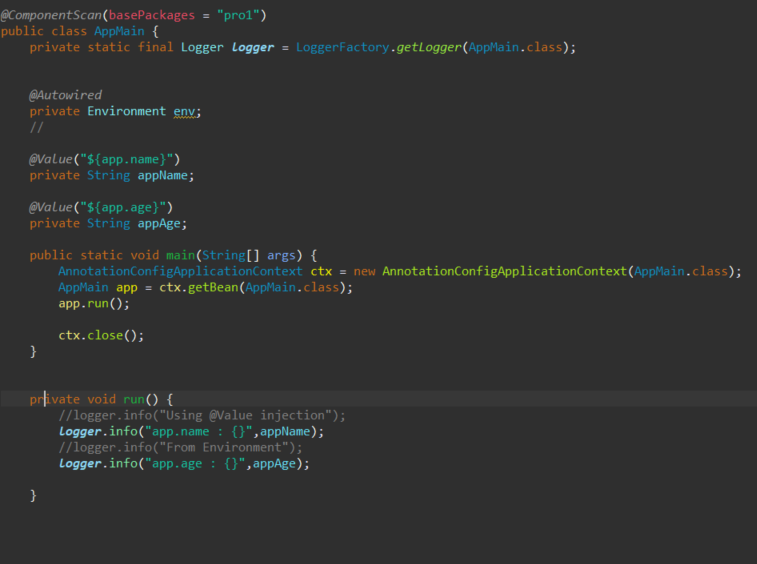
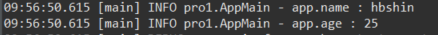

## Spring properties 파일 읽어오기

- 먼저 resources아래 properties파일을 생성합니다.

- 읽어오기를 원하는 문구를 properties 파일에 입력합니다.

 

- 그 다음 properties 파일을 읽기위해 configuration과 PropertySource어노테이션 사용

- propertySource 어노테이션으로 인해 자동으로 Environment 객체에 주입 
- AnnotationConfigApplicationContext 를 통해 java클래스를 읽어들여 IOC와 DI를 적용
- AppMain타입의 자바빈을 app변수에 담고 run 메서드를 통해 로그로 출력 

- 로그를 통해 properties에 입력한 값이 정상적으로 출력되는것을 확인.

## Spring boot properties 파일 읽어오기

- spring과 비슷한 전계로 boot에서는 yml 파일생성 및 원하는 값 입력

- spring과 비슷하게 configuration 어노테이션과 boot에서는 configurationProperties어노테이션을 사용하여 yml 파일에 있는 property를 자바 클래스에 값을 가져와서 사용할 수 있게 한다.

- boot에서는 test클래스를 통해 PropCom에 있는 정보를 자동주입하여 테스트코드 작성을 쉽게
도와주는 AssrtJ 라이브러리를 통해 yml에 입력한 값을 출력

- 로그를 통해 "My name is heebum" 이 정상적으로 출력되는것을 확인.

