# jenkins로 Maven 프로젝트 자동 빌드, 배포 환경 구축하기

## 1. jenkins란?

### Build란?
빌드는 서버에 올릴 수 있는 상태로 만드는 것을 말한다.<br>
(서버에 올려서 사용자가 사용할 수 있게 하는 것을 배포(deploy))
<br>

### jenkins란?
빌드를 자동화 해주는 툴을 말한다.<br>
즉, jenkins는 빌드를 자동화 시키기 위해 사용한다.<br><br>

대표적인 기능으로는 첫번째로 대쉬보드를 제공한다. 여러가지 배포 작업의 상황을 모니터링할 수 있다.
<br>
두번째로는 배포 스크립트를 실행한다. 배포 스크립트를 개발자 로컬에서도 실행할 수 있는데 젠킨스 프로그램을 띄워놓으면 스케쥴링을 해준다.
<br><br>

## 2. jenkins 설치

jenkins를 설치하려면 기존에 java(jenkins는 2.54 버전부터 자바8 사용)와 tomcat(jenkins war 파일 톰캣에 배포해 실행하려면)가 설치되어 있어야 한다.
<br>
이제 설치를 위해 [jekins다운로드](https://www.jenkins.io/download/) 페이지로 접속해서 안정 버전의 'Past Releases'를 클릭합니다.
<br>

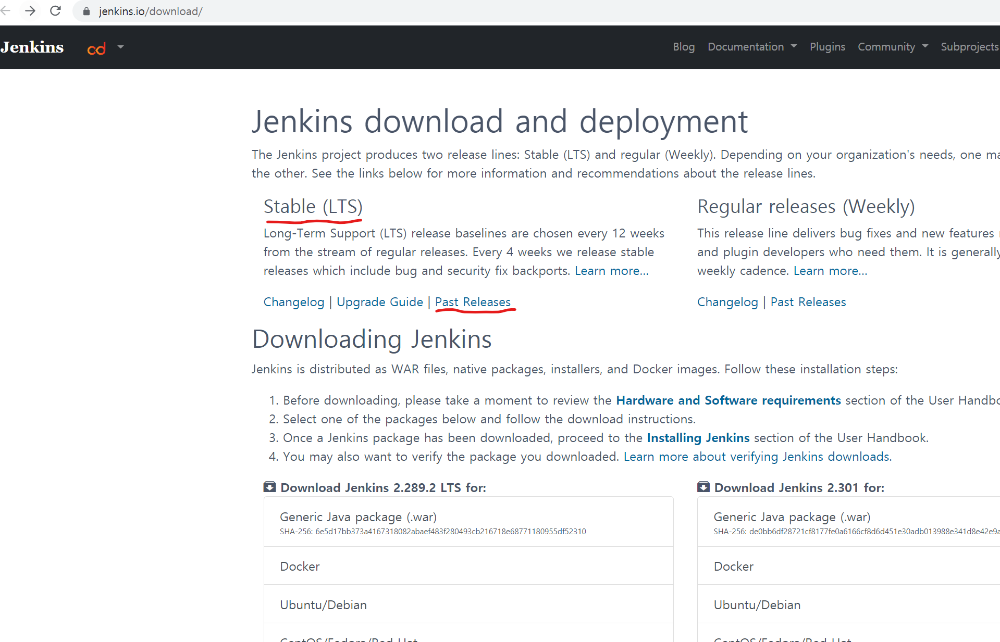
<br>

최신버전을 클릭합니다.
<br>


<br>

war 파일을 우클릭해 링크 주소 복사를 합니다.
<br>

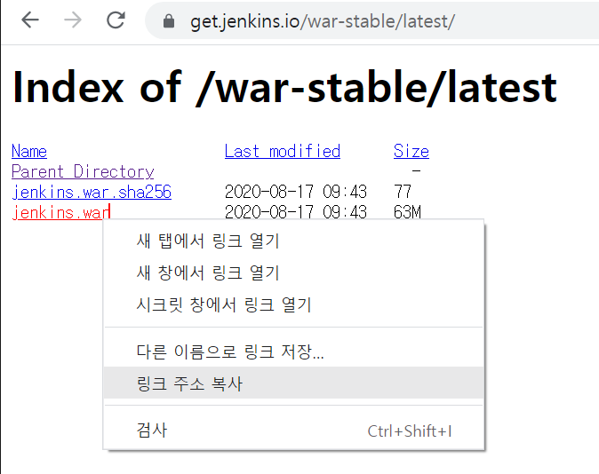
<br>

이제 설치하고자 하는 디렉토리로 이동해 wget 명령어를 이용해 설치를 진행한다.<br>
그런데 톰캣을 통해 실행하고자 하려면 기존의 톰캣 디렉토리를 하나 복사하고 복사한 톰캣 디렉토리 안에 webapps 디렉토리에서 설치를 진행한다.
<br>

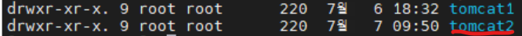
<br>

```
# cd 복사한톰캣홈디렉토리/webapps
# wget https://get.jenkins.io/war-stable/latest/jenkins.war (복사한 링크 주소)
```
<br>

wget으로 설치를 하고 해당 디렉토리에서 확인해보면 .war 파일이 생성되어 있다.
<br>

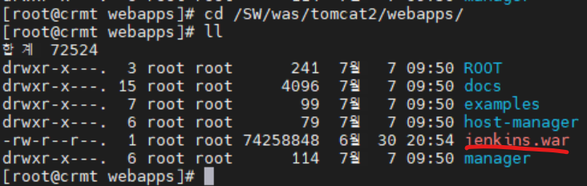
<br><br>

다음엔 복사한톰캣홈디렉토리/conf의 server.xml파일을 열어 포트를 변경해준다.(기존 톰캣서버 포트와 충돌)
<br>

```
# nano 복사한톰캣홈디렉토리/conf/server.xml
```

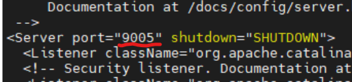
<br>

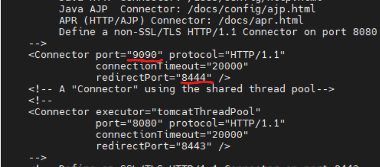
<br>

이제 변경한 9090 포트의 방화벽을 열어 줍니다.

```
# firewall-cmd --permanent --add-port=9090/tcp
# firewall-cmd --reload
```
<br>

복사한톰캣홈디렉토리/bin 으로 이동해 톰캣서버를 기동시켜주고 나면 webapps 폴더에 war 파일이 압축이 풀리고 jenkins 디렉토리가 생성되어 있는 것을 볼 수 있다.

```
# cd /복사한톰캣홈디렉토리/bin
# ./startup.sh
```

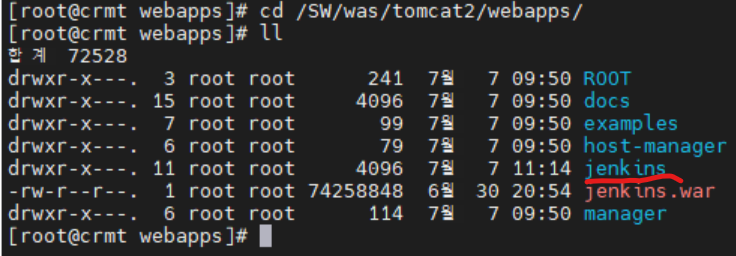
<br>

이제 웹브라우저에서 http://서버아이피:지정한포트/jenkins 로 접속을 해봅니다.
<br>

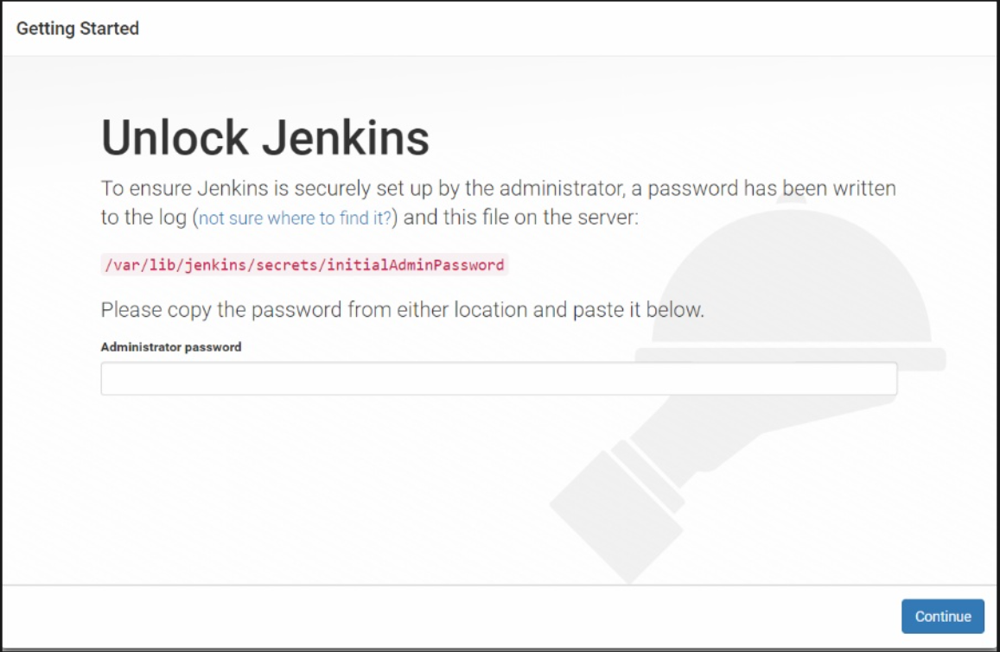
<br>

초기 비밀번호는 '/var/lib/jenkins/secrets/initialAdminPassword에 있다고 안내가 나온다.<br>
cat /var/lib/jenkins/secrets/initialAdminPassword 로 열어보면 비밀번호가 나온다. 복사해서 밑에 입력해주면 로그인이 된다. 그럼 다음과 같은 화면이 나온다.
<br>

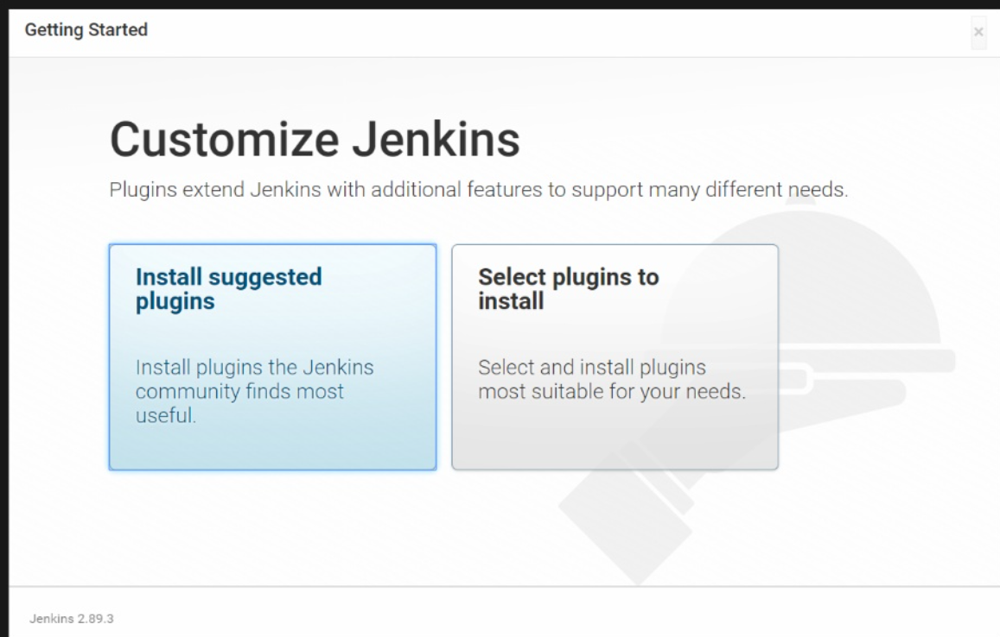
<br>

'Install suggested plugins'를 클릭해 기본 플러그인들을 설치한다.
<br>

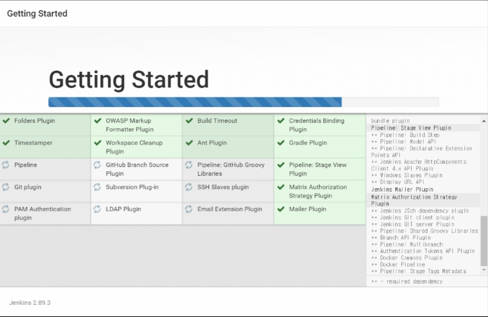
<br>

설치가 완료되면 계정 설정을 해준다.
<br>

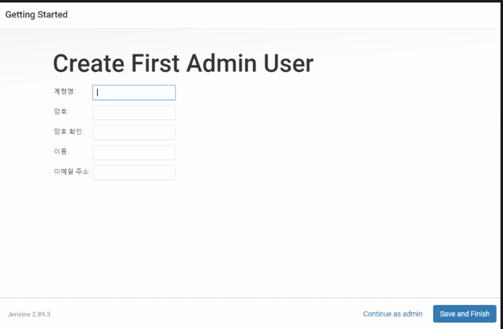
<br>

계정설정을 완료하면 다음과 같은 jenkins 기본 화면이 나오면 끝이다.
<br>

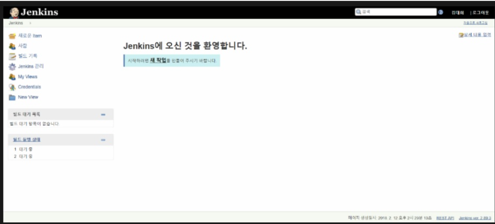
<br><br>

## 3. jenkins 설정


