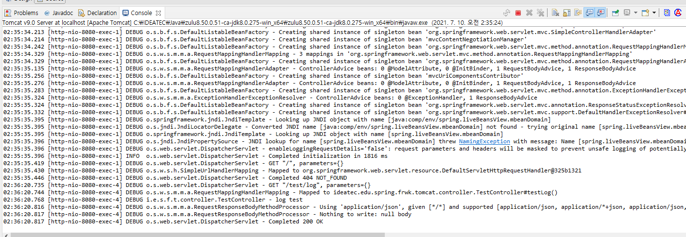
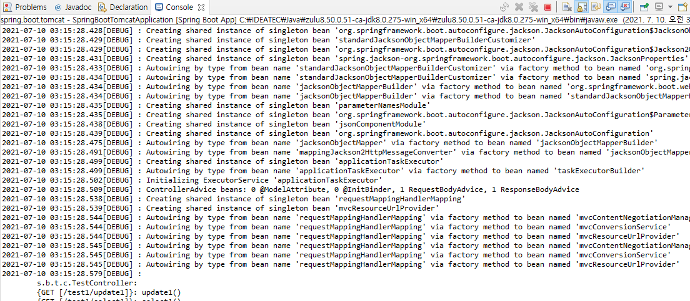

# Spring Logback 설정

## 1. 스프링 프레임 워크 logback

### logback 이란

기존 log를 관리하기 위한 구현체로써 log4j가 사용되었다. 그러나 보다 안정성이 높고 편리하게 log를 관리하기 위해 Logging framework인 Slf4j(Simple Logging Façade for Java)와 그 구현체로써 Logback이 고안되었다.
<br>
Slf4j는 일명 Façade  패턴으로, 이를 사용하면 구현체의 종류와 상관없이 일관된 로깅 코드를 작성할 수 있으며 구현체를 변경할 경우에도 최소한의 수정으로 교체가 가능하다. 이에 맞춘 Logback은 log4j의 후속 버전으로 만든 Logging 라이브러리이다. Logback은 springboot의 기본 Logging framework로 사용될만큼 범용적이고 다양한 기능을 가지고 있다.
<br><br>

### logback 구조

Logback을 사용하기 위해서는 다음과 같은 tag들로 구성되어있다.
<br>
Logger : 로그의 주체, 로그의 메시지 전달, 특정 패키지 안의 특정 레벨이상인 것에 대해 출력<br>
Appender : 어디에 출력할지에 대해 기술 - console / file / DB appender<br>
Encoder : 어떻게 출력할지에 대해 기술
<br><br>

### logback 환경설정(pom.xml)

Logback을 사용하기 위해선 pom.xml에 다음과 같은 라이브러리를 추가로 설정해주어야 한다.
<br>

```
<dependency>
<groupId>org.slf4j</groupId>
<artifactId>slf4j-api</artifactId>
<version>${slf4j.version}</version>
</dependency>

<dependency>
<groupId>ch.qos.logback</groupId>
<artifactId>logback-classic</artifactId>
<version>${logback.version}</version>
</dependency>

```
<br><br>

### logback 설정

src/main/resources 하단에 logback.xml 파일을 생성한 후 다음과 같이 Logback을 설정할 수 있다.
<br>
선택한 log 이외의 정보들에 대해서는 <root>로 설정해주도록 한다. log관리에 있어서 else와 같은 기능을 한다.
<br>

```
<?xml version="1.0" encoding="UTF-8"?>
<configuration scan="true" scanPeriod="30 seconds">
  <appender name="console" class="ch.qos.logback.core.ConsoleAppender">
    <encoder class="ch.qos.logback.classic.encoder.PatternLayoutEncoder">
      <pattern>[%d{HH:mm:ss.SSS}][%-5level][%logger{36}.%method:line%line] - %msg%n</pattern>
    </encoder>
  </appender>

  <logger name="org.springframework" level="info" additivity="false">
    <appender-ref ref="console" />
  </logger>

  <root level="debug">
    <appender-ref ref="CONSOLE"/>
  </root>
</configuration>
```
<br>

### logback 사용

og를 출력할 java 파일에서는 다음 예시와 같이 사용하면 된다.
<br>

```
import org.slf4j.Logger;
import org.slf4j.LoggerFactory;
public class SampleLogTest {
  private static final Logger log = LoggerFactory.getLogger(SampleLogTest.class);
  public void testLog() {
    log.debug("log test");
  }
}
```
<br>


<br><br>


## 2. 스프링부트 logback

Spring Boot는 logback이 기본으로 설정되어 있어서 별도로 라이브러리를 추가하지 않아도 됩니다.
<br>
spring-boot-starter-web 안에 spring-boot-starter-logging 구현체가 있습니다.
<br>
src/main/resources/ 아래에 위치한다. Spring boot 에서는 logback.xml로 설정하면 스프링 부트에대한 설정전에 로그백 설정이 되므로 제어 할 수가 없다.
<br>
따라서 logback-spring.xml을 이용하던지 property의 logging.config = classpath:logback-${spring.profiles.active}.xml을 통해 각 프로파일별로 logback 설정파일을 관리하도록 한다.

### logback 설정

application.properties 파일에 다음을 설정해 준다.
<br>
```
#logback
spring.profiles.active=local
logging.config=classpath:logback-${spring.profiles.active}.xml
```
<br>

경로에 맞게 logback-local.xml 파일을 만들어 준다.
<br>

```
<?xml version="1.0" encoding="UTF-8"?>
<configuration scan="true" scanPeriod="30 seconds">
    <appender name="STDOUT" class="ch.qos.logback.core.ConsoleAppender">
        <encoder>
            <pattern>%d{yyyy-MM-dd HH:mm:ss.SSS}[%-5level] : %msg%n</pattern>
        </encoder>
    </appender>
    <appender name="ROLLING" class="ch.qos.logback.core.rolling.RollingFileAppender">
        <filter class="ch.qos.logback.classic.filter.ThresholdFilter">
            <level>INFO</level>
        </filter>
        <file>mylog.txt</file>
        <rollingPolicy class="ch.qos.logback.core.rolling.TimeBasedRollingPolicy">
            <!-- rollover daily -->
            <fileNamePattern>mylog-%d{yyyy-MM-dd}.%i.txt</fileNamePattern>
            <timeBasedFileNamingAndTriggeringPolicy
                    class="ch.qos.logback.core.rolling.SizeAndTimeBasedFNATP">
                <!-- or whenever the file size reaches 100MB -->
                <maxFileSize>100MB</maxFileSize>
            </timeBasedFileNamingAndTriggeringPolicy>
        </rollingPolicy>
        <encoder>
            <pattern>[%-5level] %d{HH:mm:ss.SSS} %logger{36} - %msg%n</pattern>
        </encoder>
    </appender>
    <root level="debug">
        <appender-ref ref="STDOUT"/>
        <appender-ref ref="ROLLING"/>
    </root>
</configuration>
```

<br>



