# Spring Logback 설정

## 1. 스프링 프레임 워크 logback

### logback 이란

기존 log를 관리하기 위한 구현체로써 log4j가 사용되었다. 그러나 보다 안정성이 높고 편리하게 log를 관리하기 위해 Logging framework인 Slf4j(Simple Logging Façade for Java)와 그 구현체로써 Logback이 고안되었다.
<br>
Slf4j는 일명 Façade  패턴으로, 이를 사용하면 구현체의 종류와 상관없이 일관된 로깅 코드를 작성할 수 있으며 구현체를 변경할 경우에도 최소한의 수정으로 교체가 가능하다. 이에 맞춘 Logback은 log4j의 후속 버전으로 만든 Logging 라이브러리이다. Logback은 springboot의 기본 Logging framework로 사용될만큼 범용적이고 다양한 기능을 가지고 있다.
<br><br>

### logback 구조

Logback을 사용하기 위해서는 다음과 같은 tag들로 구성되어있다.
<br>
Logger : 로그의 주체, 로그의 메시지 전달, 특정 패키지 안의 특정 레벨이상인 것에 대해 출력<br>
Appender : 어디에 출력할지에 대해 기술 - console / file / DB appender<br>
Encoder : 어떻게 출력할지에 대해 기술
<br><br>

### logback 환경설정(pom.xml)

Logback을 사용하기 위해선 pom.xml에 다음과 같은 라이브러리를 추가로 설정해주어야 한다.
<br>

```
<dependency>
<groupId>org.slf4j</groupId>
<artifactId>slf4j-api</artifactId>
<version>${slf4j.version}</version>
</dependency>

<dependency>
<groupId>ch.qos.logback</groupId>
<artifactId>logback-classic</artifactId>
<version>${logback.version}</version>
</dependency>

```
<br><br>

### logback 설정

src/main/resources 하단에 logback.xml 파일을 생성한 후 다음과 같이 Logback을 설정할 수 있다.
<br>
선택한 log 이외의 정보들에 대해서는 <root>로 설정해주도록 한다. log관리에 있어서 else와 같은 기능을 한다.
<br>

```
<?xml version="1.0" encoding="UTF-8"?>
<configuration scan="true" scanPeriod="30 seconds">
  <appender name="console" class="ch.qos.logback.core.ConsoleAppender">
    <encoder class="ch.qos.logback.classic.encoder.PatternLayoutEncoder">
      <pattern>[%d{HH:mm:ss.SSS}][%-5level][%logger{36}.%method:line%line] - %msg%n</pattern>
    </encoder>
  </appender>

  <logger name="org.springframework" level="info" additivity="false">
    <appender-ref ref="console" />
  </logger>

  <root level="debug">
    <appender-ref ref="CONSOLE"/>
  </root>
</configuration>
```
<br>

### logback 사용

og를 출력할 java 파일에서는 다음 예시와 같이 사용하면 된다.
<br>

```
import org.slf4j.Logger;
import org.slf4j.LoggerFactory;
public class SampleLogTest {
  private static final Logger log = LoggerFactory.getLogger(SampleLogTest.class);
  public void testLog() {
    log.debug("log test");
  }
}
```
<br>


<br><br>


## 2. 스프링부트 logback

Spring Boot는 logback이 기본으로 설정되어 있어서 별도로 라이브러리를 추가하지 않아도 됩니다.
<br>
spring-boot-starter-web 안에 spring-boot-starter-logging 구현체가 있습니다.
<br>
src/main/resources/ 아래에 위치한다. Spring boot 에서는 logback.xml로 설정하면 스프링 부트에대한 설정전에 로그백 설정이 되므로 제어 할 수가 없다.
<br>
따라서 logback-spring.xml을 이용하던지 property의 logging.config = classpath:logback-${spring.profiles.active}.xml을 통해 각 프로파일별로 logback 설정파일을 관리하도록 한다.

### logback 설정

application.properties 파일에 다음을 설정해 준다.
<br>
```
#logback
spring.profiles.active=local
logging.config=classpath:logback-${spring.profiles.active}.xml
```
<br>

경로에 맞게 logback-local.xml 파일을 만들어 준다.
<br>

```
<?xml version="1.0" encoding="UTF-8"?>
<configuration scan="true" scanPeriod="30 seconds">
    <appender name="STDOUT" class="ch.qos.logback.core.ConsoleAppender">
        <encoder>
            <pattern>%d{yyyy-MM-dd HH:mm:ss.SSS}[%-5level] : %msg%n</pattern>
        </encoder>
    </appender>
    <appender name="ROLLING" class="ch.qos.logback.core.rolling.RollingFileAppender">
        <filter class="ch.qos.logback.classic.filter.ThresholdFilter">
            <level>INFO</level>
        </filter>
        <file>mylog.txt</file>
        <rollingPolicy class="ch.qos.logback.core.rolling.TimeBasedRollingPolicy">
            <!-- rollover daily -->
            <fileNamePattern>mylog-%d{yyyy-MM-dd}.%i.txt</fileNamePattern>
            <timeBasedFileNamingAndTriggeringPolicy
                    class="ch.qos.logback.core.rolling.SizeAndTimeBasedFNATP">
                <!-- or whenever the file size reaches 100MB -->
                <maxFileSize>100MB</maxFileSize>
            </timeBasedFileNamingAndTriggeringPolicy>
        </rollingPolicy>
        <encoder>
            <pattern>[%-5level] %d{HH:mm:ss.SSS} %logger{36} - %msg%n</pattern>
        </encoder>
    </appender>
    <root level="debug">
        <appender-ref ref="STDOUT"/>
        <appender-ref ref="ROLLING"/>
    </root>
</configuration>
```

<br>


### Build란?
빌드는 서버에 올릴 수 있는 상태로 만드는 것을 말한다.<br>
(서버에 올려서 사용자가 사용할 수 있게 하는 것을 배포(deploy))
<br>

### jenkins란?
빌드를 자동화 해주는 툴을 말한다.<br>
즉, jenkins는 빌드를 자동화 시키기 위해 사용한다.<br><br>

대표적인 기능으로는 첫번째로 대쉬보드를 제공한다. 여러가지 배포 작업의 상황을 모니터링할 수 있다.
<br>
두번째로는 배포 스크립트를 실행한다. 배포 스크립트를 개발자 로컬에서도 실행할 수 있는데 젠킨스 프로그램을 띄워놓으면 스케쥴링을 해준다.
<br><br>

## 2. jenkins 설치

jenkins를 설치하려면 기존에 java(jenkins는 2.54 버전부터 자바8 사용)와 tomcat(jenkins war 파일 톰캣에 배포해 실행하려면)가 설치되어 있어야 한다.
<br>
이제 설치를 위해 [jekins다운로드](https://www.jenkins.io/download/) 페이지로 접속해서 안정 버전의 'Past Releases'를 클릭합니다.
<br>


<br>

최신버전을 클릭합니다.
<br>


<br>

war 파일을 우클릭해 링크 주소 복사를 합니다.
<br>

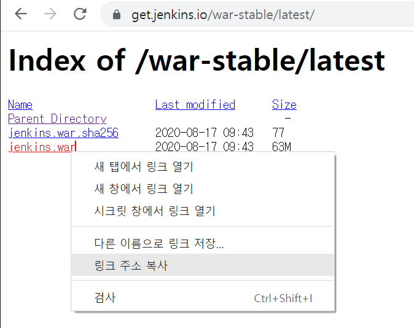
<br>

이제 설치하고자 하는 디렉토리로 이동해 wget 명령어를 이용해 설치를 진행한다.<br>
그런데 톰캣을 통해 실행하고자 하려면 기존의 톰캣 디렉토리를 하나 복사하고 복사한 톰캣 디렉토리 안에 webapps 디렉토리에서 설치를 진행한다.
<br>


<br>

```
# cd 복사한톰캣홈디렉토리/webapps
# wget https://get.jenkins.io/war-stable/latest/jenkins.war (복사한 링크 주소)
```
<br>

wget으로 설치를 하고 해당 디렉토리에서 확인해보면 .war 파일이 생성되어 있다.
<br>

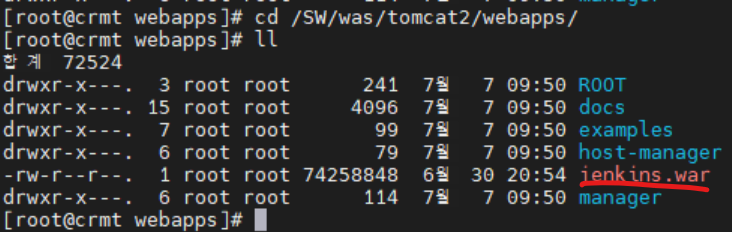
<br>

톰캣을 실행하기 전에 추가로 설정해줘야 할 것이 있다.
<br>
우선 접속 설정을 위해 복사한톰캣디렉토리/conf 의 tomcat-users.xml 에서 다음을 입력해준다.
<br>

```
<role rolename="manager-gui"/>
<role rolename="manager-script"/>
<role rolename="manager-status"/>
<user username="admin" password="1" roles="manager-gui,manager-script,manager-status"/>
<!--
role / user 삽입.
1. manager-gui : 톰캣에서 웹으로 제공하는 서비스 이용시 사용한다.
2. manager-status : "Server Status"페이지 접속시에만 사용한다.
3. manager-script : 스크립트를 이용한 배포시 사용하는 듯 하다.
4. manager-jmx : jmx 사용시 사용한다.
-->
``` 
<br>

다음엔 복사한톰캣홈디렉토리/conf의 server.xml파일을 열어 포트를 변경해준다.(기존 톰캣서버 포트와 충돌)
<br>

```
# nano 복사한톰캣홈디렉토리/conf/server.xml
```


<br>


<br>

이제 변경한 9090 포트의 방화벽을 열어 줍니다.

```
# firewall-cmd --permanent --add-port=9090/tcp
# firewall-cmd --reload
```
<br>

복사한톰캣홈디렉토리/bin 으로 이동해 톰캣서버를 기동시켜주고 나면 webapps 폴더에 war 파일이 압축이 풀리고 jenkins 디렉토리가 생성되어 있는 것을 볼 수 있다.

```
# cd /복사한톰캣홈디렉토리/bin
# ./startup.sh
```

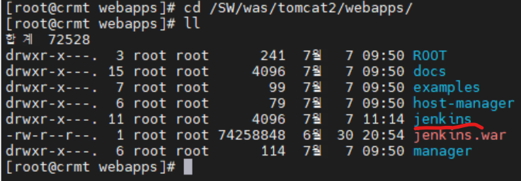
<br>

이제 웹브라우저에서 http://서버아이피:지정한포트/jenkins 로 접속을 해봅니다.
<br>


<br>

초기 비밀번호는 '/var/lib/jenkins/secrets/initialAdminPassword에 있다고 안내가 나온다.<br>
cat /var/lib/jenkins/secrets/initialAdminPassword 로 열어보면 비밀번호가 나온다. 복사해서 밑에 입력해주면 로그인이 된다. 그럼 다음과 같은 화면이 나온다.
<br>


<br>

'Install suggested plugins'를 클릭해 기본 플러그인들을 설치한다.
<br>


<br>

설치가 완료되면 계정 설정을 해준다.
<br>


<br>

계정설정을 완료하면 다음과 같은 jenkins 기본 화면이 나오면 끝이다.
<br>


JAR (Java Archive) WAR (Web Application Archive) 모두 JAVA의 jar 툴을 이용하여 생성된 압축(아카이브) 파일이며 어플리케이션을 쉽게 배포하고 동작시킬 수 있도록 있도록 관련 파일(리소스, 속성파일 등)들을 패키징해주는 것이 주 역할입니다.
<br>

Maven 등을 통해 내려받는 라이브러리들은 CLASS 파일들이 묶인 jar파일로 구성되어 있는 것을 확인 하실 수 있습니다. 그리고 서비스 배포시에는 프로젝트를 WAR 포맷으로 묶어서 /webapps 등의 지정된 경로에 넣고 Tomcat 등의 웹 컨테이너(Web Contaioner)를 이용하여  deploy하는 식으로 서비스를 올립니다.
<br>

### jar 파일
.jar 확장자 파일에는 Class와 같은 Java 리소스와 속성 파일,  라이브러리 및 액세서리 파일이 포함되어 있습니다. 
쉽게 JAVA 어플리케이션이 동작할 수 있도록 자바 프로젝트를 압축한 파일입니다.<br>
JAR 파일은 원하는 구조로 구성이 가능하며 JDK(Java Development Kit)에 포함하고 있는 JRE(Java Runtime Environment)만 가지고도 실행이 가능합니다.

<br><br>

### war 파일
.war 확장자 파일은  servlet / jsp 컨테이너에 배치 할 수 있는 웹 어플리케이션(Web Application) 압축 파일 포맷입니다.  JSP,  SERVLET, JAR, CLASS, XML, HTML, JAVASCRIPT 등  Servlet Context 관련 파일들로 패키징 되어있습니다.
<br>
원하는 구성을 할 수 있는 JAR 포맷과 달리 WAR은 WEB-INF 및 META-INF 디렉토리로 사전 정의 된 구조를 사용하며 WAR파일을 실행하려면 Tomcat, Weblogic, Websphere 등의 웹 서버 (WEB)또는 웹 컨테이너(WAS)가 필요합니다.
<br><br>

## 2. jar 파일 생성

### export로 jar 파일 생성

먼저 jar로 만들 project를 우클릭해서 Export 항목을 클릭합니다.<br>
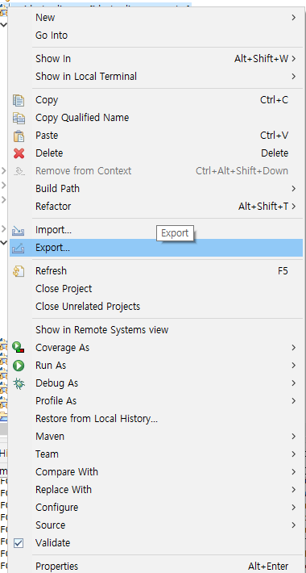
<br>
그럼 아래와 같이 나오는데 JAVA클릭 후 JAR file 선택하고 Next눌러줍니다.<br>

<br>
그러면 어떤 프로젝트 내보낼지 선택하는 화면이 나오는데 처음 프로젝트 선택시 맞게 했다면 'Select the export destination' 부분의 내보내기 경로만 설정하면 됩니다.
<br>

<br>
다음은 옵션 부분 추가 선택인데 크게 중요하지 않으므로 Next 눌러줍니다.
<br>

<br>
마지막으로 메인 클래스를 선택해주면 됩니다.
<br>
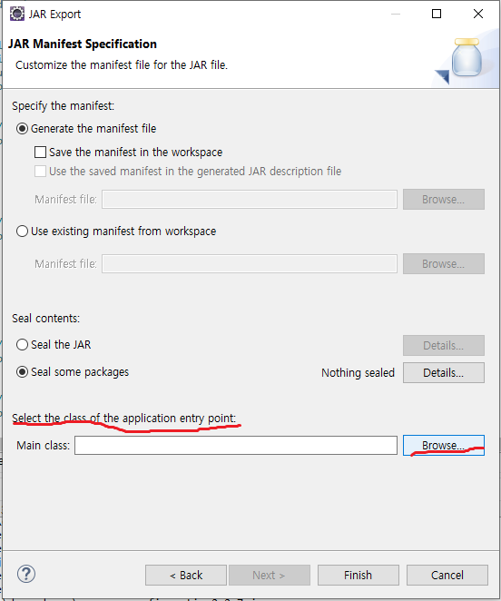
<br>

<br>
해당 경로에 가보면 .jar 파일이 생성되어 있습니다.
<br>
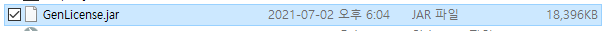
<br>
해당 .jar파일 압축을 풀고 해당 폴더에 들어가 보면 META-INF 폴더가 보일것입니다.
<br>

<br>
META-INF 폴더 안에 보면 MENIFEST.MF 파일이 있습니다.
<br>

<br>
파일을 열어보면 실행할 main class 경로가 나와 있습니다.
<br>
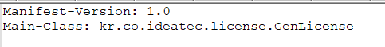
<br>
cmd 창에서 'java -jar [.jar파일]'으로 직접 실행 해보면 다른 프로젝트의 클래스를 못찾는다는 에러가 발생할 것입니다.
<br>

<br>
즉, export로 .jar 파일을 만들 때 pom.xml에서 설정한 dependancy는 해당 jar파일에 함께 묶이지 않습니다.


### maven build로 jar 파일 생성 

먼저 jar로 만들 project를 우클릭해서 Run As -> Run Configurations.. 를 클릭합니다.
<br>

<br>
다음 Maven Build의 해당 프로젝트를 클릭하고 Goals에 'clean install'을 입력해줍니다. 
<br>
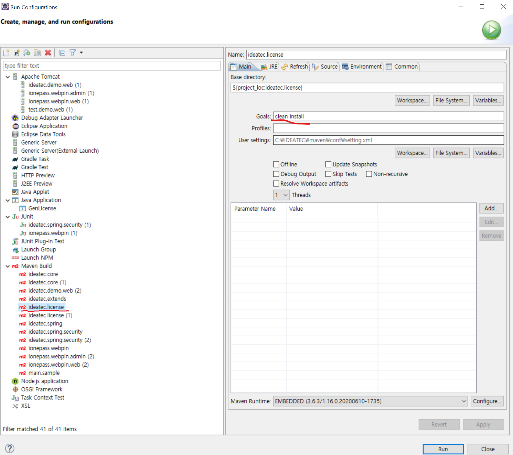
<br>
maven build가 되고 jar 파일이 생성 됩니다.
<br>
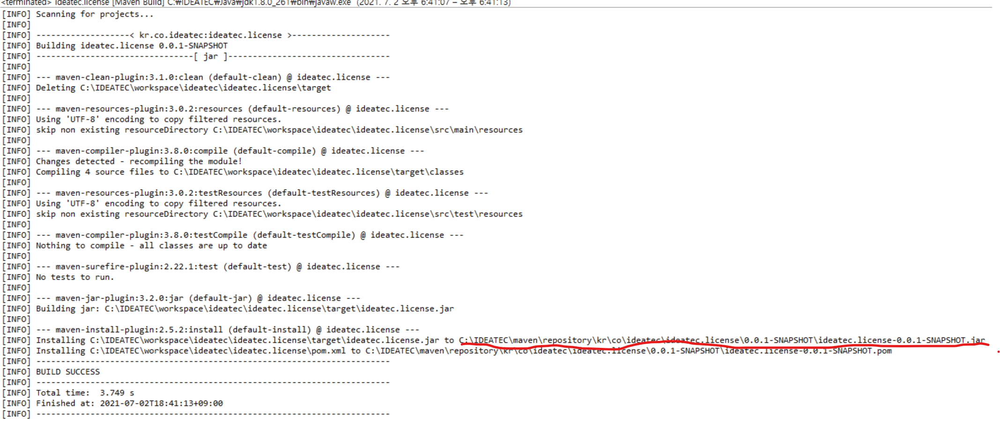
<br>
해당 경로에 가보면 .jar 파일이 생성되어 있습니다.
<br>

<br>
해당 .jar파일 압축을 풀고 해당 폴더에 들어가 보면 META-INF 폴더가 보일것입니다.
<br>
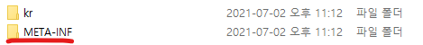
 <br>
META-INF 폴더 안에 보면 MENIFEST.MF 파일이 있습니다.
<br>

<br>
파일을 열어보면 export로 jar 파일을 생성했을때와 달리 실행할 main class 경로가 없습니다.
<br>
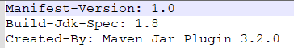
<br>
cmd 창에서 'java -jar [.jar파일]'명령어로 해당 .jar 파일을 실행해보면 다음과 같이 에러가 납니다.
<br>

<br>
그래서 java -cp [.jar파일] [실행할 클래스 경로] 실행할 main class 경로를 입력하고 실행하면 아까의 에러는 해결됐지만 이번에는 다른 프로젝트의 클래스를 찾을 수 없다는 에러가 발생합니다.
<br>

<br><br>

### Maven Library 추출

export로 jar 파일을 생성하면 실행할 main class 경로가 설정되어 있지만 maven library들은 함께 묶이지 않습니다.
<br>
maven build로 jar 파일을 생성하면 main class 경로도 미설정 되어 있고 library도 함께 묶이지 않습니다. 
<br>
그래서 dependancy를 추출해서 따로 저장하여 경로를 추가시켜 실행하는 방법이 있다.
<br><br>

그래서 해당 프로젝트 우클릭해서 Run As -> Run Configurations 에서 Maven Build 의 해당프로젝트를 우클릭해서 duplicate 해줍니다.
<br>
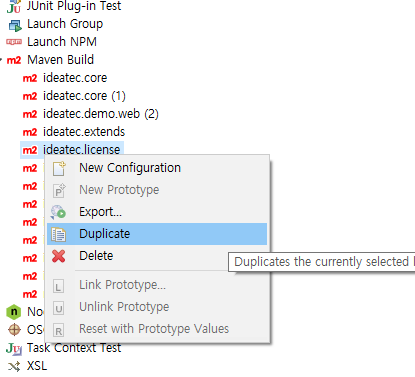
<br>
그럼 해당 프로젝트에 대한 maven build가 하나 더 생성된 것을 확인할 수 있습니다. 그리고 Goals는 'dependency:copy-dependencies'를 입력하고 Run 해줍니다.
<br>
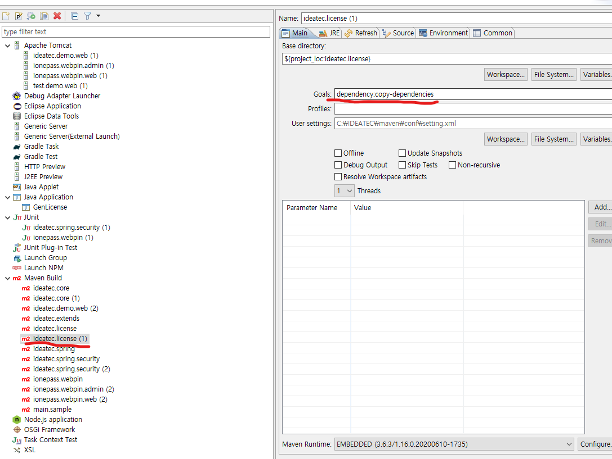
<br>
그럼 console 창에 다음과 같이 BUILD SUCCESS가 나타납니다.
<br>
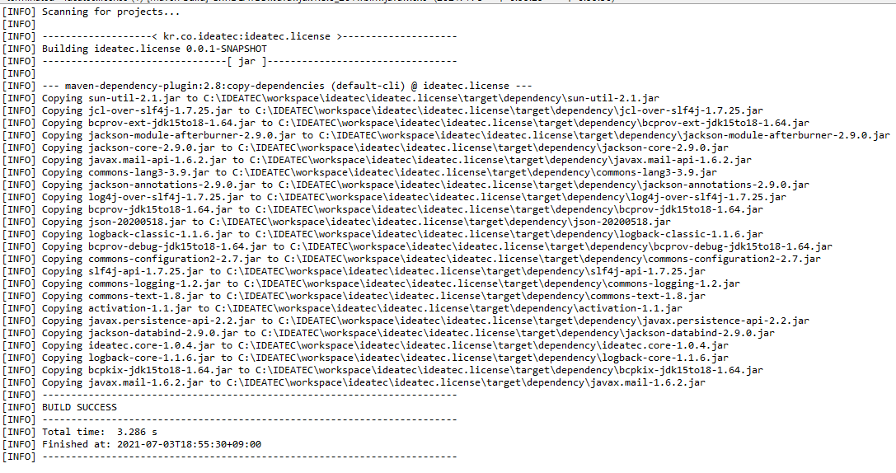
<br>
해당 프로젝트의 target 디렉토리에 가보면 dependancy 폴더가 생성되어 있고 그 안에 maven library들이 추출되어 있습니다.
<br>

<br>
다시 cmd 창에서 jar 파일을 실행하는데 이번에는 추출한 maven library도 포함해서 실행해봅니다.<br>
실행하기 전에 아까전에 만들었던 .jar 파일을 dependancy 폴더가 있는 target 폴더로 옮기고나서<br>
java -cp "[.jar 파일];dependency/*" [실행할 main class 경로] 입력하면 실행이 됩니다.
<br>

<br><br>

### maven library 포함하여 Jar 파일 생성

위의 방법도 있고 아예 dependancy를 추가해서 jar 파일을 생성할 수 있습니다.
<br>
pom.xml 파일에 아래와 같이 Assembly 플러그인 내용을 추가합니다.

```
      <plugin>
        <groupId>org.apache.maven.plugins</groupId>
        <artifactId>maven-assembly-plugin</artifactId>
        <version>2.2.1</version>
        <configuration>
          <descriptorRefs>
            <descriptorRef>jar-with-dependencies</descriptorRef>
          </descriptorRefs>
        </configuration>
      </plugin>
```
<br>
아까와 같이 해당 프로젝트 우클릭해서 Run As -> Run Configurations 에서 Maven Build 의 해당프로젝트를 우클릭해서 duplicate 하면 해당 프로젝트에 대한 maven build가 하나 더 생성된 것을 확인할 수 있습니다. 그리고 Goals는 'assembly:assembly'를 입력하고 Run 해줍니다.
<br>

<br>
그러면 target 폴더에 -jar-with-dependencies 이름으로 dependency가 포함된 Jar 파일이 생성이 됩니다.

<br>
cmd 창에서 jar 파일이 만들어진 폴더로 이동 후 java -cp [.jar 파일] [실행할 class 경로]를 입력해보면 바로 실행이 됩니다.
<br>

<br><br>

jar 파일이 다른 프로젝트에 적용될 때도 마찬가지로 적용되는 프로젝트에 해당 jar 파일에 쓰여지는 library 들이 포함되어 있지 않으면 에러가 발생하므로 적용되는 프로젝트에 해당 library들이 build 되어 있어야 합니다.


