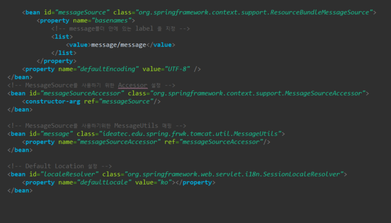
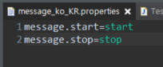
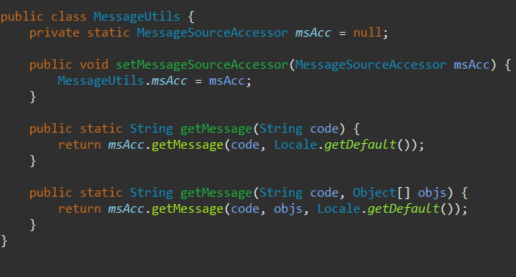
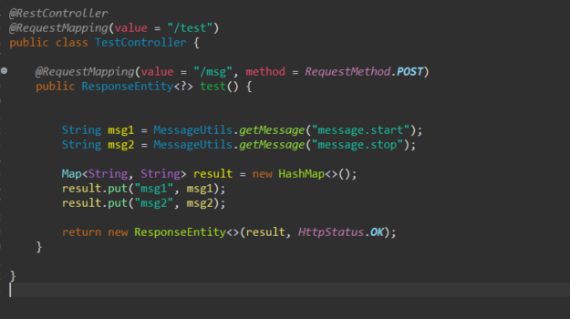
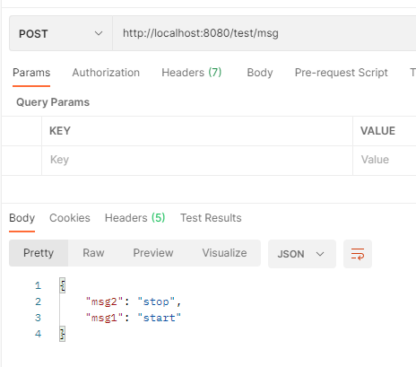
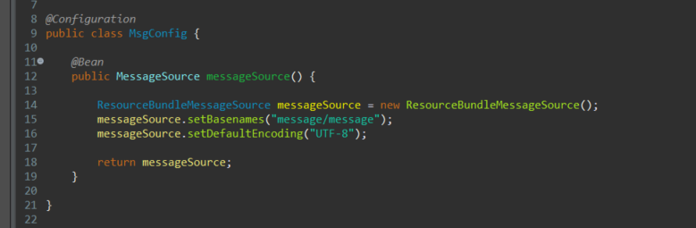
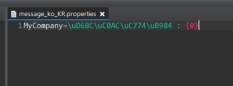
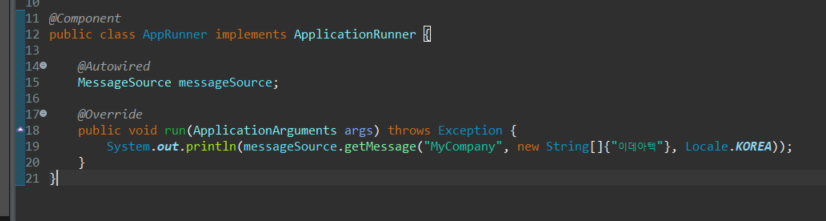
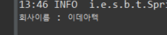

## Spring Message

- message를 사용하기 위해서는 먼저 context.xml에 필요한 설정을 합니다.

1. message폴더안에 있는 properties파일의 위치를 지정하는데 2가지 방식이 있다.

- ResourceBundleMessageSource 와 ReloadableResourceBundleMessageSource 이다.
- 여기서 주의할점은 ResourceBundleMessageSource는 resources파일을 직접읽기때문에 
- classpath를 따로 작성하지 않아도되고 ReloadableResourceBundleMessageSource 은 classpath를 작성하여 지정해줘야한다.

2. MessageSource를 사용하기 위해서 Accessor 설정을하고
3. MessageSource를 간편하게 사용하기 위해 MessageUtils를 매핑한다.
4. Default 값은 한국어로 지정

- 다음으로는 메시지를 불러올 값을 key value형태로 properties파일에 생성하고 작성한다.

- Controller를 통해 메시지를 출력하기전 context에서 messageSource를 쉽게 사용하기 위해 매핑했던 MessageUtils파일을 작성

- Controller 작성

- 결과 출력

## Spring boot Message

- spring boot 에서는 config파일을 만들어서 파일위치와 인코딩 설정 , MessageSource를 사용했다.

- properties파일명과 작성은 spring과 큰 차이는 없다. 

- boot는 더 간단하게 @Component를 사용해서 빈클래스에서 빈을 직접 등록하고 MessageSource 주입받아 사용했다.

 

 - 결과 출력

 
 