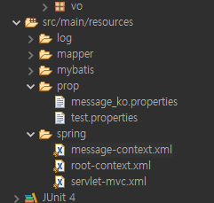
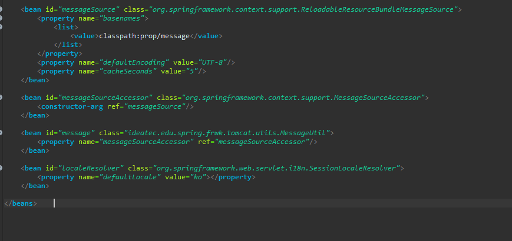
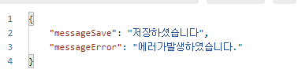

# Spring
Spring 프레임 워크를 이용하여 다국어 메세지 처리를 설정할 수 있다.

### 1. 설정

우선 message-context.xml을 작성하고 
```
###message.properties###
message.list=\uB9AC\uC2A4\uD2B8 \uD638\uCD9C
message.save=\uC800\uC7A5\uD558\uC168\uC2B5\uB2C8\uB2E4
message.error=\uC5D0\uB7EC\uAC00\uBC1C\uC0DD\uD558\uC600\uC2B5\uB2C8\uB2E4.
```

message.properties 파일을 생성한다 


messageSource를 사용하기 위해 bean에 추가, basenames로 classpath:prop/message 를 설정한다.ReloadableResourceBundleMessageSource 를 쓰게 되면 WAS 를 재로딩하지 않아도 수정된 resource 파일들을 자동으로 읽어 들이게 할수 있다.
chacheSeconds 에서 설정한 값을 기준으로 자동으로 변화를 체크한다.

MessageSourceAccessor는 다양한 getMessage메소드를 사용할 수 있고 message-context.xml에서는 MessageUtil과 매핑 시켰다.


### 3.MessageUtil만들기
MessageUtil은 
프로퍼티 파일에서 설정한 메시지를 가져오는 역할을 할 것이다.


MessageUtil클래스를 생성한다.
```
public class MessageUtil {
	private static MessageSourceAccessor msgAcc = null;
	
	public void setMessageSourceAccessor(MessageSourceAccessor msgAcc) {
		MessageUtil.msgAcc = msgAcc;
	}
	
	public static String getMessage(String code) {
		return msgAcc.getMessage(code, Locale.getDefault());
	}
	
	public static String getMessage(String code, Object[] objs) {
		return msgAcc.getMessage(code, Locale.getDefault());
	}
}
```
MessageSourceAccessor를 bean으로 주입하였고 getMessage를 사용하였다.

### 4.결과 




#SpringBoot
SpringBoot는 ResourceBundleMessageSource가 자동으로 bean 등록이 되지만 
ReloadableResourceBundleMessageSource를 사용하기 위해서 
MessageConfig파일을 생성하였다.
```
@Configuration
public class MessageConfig {

	@Bean
	public MessageSource messageSource() {
		ReloadableResourceBundleMessageSource source = new ReloadableResourceBundleMessageSource();
		
		source.setBasename("classpath:/prop/message");
		source.setCacheSeconds(60);
		source.setDefaultEncoding("UTF-8");
		Locale.setDefault(Locale.KOREA);
		
		return source;
	}
}
```