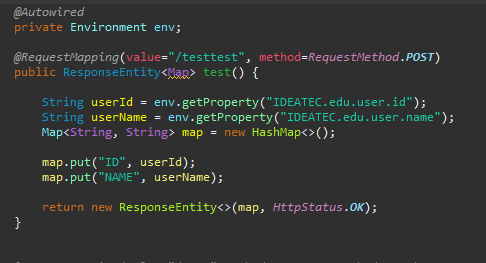
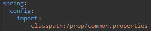

# Spring

### 1.properties
properties는 코드에 정보를 입력하지 않고 properties파일에 정보를 입력하는 방식입니다. 이 방식은 정보를 수정할 때 코드를 수정하지 않고 쉽게 수정할 수 있으며 의존성을 줄일수 있다는 장점이 있습니다.

### 2. 구현 


classpath 에 properties파일을 저장할 폴더를 생성하고 properties 파일 생성한다

```
###test.properties###
IDEATEC.edu.user.id = soohan
IDEATEC.edu.user.name=leesoohan
```
properties 파일은 key = value 형식으로 작성한다
```
###root-contest.xml###
@Configuration
@PropertySource("classpath:prop/test.properties")
public class TestConfig {

}
```
@PropertySource annotation에 properties파일의 위치를 넣어주면 Environment객체에 프로퍼티 값이 자동으로 주입된다.
Environment객체는 외부 설정파일들을 가져와서 프로퍼티를 추가하거나 추출하는 역할을 한다.



Environment 객체에 주입된 properties의 정보들은 .getProperty(key)메소드를 통해서 가져 올 수 있다.


# SpringBoot
Spring Boot 에서는 기존 application.yml(application.property) 파일에서 spring.config.import 로 프로퍼티 파일들의 클래스 패스를 입력하면 된다.

