# linux Centos7 환경에서 jenkins 자동 빌드 배포 환경 구축 

## 1. jenkins 설정

jenkins 서버 설치 후 접속하고 로그인 한다.

구축하려는 환경은 maven과 git을 이용한 spring web application 배포이므로 Jenkins Global Tool Configuration 설정에서 git, maven, jdk를 설정한다.
<br>

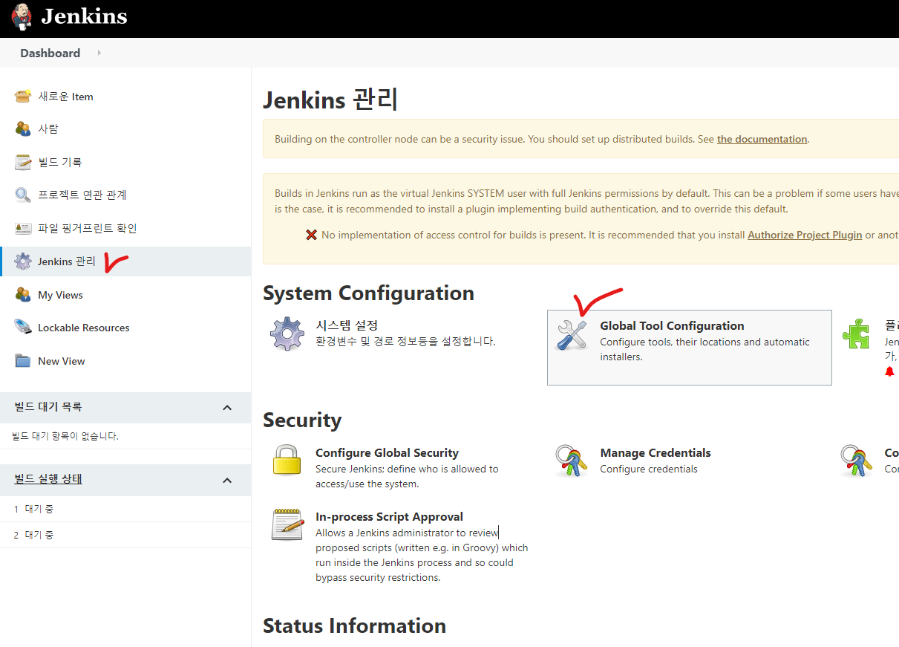
<br>

### JDK 설정

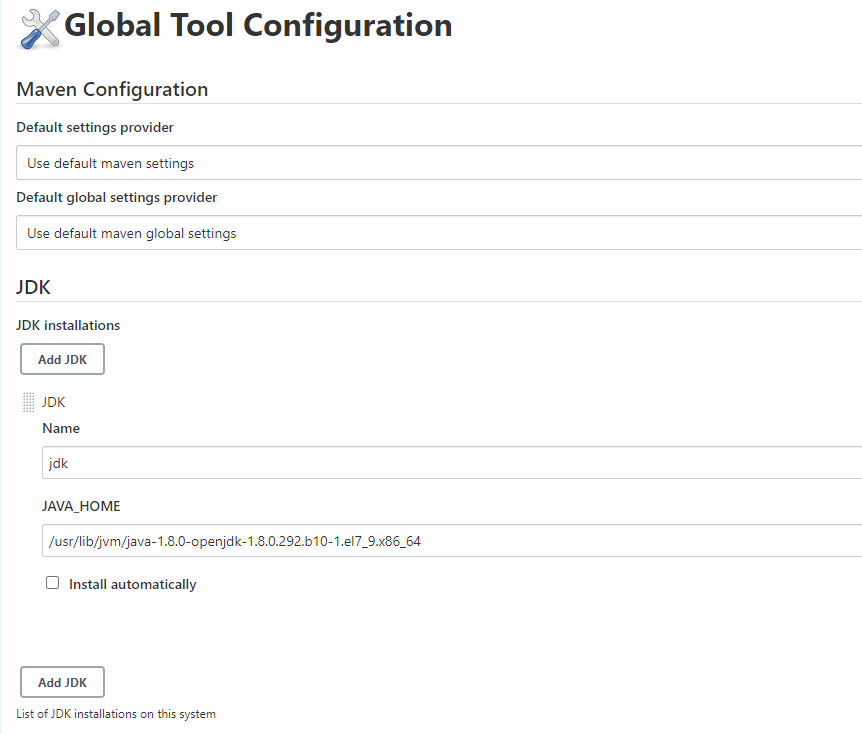
<br>

Install automatically : 비활성화<br>
Name : 자유롭게 작성<br>
JAVA_HOME : jenkins 서버의 JAVA_HOME 경로 기입<br><br>
jenkins 서버에 java가 설치 안되어 있다면 추가적으로 설치<br>
```
# yum install java-1.8.0-openjdk-devel
```
<br><br>

### GIT 설정

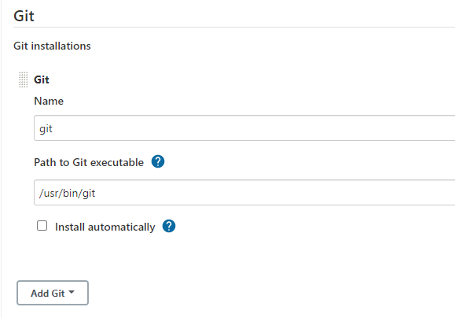
<br>

Install automatically : 비활성화<br>
Name : 자유롭게 작성<br>
Path to Git executable : jenkins 서버의 git 커맨드 경로를 기입<br><br>
git 역시 설치되어있지 않다면 추가적으로 설치해준다.<br>
```
# yum install git
```
<br><br>

### Maven 설정

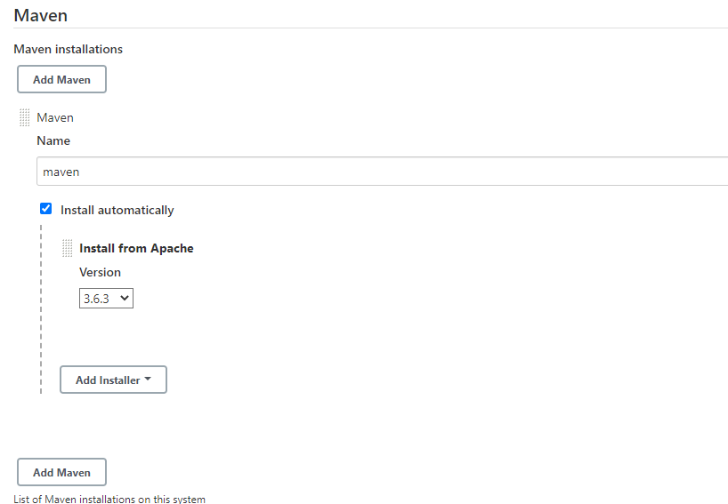
<br>

Install automatically : 활성화<br>
Name : 자유롭게 작성<br>
Version : 되도록 배포하고자하는 메이븐프로젝트 버전과 일치시켜준다.
<br><br>

### SSH 설정

빌드한 파일을 원격 서버로 전송하고자 할 때, 우선 필요한 플러그인을 설치한다.<br>
설치 가능 탭에서 'Publish Over SSH'를 검색해 설치한다.
<br>

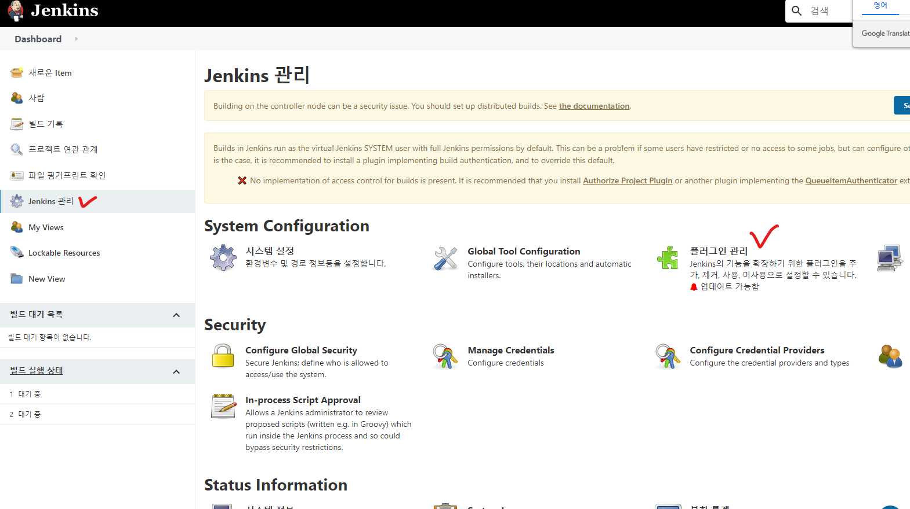
<br>

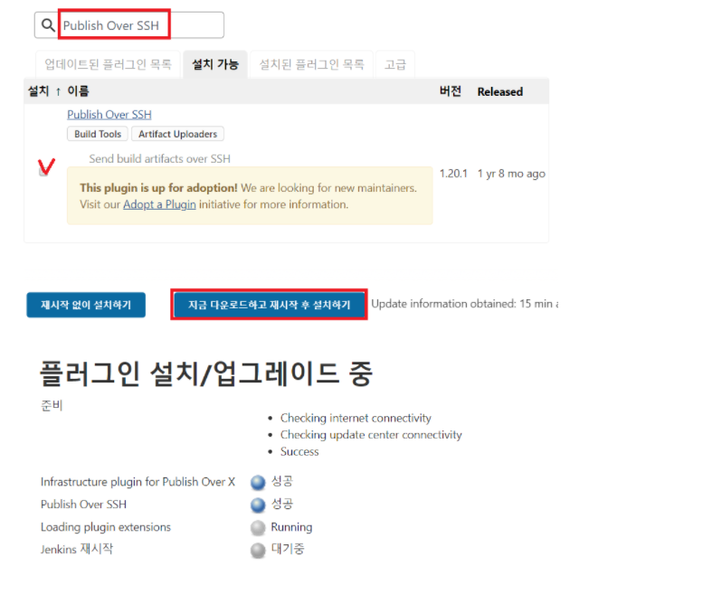
<br><br>

설치가 끝났으면 해당 플러그인 설정을 해준다.
<br>

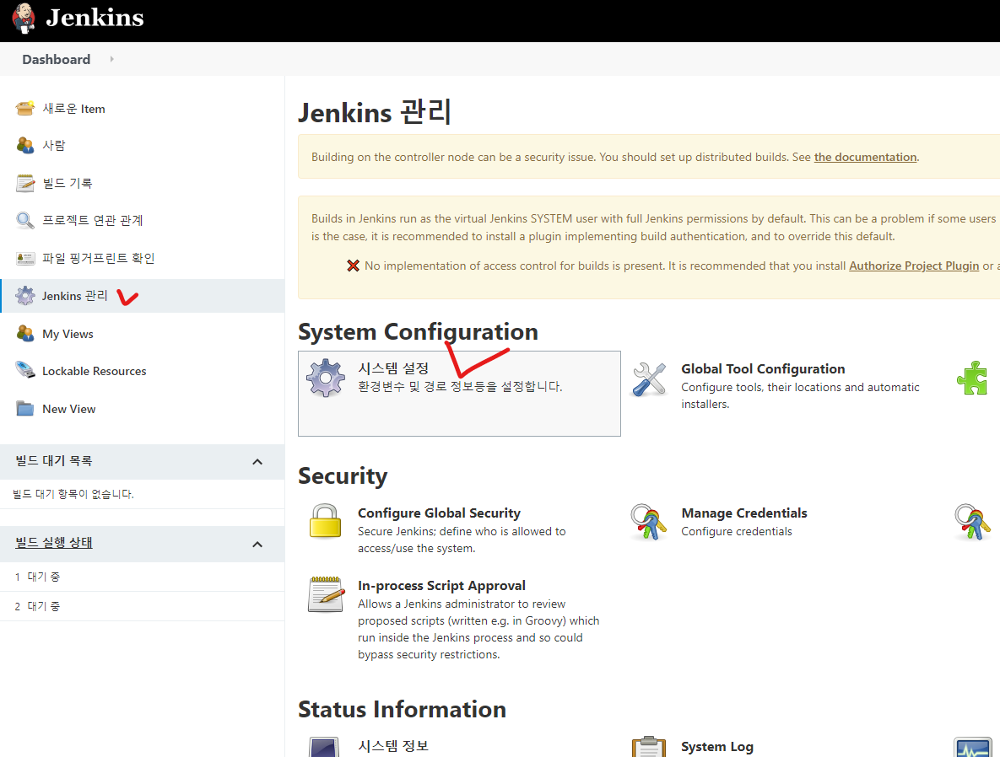
<br>

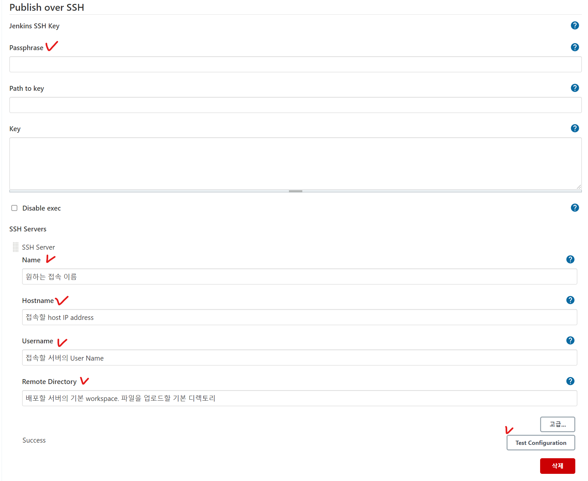
<br>

Passphrase : 접속할 원격 서버의 사용자 password<br>
Name : 본인이 사용할 임의의 SSH Server의 Name 설정<br>
Hostname : 실제로 접속할 원격 서버 ip<br>
Username : 접속할 원격 서버의 사용자 user<br>
Remote Directory : 파일 업로드할 기본 디렉토리
<br>

하단에 Test Configuration 클릭했을 때 좌측에 Success라고 뜨면 접속이 잘 된거다.
<br><br>

## Job 작성

이제 실제 빌드 배포를 수행하는 job을 작성한다. 
<br>

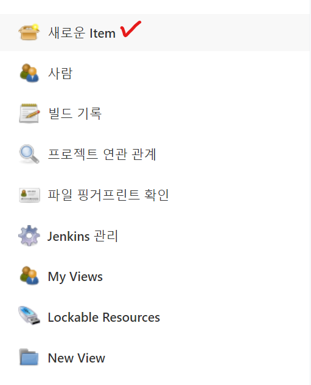
<br>

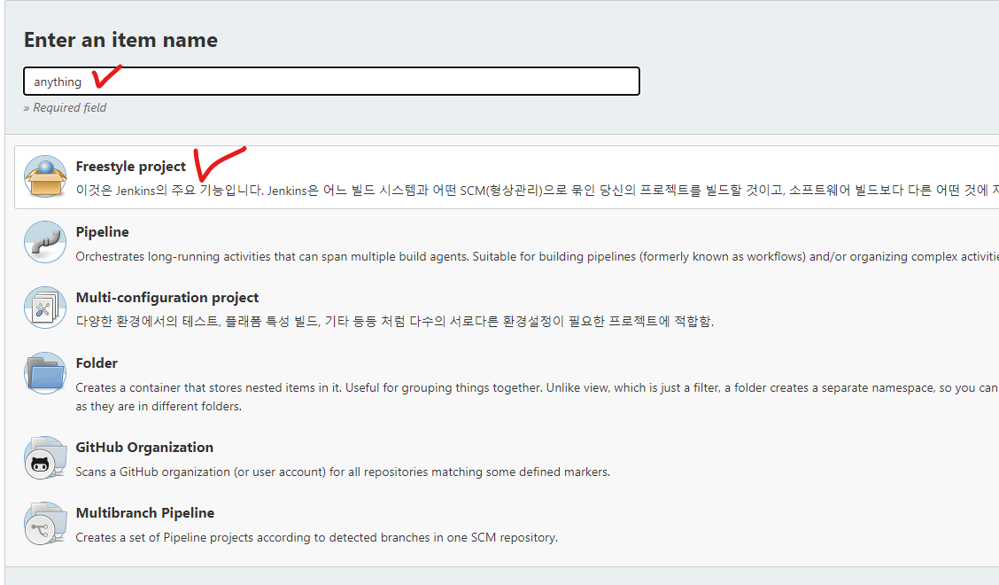
<br><br>

### 소스코드 관리

Job 실행 시 배포할 코드를 git repository에서 가져오기 위한 설정을 진행한다.
<br>

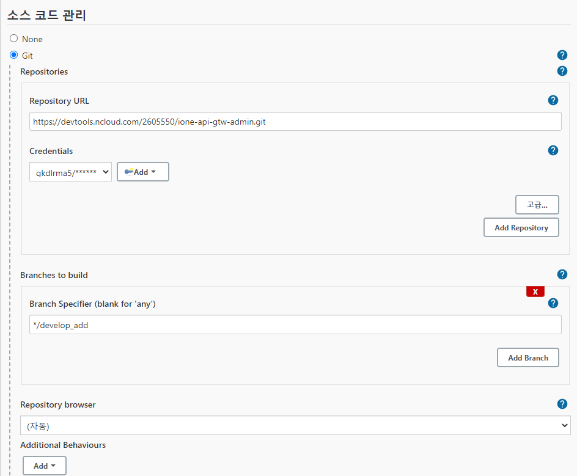
<br>

Repository URL : 해당 repository의 git url<br>
Credentials : git 접속 계정 설정
Branch Specifier : 원하는 repository branch 설정
<br><br>

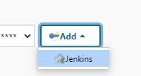
<br>

Add 버튼클릭 후 Jenkins를 클릭하면 다음과 같은 화면이 뜬다.
<br>

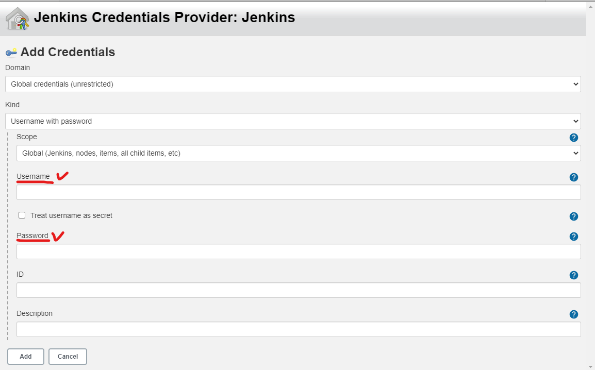
<br>

Username : git 계정 아이디<br>
Password : password
<br>
두 항목을 입력 하면 Credentials가 생성이 되고 표시된 항목에서 선택해주면 된다.
<br><br>

### 빌드 환경

빌드 설정을 진행한다.<br>
Maven 환경이기 때문에 'Invoke top-level Maven targets'를 선택해준 후 Goals를 작성해준다.<br>
추가로 실행할 것이 있다면 'Execute shell'을 선택해 스크립트를 작성해준다.

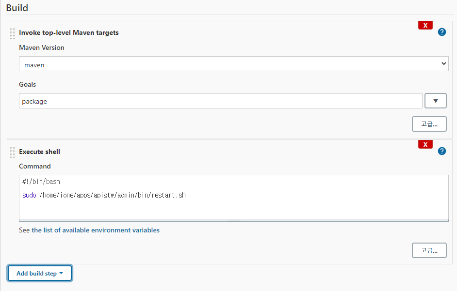
<br>

### 빌드 후 조치

빌드 후 원격서버로 파일을 보내려면 'Send build artifacts over SSH'를 선택해 필요한 항목들을 작성해준다.<br>

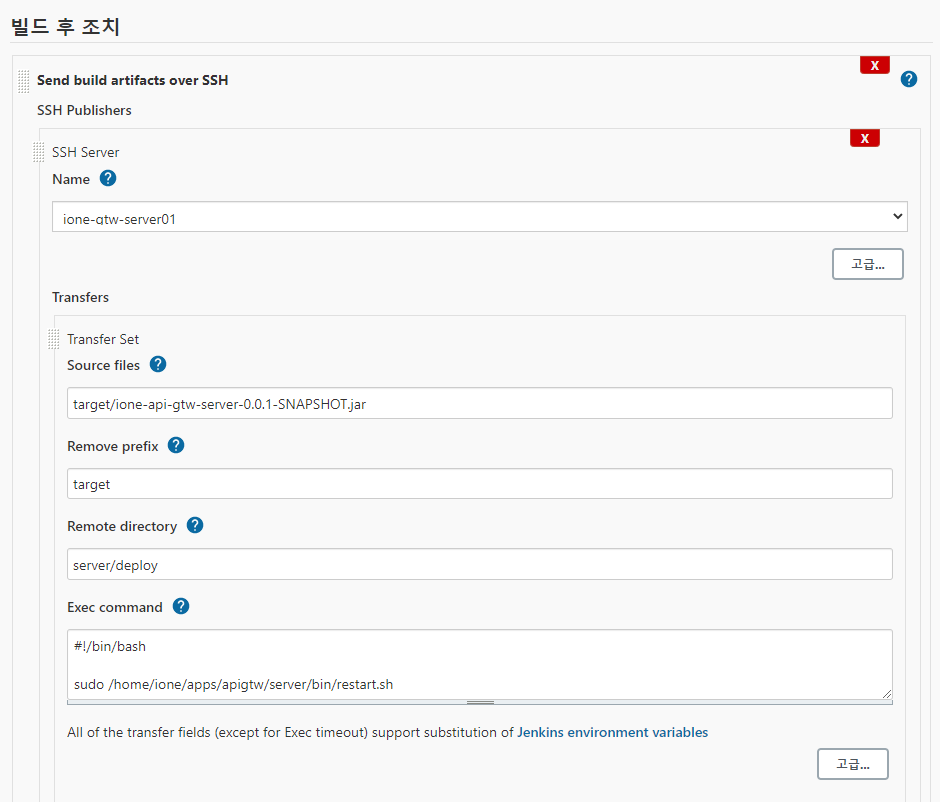
<br>

Name : 플러그인 설정에서 만들어 놓은 항목을 선택<br>
Source files : 워크스페이스상의 상대경로 입력(Job 디렉토리 이후부터 입력)<br>
Remove prefix : 보내고자 하는 타겟 파일만 보내기 위해 나머지 경로 입력<br>
Exec command :  파일 전송 이후 실행할 스크립트 입력
<br><br>


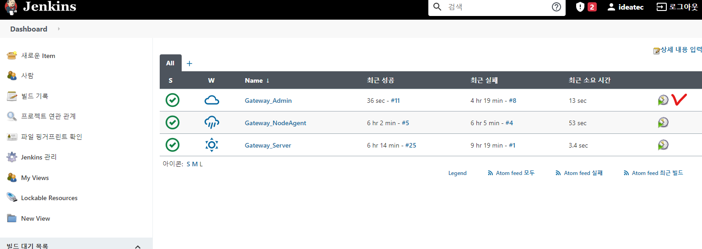


