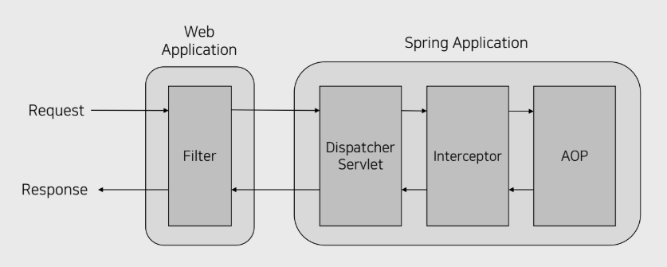
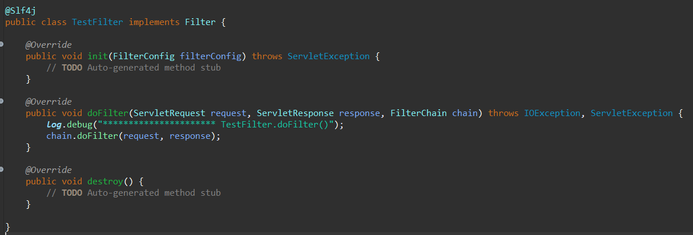
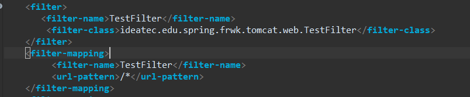
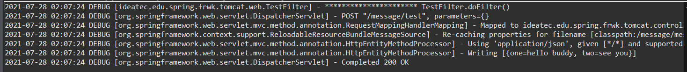
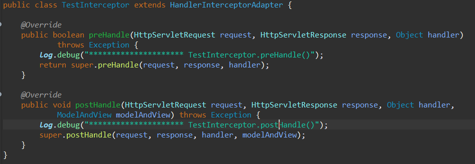
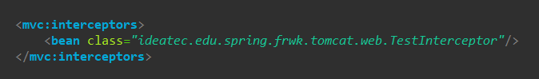
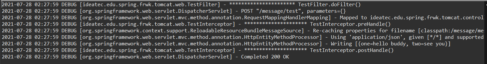

#Spring에서 Filter, Interceptor, AOP 사용하기

 
 
웹 애플리케이션 개발을 하다보면 공통 처리가 필요한 부분이 존재한다.
 
대표적으로 로그인 세션 및 권한 체크, 로깅, 페이지 인코딩, 디바이스에 따른 분기처리 등이 있다.
 
이러한 작업들을 처리할 때 페이지 하나마다 따로따로 처리하게 되면 상당히 비효율적인 설계가 될 것이다.
 
 
따라서 이런 작업은 공통으로 처리해주어야 한다.
 
Spring에서 이러한 공통 처리를 할 수 있는 것은 Filter, Interceptor, AOP 가 있다.
 
 
그렇다면 어떤 걸 사용해야 할까? 위 세가지의 용도는 발동 시점에 따라 나뉜다.
 
 

출처: https://velog.io/@damiano1027/Spring-Spring-MVC-Request-Lifecycle
 
위 사진을 보면 순서를 알 수 있는데, 발동 순서는 간단하게 나타내면 Request -> Filter -> Interceptor -> AOP -> Interceptor -> Filter -> Response 순이다.
 
 
Filter는 스프링 외부에서 request와 response의 해당하는 작업을 가로채서 공통적인 처리를 할 수 있다.
 
 
우선 Filter를 구현하기 위해 클래스를 하나 만들었다.
 
 

 
javax.servlet.Filter를 상속받고, Filter 아래의 init, doFilter, destory 메소드도 Override 했다.
 
여기서 init() 메소드는 필터를 웹 컨테이너에 생성 후 초기화할 때 호출한다. 서버를 실행하면 서블릿이 올라오는 동안 실행된다.
 
doFilter() 메서드는 요청(Request)와 응답(Response)의 한 쌍이 체인을 통과할 때마다 컨테이너에서 호출된다. 또한, 여기서 실제 처리 로직을 구현한다.
 
destroy() 메소드는 필터가 웹 컨테이너에서 삭제될 때 호출된다. 서버를 종료할 때 같이 종료된다.
 
 

 
이렇게 만든 Filter는 웹 Web Application 설정이기 때문에 web.xml에 등록한다.
 
 
filter-name 과 filter-class로 매핑시켜 준 후 filter-mapping 에서는 범위를 모든 요청(/*)으로 설정했다.
 
 
설정해준 후에 서버 API에 요청을 했다.
 

 
요청이 들어온 후 DispatcherServlet으로 가기 전에 가장 먼저 Filter의 doFilter() 메소드를 거치는 것을 볼 수 있다.
 
 
Filter에서는 Spring이 아닌 전반적인 Web Application에서의 Config나 Validation을 수행하는것이 좋을 것 같다. (인코딩, XSS 처리 등)
 
 

 
그다음 Interceptor를 구현하기 위해 클래스를 생성했다.
 
HandlerInterceptorAdapter 객체를 상속 받았는데 postHandle, preHandle, afterConcurrentHandlingStarted, afterCompletion 메소드가 내장되어 있고 원하는 메소드를 Override하여 사용하면 되는데 여기서는 preHandle과 postHandle을 받아서 사용했다.
 
preHandle()과 postHandle()은 각각 요청을 처리하는 Handler의 전후에서 발동되는 메소드이다.
 
 
생성해준 클래스는 servlet-context.xml에 등록해주었다.
 

 
mvc:interceptors 태그안에 bean으로 interceptor를 등록해 줄 수 있다.
 
 

 
역시 서버 요청을 했을 때 preHandle()과 postHandle()이 RequestMappingHandlerMapping으로 매핑된 Handler(ideatec.edu.spring.frwk.tomcat.controller.MessageController)의 실행 전 후에 발동되는 것을 확인할 수 있다.
 
 
 
AOP는 기존의 OOP와 목적은 공통 코드를 가져다 쓰는것에서는 같지만 AOP에서는 IoC(제어 역행)이 적용된다는 점은 다르다.
 
이는 공통 기능의 코드를 개발자가 직접 넣어주는 것이 아니라 컨테이너나 관련 라이브러리가 지정된 메소드나

