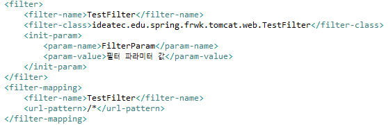
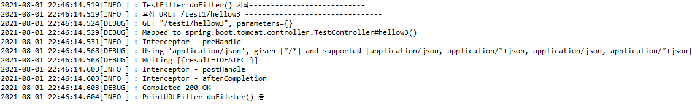

# Spring Filter, Interceptor, AOP 설정

스프링에서 사용되는 Filter, Interceptor, AOP 기능은 모두 무슨 행동을 하기 전에 먼저 실행하거나, 실행한 후에 추가적인 행동을할 때 사용되는 기능들이다.
<br>

적용시점은 Filter -> Interceptor -> AOP
<br>

적용방식은 Filter: web.xml , Interceptor: servlet-context.xml
<br>


<br>                      2021-07-30_spring_filter_interceptor_aop

Interceptor와 Filter는 Servlet 단위에서 실행된다. AOP는 메소드 앞에 Proxy 패턴의 형태로 실행된다.
<br>

요청이 들어오면 Filter -> Interceptor -> AOP Interceptor -> Filter순으로 거치게 된다.
<br><br>

## Filter

### Filter란

서블릿 필터는 DispatcherServlet 이전에 실행이 되는데 필터가 동작하도록 지정된 자원의 앞단에서 요청내용을 변경하거나 여러가지 체크를 수행할 수 있다.
<br>

또 자원의 처리가 끝난 후 응답내용에 대해서도 변경하는 처리가 가능하다.
<br>

보통 web.xml에 등록하고 일반적인 인코딩 변환처리, XSS방어 등의 요청에 대한 처리로 사용된다.
<br>

### Filter 설정

우선, 기본 인터페이스인 Filter를 구현한 커스텀 필터 클래스를 하나 만든다.
<br>


<br>

Filter 인터페이스의 메서드는
<br>

- init() : 필터 인스턴스 초기화
- doFilter() : 전/후 처리
- destroy() : 필터 인스턴스 종료
<br>

1.init()를 보면 getInitParameter()로 파라미터를 사용하는 것을 보실 수 있는데 이후에 설정할 'web.xml'에서 필터를 등록할 때 파라미터를 설정해주었는데, 그것을 받아 사용한 것이다.
<br>

2.그리고 doFilter()의 chain.doFilter();는 해당 필터의 처리(doFilter())결과를 다음 처리로 넘겨주는 역할을 한다. 만약에 다음 필터가 있다면 다음 필터로, 없다면 서블릿으로 전해준다.
<br>

따라서 chain.doFilter();를 해주지 않으면 현재 필터링 결과를 확인할 수가 없다.
<br>

다음으로 web.xml에 필터 설정을 해준다.
<br>


<br>

filter-name 과 filter-class로 매핑시켜 준 후 filter-mapping 에서는 범위를 모든 요청(/*)으로 설정한다.
<br>


<br>


<br>

앱이 실행될때 init()으로 필터 인스턴스가 셍겼고, 초기 파라미터를 잘 읽어온 것을 볼 수 있다.<br>
그리고 URL요청이 들어왔을 때, DispatcherServlet으로 가기 전 doFilter()가 실행되는 것을 볼 수 있다.
<br>

### Filter 설정(boot)

Spring boot에서는 필터클래스에 @Component와 @WebFilter 어노테이션만 추가해주면 된다.
<br>


<br>


<br><br>


## Interceptor

### Interceptor란

요청에 대한 작업 전/후로 가로챈다고 보면 된다.
<br>

인터셉트는 스프링의 DispatcherServlet이 컨트롤러를 호출하기 전/후로 끼어들기 때문에 스프링 컨텍스트(Context영역) 내부에서 Controller(Handler)에 관한 요청과 응답에 대해 처리한다.
<br>

스프링의 모든 빈 객체에 접근할 수 있다.
<br>

인터셉트는 여러개를 사용할 수 있고 로그인체크, 권한체크, 프로그램  실행시간 계산작업 로그 확인 등의 업무처리에 이용됨.
<br>

### Interceptor 설정

HandlerInterceptorAdapter를 상속받아 인터셉트로 사용할 클래스를 만들어준다.
<br>


<br>

1.preHandle<br>
- Controller 실행 요청 전에 수행되는 메서드
- 클라이언트 요청을 컨트롤러에 전달하기 전에 호출
- return 값으로 boolean 값 전달. false 인 경우 Controller 실행 않고 요청 종료
<br> 

2.postHandle<br>
- view단으로 forward 되기 전에 수행
- 컨트롤러 로직이 실행된 이후 호출
- 컨트롤러 단에서 에러 발생 시 해당 메서드 수행x
<br><br>

servelt-mvc.xml에서 인터셉터 설정을 해준다. (프로젝트 구성에 맞게 설정)
<br>


<br>

이제 url 요청을 날려보면 
<br>


<br>

해당 URL 요청을 받은 controller 실행 전/후로 preHandle()과 postHandle()이 실행된 것을 볼 수 있다.
<br>

### Interceptor 설정(boot)

Spring boot에서는 먼저 interface HandlerInterceptor를 상속받아서 Interceptor를 구성한다.<br>
(* sts4 기준으로 java8을 사용하며 HandlerInterceptor를 사용한다. 기존에 상속받아서 사용하던 추상클래스HandlerInterceptorAdapter는 "Deprecated." 처리되었다.)
<br>


<br>

여기서 afterCompletion은 view 가 정상적으로 랜더링 된 후 마지막에 실행된다.
<br>

SpringLegacy에서는 .xml에서 맵핑할 정보와 어떤 인터셉터를 적용할건지 처리를 하곤 했는데, 부트에서는 java를 통해 설정을 진행한다.
<br>


<br>


<br><br>


## AOP

### AOP란

프로그래밍을 하다보면 공통적인 기능이 많이 발생한다. 이러한 공통 기능은 상속을 통해서 모든 모듈에 적용을 시켜줄 수 있지만 몇 가지 문제가 있다. 우선 JAVA에서는 다중 상속이 불가능하기 때문에 한계가 있고, 기능을 구현하는 부분에 핵심 기능 코드와 공통 기능 코드가 섞여 있어서 효율이 떨어진다.
<br>

이러한 문제점때문에 핵심 기능과 공통 기능을 분리 시켜놓고, 공통 기능을 필요로 하는 핵심 기능들에서 사용하는 방식의 AOP가 등장했다.
<br>

AOP 관련용어<br>
-Aspect: 공통기능<br>
-Advice: Aspect 기능 그 자체(세부 주요 기능)<br>
-Joinpoint: Advice 적용해야 되는 부분(ex 필드, 메소드 - 스프링에서는 메소드만 해당)<br>
-Pointcut: Joinpoint의 부분으로 실제로 Advice가 적용되는 부분
<br><br>


### AOP 설정

일단, 간단히 user 정보 출력하는 클래스를 만든후 AOP를 적용해보자.
<br>


<br>

Aspect 사용을 위해 pom.xml에 dependancy를 추가해준다.
<br>


<br>

root-context.xml에 aop 설정을 해준다. (user 데이터 넣는 bean도 설정해주었다.)
<br>


<br>

이제 공통기능을 하는 클래스를 만들어준다.(Advice 역할 클래스)
<br>


<br>

User 클래스에 설정해 놓은 getUsersInfo()를 핵심기능으로 놓고 핵심 기능에 공통기능을 추가해 놓았다.
<br>

이제 실행을 해보면 다음과 같이 나타나는 것을 볼 수 있다.
<br>


<br>

### AOP 설정(boot)

aop 사용을 위해 pom.xml에 dependancy를 추가한다.
<br>


<br>

controller에 "aop Test"를 출력하는 메서드를 하나 만들어준다. 주의할 점은 @GetMapping 어노테이션을 적용해준다.
<br>


<br>

다음으로 AspectJ를 적용할 class를 만들어 준다. pointcut으로 Around에  GetMapping 어노테이션이 설정된 특정 클래스/메소드에만 AspectJ가 적용되도록 설정한다.
<br>


<br>

실행하면 다음과 같이 나타나는 것을 볼 수 있다.
<br>


<br><br>


## @Value map, list 설정

속성값으로 
```
listOfValue=A,B,C
valueOfMay={key1: '1', key2: '2', key3: '3'}
```
<br>

list
```
list
@Value("${listOfValues}")
private String[] valuesArray;

@Value("#{'${listOfValues}'.split(',')}")
private List<String> valuesList;
```
<br>

map
```
@Value("#{${valuesMap}}")
private Map<String, Integer> valuesMap;

@Value("#{${unknownMap : {key1: '1', key2: '2'}}}")
private Map<String, Integer> unknownMap;

@Value("#{${valuesMap}['unknownKey'] ?: 5}")
private Integer unknownMapKeyWithDefaultValue;
```

