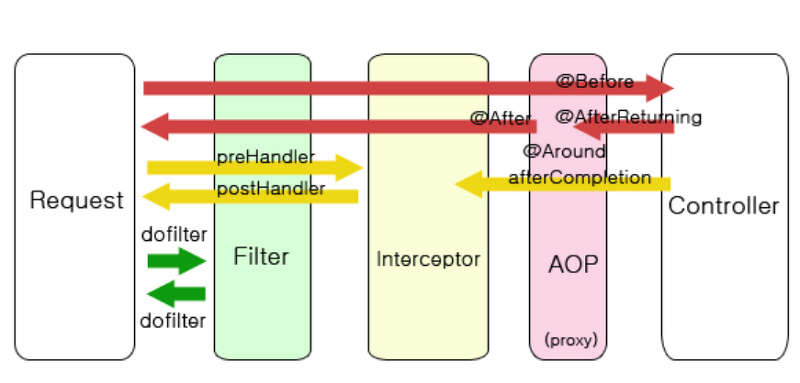

## spring filter , interceptor, aop

### 자바 웹 개발에서는 공통 부분은 빼서 따로 관리하는게 좋다.

- 따로 관리하기 위해서는 3가지 방법이 있다.

1. Filter
2. Interceptor
3. AOP

- 스프링에서 사용되는 filter,interceptor,aop 세 가지 기능은 모두 무슨 행동을 하기전에
먼저 실행하거나, 실행한 후에 추가적인 행동을 할 때 사용되는 기능들이다.

## filter , interceptor , aop 의 전체적인흐름 

1. 서버를 실행시켜 서블릿이 올라오는 동안에 init이 실행되고, 그 후 doFilter가 실행된다.
2. 컨트롤러에 들어가기 전 preHandler가 실행된다.
3. 컨트롤러에서 나와 postHandler, after, Completion, doFilter 순으로 진행이 된다.
4. 서블릿 종료 시 destroy가 실행된다.

## Filter

- 서블릿 필터는 DispatcherServlet 이전에 실행이 되는데 필터가 동작하도록 시정된 자원의 앞단에서 요청내용을 변경하거나, 여러가지 체크를 수행할 수 있습니다. 또한 자원의 처리가 끝난 후 응답내용에 대해서도 변경하는 처리를 할 수가 있습니다. 보통 web.xml에 등록하고, 일반적으로 인코딩 변환처리,xss방어 등의 요청에 대한 처리로 사용됩니다.

- 그림으로 보면 자원이 받게 되는 요청 정보는 클라이언트와 자원 사이에 존재하는 필터에 의해 변경된 요청정보가 되며, 클라이언트가 보게 되는 응답 정보는 클라이언트와 자원사이에 존재하는 필터에 의해 변경된 응답 정보가 된다. 필터는 클라이언트와 자원사이에 존재하는 경우가 보통이지만, 여러개의 필터가 모여서 하나의 체인을 형성할 수 있다.

- 먼저 Filter를 사용하기위한 방법중 하나인 xml 방식을 사용할때는 name과 class로 mapping하고 요청패턴을 /*지정하는 설정을 한다.

#### filter의 실행메서드
1. init() - 필터 인스턴스 초기화
2. doFilter() - 전/후 처리
3. destroy() - 필터 인스턴스 종료

- xml 기반으로 init() 메서드를 통해 filter 생성 시 처리하고 doFilter() 메서드를 통해 다음 filter 실행 전 처리(preHandle)하고 Chain.dofilter를 통해 다음 실행을 위해 넘겨
주고 destroy() 메소드를 통해 filter가 웹 컨테이너에서 삭제 시 호출하여 서버와 같이 종료합니다.

- 실행 시 정상출력 

## boot Filter

- boot는 xml 설정없이 @component , @WebFilter 어노테이션만 추가하고 위와 같이 동일한 코드로 사용할 수 있다.

- 정상 출력 

## interceptor 

- interceptor란 컨트롤러에 들어오는 요청 HttpRequest와 컨트롤러가 응답하는 HttpResponse를 가로채는 역할을 합니다.

- filter는 spring context 외부에 존재하여 스프링과 무관한 자원에 대해 동작하는데 
interceptor는 spring의 DistpatcherServlet이 컨트롤러를 호출하기 전, 후로 끼어들기 때문에 springContext 내부에서 Controller(Handler)에 관한 요청과 응답에 대해 처리한다.

- interceptor를 사용하기위해 xml 설정을 합니다
- 모든 요청을 가로채서( Interceptor ) ideatec.edu.spring.frwk.controller 패키지에 있는  InterceptorController 객체를 실행하겠다는 의미입니다.

1. preHandle()
 - 컨트롤러가 호출되기 전에 실행됩니다.
 - 컨트롤러가 실행 이전에 처리해야 할 작업이 있는 경우 혹은 요청정보를 가공하거나 추가하는 경우에 사용합니다.
 - 실행되어야 할 '핸들러'에 대한 정보를 인자 값으로 받기 때문에 '서블릿 필터'에 비해 보다 세밀하게 로직을 구성할 수 있습니다.
 - 리턴 값이 boolean입니다. ture를 리턴하게 된다면 preHandle() 실행 후 핸들러에 접근을 합니다. false를 리턴하게 되면 작업을 중단하기 때문에 컨트롤러와 남은 인터셉트가 실행되지 않습니다. 

2. postHandle()
- 핸들러가 실행은 완료되었지만 아직 View가 생성되기 이전에 호출됩니다.
- ModelAndView 타입의 정보가 인자 값으로 받습니다. 따라서 Controller에서 View에 정보를 전달하기 위해 작업한 Model 객체의 정보를 참조하거나 조작할 수 있습니다.
- preHandle()에서 리턴 값이 false인 경우 실행되지 않습니다.
- 적용 중인 interceptor가 여러 개인 경우 preHandle()는 역순으로 호출됩니다.
- 비동기적 요청 처리 시에는 처리되지 않는다

3. afterCompletion()
- 모든 View에서 최종 결과를 생성하는 일을 포함한 모든 작업이 완료된 후에 실행됩니다.
- 요청 처리 중에 사용한 리소스를 반환해주기 적당한 메서드입니다.
- preHandle()에서 리턴 값이 false인 경우 실행되지 않습니다.
- 적용 중인 interceptor가 여러 개인 경우 preHandle()는 역순으로 호출됩니다.
- 비동기적 요청 처리 시에는 호출되지 않습니다.

- message 요청을 했을 때 preHandle()과 postHandle()이 RequestMappingHandlerMapping으로 매핑된 Handler()의 실행 전 후에 발동되는 것을 확인할 수 있다.

## boot interceptor 

- 스프링에서 제공하는  org.springframework.web.servlet.
HandlerInterceptor  인터페이스를 구현
- HandlerInterceptor API(Spring 5.3.2버전)

- boot는 interface HandlerInterceptor를 상속받아서 Interceptor를 구현합니다.

- boot는 xml 설정을 하지않고 java로 설정합니다.

- 정상적으로 interceptor 로그 출력

## AOP