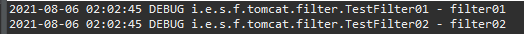

# Filter, Interceptor, AOP란?

간단하게 설명하자면, 작업하면서 공통적으로 처리해야 할 업무들을 중복되지 않게 사용하기 위해서 공통 부분을 관리하게 되는데, 이러한 공통 처리를 위해 사용되는 기능들이다.  

출처: https://twofootdog.github.io/Spring-%ED%95%84%ED%84%B0(Filter),-%EC%9D%B8%ED%84%B0%EC%85%89%ED%84%B0(Interceptor),-AOP-%EC%B0%A8%EC%9D%B4%EC%A0%90/
  

대략적인 그림을 봤을 때 DispatcherServlet전후로 필터와 인터셉터가 실행되고 AOP 메서드 간 Proxy형태로 존재한다. 
위 그림에 나와있는 것처럼 filter -> interceptor -> AOP 순으로 실행된다.  
또한 filter는 스프링 영역이 아닌 독자적으로 기동하기 스프링의 자원에 접근할 수 없다. 

# 스프링 프레임워크

1. **Filter 사용하기**

   

   필터 사용을 위해서는 javax.servlet.Filter 인터페이스의 구현체를 만들면 된다. 직접 구현하는 방법도 있지만, 스프링에서 제공하는 지원 클래스인 필터르 사용해봤다.  
   특별한 작없 없이 단순히 로그를 찍는 필터고, filteChain.doFilter를 실행하면 다음 필터로 넘어간다. 

   

   그 후에는 web.xml에 위와 같이 필터를 등록해주면 된다. 이 때 주의할 점은, web.xml에 등록한 순서대로 필터 체인이 형성 되기 때문에 순서에 유의해야 한다.  

   

   정상적으로 작동하는 것을 확인할 수 있다.  

   

   추가적으로 위에서 설명한 것처럼 필터는 스프링 영역이 아닌 독자적으로 동작하기 때문에 스프링 자원에 접근이 불가능하다. 
   그렇기 때문에 위처럼 db에서 접근을 시도하기 위한 서비스를 주입받지 못하고 null이 된다.  

2. **Interceptor 사용하기**

   

   스프링 인터셉터를 사용하기 위해선 HandlerInterceptor를 상속받아 구현하면 된다. 

   - preHandle: 컨트롤러의 핸들러 메서드를 실행하기 전에 호출된다
   - postHandle: 컨트롤러의 핸들러 메서드가 정상적으로 종료된 후 호출되는데, 헨들러 메서드에서 예외 발생시 호출되지 않는다.
   - afterCompletion: 컨트롤러의 헨들러 메서드의 처리가 종료된 후 호출되며 예외 발생시에도 실행된다.
      

   

   인터셉터를 구현한 다음, xml파일에서 위와 같이 인터셉터를 등록해주면 된다. 

   

   정상적으로 실행된다. 주목할 점은 위의 흐름도에서 봤듯이 filter다음에 실행되는 점과, 인터셉터는 스프링 영역에서 동작하기 때문에 db접근도 정상적으로 작동하는 것을 확인할 수 있다.   

3. **AOP 사용하기**

   AOP란 관점 지향 프로그래밍(Aspect Oriented Programming)의 약자로, 여러 클래스에 나눠져 있는 횡단 관심사를 중심으로 구현하는 기법이다. 

   **주요 용어**

   - Aspect : 횡단 관심사를 의미(로그를 출력, 예외를 처리한다 등)
   - Join Point : 횡단 관심사가 실행되는 지점을 의미하며 스프링 AOP에서는 메서드 단위로 조인 포인트를 잡는다
   - Advice : 특정 조인 포인트에서 실행되는 코드
   - Pointcut : advice를 적용할 곳을 선별하는 표현식
   - Weaving : 애플리케이션 코드의 적절한 지점에 aspect를 적용하는 것, 스프링 AOP는 기본적으로 실행 시점에 위빙한다.
   - Target : AOP에 의해 흐름에 변화가 생긴 객체
      

   
   

   AOP를 사용하기 위해서는 위와같은 dependency를 추가한 후 root-context.xml 파일에서 위 태그를 추가해줘야 한다. 

   

   그 후 Aspect를 구현한다. 이 컴포넌트가 Aspect로 식별되도록 @Aspect를 붙여주고, @Component또한 붙여준다. 그 후 JoinPoint를 인자로 받는 메써드를 구현한다. 이 때 메서드가 어드바이스로 식별 되도록 어드바이스 어노테이션을 붙여준다. 예시에서는 조인 포인트가 정상적으로 종료되면 실행되는 @AfterReturning을 붙여주었다.  
   그 후 포인트컷으로 적용될 대상을 지정해준다. 예시에서는 TestServiceImpl의 filterTestSelect() 메써드가 종료되면 select()를 통해서 db에서 데이터를 가져오게 구현했다.  

   

   정상 작동 되는것을 확인할 수 있다.  

# 스프링 부트

1. **Filter 사용하기**

   

   부트에서는 필터를 적용하는 다양한 방법이 있다(필터는 스프링과 같은 필터를 사용했다).  

   1. @Component + @Order를 사용하는 조합
   2. @WebFilter(urlPatterns="/") + @ServletComponentScan

   첫번째 조합은 필터의 순서를 지정할 수 있다는 장점이 있지만, urlPattern을 지정할 수 없다는 단점이 있다. 
   두번째 조합은 urlPattern을 지정할 수 있지만, 필터의 순서를 지정할 수 없다는 단점이 있다. 

   

   그렇기 때문에 위와 같이 FilterConfig를 생성해 필터를 등록해주었다. 이 경우 순서와 urlPattern모두를 지정해 줄 수 있다. 

   

   마찬가지로 정상 작동한다.   

2. **Interceptor 사용하기**

   
   

   스프링과 마찬가지로 HandlerInterceptor를 상속받아 구현한후 컴포넌트로 등록해준다. 
   정상적으로 작동하는 것을 보여준다.  

3. **AOP 사용하기**

   
   

   스프링과 마찬가지로 dependency를 추가해준다(Aspect 구현체는 스프링 예시와 같다). 
   같은 결과값이 출력되는 것을 확인할 수 있다.  

---

#### 참고자료

&nbsp; - https://twofootdog.github.io/Spring-%ED%95%84%ED%84%B0(Filter),-%EC%9D%B8%ED%84%B0%EC%85%89%ED%84%B0(Interceptor),-AOP-%EC%B0%A8%EC%9D%B4%EC%A0%90/  
&nbsp; - https://goddaehee.tistory.com/154  
&nbsp; - https://congsong.tistory.com/25  
&nbsp; - 스프링 철저 입문  
