# hyper-v , centOS7 세팅 / java, tomcat, apache install
(java version 1.8 , tomcat version 8.5)

## hyper-v란?
<br>
windows server2008부터 기본적으로 제공되는 가상화솔루션으로 가상화기술을 사용하여,
가상화된 컴퓨팅환경을 만들고 관리할 수 있는 인프라를 제공합니다.
<br>

## hyper-v 세팅 
<br>


```
- window 검색창에 window를 검색 -> window 기능켜기/끄기 클릭
```

```
- 위와 같이 창이뜨면 Hyper-v를 체크하고 컴퓨터 재부팅
```
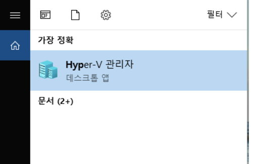
```
- hyper-v 관리자모드로 실행
```
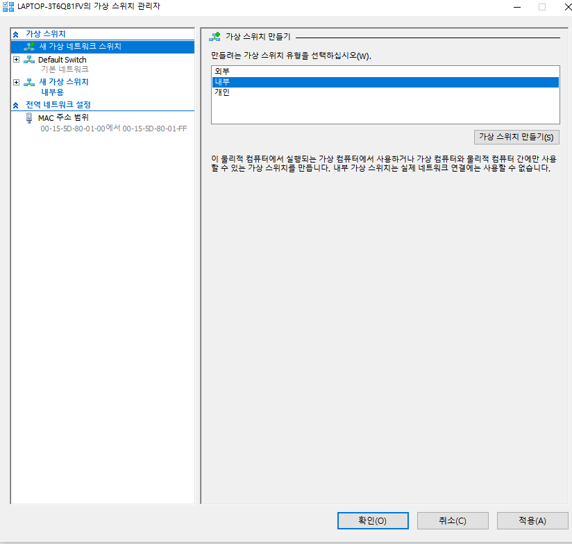
```
- 실행 후 오른쪽목록에서 가상스위치관리자를 생성 -> 내부로 생성 클릭
```
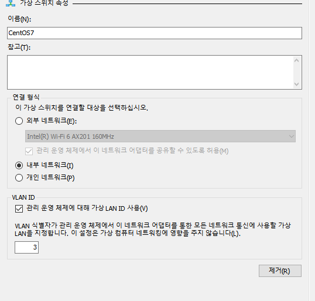
```
- 스위치의 이름을 정하고 VLAN ID를 사용하며 가상LAN을 3으로 지정
```
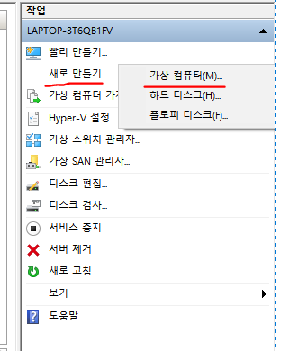
```
- 새로만들기 클릭후 가상컴퓨터 생성
```
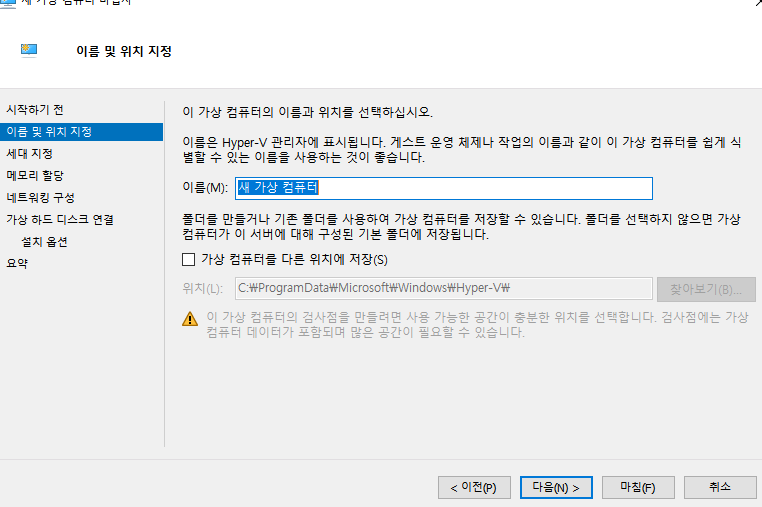
```
- 원하는 이름 입력 -> "가상 컴퓨터를 다른 위치에 저장(S)를 체크하고 개인이 원하는 위치에 Hyper-v폴더생성 후 다음 클릭
```
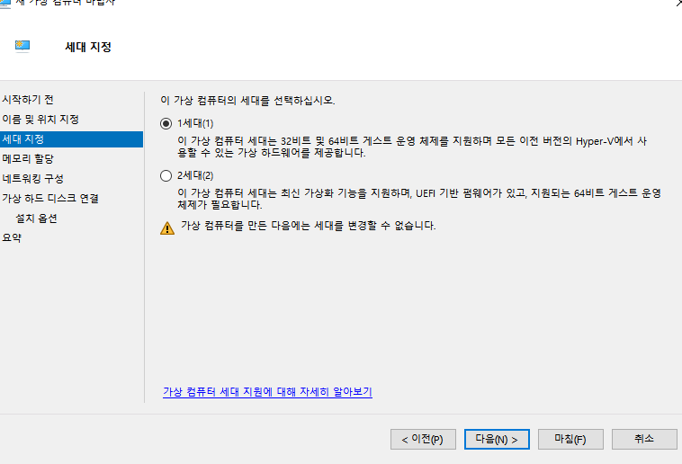
```
- 세대지정 후 다음 클릭
```
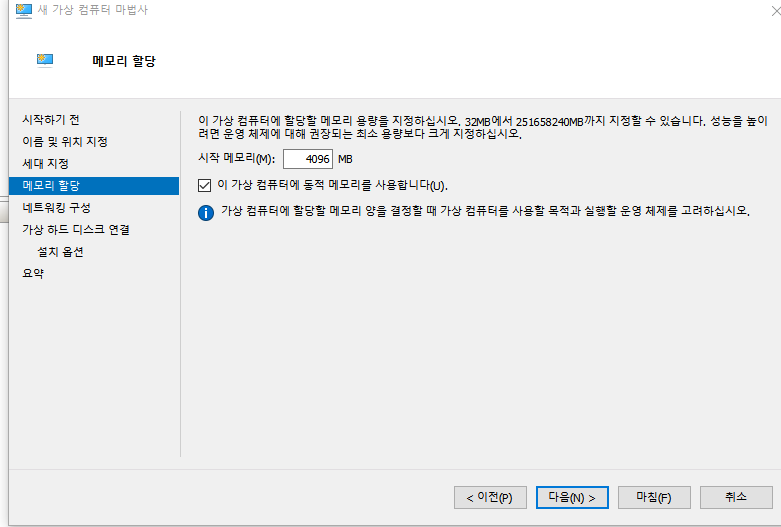
```
- 개인 컴퓨터 메모리에 따라 시작 메모리를 설정
```
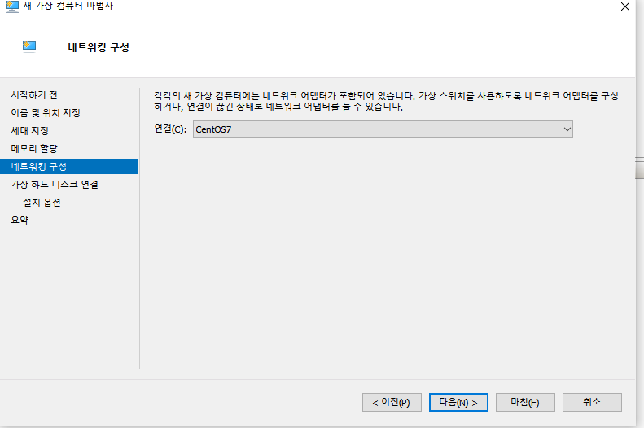
```
- 미리 만들었던 가상스위치를 연결 
```
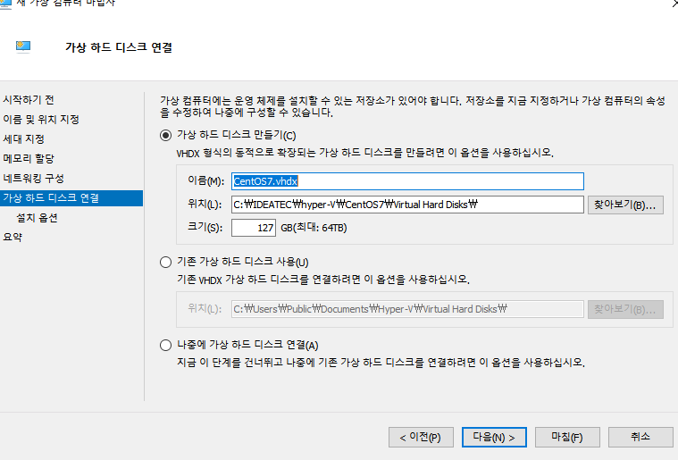
```
- 기본 default값으로 사용
```
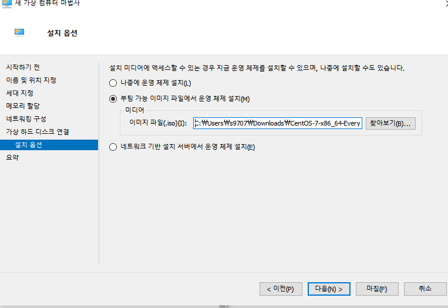
```
- 부팅 가능 이미지 파일에서 운영 체제 설치를 체크하고 미리 다운받아놓은 centOS7-iso파일 선택 후 마침 클릭
```

```
- 가상환경에 centOS7 설치완료
```
## hyper-v 에서 centOS7 설정
<br>

```
- 네트워크 설정
```
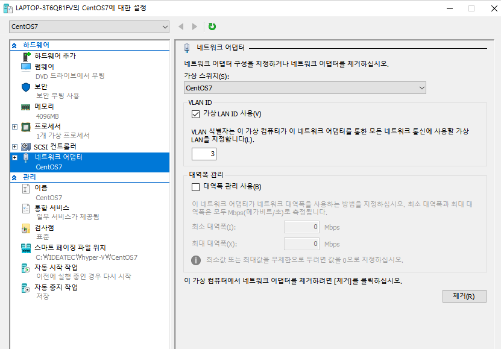
```
- hyper-v 메인화면에서 오른쪽에 연결되어있는 가상컴퓨터에 설정을 클릭하고 그림과 같이 네트워크 
어댑터를 클릭하고 설정합니다. (LAN ID)는 처음 설정한 값인 3으로 등록
```
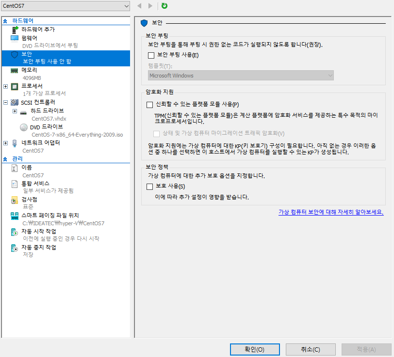
```
- 추가로 보안에서 보안 부팅 사용을 체크 해제합니다. 사용자가 리눅스 환경을 가상화 서버로 구성할 경우 리눅스는 처음부터 "보안 부팅" (Secure Boot) 을 지원하지 않으므로 이를 제거하여야 합니다.
리눅스 OS 전부 "보안 부팅" 을 지원하지 않습니다. 체크 해제하지 않을 시 에러가 발생합니다.
```
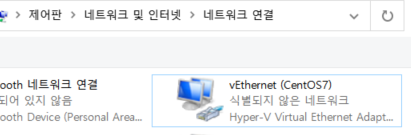
```
- 먼저 window가 hyper-v에서 만들었던 가상컴퓨터와 네트워크를 공유하도록 설정해줘야 사용이 가능합니다.
- 위와 같이 네트워크 연결창에서 자신이 사용하는 이더넷이나 WI-FI네트워크를 오른쪽 마우스클릭 -> 속성 -> 공유에서 아래와 같이 설정합니다.
```
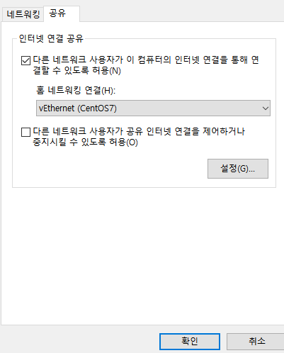
```
- 인터넷 연결 공유에서 아래와 같이 체크를 하고 "홈 네트워킹 연결"에서 생성한 가상컴퓨터 네트워크를 선택한뒤 확인
```
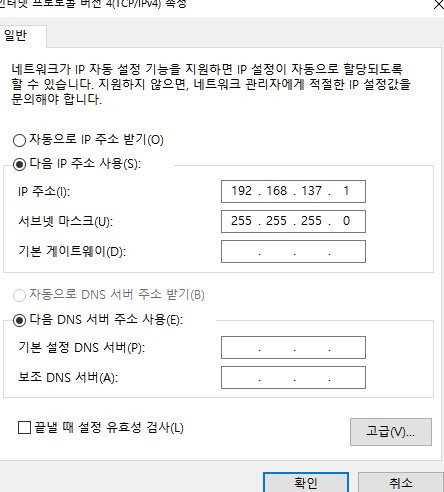
```
- 다음으로 가상컴퓨터에 네트워크설정을 위해 ip주소와 서브넷 마스크 확인 
- IP 주소끝에 1이 가상 스위치의 게이트웨이 주소입니다.
이 게이트웨이에 연결되는 가상 머신들의 IP주소는 마지막 1대신 사용자가 임의로 정해줍니다.(2~255)
```
## centOS7 네트워크 ip 설정
<br>

```
- 이제 hyper-v에서 생성한 가상컴퓨터를 실행하고 생성 시 설정했던 username과 pw로 접속합니다.
```

```
- IP를 설정하기 위해서 /etc/sysconfig/network-scripts 경로로 접속
```
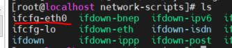
```
- 자신의 이더넷 이름확인
(ex : ifcfg-eth0 , ifcfg-ens33 등등)
```
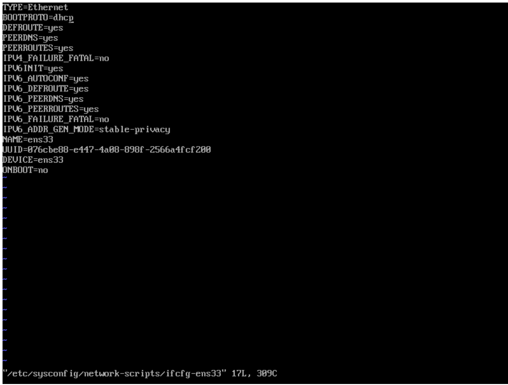
```
- 확인이되면 위와같이 vi로 접속하고 몇가지를 변경합니다.
```
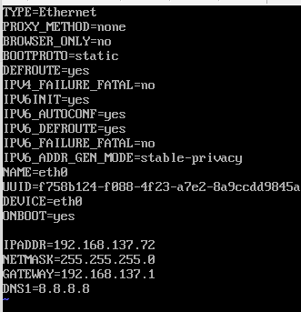

```
- 변경사항은 다음과 같습니다.

BOOTPROTO=static (DHCP를 통해 IP를 받아오지 않고 직접 설정합니다.)
ONBOOT=yes (부팅 시 등록된 IP설정을 적용합니다.)
IPADDR=192.168.137.72 (전 포스팅에서 말씀드린 GATEWAY 주소입니다. 끝자리를 72로 설정했습니다.)
NETMASK=255.255.255.0 (네트워크 주소를 찾을 수 있도록 넷마스크를 설정합니다.)
GATEWAY=192.168.137.1 
DNS1=8.8.8.8 (DNS서버 IP를 등록합니다. 저는 구글 DNS를 적용했습니다.)
```
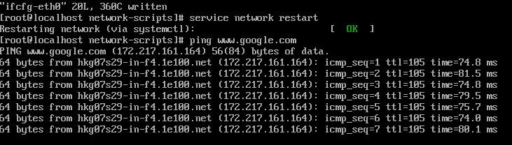
```
- 변경이 끝나면 저장된 네트워크를 재시작하고 등록했던 google ping을 보내 응답을 확인하여 설정이 잘되었는지 체크합니다.
```

## java 1.8 version install

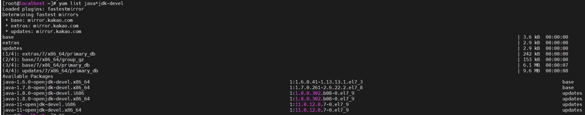

```
yum list java*jdk-devel 
```
```
- 먼저 위의 명령어를 통해서 설치가능한 jdk를 확인합니다.
```
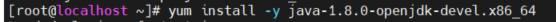
```
- java-1.8.0-openjdk-devel.x86_64를 설치합니다.
```
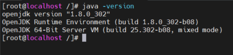
```
- 설치가 완료되면 java -version 을 통해 확인합니다. 위와 같이 뜨면 정상적으로 설치가 된 것입니다.

- 이제 jdk 환경변수 설정만 남았습니다. 먼저 which java 를 입력해서 java의 위치를 확인합니다.
```
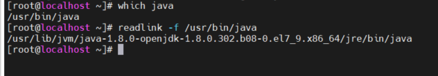
```
- 확인하면 위와 같이 심볼릭링크가나오므로 readlink -f 를 통해 실제 경로를 확인합니다.
- 그리고 vi 나 nano 편집기를 통해 ex) vi /etc/profile 입력후 환경변수 설정을 export합니다.
```
```
-환경변수 설정-

PATH=$PATH:$JAVA_HOME/bin
JAVA_HOME=/usr/lib/jvm/java-1.8.0-openjdk-1.8.0.292.b10-1.el7_9.x86_64
CLASSPATH=.:$JAVA_HOME/jre/lib:$JAVA_HOME/lib/tools.jar

export PATH
export JAVA_HOME
export CLASSPATH

```

## tomcat 8.5 version install

```
yum list tomcat 
```
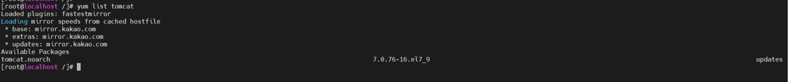
```
- 먼저 설치가능한 tomcat을 확인합니다.
- 확인해보면 목록에 패키지가 없는데 yum으로는 tomcat7 버전까지만 지원한다고 합니다.
```
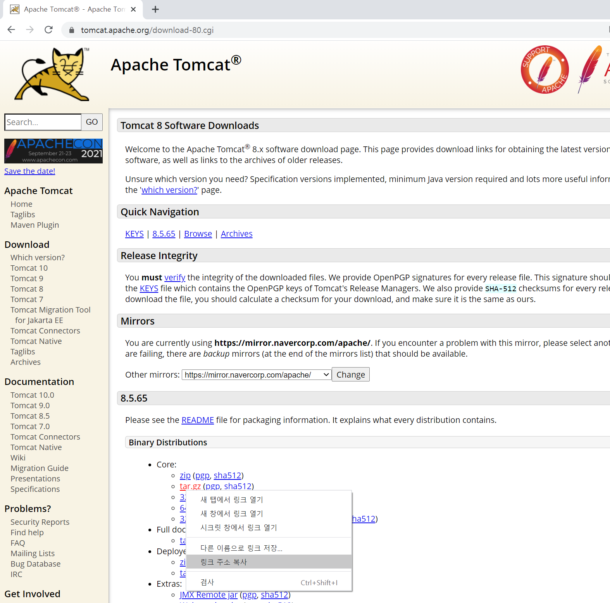
```
- 그래서 직접 http://tomcat.apache.org 로 접속해서 원하는 버전의 .tar파일 링크주소를 복사해서 가져옵니다.
```
```
[root@localhost /]# wget https://mirror.navercorp.com/apache/tomcat/tomcat-8/v8.5.70/bin/apache-tomcat-8.5.70.tar.gz

```
```
- 위와 같이 입력하여 tomcat 설치를 합니다.
```
```
[root@localhost /] # tar zxvf apache-tomcat-8.5.70.tar.gz
```
```
- 설치후 .tar 파일 압축해제 
```
```
# firewall-cmd --permanent --zone=public --add-port=8080/tcp
# firewall-cmd --reload
# firewall-cmd --list-ports
```
```
- 마지막으로 3가지를 입력해서 외부 브라우저를 통해 접속이 가능하도록 방화벽 포트 개방
```
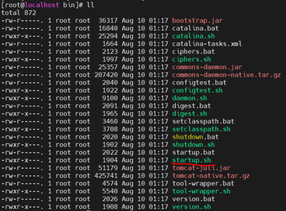
```
- tomcat에 bin파일에 접속해서 ll 을 통해 start목록을 확인하고 ./startup.sh 를 입력해서 tomcat실행
```
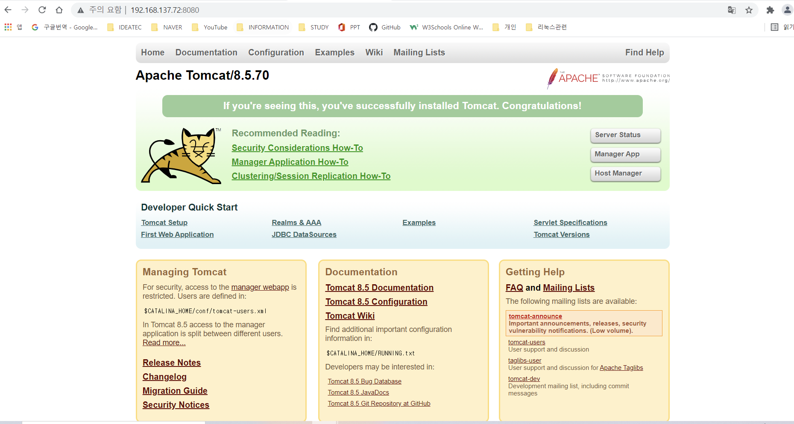
```
- http://ip주소:8080을 통해 접속이 완료되면 정상적으로 설치 완료입니다.
```

## Aaache install

```
# yum install gcc-c++
- gcc : 오픈 소스 컴파일러 컬렉션 
# yum install openssh-server openssh-clients openssh-askpass
- ssh : 보안이 강화된 서버 원격 접속 및 제어 도구
# yum install openssl openssl-devel
- ssl : 네트워크를 통한 데이터 통신에 쓰이는 프로토콜
# yum install zlib-devel
- zlib : 데이터 압축 오픈 소스 라이브러리
# yum install expat-devel
- expat : xml 파서 라이브러리
```

```
- apache install 에 필요한 패키지들부터 yum을 통해 install 해줍니다.
```

```
apache - httpd.apache.org/download.cgi#apache24
apr,apr-util - https://apr.apache.org/download.cgi
pcre - https://ftp.pcre.org/pub/pcre/

- apache , apr , apr-util, pcre 사이트 링크를 통해 각각 최신버전의 .tar파일 링크주소 복사 
```
```
# wget https://mirror.navercorp.com/apache//httpd/httpd-2.4.48.tar.gz
# wget https://mirror.navercorp.com/apache//apr/apr-1.7.0.tar.gz
# wget https://mirror.navercorp.com/apache//apr/apr-util-1.6.1.tar.gz
# wget https://ftp.pcre.org/pub/pcre/pcre2-10.37.tar.gz

# tar xvfz httpd-2.4.48.tar.gz
# tar xvfz apr-1.7.0.tar.gz
# tar xvfz apr-util-1.6.1.tar.gz
# tar xvfz pcre2-10.37.tar.gz

※ 항상 최신버전 확인 후 버전에 맞게 .tar 주소링크를 수정해서 사용합니다. 
```

### 설정

```
※ 1~5번까지 차례대로 하나씩 입력

1. pcre
# cd ./pcre2-10.37
# ./configure --prefix=/usr/local/pcre
# make
# make install

2. apr
# cd ../apr-1.7.0
# ./configure --prefix=/usr/local/apr -  에러가 발생한다. (정상)
# cp -arp libtool libtoolT - 입력 후 
# ./configure --prefix=/usr/local/apr - 다시 입력하면 에러가 해결됨.
# make
# make install

3. apr-util
# cd ../apr-util-1.6.1
# ./configure --prefix=/usr/local/aprutil --with-apr=/usr/local/apr
# make
# make install

4. apr-1.7.0과 apr-util-1.6.1은 ./httpd-2.4.46/srclib/ 안에 디렉토리명을 바꿔서 넣어줍니다.
# mv apr-1.7.0 ./httpd-2.4.48/srclib/apr
# mv apr-util-1.6.1 ./httpd-2.4.48/srclib/apr-util

5. apache 
# cd ../httpd-2.4.48
# ./configure \
--prefix=/SW/web/httpd-2.4.48 \
--with-mpm=worker \
--with-pcre=/usr/local/pcre/bin/pcre-configure \
--with-apr=/usr/local/apr \
--with-apr-util=/usr/local/aprutil \
--with-ssl=/usr/bin/openssl \
--enable-module=so \
--enable-so \ --enable-rewrite=shared \
--enable-ssl=shared \
--enable-deflate=shared \
--enable-cache=shared \
--enable-disk-cache=shared \
--enable-mem-cache=shared \
--enable-proxy \
--enable-unique-id \
--enable-asis=shared \
--enable-headers \
--enable-logio=shared \
--enable-expires=shared \
--enable-status=shared \
--enable-auth-digest \
--enable-lib64
--libdir=/usr/lib64
# make
# make install

- configure : 소스파일에 대한 환경설정(서버 환경에 맞춰 makefile 생성)
- make : 소스 컴파일(설치 파일 생성)
- make instatll : make 통해 만들어진 설치 파일을 설치.

```

### 실행
```
# firewall-cmd --permanent --zone=public --add-port=80/tcp
# firewall-cmd --reload
# firewall-cmd --list-ports
- apache 80포트 방화벽 개방을 해줍니다.
```
```
# (apache 파일경로)/bin/apachectl start
- 실행합니다.
# ps -ef | grep httpd
- 정상적으로 돌아가는지 확인합니다.
```

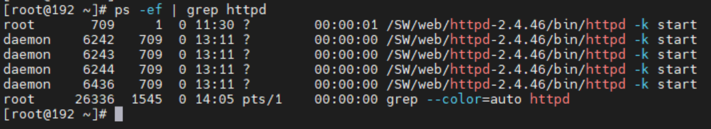


