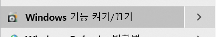

## linux java-1.8, tomcat8.5 install / hyper-v , centOS7

### hyper-v란?
```
windows server2008부터 기본적으로 제공되는 가상화솔루션으로 가상화기술을 사용하여,
가상화된 컴퓨팅환경을 만들고 관리할 수 있는 인프라를 제공한다.
```
### hyper-v 세팅 



- window 검색창에 window를 검색 -> window 기능켜기/끄기 클릭


- 위와 같이 창이뜨면 Hyper-v를 체크하고 컴퓨터 재부팅


- hyper-v 관리자모드로 실행


- 실행 후 오른쪽목록에서 가상스위치관리자를 생성 -> 내부로 생성 클릭


- 스위치의 이름을 정하고 VLAN ID를 사용하며 가상LAN을 3으로 지정


- 새로만들기 클릭후 가상컴퓨터 생성


- 원하는 이름 입력 -> "가상 컴퓨터를 다른 위치에 저장(S)를 체크하고 개인이 원하는 위치에 Hyper-v폴더생성 후 다음 클릭


- 세대지정 후 다음 클릭


- 개인 컴퓨터 메모리에 따라 시작 메모리를 설정


- 미리 만들었던 가상스위치를 연결 


- 기본 default값으로 사용


- 부팅 가능 이미지 파일에서 운영 체제 설치를 체크하고 미리 다운받아놓은 centOS7-iso파일 선택 후 마침 클릭


- 가상환경에 centOS7 설치완료


