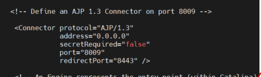

## Mod_jk 방식

- apache , tomcat 연동을 하기 위한 모듈 
- AJP 프로토콜을 이용해 요청 중 톰캣이 처리할 요청을 AJP포트를 통해 tomcat에 전달하고 응답받는 역할을 수행 

### 설치

기본적으로 apache , tomcat 필요
```
# yum install -y httpd
```
- 먼저 (http://tomcat.apache.org) tomcat 웹사이트에서 tomcat connectors 메뉴에서 최신버전의 connector 링크 주소 복사를 통해 가져와서 설치하고 압축파일을 풉니다. 

```
# wget tomcat-connectors의 최신버전링크

# tar xvfz tomcat-connectors-버전-src
```

```
# cd ./tomcat-connectors-버전-src/native/
# ./configure --whth-apps=/bin/apxs
# make
# make install
```

- 위에 작업을 모두 마쳤으면 설치를 확인합니다.
```
/SW/web/httpd-2.4.48/modules/mod_jk.so
```


## centOS7 - apache + tomcat connector

<br>

- tomcat 설정파일 server.xml파일 안에 주석처리 되어있는 AJP포트 설정을 주석해제

<br>



<br>


- 주석을 지우고 tomcat을 재기동하면 8009포트를 netstat상에서 확인가능.

```
vi 나 nano를 통해 apache(httpd) /conf/httpd.conf 설정 파일을 수정합니다.
```


<br>


- apache와 연동할 tomcat 을 설정하는 파일 생성

```
vi 나 nano를 통해 httpd/conf/workers.properties 접속 후 내용추가
```


<br>

- 모두 완료되었으면 tomcat 과 apache 재기동 하고 웹브라우저에 :8080 포트없이 본인 IP만으로 접속확인


