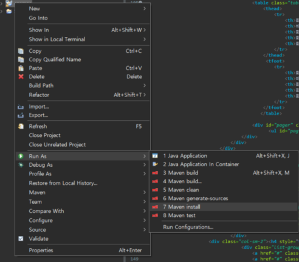
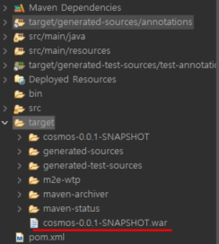
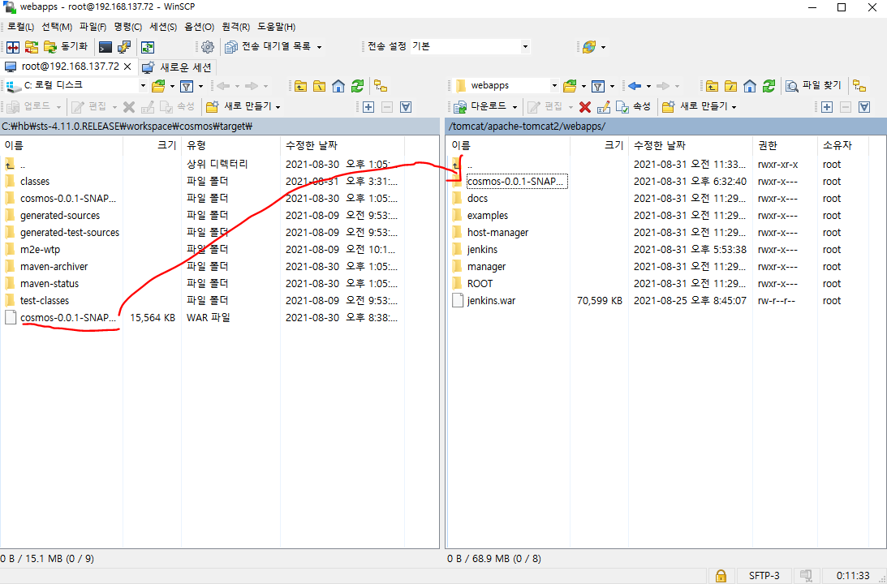
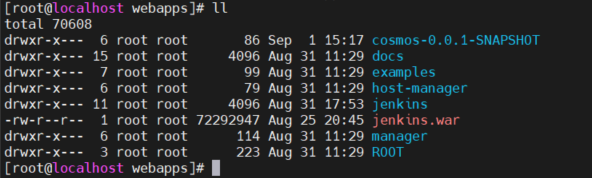

## War File Tomcat 배포하기
### (linux(centos7) , java1.8 , tomcat8.5 , apache tomcat connector)

```
- 먼저 war 파일을 배포하기 위해서 프로젝트.war파일을 sts에서 가져와야합니다.
```


```
- 방법은 sts상에서 war파일로 배포할 본인의 프로젝트를 우클릭해서 sts 기준 Run As -> Maven install 클릭
```

```
- 그럼 경로상 project target 디렉토리안에 위와 같은 .war 파일이 생성됩니다.
```

```
※ winSCP는 다운받아서 간단하게 개인 ip와 username ,pw 등록후 사용가능합니다.
- 생성된 war 파일을 winSCP를 통해서 .war파일을 linux tomcat 디렉토리에 webapps 디렉토리안에 넣어줍니다.
```

```
- 전송이 완료되면 tomcat을 재기동하면 자동으로 war파일 압축이 풀립니다.
```
```
- 마지막으로 tomcat홈 디렉토리 /conf/server.xml에서 설정을 추가해줍니다.
```
```
<Host name="192.168.137.72"  appBase="webapps"
            unpackWARs="true" autoDeploy="true">
    <Context path="/" docBase="cosmos-0.0.1-SNAPSHOT" reloadable="true"/>    
<Host>          
```
```
- 모든 설정을 마무리했으면 tomcat 재기동
- 본인 ip:8080/로 요청을 하면 본인이 war파일로 넣었던 프로젝트의 메인화면이 웹 브라우저에 송출됩니다.
```

