## linux (centos7) - jenkins 설치 

```
- jenkins로 tomcat 연동 후 자동 빌드환경 구축까지의 설치조건 
- 기본적으로 java 8 버전과 tomcat에 war파일 배포가 완료되어 있어야 합니다.
```
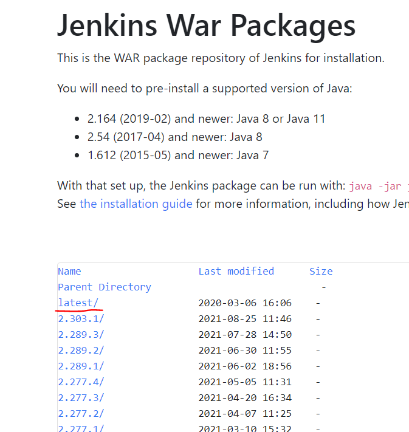

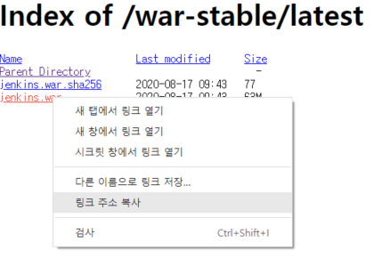
```
- jenkins download - https://get.jenkins.io/war-stable/
- 위 링크를 통해 최신버전의 jenkins.war 파일의 링크 주소 복사를 합니다.
```
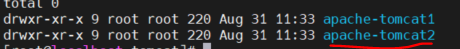

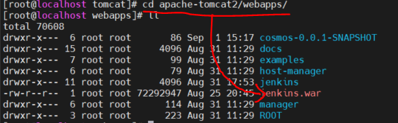
```
- tomcat을 통해 실행하기 위해서는 tomcat 디렉토리를 복사합니다.
- 복사한 디렉토리안에 webapps 디렉토리안에서 jenkins를 설치합니다.
```
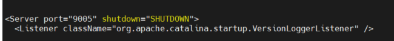

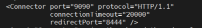
```
- vi 나 nano 편집기를 통해 복사한 tomcat 디렉토리/conf/server.xml 을 접속
- 위와 같이 포트충돌 방지를 위해 수정해줍니다.
- 이제 새로 개방한 9090포트의 방화벽을 열어 줍니다.
# firewall-cmd --permanent --add-port=9090/tcp
# firewall-cmd --reload
- 그 후 tomcat을 실행하면 자동으로 .war파일의 압축이 풀립니다.
```
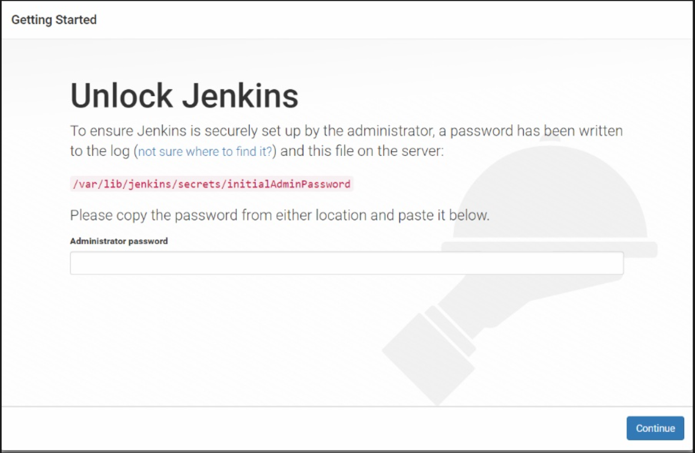
```
- 이제 tomcat을 재기동하고 본인의ip:9090(지정한포트번호)로 접속하면 위와 같은 화면이 뜹니다.
- 초기비밀번호가 있는데 이미지에서 가르쳐주는 /var/lib...으로 vi 나 nano를 통해 접속합니다.
- 접속 후 비밀번호를 copy and paste 합니다.
```
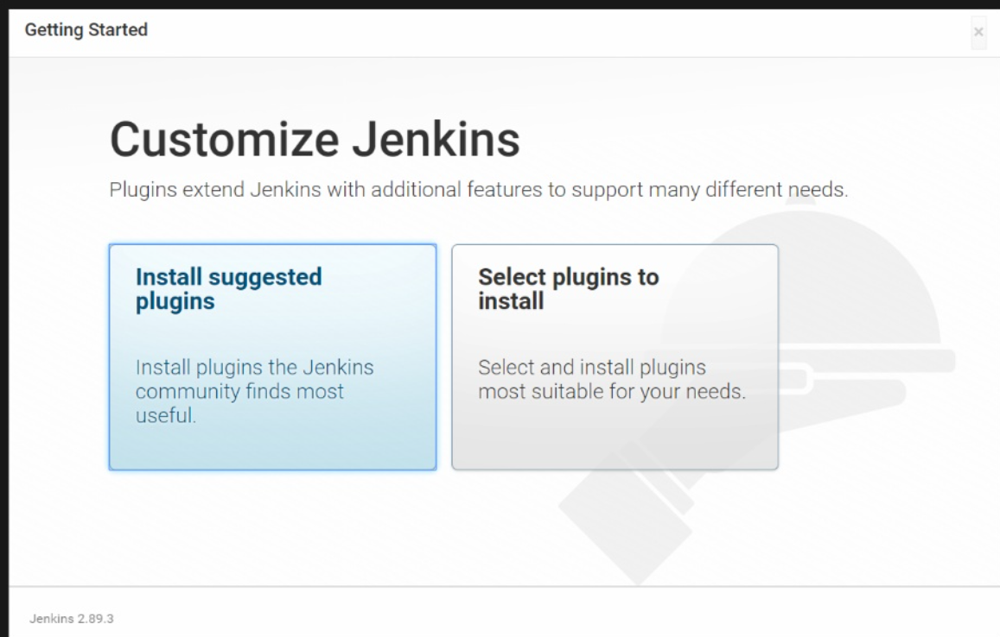
```
- install suggested plugins 합니다.
```
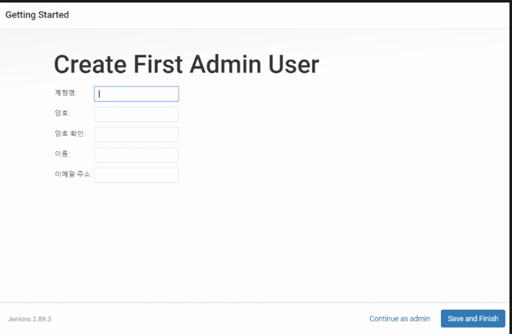
```
- 계정을 생성합니다.
```
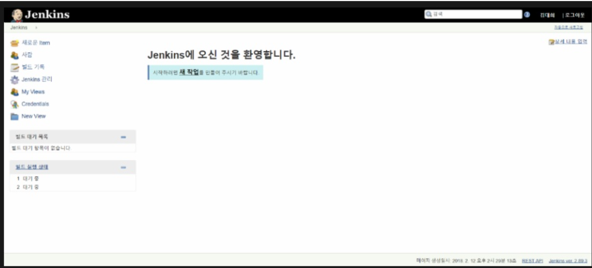
```
- 위와 같이뜨면 설치는 마무리입니다.
```

## jenkins 자동빌드 배포환경 구축하기
<br>

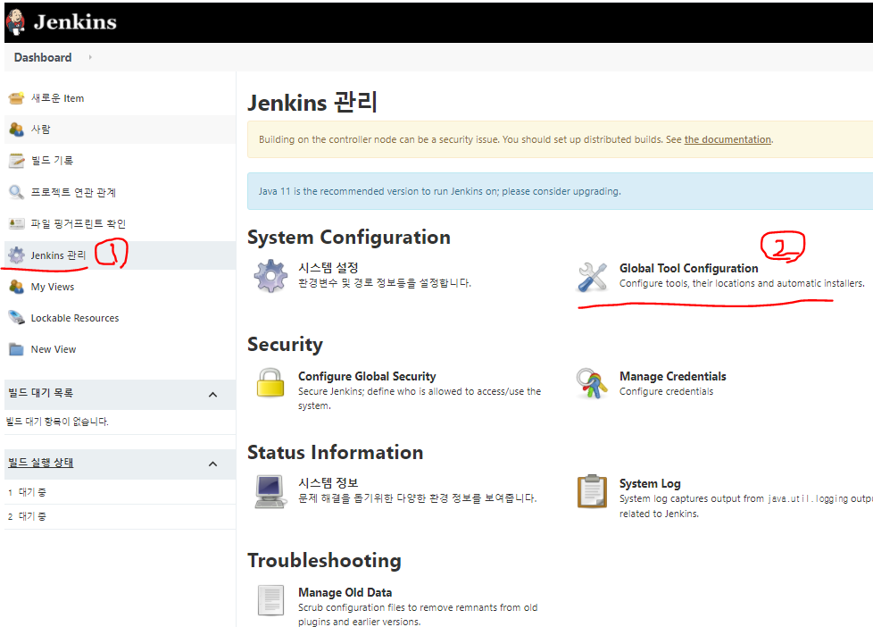
```
- 설치시 등록한 계정으로 로그인 후 jenkins 관리 -> Global Tool Configuration 클릭
```
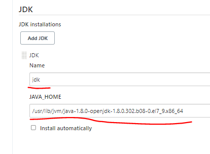
```
- Install automatically : 비활성화
- Name : 자유롭게 작성
- JAVA_HOME : jenkins 서버의 JAVA_HOME 경로 기입
```
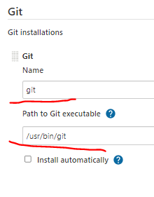
```
- Install automatically : 비활성화
- Name : 자유롭게 작성
- Path to Git executable : jenkins 서버의 git 경로 
※ 미설치시 #yum install git 
```
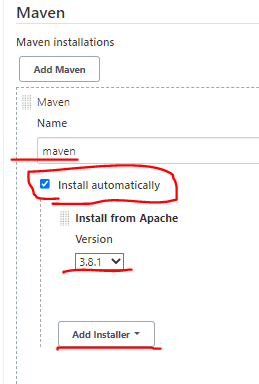
```
- Install automatically : 활성화
- Name : 자유롭게 작성
- Version : 되도록 배포하고자하는 메이븐프로젝트 버전과 일치시켜준다.
```

### 빌드배포를 수행하는 job 설정
<br>

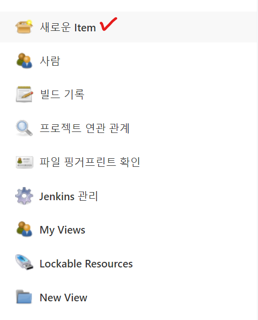
```
- 새로운 ltem 클릭
```
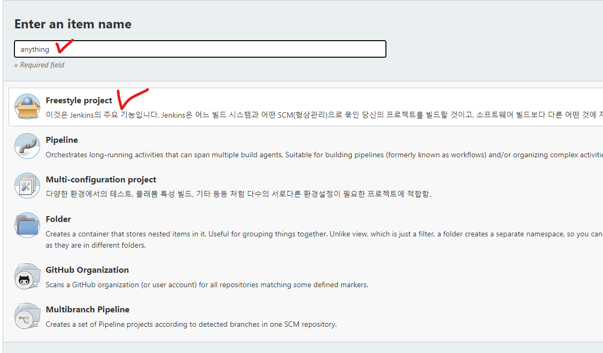
```
- name 설정 후 Freestyle project 클릭
```
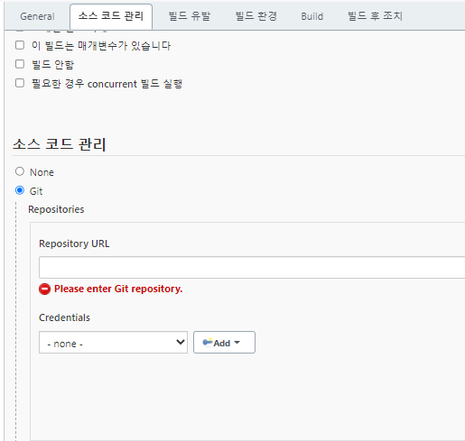
```
- 소스 코드 관리탭 클릭후 관리에서 None 말고 Git 클릭
- 본인의 git Repository URL 작성 
```
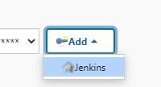
```
- Credentials 에서 Add 클릭 -> jenkins 선택 
```
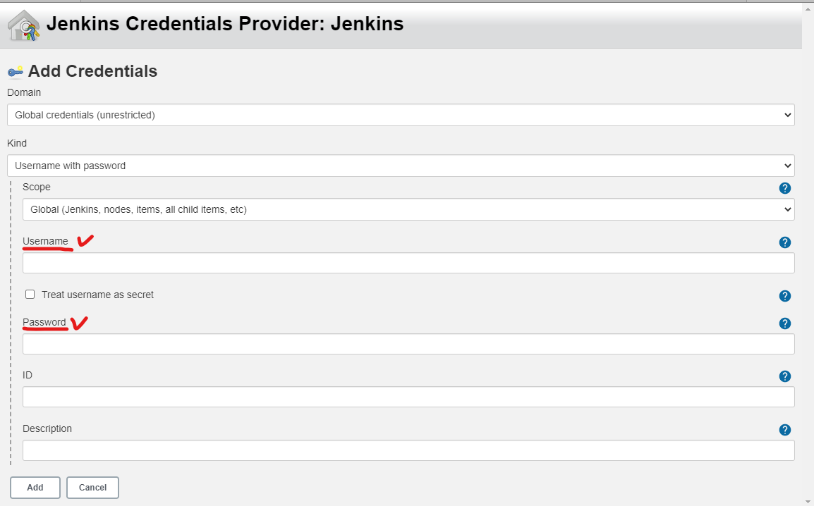
```
- 본인 git계정 Username , password 작성 후 Add
```
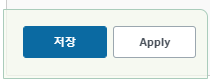
```
- Apply 후 저장 클릭
```
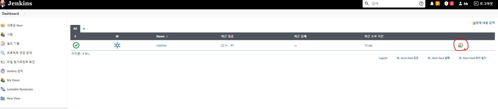
```
- 빌드완료 후 빨간색 동그라미 버튼 클릭 후 빌드 실행 
```
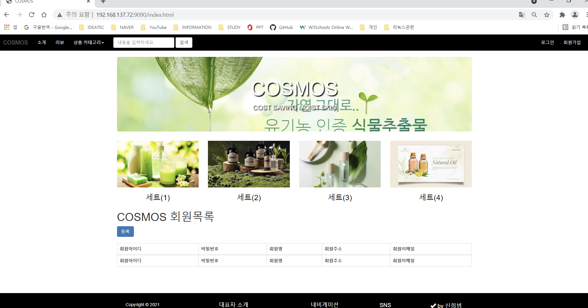
```
- 최종 실행화면
```
