# 1. Git push할때마다 webhook을 통해 jenkins 자동빌드 
# 2. jenkins빌드 후 war 파일을 SSH를 통해 tomcat 서버에 자동배포

<br>

```
- 이전 jenkins 설치 및 tomcat 자동 빌드환경 구축 설정에 이어서 하겠습니다.
```

## Git push -> jenkins 자동빌드
<br>

## Webhook이란?
<br>

```
- 앱 to 앱으로 실시간 정보를 제공하는 방법. Web callback, HTTP push API, 역방향 API라고 할수 있습니다.
- 전형적인 API를 통해 실시간으로 데이터를 가져오려면 자주 호출하거나 떙겨오는작업을 해야 하지만, 이 방식을 사용하면 즉시 데이터를 얻을 수 있습니다.
```
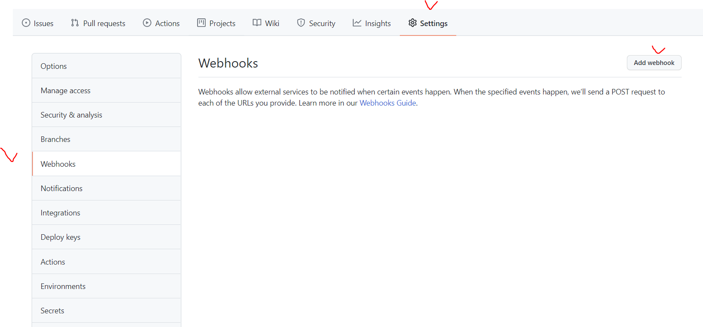

```
- 먼저 본인의 git에서 settings -> webhooks -> Add webhook을 클릭합니다.
```

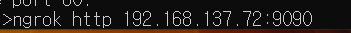


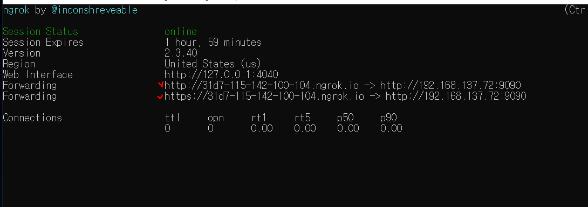

```
- webhook을 설정할때 본인의 jenkinsIP가 외부에서 접근이 가능하도록 열려 있어야 합니다. 
- 저는 포트 포워딩과 같은 네트워크 환경 설정 변경없이 로컬에 실행중인 서버를 안전하게 외부에서 접근 가능하도록 해주는 도구인 "ngrok" 를 통해 저의 jenkins ip를 외부에서 접근 가능하도록 했습니다.
- ngrok 사용방법은 google에 엄청 많고 간단합니다.
- 다시 Webhook 설정으로 돌아가겠습니다.
```
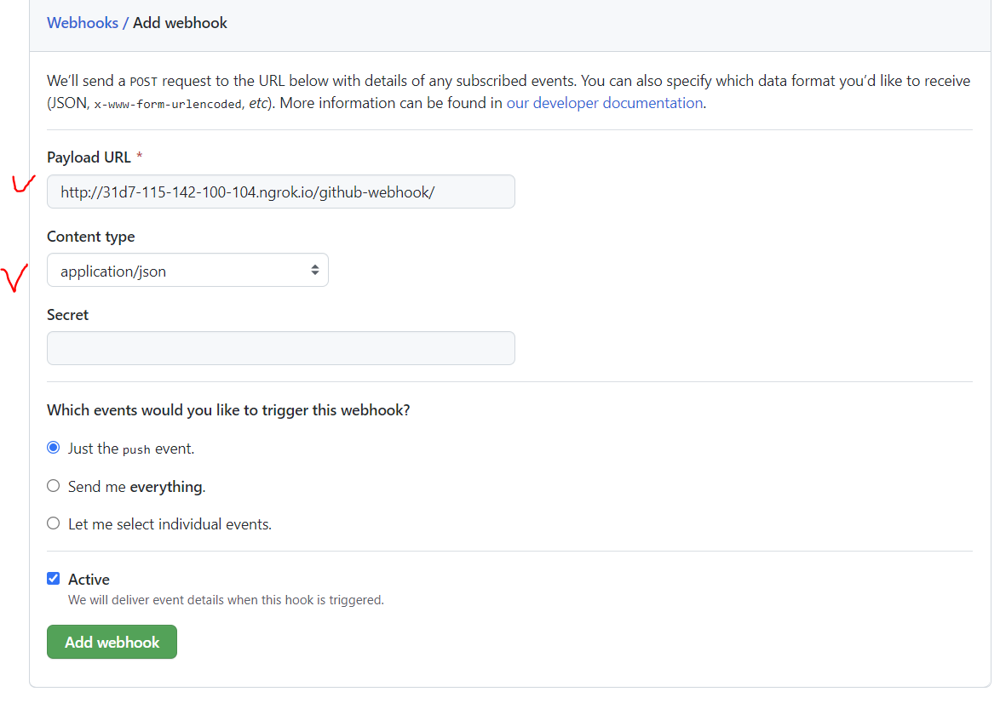

```
- 2가지만 설정합니다.
- Payload URL : http://"jenkins IP"/github-webhook/을 입력합니다.
- Content type : application/json <- 바꾸지않고 기본값으로 써도 상관없습니다.
- 그 후 Add webhook 을 클릭합니다.
```
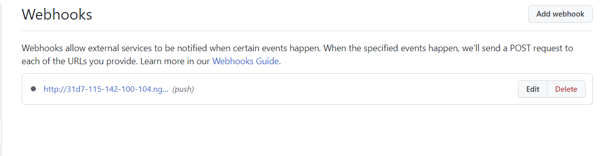

```
- 설정이 완료되면 위와 같이 webhook이 생성됩니다.
```

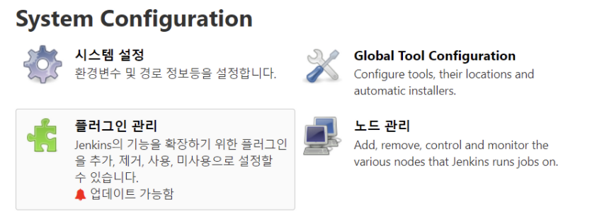
```
- jenkins로 돌아와서 git 연동에 필요한 플러그인부터 설치합니다.
```

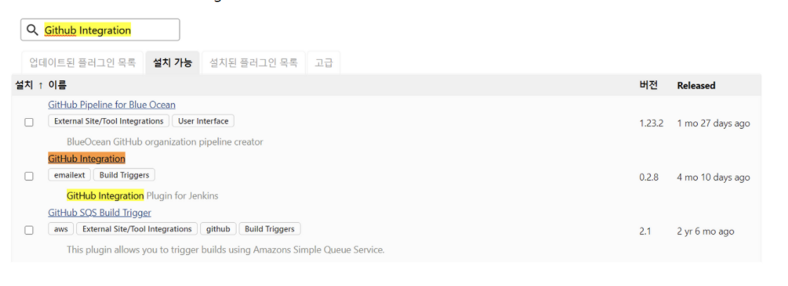
```
- 설치 가능탭에서 github 통합플러그인 검색 후 설치합니다.
```
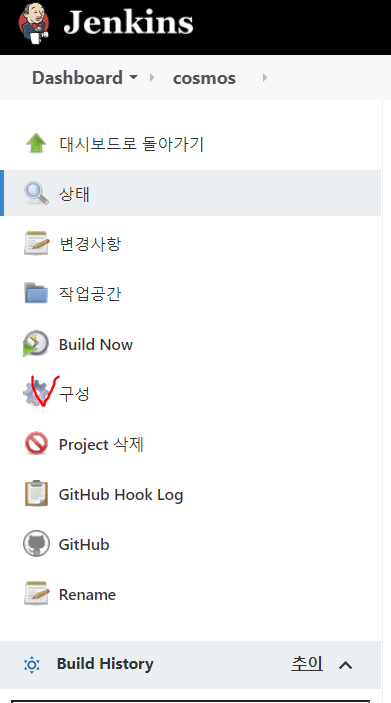
```
- 플러그인 설치가 완료되면 본인의 project의 구성을 클릭합니다.
```

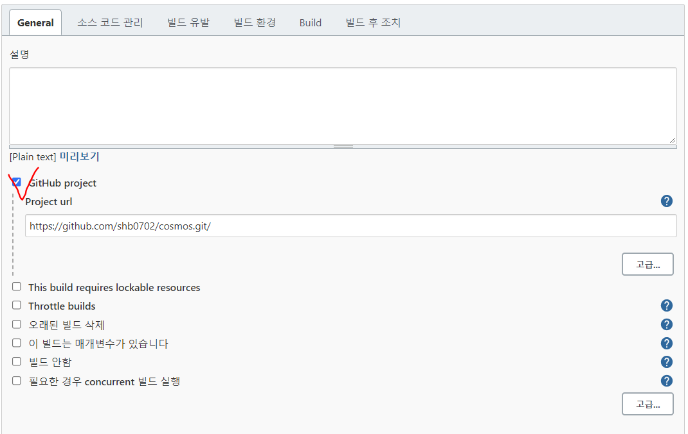

```
- GitHub project 체크 후 본인의 project git url 을 입력합니다.
```
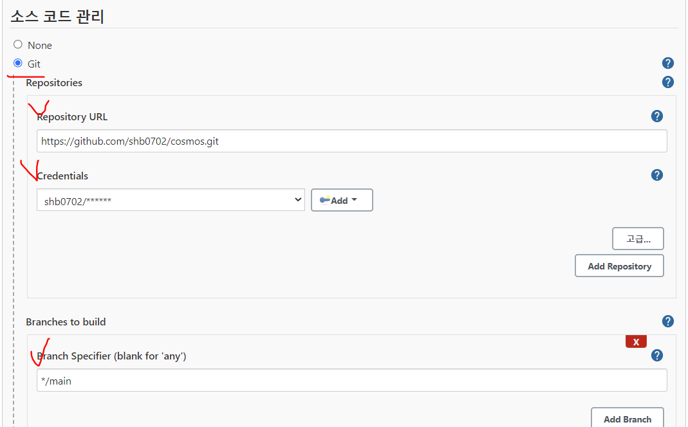

```
- 다음으로 소스 코드 관리에서 Git 체크합니다.
- Repository URL : 본인이 jenkins에 연동할 git url 작성합니다.
- Credentials 는 바로 밑에서 확인합니다.
- Branch Specifier : 본인이 사용하는 git branch 입력합니다.
```
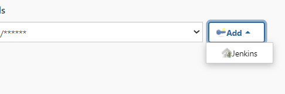

```
- Credentials : Add -> jenkins 클릭합니다.
```

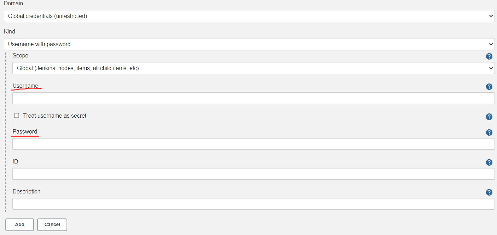

```
- Username : 연동하는 깃에서 사용하는 git id,email주소 말고 git name 입력합니다.
- Password : git 계정 password or token
```

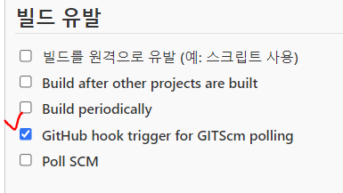
```
- 기본적으로 이전에 jenkins 관리 -> 플러그인 관리에서 Git plugin GitHub plugin 은 설치합니다.

- 바로 아래 빌드유발에서는 git hook 을 자동관리해주는 "GitHub hook trigger for GITScm polling" 체크합니다.
```
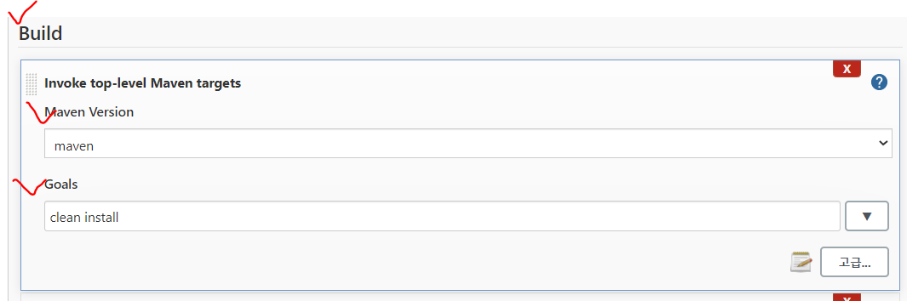
```
- Build 에서는 Maven프로젝트이기때문에 Invoke top-level Maven targets 추가
- Maven Version : 앞서 환경설정에서 추가한 Maven 선택
- Goals : 빌드 후 어떤 작업을 실행할지 입력하는데 저는 clean과 배포를 위한 install을 입력했습니다. 
```

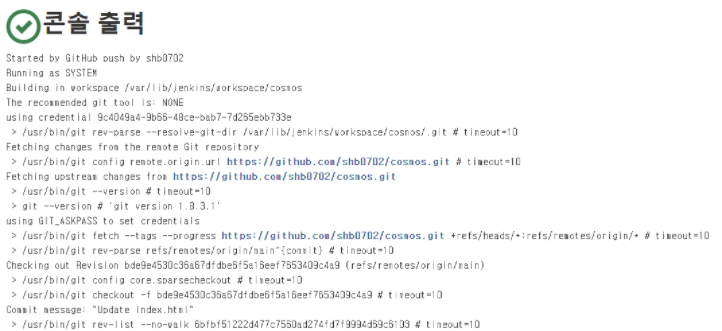

```
- 저장하고 git push후 jenkins가 자동빌드되고 console에서 자동빌드되고 배포준비가 완료됩니다.
```

## jenkins 자동빌드 후 war 파일을 SSH를 통해 tomcat 서버에 자동배포
<br>


```
- 다시 플러그인 관리를 클릭합니다.
```
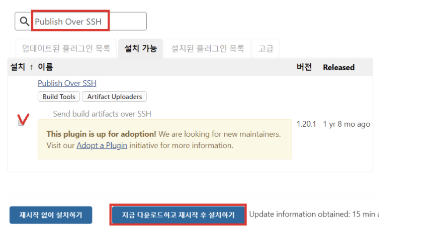
```
- 설치 가능탭에서 Publish Over SSH 입력 후 지금 다운로드하고 재시작 후 설치하기 클릭합니다.
```
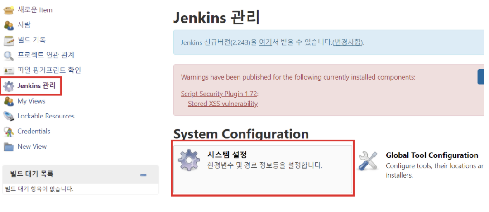
```
- 다시 jenkins관리 -> 시스템 설정으로 이동합니다.
```
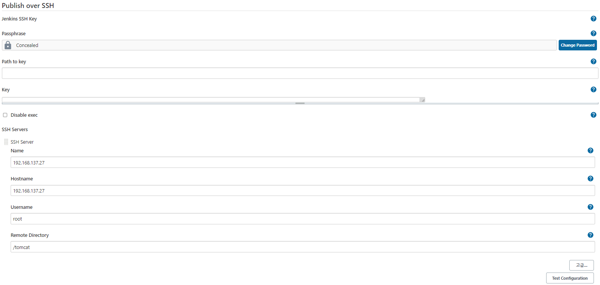
```
- SSH Server 설정
- Name : 원하는 이름
- HoshName : 원격서버의 host IP Address
- UserName : 원격서버의 접속계정
- Remote Directory : 배포할 서버의 기본 디렉토리, 파일 업로드할 기본 디렉토리 Path 
(저는 tomcat 서버에 webapps에 배포가 되어야 톰캣 실행시 자동으로 .war파일의 압축이 풀려 배포가 완료되는 과정이기때문에 저의 linux상 경로는 /tomcat/webapps 였으므로 /tomcat을 입력했습니다.)
```

```
- 다시 프로젝트의 구성을 클릭합니다.
```
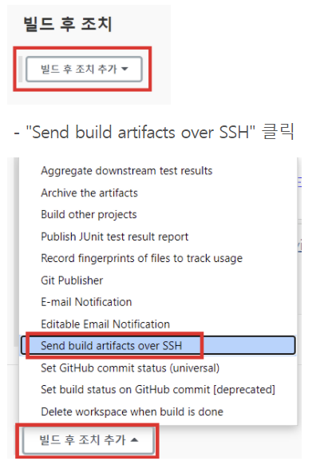
```
- 하단으로 내려와 빌드 후 조치에서 "Send build artifacts Over SSH" 를 클릭합니다.
```
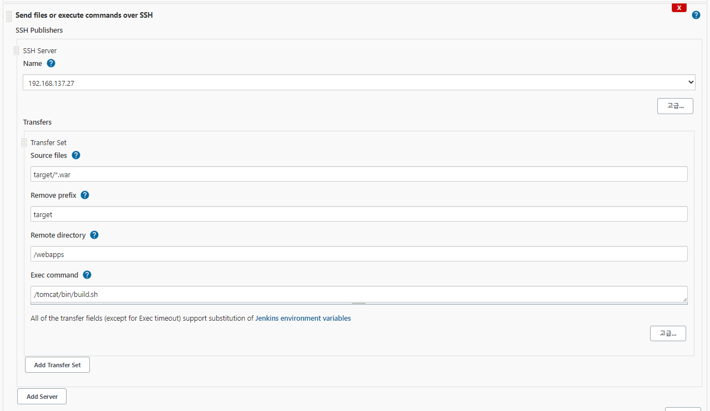
```
- SSH server Name : 환경설정에서 지정했던 Name 선택
- Source files : 전송할 파일을 지정합니다. 
- Remove prefix : Source files에서 지정한 경로의 하위폴더를 지우는 기능
(target을 입력하면 target 안에 .war파일만 전송됩니다.)
- Remote directory : 앞서 환경설정에서 설정했던 Path /tomcat의 하위디렉토리 즉 전 webapps가 됩니다.
- Exec command : 파일 전송이 모두 끝난 이후에 SSH server로 지정한 서버에서 실행될 스크립트를 입력할 수 있습니다.
```
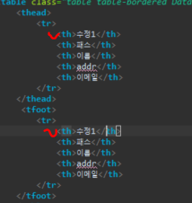
```
- 설정을 마치고 결과 확인을 위해 저의 sts project의 html파일을 수정해보겠습니다.
```
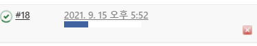
```
- git push를 해보면 자동빌드가 되고 
```
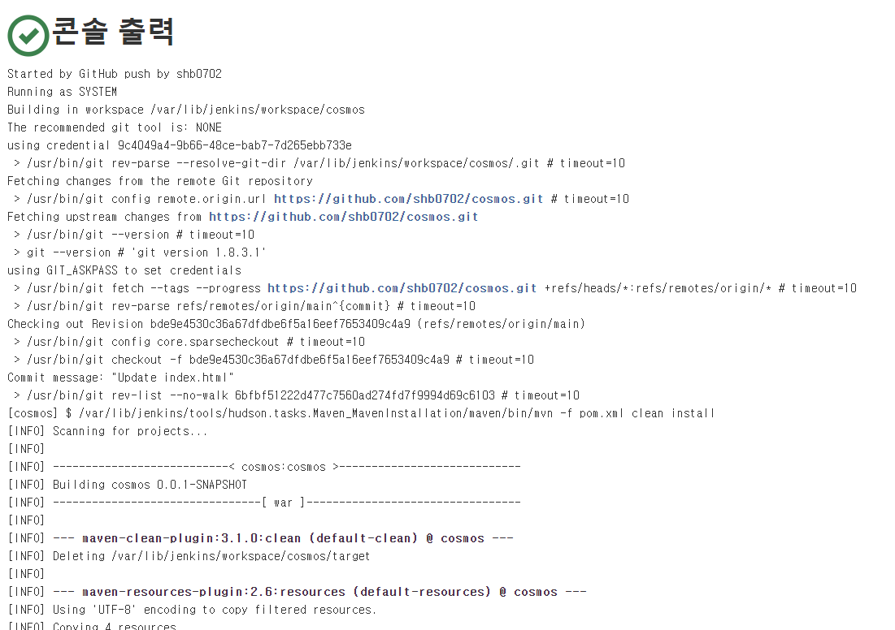

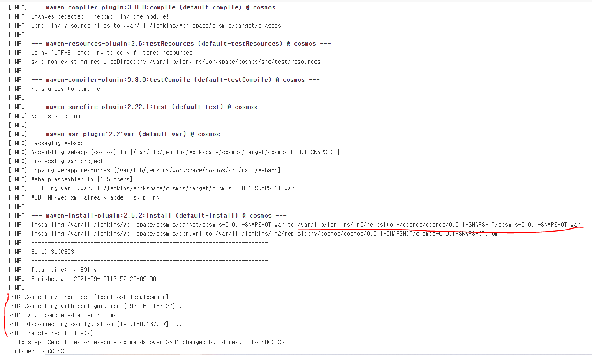
```
- 정상적으로 자동빌드 및 ssh를 통한 war파일전송이 됩니다.
```
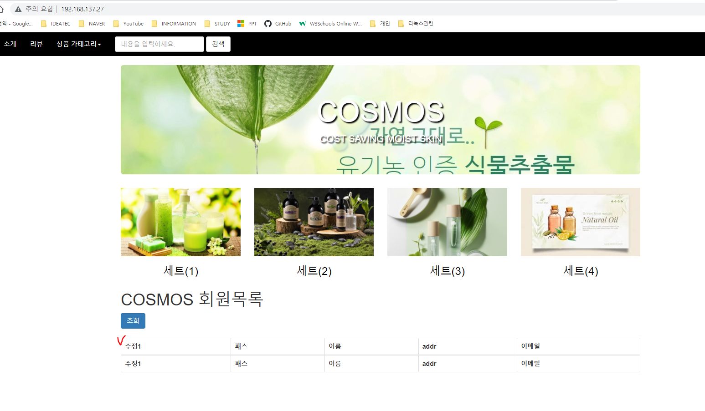
```
- war파일이 배포된 tomcat서버 ip주소로 가보면 정상적으로 반영된것을 확인 할 수 있습니다.
```
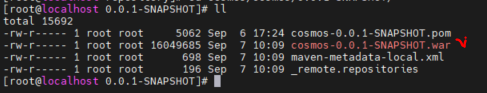
```
- 추가로 linux 상에서도보면 자동빌드후 jenkins 서버에 war파일이 압축되고
```
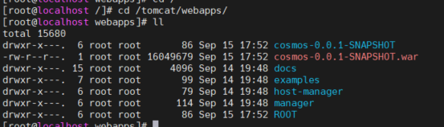
```
- 전송된 tomcat 서버에도 지정한 /tomcat/webapps에 .war압축파일이 전달되어 tomcat 실행후 압축해제 된 것을 확인했습니다.
```