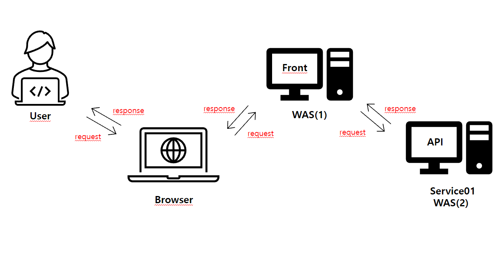
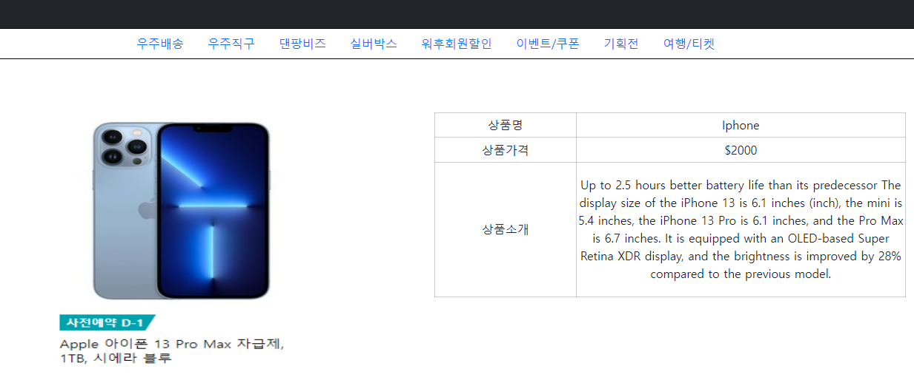
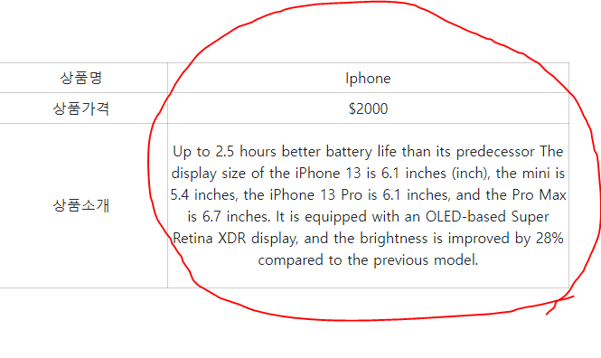
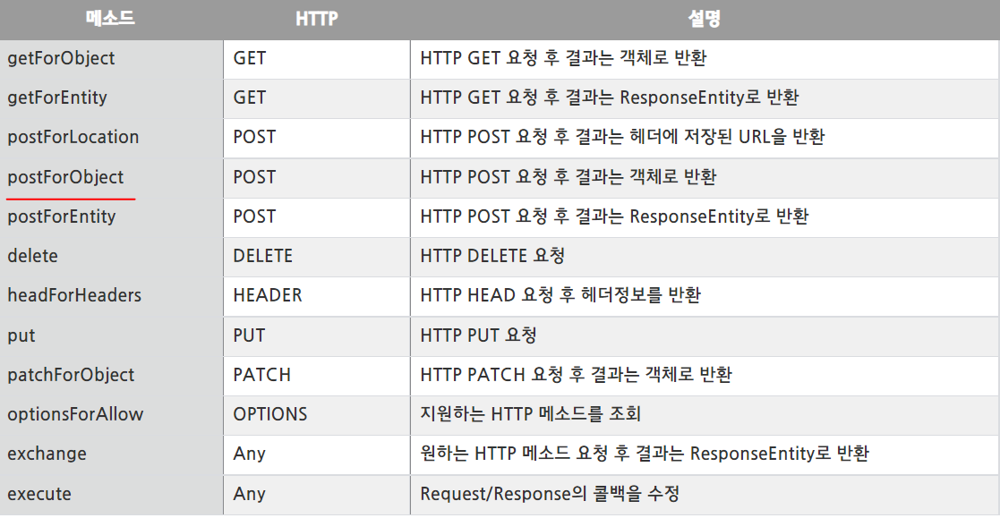

## 1. Architecture
<br>



```
아키텍처 구조는 그림과 같습니다. User가 Browser에 요청하면 Browser에서 WAS1(front)로 request를 보내고 WAS2(API)에서 받습니다. 이후 WAS2에서 생성된 API값을 WAS1에 Response 하고 WAS1에서는 Browser로 Response 한 뒤 최종적으로 User까지 Response 합니다.
```

## 2. SourceCode Explanation
<br>



```
<div class="container">
	 		<div class="row"style="text-align: center" >
		      <div class="col-md-6">
		      	<a href="#"></a>
		      </div>
			<div class="col-md-6">
			<table >
				<tr>
					<td id="td1">상품명</td>
					<td class="prodName"></td>
				</tr>
				<tr>
					<td id="td1">상품가격</td>
					<td class="prodPrice"></td>
				</tr>
				<tr>
					<td id="td1">상품소개</td>
					<td class="prodIntrod"></td>
				</tr>
			</table>
			</div>	
		  </div>
	 	</div>	
```
```
- 먼저 html 코드입니다. 간단하게 이미지 넣고 <tr>,<td> 사용해서 상품 카테고리 추가했습니다.

- User -> Browser 요청입니다.
```
```
$(document).ready(function() {
	  $.ajax({
		type: "POST",
        url:'http://"외부서버IP":8080/demo/list',
        dataType: 'json',
        success: function (data) {
		console.log(data);
		setData(data);
       }
  });
```
```
- Browser에서 요청이 들어오면 .ready가 실행되면서 ajax가 실행됩니다.

- 전송 type 은 POST, URL 을 통해 함수가 SUCCESS 시 JSON 타입으로 Controller에 요청합니다.
```
```
package api.gtw.web;

import org.springframework.http.HttpStatus;
import org.springframework.http.ResponseEntity;
import org.springframework.web.bind.annotation.CrossOrigin;
import org.springframework.web.bind.annotation.PostMapping;
import org.springframework.web.bind.annotation.RequestMapping;
import org.springframework.web.bind.annotation.RestController;
import org.springframework.web.client.RestTemplate;

import api.gtw.vo.DemoVo;


@RestController
@RequestMapping(value = "/demo")
public class DemoController {
	
	
	@PostMapping(value = "list")
	public ResponseEntity<?> testList(){
		
			DemoVo demoVo = new DemoVo();
			demoVo.setProdName("1");
			demoVo.setProdPrice("2");
			demoVo.setProdIntrod("3");
			
			RestTemplate restTemplate = new RestTemplate();
			
			DemoVo dd = null;
			
			try {
			 dd = restTemplate.postForObject("http://"내부서버IP":48080/api/list", demoVo, DemoVo.class);
			}catch(Exception e){
				System.out.println("catch error : ");
				e.printStackTrace();
			}
			
		return new ResponseEntity<>(dd, HttpStatus.OK);
	
	}
}
```
```
package api.gtw.vo;

import java.io.Serializable;

import lombok.Data;

@Data
public class DemoVo implements Serializable{

	private static final long serialVersionUID = 1L;
	
	private String prodName;
	private String prodPrice;
	private String prodIntrod;	
}
```
```
- 앞서 Browser에서 URL을 통해 한 요청을 testList()가 받고 Vo를 생성, Controller에서 Vo를 통해 넘겨줄 parameter값을 demoVO에 set 합니다. 

- 이제 API WAS에 있는 API값을 return 받기 위해서 RestTemplate을 생성합니다.

※ RestTemplate :RestTemplate은 Spring 3.0 부터 지원하는 템플릿으로 Spring에서 HTTP 통신을 RESTful 형식에 맞게 손쉬운 사용을 제공해주는 템플릿입니다. Rest API 서비스를 요청후 응답 받을 수 있도록 설계되었으며 HTTP 프로토콜의 메소드(ex. GET, POST, DELETE, PUT)들에 적합한 여러 메소드들을 제공합니다.Java에서 사용되는 다른 템플릿(ex. JdbcTemplate)들 처럼 단순 메소드 호출 만으로 복잡한 작업을 쉽게 처리할 수 있는 것이 특징이다.

- 먼저 예외처리를 위해 try catch로 묶습니다.

- 생성된 RestTemplate 의 postForObject(URL, parameter , return 받을 class type)를 통해 API WAS에 요청하고 return 받습니다.

※ postForObject : HTTP POST 요청 후 결과는 객체로 반환 

```
```
package kr.co.ione.apigtw.service01.controller;


import org.springframework.http.HttpStatus;
import org.springframework.http.ResponseEntity;
import org.springframework.web.bind.annotation.PostMapping;
import org.springframework.web.bind.annotation.RequestMapping;
import org.springframework.web.bind.annotation.RestController;

import kr.co.ione.apigtw.service01.controller.vo.DemoVo;
import lombok.extern.slf4j.Slf4j;


@Slf4j
@RestController        
@RequestMapping(value = "/api")
public class DanController {

	
	@PostMapping(value = "list")
	public ResponseEntity<?> demoList() throws Exception{
		
		
		DemoVo demoVo = new DemoVo();
		
		demoVo.setProdName("Iphone");
		demoVo.setProdPrice("$2000");
		demoVo.setProdIntrod("Up to 2.5 hours better battery life than its predecessor\r\n"
				+ "The display size of the iPhone 13 is 6.1 inches (inch), the mini is 5.4 inches, the iPhone 13 Pro is 6.1 inches, and the Pro Max is 6.7 inches."
				+ " It is equipped with an OLED-based Super Retina XDR display, and the brightness is improved by 28% compared to the previous model.");
		
		System.out.println("API demoVO OK : " + demoVo);
		
		return new ResponseEntity<>(demoVo, HttpStatus.OK);
		
	}
}
```
```
- RestTemplate PostForObject를 통한 요청을 demoList()에서 받고 WAS1(front)처럼 WAS2(API)에서도 VO를 생성하고 demoVO에 API 값을 set 하고 demoVo로 다시 요청받은곳으로 return 합니다. 
```
```
$(document).ready(function() {
	  $.ajax({
		type: "POST",
        url:'http://"외부서버IP":8080/demo/list',
        dataType: 'json',
        success: function (data) {
		console.log(data);
		setData(data);
       }
  });


  function setData(result) { 
	
	$('.prodName').text(result.prodName);
	$('.prodPrice').text(result.prodPrice);
	$('.prodIntrod').text(result.prodIntrod); 
	console.log(result)
	}
	
});  
```
```
- return 받은 json data를 setData에 담고 jQuery Method 인 .text()를 통해 선택한 요소안의 내용을 가져와서 각각 data에 맞게 뿌려줍니다.
```



```
- 그럼 위와 같이 API 값이 정상 호출됩니다.
```

## 3. 시행착오

```
1. RestAPI 호출 : 항상 1개의 WAS로 개발을 공부했던 저는 2개의 WAS 를 통해 서로 요청,응답을 한다는 개념에 대한 이해가 필요했었고, 외부 API 호출에 대한 잘못된 이해를 하고 있었습니다.

검색을 해보니 외부 RestAPI를 호출 할 수 있는 방법에는 여러가지가 있었습니다. 그중에 저는 RestTemplate을 사용하였습니다.

RestTemplate의 메소드 종류는 알아본 결과 12가지가 있었습니다.
```


```
- 본인의 상황에 맞게 메소드를 사용하면 된다고 합니다. 저는 POST 요청을 통해 객체로 반환 받아야 했기 때문에
PostForObject를 사용했습니다.

-PostForObject 의 사용방법을 이해했지만 코드를 작성하기 위한 이해는 아직 부족했습니다.
그래서 RestTemplate PostForObject example을 참고하여 (URL , 요청할 parameter , return 받을 class type) 통해 요청하고 응답받는 방식이라는 점을 이해했습니다.

- 코드 작성 시 URL을 통해 요청 할 때 넘겨줄 parameter 값을 demoVo에 담았고 return 받을 class type을 DemoVo로 작성하고 URL은 localhost:"WAS2 포트번호"를 입력했습니다.

- WAS2(API) Controller에서는 요청 할 때 단순하게 return 시켜줄 API 값이 필요하기 때문에 앞서 WAS1(front) 에서 DemoVo를 사용했던 것과 같이 WAS2(API)에서도 DemoVO에 API 값을 set 해서 return 했습니다.

- 그리고 최종적으로 jquery method .text()를 사용하기전에 html화면단에 dataTable을 통해 뿌려주려고 했습니다. 하지만 API값이 로그상에서도 정상적으로 호출되는게 확인되었음에도 불구하고  dataTable에 data가 적용되지 않는 오류가 발생했었습니다. 그래서 결론적으로 제가 쓴 코드에서는 API값이 단일건으로 나오기 때문에 굳이 dataTable을 사용 할 필요가 없었기 때문에 수정해서 코드를 마무리했습니다.
```
```
2. jar file 배포 디렉토리 위치 : 가장 흔하게 war file 배포는 기본적으로 tomcat설정이 tomcat dir 안에 webapps를 읽도록 Server.xml에 Default되어 있습니다. 그래서 당연히 jar file 배포도 war file 배포와 크게 다를바 없을거란 생각을 하여 webapps에 배포했지만 Server에서는 file을 읽지 못했습니다.
알고보니 script 설정이 deploy dir를 읽도록 변경되어 있었고 꼭 webapps에 배포하지 않아도 되는 것을 알게 되었습니다. 
```
```
3. jar file

※ jar
- Java Archive
- path 정보를 유지한 상태로 압축
- 자바 클래스 파일과, 각 클래스들이 사용하는 관련 리소스파일 및 메타데이터를 압축한 파일

※ war 
- Web Application Archive
- 웹 어플리케이션을 어떻게 설정할 지에 대한 정의가 있는 web.xml 파일이 있다.
- 자바 서버 페이지, 자바 서블릿, 자바 클래스, XML, 파일, 태그 라이브러리, 정적 웹페이지 및 웹 application 을 구성할 때 필요한 자원을 압축한 jar 파일

- jar가 가장 적은 압축범위를 갖고 war는 jar의 모든 파일 + war만의 파일을 더 압축합니다. 결론은 사용되는 목적에 따라 압축되는 파일 범위만 다른 같은 압축 파일입니다.

- 대부분 linux 가상 서버에 jar file 배포시 쉘 스크립트를 통해 명령어들의 조합을 모아서 배치 파일을 만들어서 실행시킵니다. 이 부분을 이해하지 못했던 것과 Service01이 회사 기준으로  만든 서버이므로 그 부분에 맞춰서 배포를 해야 한다는 점을 인지하지 못했었습니다.
```
```
(1)	$(document).ready(function() {
		$.ajax({
			type: "POST",
			url:'http://외부 IP:8080/demo/list',
			dataType: 'json',
			success: function (data) {
			console.log(data);
			setData(data);
		}
	});
-----------------------------------------------------------------------------------------

(2) restTemplate.postForObject("http://내부 IP:48080/api/list", demoVo, DemoVo.class);

```
```
4. URL 호출시 내부, 외부 ip : 위에 2가지 코드가 있습니다. 그리고 Service01 내부, 외부 IP가 있습니다.
"demo/list"는 WAS1(front)의 호출경로입니다. .ready가 실행되면 WAS1으로 요청을 보내야하는데 WAS1은 외부IP로 호출해야하고 WAS2는 내부IP로 호출 해야하는 상황입니다. 하지만 저는 이 부분을 처음에는 정확히 인지 하지 못해서 Service01 Server안에 모두 들어가 있기 때문에 같은 IP로 호출을 해야 한다고 생각을 하고 있었습니다. 하지만 질문을 한 결과 아래의 그림과 같습니다.
```


```
- 즉, Browser에서 서버로 요청 할 때에는 외부에서 접근하기 때문에 외부IP를 사용해야 하고, API 호출시에는 같은 Server안에서 호출 하기 때문에 내부 IP를 사용해야 호출이 가능합니다. 이 부분에 대한 정확한 인지를 하지 못했었습니다.
```


