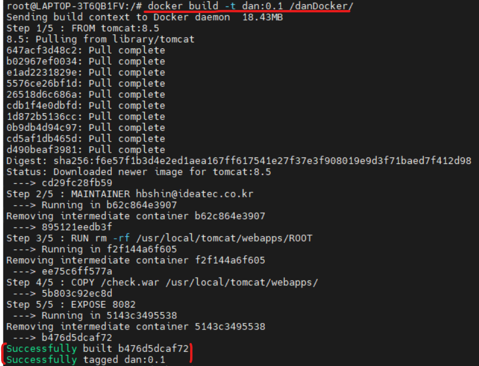
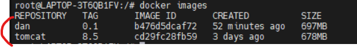
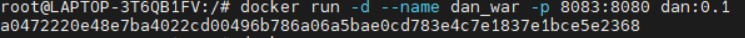
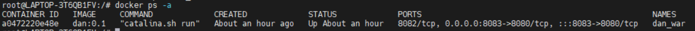
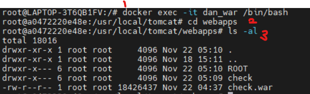
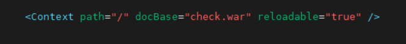

## 1. dockerfile 생성
<br>


```
- image build 하기전 dockerfile을 먼저 생성하고, 이미지에 대한 설정을 합니다.

- dockerfile은 host에서 디렉토리를 생성하고 그 안에 vi를 통해 Dockerfile을 생성합니다.

------------------------------------------------------------------------------------

- FROM : 어떤 이미지를 기반으로 할지 설정합니다. docker 이미지는 기존에 만들어진 
이미지를 기반으로 생성합니다. <이미지 이름>:<태그> 형식으로 설정

- RUN : 셸 스크립트 혹은 명령을 실행합니다. 저는 tomcat에 webapps에 ROOT파일을
삭제하도록 설정하였습니다.

- COPY : COPY는 제가 만든 .war파일을 tomcat/webapps에 복사하기 위해 설정

- EXPOSE : 호스트와 연결할 포트 번호입니다. 저는 8083으로 설정하였습니다.
```

## 2. image build 하기
<br>




```
- docker build <옵션> <생성할 이미지명> <dockerfile 경로> 를 토대로 build

- 마지막에 Successfully이 뜨면 정상적으로 images build 완료입니다.
```




```
- # docker images 명령어를 통해 잘 생성되었는지 확인 

- 위와 같이 dan image와 Dockerfile에서 FROM 에서 설정한 tomcat8.5기반 이미지 생성
```

## 3. build 한 image 를 통해 container run
<br>




```
- # docker run <옵션> <생성할 컨테이너명> <포트포워딩> <이미지명> 으로 실행 하였습니다.
```



```
- # docker ps -a 명령어를 통해 컨테이너가 정상 실행되는지 확인합니다.
```

## 4. war file deploy
<br>




```
- 이제 tomcat을 bash를 통해 접속하고 war file 이 Dockerfile대로 잘 복사되었는지 확인

- docker exec <옵션> <컨테이너명> /bin/bash

- cd webapps

- ls -al

```




```
- 톰캣홈/conf/server.xml 파일을 vi로 통해 접속해서 tomcat이 war file을 
읽을 수 있도록 Context 설정을 합니다.

- 이상 완료되었으면, #docker restart <컨테이너명> 으로 컨테이너를 재기동 합니다.
```


```
- Dockerfile에서 EXPOSE 했던 포트번호를 통해 접속 후 확인합니다.
```
