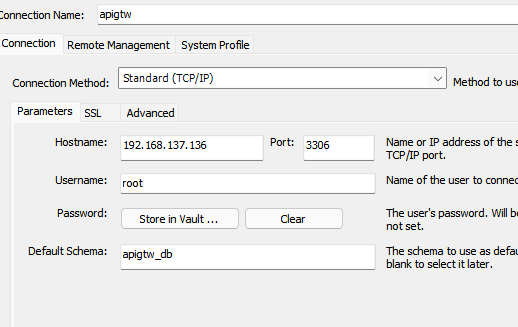
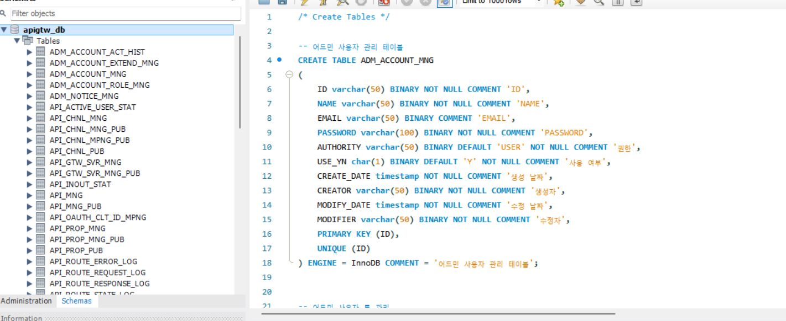
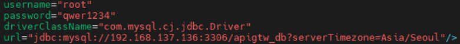
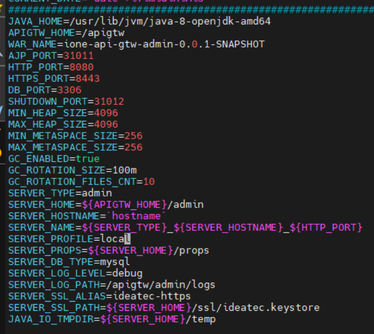
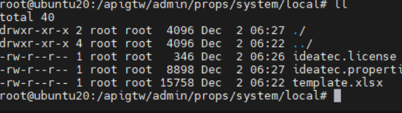
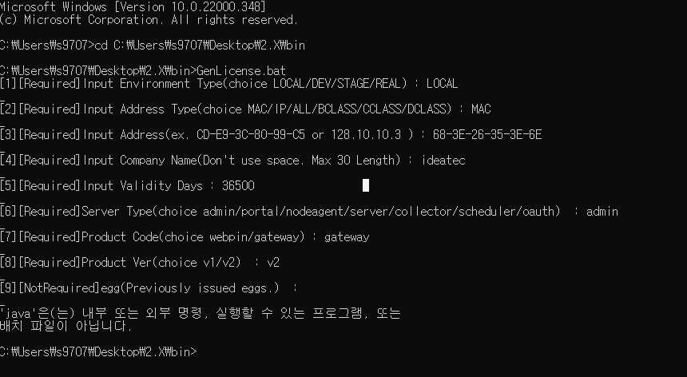
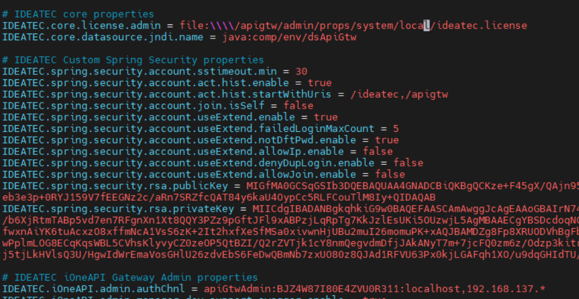

## apigtw-containerizating (~ing)
<br>

```
version: "3"
services:
  db:
    image: mysql:8.0
    restart: always
    command: --lower_case_table_names=1
    container_name: apigtwdb
    ports:
      - "3306:3306"
    environment:
      - MYSQL_ROOT_PASSWORD=qwer1234
      - TZ=Asia/Seoul
    command:
      - --character-set-server=utf8mb4
      - --collation-server=utf8mb4_unicode_ci
    volumes:
      - /root/data/apigtw\mysql:/var/lib/mysql
```
```
- #docker-compose.yml 파일을 docker-compose up 명령어로 실행하여,
apigtw용 db를 생성합니다. 
```



```
- container가 있는 서버IP를 통해
mysql workbench에서 DB연결하고 Hostname에 서버IP와 port입력하여 연동
```


```
- apigtw db table 제작
```



```
- apigtw/admin/conf/context.xml 파일을 열어서 
위에서 연결했던 DB정보에 맞게 URL을 수정
```



```
- /apigtw/admin/bin/setenv.sh 파일을 열어서 아래 목록들 수정
- JAVA_HOME : 나의 서버 자바 경로 입력 (jdk-1.8)
- APIGTW_HOME : 내 서버 기준에 맞춰서 수정
- WAR_NAME : 위에 입력되어 있는 이름과 맞춘다.
- SERVER_PROFILE : license 생성시 Environment Type과 맞춰서 입력
- SERVER_LOG_PATH : log가 생성될 경로에 맞게 수정
```



```
- license 설정을 위해서 apigtw/admin/props/system/으로 이동
- 자신이 설정한 EnvironmentType에 맞게 디렉토리명을 변경
```


```
- license 생성과정입니다.
- 설치파일 bin 파일경로를 cmd를 통해 접속합니다.
- GenLicense.bat 파일을 통해 실행
- 사진과 비슷하게 목록중 선택해서 라이센스 발급받기
- 발급 받으면 라이센스 키를 
/apigtw/admin/props/system/local/ideatec.license파일에 입력
```



```
- 같은경로에서 ideatec.properties 파일에 들어와서
- license.admin 파일경로 맞춰서 수정
- 아래 admin.authchnl에 마지막 IP 주소를
나의 ip 주소를 읽을수 있도록 맞게 설정
```
